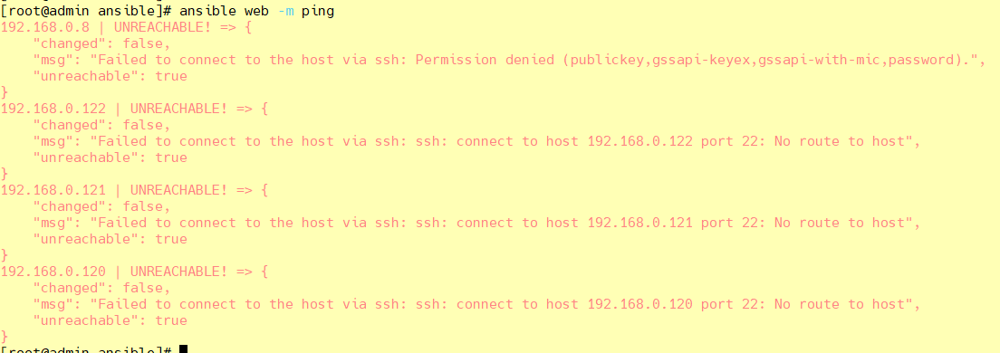

Ansible AD-Hoc命令执行工具

<!-- more -->

# Ansible AD-Hoc命令执行工具

[ansible 中文指南](http://ansible.com.cn/docs/intro.html)

[本节示例文件 提取码：1234](https://pan.baidu.com/s/1fkosURl4HaYZALtSjKvcKg)

## 简介

Ansibe AD-Hoc 临时命令执行工具，常用于临时命令的执行

```css
ansible <host-pattern> [-f forks] [-m module_name] [-a args]
```

也可以通过`ansible -h`来查看帮助，下面我们列出一些比较常用的选项，并解释其含义：

- **-a MODULE_ARGS**：模块的参数，如果执行默认COMMAND的模块，即是命令参数，如： “date”，“pwd”等等
- **-k,--ask-pass**：ask for SSH password。登录密码，提示输入SSH密码而不是假设基于密钥的验证
- **--ask-su-pass**：ask for su password。su切换密码
- **-K,--ask-sudo-pass**：ask for sudo password。提示密码使用sudo，sudo表示提权操作
- **--ask-vault-pass**：ask for vault password。假设我们设定了加密的密码，则用该选项进行访问
- **-B SECONDS**：后台运行超时时间
- **-C**：模拟运行环境并进行预运行，可以进行查错测试
- **-c CONNECTION**：连接类型使用
- **-f FORKS**：并行任务数，默认为5
- **-i INVENTORY**：指定主机清单的路径，默认为`/etc/ansible/hosts`
- **--list-hosts**：查看有哪些主机组
- **-m MODULE_NAME**：执行模块的名字，默认使用 command 模块，所以如果是只执行单一命令可以不用 -m参数
- **-o**：压缩输出，尝试将所有结果在一行输出，一般针对收集工具使用
- **-S**：用 su 命令
- **-R SU_USER**：指定 su 的用户，默认为 root 用户
- **-s**：用 sudo 命令
- **-U SUDO_USER**：指定 sudo 到哪个用户，默认为 root 用户
- **-T TIMEOUT**：指定 ssh 默认超时时间，默认为10s，也可在配置文件中修改
- **-u REMOTE_USER**：远程用户，默认为 root 用户

## 自己配置

```
# 自定义主机与组
[web]
192.168.0.[8:10]
```

主机连通性测试：ansible web -m ping

会出现ping不通



## SSH免密登录

参考：<https://blog.csdn.net/qq_42476834/article/details/124766896>

```shell
#1.生成私钥(主-被控制端最好都要生成)
[root@admin ~]# ssh-keygen -t rsa
#2.向主机分发私钥
[root@admin ~]# ssh-copy-id root@192.168.0.8 ssh-copy-id a@192.168.0.8
[root@admin ~]# ssh-copy-id root@192.168.0.9 ssh-copy-id a@192.168.0.9
[root@admin ~]# ssh-copy-id root@192.168.0.10 ssh-copy-id a@192.168.0.10

校验：
ssh root@192.168.0.8   ssh a@192.168.0.8
ssh root@192.168.0.9   ssh a@192.168.0.9
ssh root@192.168.0.10   ssh a@192.168.0.10
```

查看192.168.0.8用户ssh目录 authorized_keys

> ssh-rsa  xxx/ph8H3i2mKHscP root@admin

或者是在清单中设置ssh登录

```shell
[web]
192.168.0.8 ansible_port=22
```

## 主机连通性测试

```shell
[root@admin ansible]# ansible web -m ping
192.168.0.8 | SUCCESS => {
    "ansible_facts": {
        "discovered_interpreter_python": "/usr/bin/python"
    },
    "changed": false,
    "ping": "pong"
}
192.168.0.10 | SUCCESS => {
    "ansible_facts": {
        "discovered_interpreter_python": "/usr/bin/python"
    },
    "changed": false,
    "ping": "pong"
}
192.168.0.9 | SUCCESS => {
    "ansible_facts": {
        "discovered_interpreter_python": "/usr/bin/python"
    },
    "changed": false,
    "ping": "pong"
}

```

## command 模块（直接在远程主机上执行命令，并将结果返回本主机）

```shell
[root@admin ansible]# ansible web -m command -a 'ss -ntl'
192.168.0.8 | CHANGED | rc=0 >>
State      Recv-Q Send-Q Local Address:Port               Peer Address:Port
LISTEN     0      100    127.0.0.1:25                       *:*
LISTEN     0      128          *:111                      *:*
LISTEN     0      128          *:22                       *:*
LISTEN     0      100      [::1]:25                    [::]:*
LISTEN     0      128       [::]:111                   [::]:*
LISTEN     0      128       [::]:22                    [::]:*
192.168.0.10 | CHANGED | rc=0 >>
State      Recv-Q Send-Q Local Address:Port               Peer Address:Port
LISTEN     0      100    127.0.0.1:25                       *:*
LISTEN     0      128          *:111                      *:*
LISTEN     0      128          *:22                       *:*
LISTEN     0      100      [::1]:25                    [::]:*
LISTEN     0      128       [::]:111                   [::]:*
LISTEN     0      128       [::]:22                    [::]:*
192.168.0.9 | CHANGED | rc=0 >>
State      Recv-Q Send-Q Local Address:Port               Peer Address:Port
LISTEN     0      128          *:22                       *:*
LISTEN     0      100    127.0.0.1:25                       *:*
LISTEN     0      128          *:111                      *:*
LISTEN     0      128       [::]:22                    [::]:*
LISTEN     0      100      [::1]:25                    [::]:*
LISTEN     0      128       [::]:111                   [::]:*
```

命令模块接受命令名称，后面是空格分隔的列表参数。给定的命令将在所有选定的节点上执行。它不会通过shell进行处理，比如 \$HOME 和操作如 "<"，">"，"|"，";"，"&" 工作（需要使用（shell）模块实现这些功能）。

**注意**：该命令不支持`| 管道命令`。

该模块下常用的几个命令：

- **chdir**：在执行命令之前，先切换到该目录
- **executable**：切换shell来执行命令，需要使用命令的绝对路径
- **free_form**：要执行的Linux指令，一般使用Ansible的-a参数代替。
- **creates**：一个文件名，当这个文件存在，则该命令不执行,可以用来做判断
- **removes**：一个文件名，这个文件不存在，则该命令不执行

### chdir在执行命令之前，先切换到该目录

```shell
[root@admin ~]# ansible web -m command -a 'chdir=/root/ ls -all'
192.168.0.8 | CHANGED | rc=0 >>
总用量 28
dr-xr-x---.  7 root root  204 7月  28 13:19 .
dr-xr-xr-x. 17 root root  224 7月  28 11:04 ..
-rw-------.  1 root root 1614 7月  28 11:05 anaconda-ks.cfg
drwx------.  3 root root   17 7月  28 13:19 .ansible
-rw-------.  1 root root  540 7月  28 13:29 .bash_history
-rw-r--r--.  1 root root   18 12月 29 2013 .bash_logout
-rw-r--r--.  1 root root  176 12月 29 2013 .bash_profile
-rw-r--r--.  1 root root  176 12月 29 2013 .bashrc
drwxr-xr-x.  3 root root   18 7月  28 11:06 .cache
drwxr-xr-x.  3 root root   18 7月  28 11:06 .config
-rw-r--r--.  1 root root  100 12月 29 2013 .cshrc
drwxr-----.  3 root root   19 7月  28 11:18 .pki
drwx------.  2 root root   61 7月  28 13:12 .ssh
-rw-r--r--.  1 root root  129 12月 29 2013 .tcshrc
....
```

### creates（存在，不执行ls，不存在，执行ls）

```shell
# 存在，不执行ls
[root@admin ~]# ansible web -m command -a 'creates=/root/test.png ls'
192.168.0.8 | SUCCESS | rc=0 >>
skipped, since /root/test.png exists

# 不存在，执行ls
[root@admin ~]# ansible web -m command -a 'creates=/root/test1.png ls'
192.168.0.8 | CHANGED | rc=0 >>
anaconda-ks.cfg
test.png
```

### removes（存在，执行ls、不存在，不执行ls）

```shell
# 存在，执行ls
[root@admin ~]# ansible web -m command -a 'removes=/root/test.png ls'
192.168.0.8 | CHANGED | rc=0 >>
anaconda-ks.cfg
test.png

# 不存在，不执行ls
[root@admin ~]# ansible web -m command -a 'removes=/root/test1.png ls'
192.168.0.8 | SUCCESS | rc=0 >>
skipped, since /root/test1.png does not exist
```

## Shell 模块

shell模块可以在远程主机上调用shell解释器运行命令，支持shell的各种功能，例如管道等。

```shell
[root@admin ~]# ansible web -m shell -a 'cat /etc/passwd |grep "root"'
192.168.0.8 | CHANGED | rc=0 >>
root:x:0:0:root:/root:/bin/bash
operator:x:11:0:operator:/root:/sbin/nologin
......
```

## copy 模块

将文件复制到远程主机，同时支持给定内容生成文件和修改权限等。

相关选项如下：

- **src**：本地文件。可以是绝对路径，也可以是相对路径。如果路径是一个目录，则会递归复制，用法类似于"rsync"
- **content**：用于替换"src"，可以直接指定文件的值
- **dest**：*必选项*，将源文件复制到的远程主机的**绝对路径**
- **backup**：当文件内容发生改变后，在覆盖之前把源文件备份，备份文件包含时间信息
- **directory_mode**：递归设定目录的权限，默认为系统默认权限
- **force**：当目标主机包含该文件，但内容不同时，设为"yes"，表示强制覆盖；设为"no"，表示目标主机的目标位置不存在该文件才复制。默认为"yes"
- **others**：所有的 file 模块中的选项可以在这里使用


### 复制文件（src、dest）

```shell
[root@admin ~]# ll
总用量 8
-rw-------. 1 root root 2174 5月  10 14:10 anaconda-ks.cfg
-rwxrwxrwx  1 root root 1960 5月  10 19:32 first.sh

[root@admin ~]# ansible web -m copy -a 'src=./first.sh dest=/root/first.sh'
192.168.0.8 | CHANGED => {
    "ansible_facts": {
        "discovered_interpreter_python": "/usr/bin/python"
    },
    "changed": true,
    "checksum": "23f3ef0aebb2a24b97c6617c3fe8a190dc1befed",
    "dest": "/root/first.sh",
    "gid": 0,
    "group": "root",
    "md5sum": "749f84620ba675946859e0d5a8c68ec5",
    "mode": "0644",
    "owner": "root",
    "secontext": "system_u:object_r:admin_home_t:s0",
    "size": 1960,
    "src": "/root/.ansible/tmp/ansible-tmp-1658988228.09-12252-115055636503998/source",
    "state": "file",
    "uid": 0
}

远程查看：
[root@admin ~]# ansible web -m shell -a 'ls -all /root/first.sh'
192.168.0.8 | CHANGED | rc=0 >>
-rw-r--r--. 1 root root 1960 7月  28 14:03 /root/first.sh
```

### 给定内容生成文件（content），并制定权限（mode）

```shell
ansible web -m copy -a 'src=/root/ds.txt dest=/root/ds.txt mode=777'
[root@admin ~]# ansible web -m copy -a 'content="I am admin666 to copy test\n" dest=/root/ds.txt mode=777'
192.168.0.8 | CHANGED => {
    "ansible_facts": {
        "discovered_interpreter_python": "/usr/bin/python"
    },
    "changed": true,
    "checksum": "f1027296960724e4f07c7f6d695e2a9d59a41fc6",
    "dest": "/root/ds.txt",
    "gid": 0,
    "group": "root",
    "md5sum": "ebe73ae34d327b8966e3a20fafd80eda",
    "mode": "0777",
    "owner": "root",
    "secontext": "system_u:object_r:admin_home_t:s0",
    "size": 27,
    "src": "/root/.ansible/tmp/ansible-tmp-1658988702.62-14114-156810509219572/source",
    "state": "file",
    "uid": 0
}

```

查看文件

```shell
[root@admin ~]# ansible web -m shell -a 'ls -all /root/ds.txt'
192.168.0.8 | CHANGED | rc=0 >>
-rwxrwxrwx. 1 root root 27 7月  28 14:11 /root/ds.txt

[root@admin ~]# ansible web -m shell -a 'cat /root/ds.txt'
192.168.0.8 | CHANGED | rc=0 >>
I am admin666 to copy test
```

### 覆盖备份（backup）

```shell
[root@admin ~]# ansible web -m copy -a 'content="I am admin666 to backup test\n" backup=yes dest=/root/ds.txt mode=777'
192.168.0.8 | SUCCESS => {
    "ansible_facts": {
        "discovered_interpreter_python": "/usr/bin/python"
    },
    "changed": false,
    "checksum": "f1027296960724e4f07c7f6d695e2a9d59a41fc6",
    "dest": "/root/ds.txt",
    "gid": 0,
    "group": "root",
    "mode": "0777",
    "owner": "root",
    "path": "/root/ds.txt",
    "secontext": "system_u:object_r:admin_home_t:s0",
    "size": 27,
    "state": "file",
    "uid": 0
}

```

查看文件

```shell
[root@admin ~]# ansible web -m shell -a 'ls /root/'
192.168.0.8 | CHANGED | rc=0 >>
anaconda-ks.cfg
ds.txt
ds.txt.13370.2022-07-28@14:20:20~
first.sh
test.png

[root@admin ~]# ansible web -m shell -a 'cat /root/ds.txt'
192.168.0.8 | CHANGED | rc=0 >>
I am admin666 to backup test
```

## file 模块（文件管理）

主要用于设置文件的属性，比如创建文件、创建链接文件、删除文件等。

常见的命令：

- **force**：需要在两种情况下强制创建软链接，一种是源文件不存在，但之后会建立的情况下；另一种是目标软链接已存在，需要先取消之前的软链，然后创建新的软链，有两个选项：`yes|no`
- **group**：定义文件/目录的属组。
- **mode**：定义文件/目录的权限
- **owner**：定义文件/目录的属主。
- **path**：*(必选项)*，定义文件/目录的路径
- **recurse**：递归设置文件的属性，只对目录有效，后面跟上`src`：被链接的源文件路径，只应用于`state=link`的情况
- **dest**：被链接到的路径，只应用于`state=link`的情况
- **state**：状态，有以下选项：
- - *directory*：如果目录不存在，就创建目录
- - *file*：即使文件不存在，也不会被创建
- - *link*：创建软链接
- - *hard*：创建硬链接
- - *touch*：如果文件不存在，则会创建一个新的文件，如果文件或目录已存在，则更新其最后修改时间
- - *absent*：删除目录、文件或者取消链接文件

### 创建目录

```shell
[root@admin ~]# ansible web -m file -a 'path=/root/app state=directory'
192.168.0.8 | CHANGED => {
    "ansible_facts": {
        "discovered_interpreter_python": "/usr/bin/python"
    },
    "changed": true,
    "gid": 0,
    "group": "root",
    "mode": "0755",
    "owner": "root",
    "path": "/root/app",
    "secontext": "unconfined_u:object_r:admin_home_t:s0",
    "size": 6,
    "state": "directory",
    "uid": 0
}


[root@admin ~]# ansible web -m shell -a 'ls -l /root'
192.168.0.8 | CHANGED | rc=0 >>
总用量 16
-rw-------. 1 root root 1614 7月  28 11:05 anaconda-ks.cfg
drwxr-xr-x. 2 root root    6 7月  28 14:28 app
-rwxrwxrwx. 1 root root   29 7月  28 14:20 ds.txt
-rw-r--r--. 1 root root   26 7月  28 14:19 ds.txt.13370.2022-07-28@14:20:20~
-rw-r--r--. 1 root root 1960 7月  28 14:03 first.sh
-rw-r--r--. 1 root root    0 7月  28 13:44 test.png
```

### 创建链接文件

为test.jpg创建链接

- link：创建软链接
- hard：创建硬链接

force：需要在两种情况下强制创建软链接，一种是源文件不存在，但之后会建立的情况下；另一种是目标软链接已存在，需要先取消之前的软链，然后创建新的软链，有两个选项：`yes|no`

```shell

[root@admin ~]# ansible web -m file -a 'path=/root/test2.png src=/root/test.png state=link'
192.168.0.8 | CHANGED => {
    "ansible_facts": {
        "discovered_interpreter_python": "/usr/bin/python"
    },
    "changed": true,
    "dest": "/root/test2.png",
    "gid": 0,
    "group": "root",
    "mode": "0777",
    "owner": "root",
    "secontext": "unconfined_u:object_r:admin_home_t:s0",
    "size": 14,
    "src": "/root/test.png",
    "state": "link",
    "uid": 0
}
[root@admin ~]# ansible web -m file -a 'path=/root/test3.png src=/root/test.png state=hard'
192.168.0.8 | CHANGED => {
    "ansible_facts": {
        "discovered_interpreter_python": "/usr/bin/python"
    },
    "changed": true,
    "dest": "/root/test3.png",
    "gid": 0,
    "group": "root",
    "mode": "0644",
    "owner": "root",
    "secontext": "unconfined_u:object_r:admin_home_t:s0",
    "size": 0,
    "src": "/root/test.png",
    "state": "hard",
    "uid": 0
}


[root@admin ~]# ansible web -m shell -a 'ls -l /root/'
192.168.0.8 | CHANGED | rc=0 >>
lrwxrwxrwx. 1 root root   14 7月  28 14:39 test2.png -> /root/test.png
-rw-r--r--. 2 root root    0 7月  28 13:44 test3.png
-rw-r--r--. 2 root root    0 7月  28 13:44 test.png
```

### 删除文件

```shell
[root@admin ~]# ansible web -m file -a 'path=/root/test3.png state=absent'
192.168.0.8 | CHANGED => {
    "ansible_facts": {
        "discovered_interpreter_python": "/usr/bin/python"
    },
    "changed": true,
    "path": "/root/test3.png",
    "state": "absent"
}


[root@admin ~]# ansible web -m shell -a 'ls -l /root/test3.png'
192.168.0.8 | FAILED | rc=2 >>
ls: 无法访问/root/test3.png: 没有那个文件或目录non-zero return code
```

## fetch 模块（复制远程文件到本地主机）

用于从远程某主机获取（复制）文件到本地。

- **dest**：用来存放文件的目录
- **src**：在远程拉取的文件，并且必须是一个**file**，不能是**目录**

```shell
[root@admin ~]# ansible web -m fetch -a 'src=/root/ds.txt dest=/root'
192.168.0.8 | CHANGED => {
    "changed": true,
    "checksum": "dbd48461fe5fff10ea97f688511ba74a292ab6f9",
    "dest": "/root/192.168.0.8/root/ds.txt",
    "md5sum": "9a282b66af8d46bceabdcd71173fc67d",
    "remote_checksum": "dbd48461fe5fff10ea97f688511ba74a292ab6f9",
    "remote_md5sum": null
}

[root@admin ~]# ls -l /root/192.168.0.8/root/ds.txt
-rwxr-xr-x 1 root root 29 7月  28 14:46 /root/192.168.0.8/root/ds.txt
```

我们可以在本机上查看一下文件是否复制成功。要注意，文件保存的路径是我们设置的接收目录下的`被管制主机ip`目录下


## cron 模块（计划任务）

用于管理`cron`计划任务的。

其使用的语法跟我们的`crontab`文件中的语法一致，同时，可以指定以下选项：

- **month**：月( 1-12, \*, \*/2)
- **weekday**：周 ( 0-6 for Sunday-Saturday)
- **day**：天( 1-31, \*, \*/2)
- **hour**：小时 ( 0-23, \*, \*/2)
- **minute**：分钟( 0-59, \*, \*/2)
- **job**：指明运行的命令是什么
- **name**：定时任务描述
- **reboot**：任务在重启时运行，不建议使用，建议使用special_time
- **special_time**：特殊的时间范围，参数：*reboot*（重启时），*annually*（每年），*monthly*（每月），*weekly*（每周），*daily*（每天），*hourly*（每小时）
- **state**：指定状态，*present* 表示添加定时任务，默认设置，*absent* 表示删除定时任务
- **user**：以哪个用户的身份执行


### ① 添加计划任务

```shell
[root@admin ~]# ansible web -m cron -a 'name="ntp 每 5 分钟更新一次" minute=*/5 job="/sbin/ntpdate 172.17.0.1 &> /dev/null"'
192.168.0.8 | CHANGED => {
    "ansible_facts": {
        "discovered_interpreter_python": "/usr/bin/python"
    },
    "changed": true,
    "envs": [],
    "jobs": [
        "ntp 每 5 分钟更新一次"
    ]
}
```

查看计划任务列表

```shell
[root@admin ~]# ansible web -m shell -a 'crontab -l'
192.168.0.8 | CHANGED | rc=0 >>
#Ansible: ntp 每 5 分钟更新一次
*/5 * * * * /sbin/ntpdate 172.17.0.1 &> /dev/null


[root@admin ~]# ansible web -m shell -a 'ls -l /sbin/ntpdate'
192.168.0.8 | CHANGED | rc=0 >>
-rwxr-xr-x. 1 root root 110160 6月  23 2020 /sbin/ntpdate
```

### ② 删除计划任务

查看计划任务列表

```shell
[root@admin ~]# ansible web -m shell -a 'crontab -l'
192.168.0.8 | CHANGED | rc=0 >>
#Ansible: ntp 每 5 分钟更新一次
*/5 * * * * /sbin/ntpdate 172.17.0.1 &> /dev/null
```

删除

```shell
[root@admin ~]# ansible web -m cron -a 'name="df everyday" hour=15 job="df -lh >> /tmp/disk_total &> /dev/null" state=absent'
192.168.0.8 | SUCCESS => {
    "ansible_facts": {
        "discovered_interpreter_python": "/usr/bin/python"
    },
    "changed": false,
    "envs": [],
    "jobs": [
        "ntp 每 5 分钟更新一次"
    ]
}
```

删除完成后，我们再查看一下现有的计划任务确认一下：

```perl

[root@admin ~]# ansible web -m shell -a 'crontab -l'
192.168.0.8 | CHANGED | rc=0 >>
#Ansible: ntp 每 5 分钟更新一次
*/5 * * * * /sbin/ntpdate 172.17.0.1 &> /dev/null

```

## yum 模块（用于软件的安装）

顾名思义，该模块主要用于软件的安装。

其选项如下：

- **name**：所安装的包的名称
- **state**：`present` 安装，`latest` 安装最新的，`absent` 卸载软件。
- **update_cache**：强制更新yum的缓存。
- **conf_file**：指定远程yum安装时所依赖的配置文件（安装本地已有的包）。
- **disable_pgp_check**：是否禁止GPG checking，只用于`present`or `latest`。
- **disablerepo**：临时禁止使用yum库。 只用于安装或更新时。
- **enablerepo**：临时使用的yum库。只用于安装或更新时。

```shell

[root@admin ~]#  ansible web -m yum -a 'name=htop state=present'
192.168.0.8 | CHANGED => {
    "ansible_facts": {
        "discovered_interpreter_python": "/usr/bin/python"
    },
    "changed": true,
    "changes": {
        "installed": [
            "htop"
        ]
    },
    "msg": "",
    "rc": 0,
    "results": [
        "Loaded plugins: fastestmirror, langpacks\nLoading mirror speeds from cached hostfile\n * base: ftp.sjtu.edu.cn\n * epel: ftp.riken.jp\n * extras: mirror.lzu.edu.cn\n * updates: ftp.sjtu.edu.cn\nResolving Dependencies\n--> Running transaction check\n---> Package htop.x86_64 0:2.2.0-3.el7 will be installed\n--> Finished Dependency Resolution\n\nDependencies Resolved\n\n================================================================================\n Package         Arch              Version                Repository       Size\n================================================================================\nInstalling:\n htop            x86_64            2.2.0-3.el7            epel            103 k\n\nTransaction Summary\n================================================================================\nInstall  1 Package\n\nTotal download size: 103 k\nInstalled size: 218 k\nDownloading packages:\nRunning transaction check\nRunning transaction test\nTransaction test succeeded\nRunning transaction\n  Installing : htop-2.2.0-3.el7.x86_64                                      1/1 \n  Verifying  : htop-2.2.0-3.el7.x86_64                                      1/1 \n\nInstalled:\n  htop.x86_64 0:2.2.0-3.el7                                                     \n\nComplete!\n"
    ]
}
```

## service 模块（服务程序的管理）

该模块用于服务程序的管理。

其主要选项如下：

- **arguments**：命令行提供额外的参数。
- **enabled**：设置开机启动。
- **name**：服务名称。
- **runlevel**：开机启动的级别，一般不用指定。
- **sleep**：在重启服务的过程中，是否等待。如在服务关闭以后等待2秒再启动。(定义在剧本中)
- **state**：有四种状态，分别为：`started` 启动服务，`stopped` 停止服务，`restarted` 重启服务，`reloaded` 重载配置。

### ① 开启服务并设置自启动

```shell
[root@admin ~]# ansible web -m service -a 'name=nginx state=started enabled=true' 
192.168.0.8 | SUCCESS => {
    "changed": true, 
    "enabled": true, 
    "name": "nginx", 
    "state": "started", 
    ……
}
```

端口是否打开：

```shell
[root@admin ~]# ansible web -m shell -a 'ss -ntl'
192.168.0.8 | SUCCESS | rc=0 >>
State      Recv-Q Send-Q Local Address:Port               Peer Address:Port              
LISTEN     0      128          *:80                       *:*                                 
```

可以看出我们的80端口已经打开。

### ② 关闭服务

```shell
[root@admin ~]# ansible web -m service -a 'name=nginx state=stopped'
192.168.0.8 | SUCCESS => {
    "changed": true, 
    "name": "nginx", 
    "state": "stopped", 
 ……
}
```

来查看一下端口：

```shell
[root@admin ~]# ansible web -m shell -a 'ss -ntl | grep 80'
192.168.0.8 | FAILED | rc=1 >>
non-zero return code
```

## user 模块（管理用户账号）

该模块主要是用来管理用户账号。

其主要选项如下：

- **comment**：用户的描述信息。
- **createhome**：是否创建家目录。
- **force**：在使用state=absent时, 行为与`userdel –force`一致。
- **group**：指定基本组。
- **groups**：指定附加组，如果指定为(groups=)表示删除所有组。
- **home**：指定用户家目录。
- **move_home**：如果设置为home=时, 试图将用户主目录移动到指定的目录。
- **name**：指定用户名。
- **non_unique**：该选项允许改变非唯一的用户ID值。
- **password**：指定用户密码。
- **remove**：在使用state=absent时, 行为是与`userdel –remove`一致。
- **shell**：指定默认shell。
- **state**：设置帐号状态，不指定为创建，指定值为absent表示删除。
- **system**：当创建一个用户，设置这个用户是系统用户。这个设置不能更改现有用户。
- **uid**：指定用户的uid。

### ① 添加一个用户并指定其 uid

```smalltalk
[root@admin ~]# ansible web -m user -a 'name=a2 uid=11111'
192.168.0.8 | CHANGED => {
    "ansible_facts": {
        "discovered_interpreter_python": "/usr/bin/python"
    },
    "changed": true,
    "comment": "",
    "create_home": true,
    "group": 11111,
    "home": "/home/a2",
    "name": "a2",
    "shell": "/bin/bash",
    "state": "present",
    "system": false,
    "uid": 11111
}
```

添加完成，我们可以去查看一下：

```shell
[root@admin ~]# ansible web -m shell -a 'cat /etc/passwd |grep a2'
192.168.0.8 | CHANGED | rc=0 >>
a2:x:11111:11111::/home/a2:/bin/bash
```

### ② 删除用户

```dart
[root@admin ~]# ansible web -m user -a 'name=a2 state=absent'
192.168.0.8 | CHANGED => {
    "ansible_facts": {
        "discovered_interpreter_python": "/usr/bin/python"
    },
    "changed": true,
    "force": false,
    "name": "a2",
    "remove": false,
    "state": "absent"
}

```

一样的，删除之后，我们去看一下：

```shell
[root@admin ~]# ansible web -m shell -a 'cat /etc/passwd |grep a2'
192.168.0.8 | FAILED | rc=1 >>
non-zero return code
```

发现已经没有这个用户了。


## group 模块（添加或删除组）

该模块主要用于添加或删除组。

常用的选项如下：

- **gid**：设置组的GID号。
- **name**：指定组的名称。
- **state**：指定组的状态，默认为创建，设置值为`absent`为删除。
- **system**：设置值为`yes`，表示创建为系统组。

### ① 创建组

```dart
[root@admin ~]# ansible web -m group -a 'name=a2 gid=12222'
192.168.0.8 | CHANGED => {
    "ansible_facts": {
        "discovered_interpreter_python": "/usr/bin/python"
    },
    "changed": true,
    "gid": 12222,
    "name": "dd",
    "state": "present",
    "system": false
}

```

创建过后，我们来查看一下：

```makefile
[root@admin ~]# ansible web -m shell -a 'cat /etc/group | grep 12222'
192.168.0.8 | CHANGED | rc=0 >>
a2:x:12222:

```

可以看出，我们的组已经创建成功了。

### ② 删除组

```shell
[root@admin ~]# ansible web -m group -a 'name=a2 state=absent'
192.168.0.8 | CHANGED => {
    "ansible_facts": {
        "discovered_interpreter_python": "/usr/bin/python"
    },
    "changed": true,
    "name": "a2",
    "state": "absent"
}

```

照例查看一下：

```shell
[root@admin ~]# ansible web -m shell -a 'cat /etc/group | grep 12222'
192.168.0.8 | FAILED | rc=1 >>
non-zero return code

```

已经没有这个组的相关信息了。


## script 模块（将本机的脚本sh在被管理端的机器上运行）

该模块用于将本机的脚本在被管理端的机器上运行。

该模块直接指定脚本的路径即可，我们通过例子来看一看到底如何使用的：

首先，我们写一个脚本，并给其加上执行权限：

```bash
[root@admin ~]# vim /root/df.sh

#!/bin/bash

date >> /root/disk_total.log
df -lh >> /root/disk_total.log
 
[root@admin ~]# chmod +x /root/df.sh 
```

然后，我们直接运行命令来实现在被管理端执行该脚本：

```swift
[root@admin ~]# ansible web -m script -a '/root/df.sh'
192.168.0.8 | CHANGED => {
    "changed": true,
    "rc": 0,
    "stderr": "Shared connection to 192.168.0.8 closed.\r\n",
    "stderr_lines": [
        "Shared connection to 192.168.0.8 closed."
    ],
    "stdout": "",
    "stdout_lines": []
}

```

照例查看一下文件内容：

```bash
[root@admin ~]# ansible web -m shell -a 'cat /root/disk_total.log'
192.168.0.8 | CHANGED | rc=0 >>
2022年 07月 28日 星期四 15:23:35 CST
文件系统                 容量  已用  可用 已用% 挂载点
devtmpfs                 3.8G     0  3.8G    0% /dev
tmpfs                    3.9G     0  3.9G    0% /dev/shm
tmpfs                    3.9G   12M  3.8G    1% /run
tmpfs                    3.9G     0  3.9G    0% /sys/fs/cgroup
/dev/mapper/centos-root   50G  2.9G   48G    6% /
/dev/sda1               1014M  199M  816M   20% /boot
/dev/mapper/centos-home  142G   33M  142G    1% /home
tmpfs 
```

可以看出已经执行成功了。

## setup 模块（收集被管理主机的信息）

该模块主要用于收集信息，是通过调用facts组件来实现的。

facts 组件是Ansible用于采集被管机器设备信息的一个功能，我们可以使用setup模块查机器的所有facts信息，可以使用filter来查看指定信息。整个facts信息被包装在一个JSON格式的数据结构中，ansible_facts是最上层的值。

facts 就是变量，内建变量。每个主机的各种信息，cpu颗数、内存大小等。会存在facts中的某个变量中。调用后返回很多对应主机的信息，在后面的操作中可以根据不同的信息来做不同的操作。如redhat系列用yum安装，而debian系列用apt来安装软件。

### ① 查看信息

```yaml
[root@admin ~]# ansible web -m setup -a 'filter="*mem*"'
192.168.0.8 | SUCCESS => {
    "ansible_facts": {
        "ansible_memfree_mb": 7068,
        "ansible_memory_mb": {
            "nocache": {
                "free": 7456,
                "used": 346
            },
            "real": {
                "free": 7068,
                "total": 7802,
                "used": 734
            },
            "swap": {
                "cached": 0,
                "free": 8063,
                "total": 8063,
                "used": 0
            }
        },
        "ansible_memtotal_mb": 7802,
        "discovered_interpreter_python": "/usr/bin/python"
    },
    "changed": false
}

```

我们可以通过命令查看一下内存的大小以确认一下是否一致：

```yaml
[root@admin ~]# ansible web -m shell -a 'free -m'


192.168.0.8 | CHANGED | rc=0 >>
              total        used        free      shared  buff/cache   available
Mem:           7802         309        7067          11         426        7247
Swap:          8063           0        8063

```

可以看出信息是一致的。

### ② 保存信息

我们的setup模块还有一个很好用的功能就是可以保存我们所筛选的信息至我们的主机上，同时，文件名为我们被管制的主机的IP，这样方便我们知道是哪台机器出的问题。

```yaml
[root@admin ~]# ansible web -m setup -a 'filter="*mem*"' --tree /root/facts
192.168.0.8 | SUCCESS => {
    "ansible_facts": {
        "ansible_memfree_mb": 7064,
        "ansible_memory_mb": {
            "nocache": {
                "free": 7454,
                "used": 348
            },
            "real": {
                "free": 7064,
                "total": 7802,
                "used": 738
            },
            "swap": {
                "cached": 0,
                "free": 8063,
                "total": 8063,
                "used": 0
            }
        },
        "ansible_memtotal_mb": 7802,
        "discovered_interpreter_python": "/usr/bin/python"
    },
    "changed": false
}
```

然后我们可以去查看一下：

```yaml
[root@admin ~]# cd /root/facts/
[root@admin facts]#
[root@admin facts]# cat 192.168.0.8
{"ansible_facts": {"ansible_memfree_mb": 7064, "ansible_memory_mb": {"nocache": {"free": 7454, "used": 348}, "real": {"free": 7064, "total": 7802, "used": 738}, "swap": {"cached": 0, "free": 8063, "total": 8063, "used": 0}}, "ansible_memtotal_mb": 7802, "discovered_interpreter_python": "/usr/bin/python"}, "changed": false}
```
