Linux基础

<!-- more -->

# linux笔记

## VMware安装

[参考博客 csdn]( https://blog.csdn.net/qq_42476834/article/details/104618910)

**如果需要自定义分区请注意看一下：自定义分区设置**

> linux一般来说分为4个基本区：
>
> *用户分区*：home——保存用户信息
>
> *启动分区*：boot——保存系统启动的数据，一般100到200m
>
> *交换分区*：swap——理解为虚拟内存，真实内存不够的时候临时会使用swap分区，一般是内存的两倍
>
> *根分区*：/

## Linux学习路线

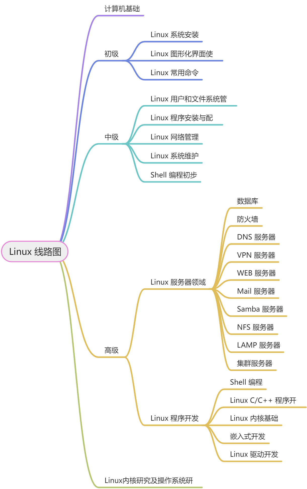

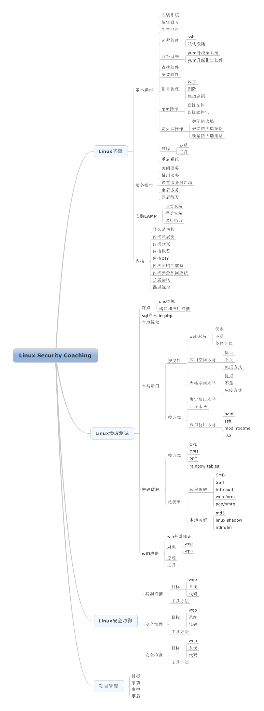

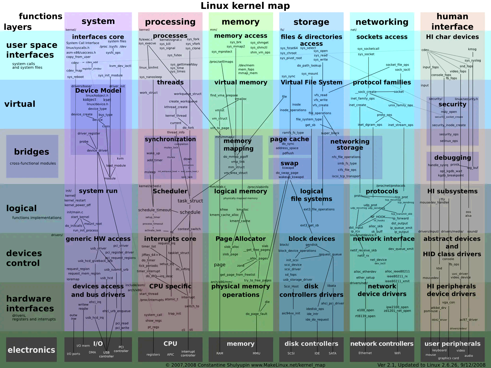

## Linux 内核

**系统结构**

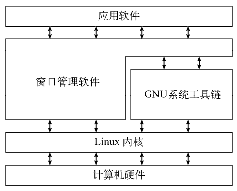

## linux 目录介绍

| 目录名称   | 描述                             |
|--------|--------------------------------|
| /      | 虚拟目录的根目录。通常不会在这里存储文件           |
| /bin   | 二进制目录，存放许多用户级的GNU工具            |
| /boot  | 启动目录，存放启动文件                    |
| /dev   | 设备目录，Linux在这里创建设备节点            |
| /etc   | 系统配置文件目录                       |
| /home  | 主目录，Linux在这里创建用户目录             |
| /lib   | 库目录，存放系统和应用程序的库文件              |
| /media | 媒体目录，可移动媒体设备的常用挂载点             |
| /mnt   | 挂载目录，另一个可移动媒体设备的常用挂载点          |
| /opt   | 可选目录，常用于存放第三方软件包和数据文件          |
| /proc  | 进程目录，存放现有硬件及当前进程的相关信息          |
| /root  | root用户的主目录                     |
| /sbin  | 系统二进制目录，存放许多GNU管理员级工具          |
| /run   | 运行目录，存放系统运作时的运行时数据             |
| /srv   | 服务目录，存放本地服务的相关文件               |
| /sys   | 系统目录，存放系统硬件信息的相关文件             |
| /tmp   | 临时目录，可以在该目录中创建和删除临时工作文件        |
| /usr   | 用户二进制目录，大量用户级的GNU工具和数据文件都存储在这里 |
| /var   | 可变目录，用以存放经常变化的文件，比如日志文件        |

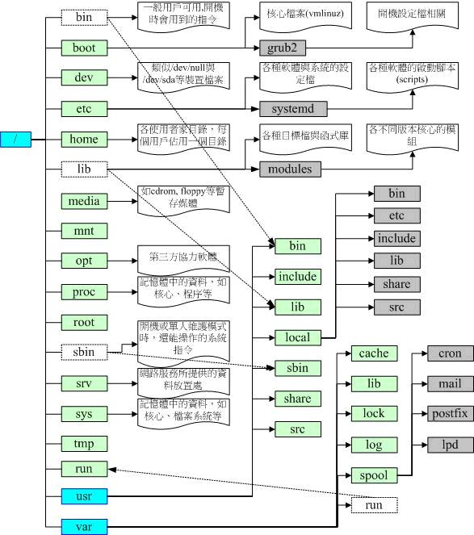

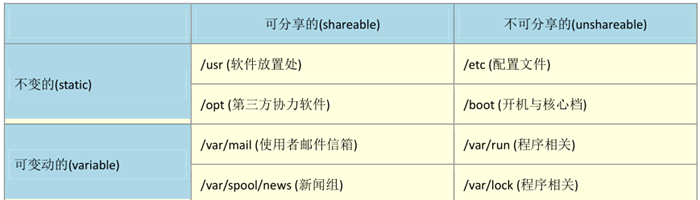

- **可分享的：** 可以分享给其他系统挂载使用的目录，所以包括执行文件与用户的邮件等数据， 是能够分享给
  网络上其他主机挂载用的目录；

- **不可分享的：** 自己机器上面运作的装置文件或者是与程序有关的 socket 文件等， 由于仅与自身机器有关，
  所以当然就不适合分享给其他主机了。

- **不变的：** 有些数据是不会经常变动的，跟随着 distribution 而不变动。 例如函式库、文件说明文件、系统管
  理员所管理的主机服务配置文件等等；

- **可变动的：** 经常改变的数据，例如登录文件、一般用户可自行收受的新闻组等

Filesystem Hierarchy Standard (FHS)标准：已安装软件通常放置于哪个目录

- */* (root, 根目录)：与开机系统有关；
- */usr* (unix software resource)：与软件安装/执行有关；
- */var* (variable)：与系统运作过程有关。

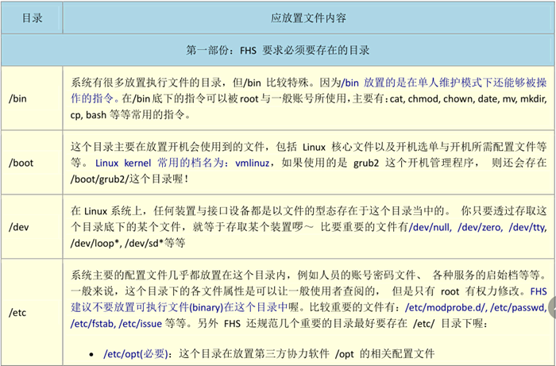

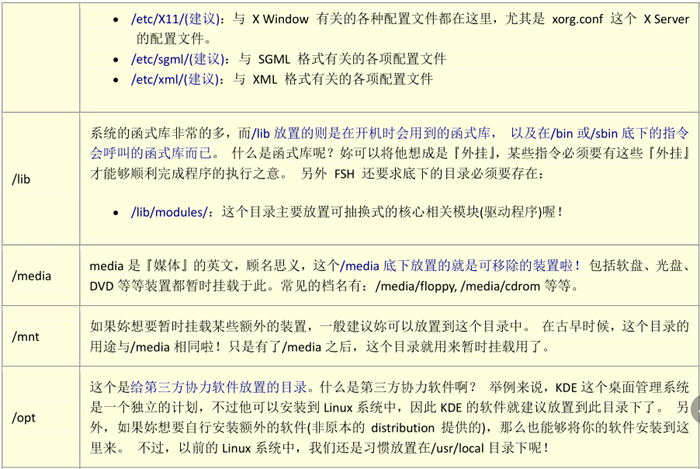

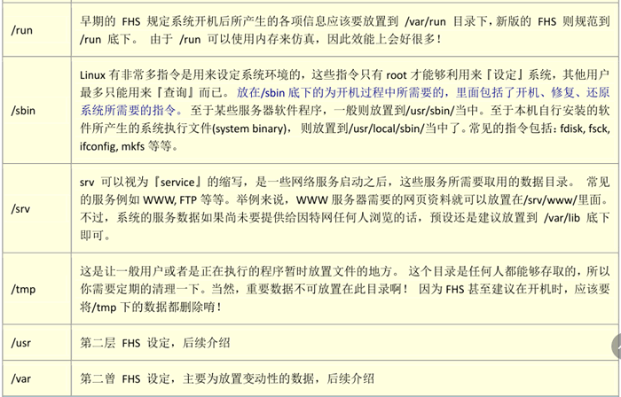


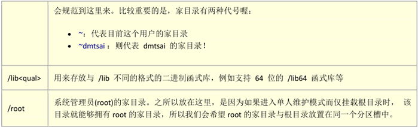

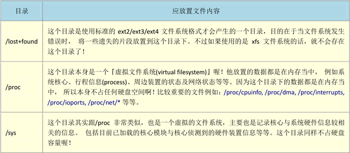

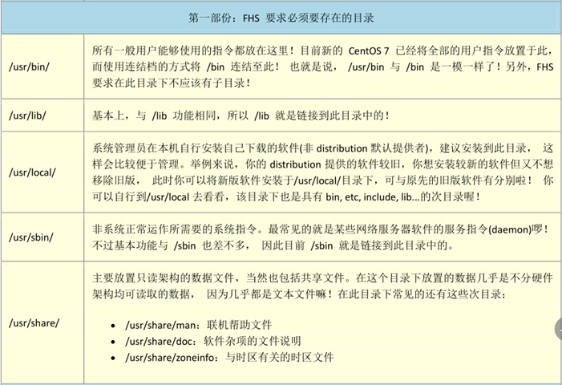

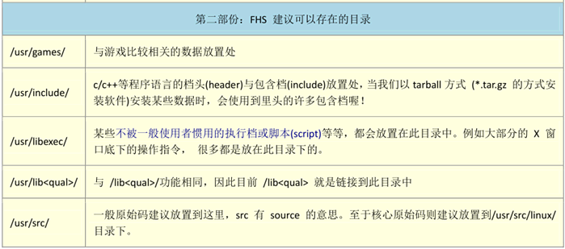


## Linux 文件系统

| 文件系统     | 描 述                         |
|----------|-----------------------------|
| ext      | Linux扩展文件系统，最早的Linux文件系统    |
| ext2     | 第二扩展文件系统，在ext的基础上提供了更多的功能   |
| ext3     | 第三扩展文件系统，支持日志功能             |
| ext4     | 第四扩展文件系统，支持高级日志功能           |
| hpfs     | OS/2高性能文件系统                 |
| jfs      | IBM日志文件系统                   |
| iso9660  | ISO 9660文件系统（CD-ROM）        |
| minix    | MINIX文件系统                   |
| msdos    | 微软的FAT16                    |
| ncp      | Netware文件系统                 |
| nfs      | 网络文件系统                      |
| ntfs     | 支持Microsoft NT文件系统          |
| proc     | 访问系统信息                      |
| ReiserFS | 高级Linux文件系统，能提供更好的性能和硬盘恢复功能 |
| smb      | 支持网络访问的Samba SMB文件系统        |
| sysv     | 较早期的Unix文件系统                |
| ufs      | BSD文件系统                     |
| umsdos   | 建立在msdos上的类Unix文件系统         |
| vfat     | Windows 95文件系统（FAT32）       |
| XFS      | 高性能64位日志文件系统                |

Linux内核采用虚拟文件系统（Virtual File System，VFS）作为和每个文件系统交互的接口。这为Linux内核同任何类型文件系统通信提供了一个标准接口。当每个文件系统都被挂载和使时，VFS将信息都缓存在内存中。

## Linux发行版

**核心Linux发行版**

| 发行版       | 描 述                           |
|-----------|-------------------------------|
| Slackware | 最早的Linux发行版中的一员，在Linux极客中比较流行 |
| Red Hat   | 主要用于Internet服务器的商业发行版         |
| Fedora    | 从Red Hat分离出的家用发行版             |
| Gentoo    | 为高级Linux用户设计的发行版，仅包含Linux源代码  |
| openSUSE  | 用于商用和家用的发行版                   |
| Debian    | 在Linux专家和商用Linux产品中流行的发行版     |

**特定用途的Linux发行版**

| 发行版         | 描述                             |
|-------------|--------------------------------|
| CentOS      | 一款基于Red Hat企业版Linux源代码构建的免费发行版 |
| Ubuntu      | 一款用于学校和家庭的免费发行版                |
| PCLinuxOS   | 一款用于家庭和办公的免费发行版                |
| Mint        | 一款用于家庭娱乐的免费发行版                 |
| dyne:bolic  | 一款用于音频和MIDI应用的免费发行版            |
| Puppy Linux | 一款适用于老旧PC的小型免费发行版              |

**Linux LiveCD发行版**

| 发行版         | 描述                                |
|-------------|-----------------------------------|
| Knoppix     | 来自德国的一款Linux发行版，也是最早的LiveCD Linux |
| PCLinuxOS   | 一款成熟的LiveCD形式的Linux发行版            |
| Ubuntu      | 为多种语言设计的世界级Linux项目                |
| Slax        | 基于Slackware Linux的一款LiveCD Linux  |
| Puppy Linux | 为老旧PC设计的一款全功能Linux                |

## 目录文件管理

<!-- @include: ./commands/cd.md{6-} -->

<!-- @include: ./commands/ls.md{6-} -->

<!-- @include: ./commands/ln.md{6-} -->

<!-- @include: ./commands/mkdir.md{6-} -->

<!-- @include: ./commands/pwd.md{6-} -->

<!-- @include: ./commands/cp.md{6-} -->

<!-- @include: ./commands/mv.md{6-} -->

<!-- @include: ./commands/rmdir.md{6-} -->

<!-- @include: ./commands/rm.md{6-} -->

<!-- @include: ./commands/touch.md{6-} -->

<!-- @include: ./commands/echo.md{6-} -->

<!-- @include: ./commands/tee.md{6-} -->

<!-- @include: ./commands/cat.md{6-} -->

<!-- @include: ./commands/more.md{6-} -->

<!-- @include: ./commands/less.md{6-} -->

<!-- @include: ./commands/find.md{6-} -->

<!-- @include: ./commands/head.md{6-} -->

<!-- @include: ./commands/tail.md{6-} -->

<!-- @include: ./commands/file.md{6-} -->

<!-- @include: ./commands/whereis.md{6-} -->

<!-- @include: ./commands/sort.md{6-} -->

## 符号含义

| 符号        | 含义                               |
| ----------- | ---------------------------------- |
| `l`         | 管道符或者正则                     |
| `>`         | 输出重定向                         |
| `>>`        | 输出追加重定向                     |
| `<`         | 输入重定向                         |
| `<<`        | 输入追加重定向                     |
| `~`         | 当前用户家的目录                   |
| `$()`  \`\` | 引用命令被执行后的结果             |
| `$`         | 以 xx结尾的（正则表达式）          |
| `^`         | 以 xx开头的（正则表达式）          |
| `*`         | 匹配全部字符，通配符               |
| `?`         | 任意一个字符，通配符               |
| `#`         | 注释                               |
| `&`         | 让脚本或程序在后台执行             |
| `&&`        | 并且，条件同时成立                 |
| `[]`        | 表示一个范围（正则表达式，通配符） |
| `{}`        | 产生一个系列（通配符）             |
| `.`         | 当前目录的硬链接                   |
| `..`        | 上级目录的硬链接                   |
|             |                                    |

## 编辑器

<!-- @include: ./commands/vim.md{6-} -->

## 用户及权限管理

<!-- @include: ./commands/chown.md{6-} -->

<!-- @include: ./commands/chmod.md{6-} -->

<!-- @include: ./commands/usermod.md{6-} -->

<!-- @include: ./commands/umask.md{6-} -->

---

## 文件传输

---

## sed

```shell
# 设置IP
  sed -ri "/IPADDR/s#(.*.)\..*#\1.${ip}\"#" /etc/sysconfig/network-scripts/ifcfg-ens33
# 设置UUID
  sed -ri "s/UUID=.*/UUID=\"${UUID}\"/" /etc/sysconfig/network-scripts/ifcfg-ens33
  #$(sed -n '3,100p) 读取文件的3-100行
  cat /etc/hosts\n$(sed -n '3,100p' /etc/hosts)
```

## gawk

## 正则表达式

## 系统管理

<!-- @include: ./commands/ps.md{6-} -->

<!-- @include: ./commands/top.md{6-} -->

<!-- @include: ./commands/kill.md{6-} -->

### 防火墙

实际应用场景中防火墙是要打开的，只能开放端口来外部访问。一般是通过开放端口来实现，关闭防火墙容易导致安全问题。

**启动命令**：`systemctl start firewalld`；`systemctl restart firewalld`；`systemctl status firewalld`

**自动启动**：`systemctl disable firewalld | systemctl enablefirewalld`

**开放端口**：`firewall-cmd --zone=public --add-port=3306/tcp --permanent`

> --zone #作用域
>
> --add-port=3306/tcp #添加端口，格式为：端口/通讯协议
>
> --permanent #永久生效，没有此参数重启后失效
>

**查看开启端口**：`netstat -ntlp` 或：`firewall-cmd --list-ports`

### deepin 防火墙

**获取更新**：`sudo apt-get update`

**更新系统**：`sudo apt-get dist-upgrade -y`

**清理更新缓存**：`sudo apt-get autoclean`

`sudo apt-get install ufw || sudo apt install gufw`

sudo ufw status：*active* 启动，*inactive* 未启动

`sudo ufw enable` 开启

`sudo ufw disable` 关闭

### 端口

查看：`netstat -tunlp |grep port`

`netstat -ntlp` 或：`firewall-cmd --list-ports`

### 修改文件监视程序数量的系统限制

`sudo echo fs.inotify.max_user_watches=524288 | sudo tee -a /etc/sysctl.conf`

## 系统设置


## 安装软件程序

包管理基础

使用Debian包

使用Red Hat包

从源码安装


## 备份压缩

| 命令      | 文件格式 | 描述                               |
|---------|------|----------------------------------|
| bzip2   | .bz2 | 采用Burrows-Wheeler块排序文本压缩算法和霍夫曼编码 |
| gzip    | .gz  | 用来压缩文件；输出`.gz`                   |
| gunzip  |      | 用来解压文件                           |
| gzcat   | .gz  | 用来查看压缩过的文本文件的内容                  |
| zip     | .zip | Windows上PKZIP工具的Unix实现           |
| zipinfo |      |                                  |
| gzexe   |      |                                  |
| tar     | .tar |                                  |

<!-- @include: ./commands/tar.md{6-} -->

## 磁盘管理

- **df**（英文全称：disk free）：列出文件系统的整体磁盘使用量
- **du**（英文全称：disk used）：检查磁盘空间使用量
- **fdisk**：用于磁盘分区

<!-- @include: ./commands/df.md{6-} -->

<!-- @include: ./commands/du.md{6-} -->

<!-- @include: ./commands/fdisk.md{6-} -->

<!-- @include: ./commands/mkfs.md{6-} -->

<!-- @include: ./commands/fsck.md{6-} -->

<!-- @include: ./commands/mount.md{6-} -->

## 磁盘维护


## 网络通讯


## 设备管理


## 电子邮件与新闻组

## 其他命令

bc

tail

head

xargs

ip

nohub

killall

kill

pkill

## 启动 java 服务

nohub java -jar xxx.jar

sh start.sh start

## 实用的工具

[https://www.zhihu.com/question/59227720/answer/163594782](https://www.zhihu.com/question/59227720/answer/163594782)
