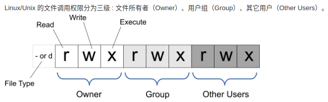
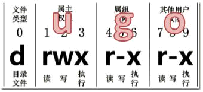

### chmod 文件权限

- [返回命令大全列表](../command.md#文件管理)





①、命令名称：chmod

②、英文原意：change the permissions mode of a file

③、命令所在路径：/bin/chmod

④、执行权限：所有用户

⑤、功能描述：改变文件或目录权限

⑥、语法：

- chmod 【{ugoa}{+-=}{rwx}】【文件或目录】
- chmod 【mode=421】 【文件或目录】

`u`:所有者 `g`:所有组 `o`:其他人 `a`:所有人(`u、g、o` 的总和)

mode=421， `读 r` 表示4，`写 w`表示2，`执行 x`表示1；`rwx`=7，`rw-`=6，`r--`=4，`---`=0

> -R 递归修改
>
> u:user 所有者，g：group组，o：other其他访问者，a：all 所有使用者
>
> 对应的位置是前 中 后三个位置

```shell
chmod -R 777 demo.txt
chmod -R 740 demo.txt
chmod -R 651 demo.txt
```

（1）授予用户对 demo 目录拥有 rwx 权限

```shell
chmod –R u+rwx demo
```

（2）授予组对 demo 目录拥有 rwx 权限

```shell
chmod –R g+rwx demo
```

（3）授予用户、组、其他人对 demo 目录拥有 rwx 权限

```shell
chmod –R u+rwx,g+rwx,o+rwx demo
```

（4） 撤销用户对 demo 目录拥有 w 权限

```shell
chmod –R u-w demo
```

（5） 撤销用户、组、其他人对 demo 目录拥有 x 权限

```shell
chmod –R u-x,g-x,o-x demo
```

（6） 授予用户、组、其他人对 demo 目录只有 rx 权限

```shell
chmod –R u=rx,g=rx,o=rx demo
```
