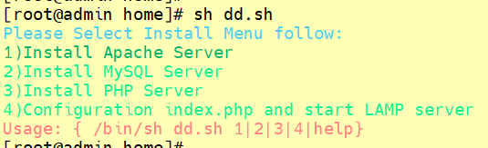

### echo 打印字符或者回显

- [返回命令大全列表](../command.md#文档编辑)

①、命令名称：

②、英文原意：

③、命令所在路径：

④、执行权限：所有用户

⑤、功能描述：打印字符或者回显，例如输入 echo ok，会显示 ok， echo
ok > test.txt 则会把 ok 字符覆盖 test.txt 内容

⑥、语法：

echo 【选项】 【输出内容】 【（输出重定向）> 文件】

```shell
echo "回显"
echo -e "支持\n回显"
echo "12311" >> 01.txt 文本末尾追加
echo "4565555" > 01.txt 替换文本内容
```

**-e 扩展参数的常用参数**

```text
\a 发出警告声
\b 删除前一个字符
\c 最后不加上换行符号；
\f 换行但光标仍旧停留在原来的位置；
\n 换行且光标移至行首；
\r 光标移至行首，但不换行；
\t 插入 tab； \v 与\f 相同；
\\ 插入\字符；
\033[30m 黑色字 \033[0m
\033[31m 红色字 \033[0m
\033[32m 绿色字 \033[0m
\033[33m 黄色字 \033[0m
\033[34m 蓝色字 \033[0m
\033[35m 紫色字 \033[0m
\033[36m 天蓝字 \033[0m
\033[37m 白色字 \033[0m
\033[40;37m 黑底白字 \033[0m
\033[41;37m 红底白字 \033[0m
\033[42;37m 绿底白字 \033[0m
\033[43;37m 黄底白字 \033[0m
\033[44;37m 蓝底白字 \033[0m
\033[45;37m 紫底白字 \033[0m
\033[46;37m 天蓝底白字 \033[0m
\033[47;30m 白底黑字 \033[0m
```

echo 颜色打印扩展，auto.sh 内容如下：

```shell
echo -e "\033[36mPlease Select Install Menu follow:\033[0m"
echo -e "\033[32m1)Install Apache Server\033[1m"
echo "2)Install MySQL Server"
echo "3)Install PHP Server"
echo "4)Configuration index.php and start LAMP server"
echo -e "\033[31mUsage: { /bin/sh $0 1|2|3|4|help}\033[0m"
```


