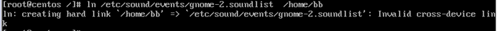

### ln 链接创建

- [返回命令大全列表](../command.md#文件管理)

权限后的数字代表硬链接数

①、命令名称：ln

②、英文原意：link

③、命令所在路径：/bin/link

④、执行权限：所有用户

⑤、功能描述：生成链接文件

⑥、语法： ln -s 【源文件】【目标文件】

> `-s` 创建软链接
>
> `不加 -s` 创建硬链接

**例子：**

一、创建文件 /etc/issue 的软链接 /tmp/issue.soft：ln -s /etc/issue /tmp/issue.soft

二、创建文件 /etc/issue 的硬链接 /tmp/issue.hard：ln /etc/issue /tmp/issue.hard

 ```shell
[root@admin /]# ln -s /etc/issue /tmp/issue.soft
[root@admin /]# ln /etc/issue /tmp/issue.hard
[root@admin /]# ls -all /tmp/issue.*
-rw-r--r--. 2 root root 23 11月 23 2020 /tmp/issue.hard
lrwxrwxrwx  1 root root 10 9月   9 22:24 /tmp/issue.soft -> /etc/issue
[root@admin /]# ls -i /tmp/issue.*
 ```

第一：软链接 前面是 l 开头的（link）,而硬链接是 - 开头，表示文件

第二：软链接所有者和所属组具有全部操作的权限，rwxrwxrwx 而硬链接不是。也就是软链接的前面都是 lrwxrwxrwx

第三：软链接类似与 windows 的快捷方式，有一个明显的箭头指向，而指向的是源文件

第四：硬链接文件除了文件名与源文件不一样，其余所有信息都是一样的。类似于 cp 复制操作。但是又和复制不一样，硬链接可以同步更新。

第五：通过 ls -i 操作，来查看 文件的 i 节点。发现硬链接和源文件的 i 节点是相同的，而软链接与源文件的 i 节点是不同的

```shell
[root@admin /]# ls -i /etc/issue
135778923 /etc/issue
[root@admin /]# ls -all -i  /tmp/issue.*
135778923 -rw-r--r--. 2 root root 23 11月 23 2020 /tmp/issue.hard
134299727 lrwxrwxrwx  1 root root 10 9月   9 22:24 /tmp/issue.soft -> /etc/issue
```

第六：不允许将硬链接指向目录；不允许跨分区创建硬链接




链接查看指令


