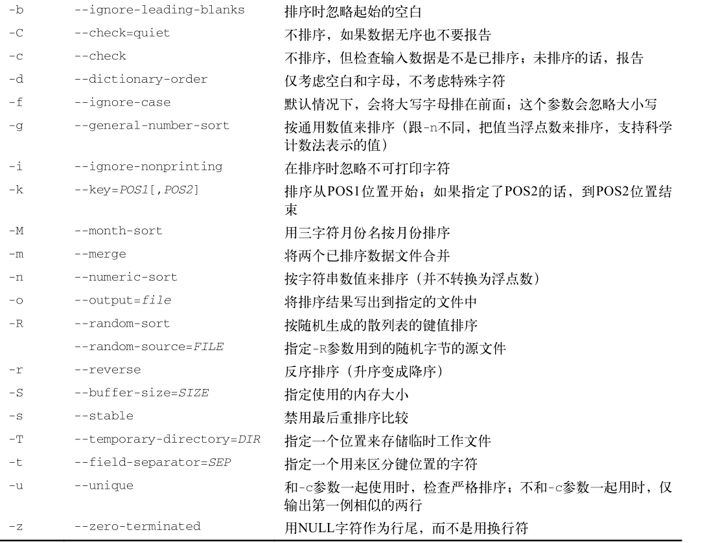

### sort 排序数据

- [返回命令大全列表](../command.md#文档编辑)

①、命令名称：sort

②、英文原意：

③、命令所在路径：

④、执行权限：所有用户

⑤、功能描述：对数据进行排序

⑥、语法：

cat 【选项】 【文件】



```shell
[root@admin home]# cat demo.txt
one
two
three
four
five

[root@admin home]# sort demo.txt

five
four
one
three
two

[root@admin home]# sort ds.log
1
10
100
145
2
3
45
75
[root@admin home]# sort -n ds.log
1
2
3
10
45
75
100
145

[root@admin home]# sort df.log
Apr
Aug
Dec
Feb
Jan
Jul
Jun
Mar
May
Nov
Oct
Sep
[root@admin home]# sort -M df.log
Jan
Feb
Mar
Apr
May
Jun
Jul
Aug
Sep
Oct
Nov
Dec
```

-k 和 -t 参数在对按字段分隔的数据进行排序时非常有用

```shell
[root@admin home]# sort -t ':' -k 3 -n /etc/passwd
root:x:0:0:root:/root:/bin/bash
bin:x:1:1:bin:/bin:/sbin/nologin
daemon:x:2:2:daemon:/sbin:/sbin/nologin
adm:x:3:4:adm:/var/adm:/sbin/nologin
lp:x:4:7:lp:/var/spool/lpd:/sbin/nologin
sync:x:5:0:sync:/sbin:/bin/sync
shutdown:x:6:0:shutdown:/sbin:/sbin/shutdown
halt:x:7:0:halt:/sbin:/sbin/halt
mail:x:8:12:mail:/var/spool/mail:/sbin/nologin
operator:x:11:0:operator:/root:/sbin/nologin
games:x:12:100:games:/usr/games:/sbin/nologin
ftp:x:14:50:FTP User:/var/ftp:/sbin/nologin
pkiuser:x:17:17:Certificate System:/usr/share/pki:/sbin/nologin
named:x:25:25:Named:/var/named:/sbin/nologin
```

按第三个字段——用户ID的数值排序

-n 参数在排序数值时非常有用，比如 du 命令的输出:( -r 参数将结果按降序输出)

```shell
[root@admin home]# du -sh * | sort -nr
921M    soft
16K     user1
4.0K    ds.log
4.0K    df.log
4.0K    demo.txt
0       ddopff.log
0       ddgff.log
0       ddg2ff.log

```
