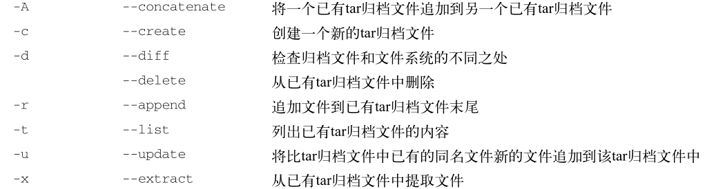
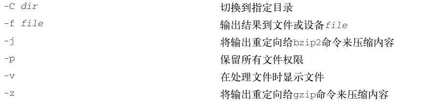

### tar 归档数据

- [返回命令大全列表](../command.md#备份压缩)

①、命令名称：tar

②、英文原意：

③、命令所在路径：

④、执行权限：所有用户

⑤、功能描述：归档数据

⑥、语法：

tar function [options] object1 object2 ...





```shell
tar -zxvf xxx.tar
tar -zxvf xxx.tar.gz
```

首先，你可以用下列命令来创建一个归档文件：

```shell
tar -cvf test.tar test/ test2/
```

上面的命令创建了名为test.tar的归档文件，含有test和test2目录内容。接着，用下列命令：

```shell
tar -tf test.tar
```

列出tar文件test.tar的内容（但并不提取文件）。最后，用命令：

```shell
tar -xvf test.tar
```
