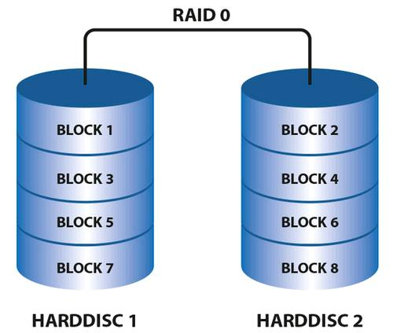
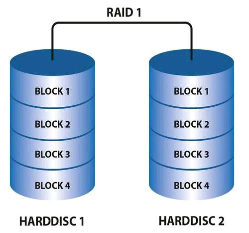
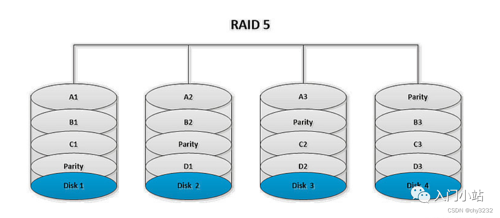
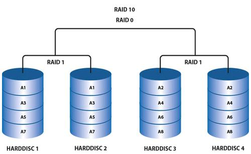
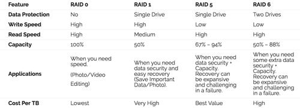
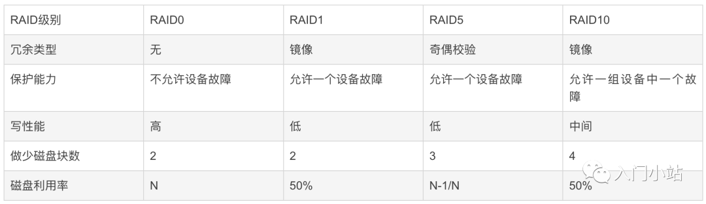
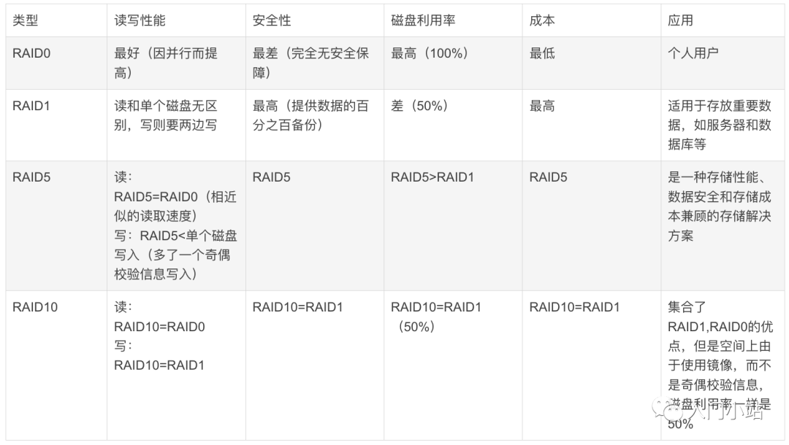

磁盘相关知识

<!-- more -->

## RAID磁盘阵列

### RAID 概念

RAID 是英文 (*Redundant Array of Independent Disks*) 的缩写，翻译成中文是“独立磁盘冗余阵列”, 简称[磁盘阵列]（Disk Array）。

>在单机时代，采用单块磁盘进行数据存储和读写的方式，由于寻址和读写的时间消耗，导致I/O性能非常低，且存储容量还会受到限制。
>另外，单块磁盘极其容易出现物理故障，经常导致数据的丢失。
>因此大家就在想，有没有一种办法将多块独立的磁盘结合在一起组成一个技术方案，来提高数据的可靠性和I/O性能。

简单的说，RAID 是一种把多块独立的硬盘（物理硬盘）按不同的方式组合起来形成一个硬盘组（逻辑硬盘），从而提供比单个硬盘更高的存储性能和提供[数据备份]技术。

在这种情况下，RAID技术就应运而生了。

RAID 技术的两大特点：**一是速度、二是安全**

### RAID 有哪些？

RAID方案常见的可以分为：

- RAID0
- RAID1
- RAID5
- RAID6
- RAID10

### RAID0 读写性能高（拆分）

RAID 0 技术把多块物理硬盘设备（至少两块）通过硬件或软件的方式串联在一起，组成一个大的卷组，并将数据一次写入到各个物理硬盘中。
这样硬盘设备的读写性能会提升数倍，但是若任意一块硬盘发生故障将导致整个系统的数据都受到破坏。

- 优点：使用 *n* 颗硬盘，即可拥有将近 *n* 倍的读写效能，读写性能是所有 RAID 级别中最高的。（仅限理论，因为实际中磁盘的寻址时间也是性能占用的大头）
- 缺点：不提供数据校验或数据冗余，因此一旦用户数据损坏，损坏的数据将无法得到恢复, RAID0 运行时只要其中任一块硬盘出现问题就会导致整个数据的故障。
因此RAID0就不可能用于高要求的业务中，但可以用在对可靠性要求不高，对读写性能要求高的场景中。

那有没有可以让存储可靠性变高的方案呢？

有的，下面的RAID1就是。

### RAID1 可靠性变高（备份）

RAID1 是将一个两块硬盘所构成 RAID 磁盘阵列，其容量仅等于一块硬盘的容量，因为另一块只是当作数据 “镜像”。

- 优点：安全性依照数组里的实体硬盘数量倍数成长。
- 缺点：空间利用率是所有 RAID 中最没有效率的。

硬盘数量：最少 *2* 个, 磁盘空间使用率：*50%*，故成本是非常昂贵的。

>RAID1其实与RAID0效果刚好相反。RAID1 这种双写的做法，就给数据做了一个冗余备份。
>这样的话，任何一块磁盘损坏了，都可以再基于另外一块磁盘去恢复数据，数据的可靠性非常强，但性能就没那么好了。

了解了RAID0和RAID1之后，我们发现这两个方案都不完美啊。

这时候就该 性能又好、可靠性也高 的方案 RAID5 登场了。

### RAID5 性能与数据备份的均衡考虑

这是目前用的最多的一种方式。

因为 RAID5 是一种将 **存储性能、数据安全、存储成本** 兼顾的一种方案。

在了解 RAID5 之前，我们可以先简单看一下 `RAID3`，虽然RAID3用的很少，但弄清楚了RAID3就很容易明白RAID5的思路。

---

RAID3的方式是：将数据按照RAID0的形式，分成多份同时写入多块磁盘，但是还会另外再留出一块磁盘用于写「奇偶校验码」。

> 例如总共有 `N` 块磁盘，那么就会让其中额度 `N-1` 块用来并发的写数据，第 `N` 块磁盘用记录校验码数据。一旦某一块磁盘坏掉了，就可以利用其它的 `N-1` 块磁盘去恢复数据。
> 但是由于第 `N` 块磁盘是校验码磁盘，因此有任何数据的写入都会要去更新这块磁盘，导致这块磁盘的读写是最频繁的，也就非常的容易损坏。

---

RAID5的方式可以说是对RAID3进行了改进。

RAID5模式中，不再需要用单独的磁盘写校验码了。它把校验码信息分布到各个磁盘上。

> 例如，总共有 `N` 块磁盘，那么会将要写入的数据分成 `N` 份，并发的写入到 `N` 块磁盘中，
> 同时还将数据的校验码信息（`Parity`）也写入到这 `N` 块磁盘中（`数据与对应的校验码信息必须得分开存储在不同的磁盘上`）。
> 一旦某一块磁盘损坏了，就可以用剩下的数据和对应的奇偶校验码信息去恢复损坏的数据。

RAID5 技术是把多块硬盘设备（至少三块）的数据奇偶校验信息（`Parity`）保存到其他硬盘设备中。
RAID5 磁盘阵列组中数据的奇偶校验信息（`Parity`）并不是单独保存到某一块硬盘设备中，
而是存储到 *除自身以外* 的其他每一块硬盘设备上，这样的好处是其中任何一设备损坏后不至于出现致命缺陷；

RAID5 不对存储的数据进行备份，而是把数据和相对应的奇偶校验信息存储到组成 RAID5 的各个磁盘上，
并且奇偶校验信息和相对应的数据分别存储于不同的磁盘上。当 RAID5 的一个磁盘数据发生损坏后，
利用剩下的数据和相应的奇偶校验信息去恢复被损坏的数据。

RAID5 校验位算法原理：`P = D1 xor D2 xor D3 … xor Dn` （`D1,D2,D3 … Dn`为数据块，`P`为校验，`xor`为异或运算）

RAID5 允许最多同时坏一块磁盘。如果有两块磁盘同时损坏了，那数据就无法恢复了。

- 优点：兼顾空间利用率与安全性。
- 缺点：需要额外的运算资源，仅能忍受 `1` 个硬盘损毁。
- 硬盘数量：至少 `3` 个。

### RAID6 进一步提高存储的高可用

为了进一步提高存储的高可用，聪明的人们又提出了RAID6方案，可以在有两块磁盘同时损坏的情况下，也能保障数据可恢复。

为什么RAID6这么牛呢，因为RAID6在RAID5的基础上再次改进，引入了双重校验的概念。

RAID6除了每块磁盘上都有同级数据XOR校验区以外，还有针对每个数据块的XOR校验区，这样的话，相当于每个数据块有两个校验保护措施，因此数据的冗余性更高了。

但是RAID6的这种设计也带来了很高的复杂度，虽然数据冗余性好，读取的效率也比较高，但是写数据的性能就很差。因此RAID6在实际环境中应用的比较少。

### RAID10

RAID10其实就是RAID1与RAID0的一个合体。

如下图，RAID10 技术需要至少四块硬盘来组建，其中先分别两两制作成 RAID1 磁盘阵列，以保证数据的安全性；
然后再对两个 RAID1 磁盘阵列实施 RAID0 技术，进一步提高硬盘设备的读写速度。
这样子从理论上讲，只要坏的不是同一组中的所有硬盘，那么最多可以损坏 *50%* 的硬盘设备而不丢失数据。
RAID10 技术继承了 RAID0 的高读写速度和 RAID1 的数据安全性。

RAID10兼备了 RAID1 和 RAID0 的有优点。首先基于RAID1模式将磁盘分为2份，当要写入数据的时候，
将所有的数据在两份磁盘上同时写入，相当于写了双份数据，起到了数据保障的作用。且在每一份磁盘上
又会基于RAID0技术讲数据分为N份并发的读写，这样也保障了数据的效率。

- 优点：利用 RAID1 写了双份数据，保障了数据安全性；利用 RAID0 保障了数据的使用效率。
- 缺点：有一半的磁盘空间用于存储冗余数据的，浪费的很严重，因此用的也不是很多。

### 对比

整体对比一下 `RAID0、RAID1、RAID5、RAID6、RAID10` 的几个特征：

#### 1）容错对比

#### 2）性能对比

以上内容来自: [不止思考_奎哥](https://m.imooc.com/article/264962)，微信公众号：**入门小站**
