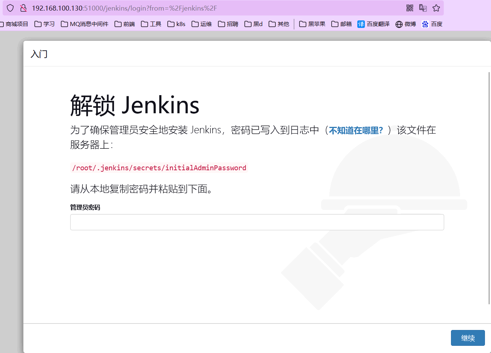
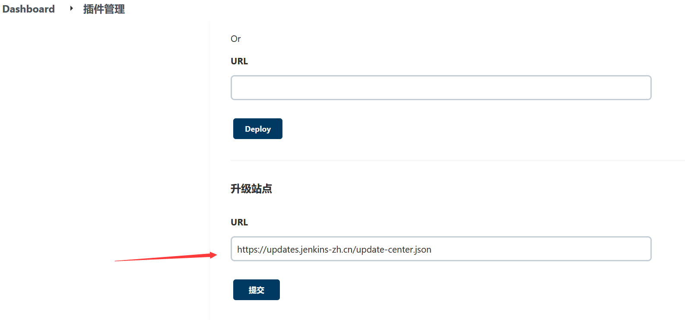
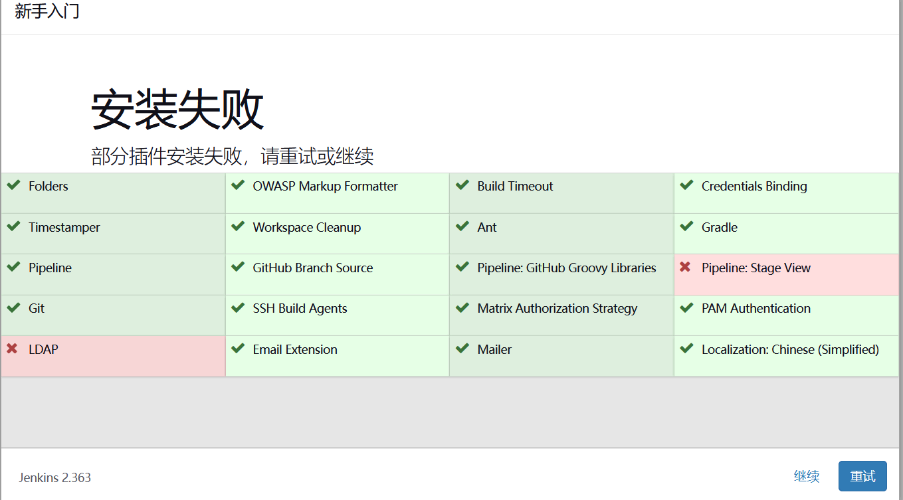
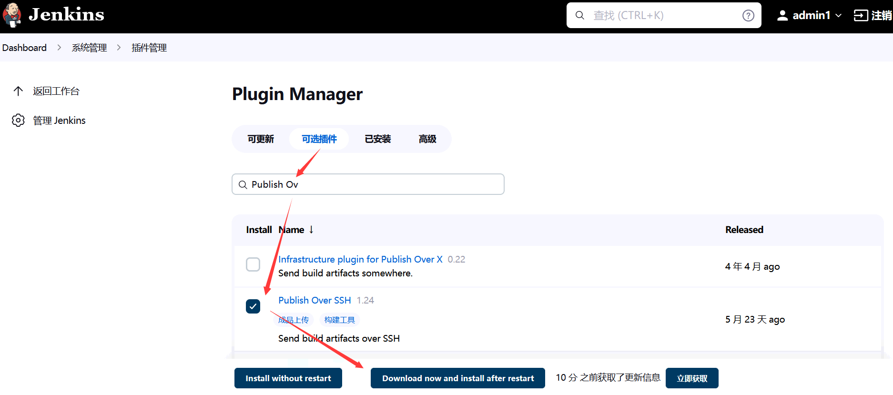
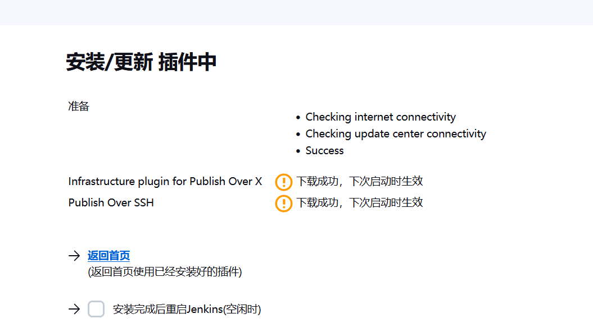
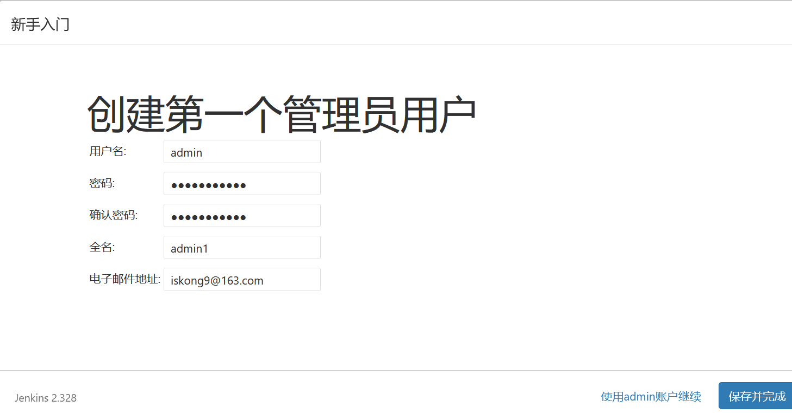
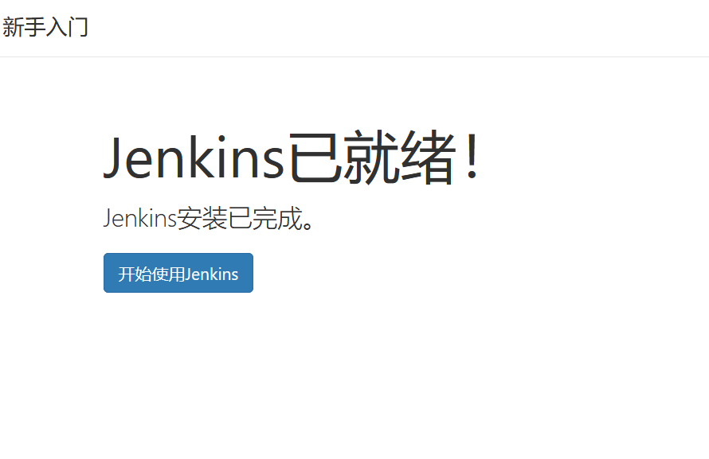

<!-- more -->

# Jenkins自动化部署


> 开发push代码到git，触发jenkins自动pull代码，通过maven编译、打包，然后通过执行shell脚本使docker构建镜像并push到私服（或者阿里云）仓库，此操作完成后jenkins服务器上再执行SSH命令登录到部署服务器，docker从仓库（私服）拉取镜像，启动容器。整个操作流程完成。

---

## 通过 war 安装 2.372（推荐使用）

下载地址：[huawei源2.346](https://mirrors.huaweicloud.com/jenkins/war/2.346/jenkins.war)、[稳定版列表](https://get.jenkins.io/war-stable/)、[尝鲜版列表](https://get.jenkins.io/war/)

```shell
wget -O ./jenkins3611.war https://get.jenkins.io/war-stable/2.361.1/jenkins.war
```

```shell
wget -O ./jenkins372.war https://get.jenkins.io/war/2.372/jenkins.war
```

安装（提取码：1234）： [java各个版本下载](https://pan.baidu.com/s/17pkHcX7YrssnEVctveHbHQ)、[maven3.8](https://pan.baidu.com/s/1ch1_sjFDvvgY52-niYEBFw)、[tomcat](https://pan.baidu.com/s/1TQgpdHz6p38k6QxPsBDhrQ)、yum install -y git

### 安装 JDK

- 卸载默认jdk

```
rpm -qa | grep java
rpm -e --nodeps java-1.8.0-openjdk*
rpm -e --nodeps  java-1.8.0-openjdk*
```

- 解压安装

```
tar -zxvf jdk-17_linux-x64_bin.tar.gz -C /usr/java/
```

`rm -rf /usr/bin/ja* &&  ln -s /usr/java/jdk-17.0.4/bin/ja* /usr/bin/ && ls -al /usr/bin/ja*`

- 设置环境变量

`vim /etc/profile`

jdk17没有jre目录

```bash
export JAVA_HOME=/usr/java/jdk-17.0.4

export PATH=$JAVA_HOME/bin:$PATH
```

### 安装 tomcat

```
tar -zxvf apache-tomcat-9.0.65.tar.gz -C /data
mv /data/apache-tomcat-9.0.65 /data/tomcat-9.0.65 
```

设置端口 `vim /data/tomcat-9.0.65/conf/server.xml`

```xml
    <Connector port="51000" protocol="HTTP/1.1"
               connectionTimeout="20000"
               redirectPort="8443" URIEncoding="UTF-8" />
```

### 安装 maven

- 解压

```
tar -zxvf apache-maven-3.8.6-bin.tar.gz
```

- 设置环境变量

`vim /etc/profile`

```bash
export JAVA_HOME=/usr/java/jdk-17.0.4
export M2_HOME=/data/apache-maven-3.8.6

export PATH=$JAVA_HOME/bin:${M2_HOME}/bin:$PATH
```

使环境变量生效：`source /etc/profile`

```bash
[root@n1 apache-maven-3.8.6]# mvn -v

Apache Maven 3.8.6 (84538c9988a25aec085021c365c560670ad80f63)
Maven home: /data/apache-maven-3.8.6
Java version: 17.0.4, vendor: Oracle Corporation, runtime: /usr/java/jdk-17.0.4
Default locale: zh_CN, platform encoding: UTF-8
OS name: "linux", version: "3.10.0-1160.71.1.el7.x86_64", arch: "amd64", family: "unix"

[root@n1 soft]# java -version
java version "17.0.4" 2022-07-19 LTS
Java(TM) SE Runtime Environment (build 17.0.4+11-LTS-179)
Java HotSpot(TM) 64-Bit Server VM (build 17.0.4+11-LTS-179, mixed mode, sharing)
```

### tomcat 启动 jenkins

使用Java测试运行1 `java -jar jenkins.war httpPort=8889`

把war放到 tomcat 里运行 `cp -R ../software/jenkins.war ./webapps/`

执行：`./bin/startup.sh`

访问：`http://192.168.100.130:51000/jenkins372/`



查看密码

```bash
cat /root/.jenkins/secrets/initialAdminPassword
```

62db2150540d400a8b86944ea4c9a2af

**后续参考下面docker的：【安装插件】**

## 通过 yum 安装

稳定版

```bash
sudo wget -O /etc/yum.repos.d/jenkins.repo https://pkg.jenkins.io/redhat-stable/jenkins.repo

#########
[jenkins]
name=Jenkins-stable
baseurl=http://pkg.jenkins.io/redhat-stable
gpgcheck=1
########

sudo rpm --import https://pkg.jenkins.io/redhat-stable/jenkins.io.key
```

最新版

```bash
wget -O /etc/yum.repos.d/jenkins2.repo https://pkg.jenkins.io/redhat/jenkins.repo
 
#########
[jenkins]
name=Jenkins
baseurl=http://pkg.jenkins.io/redhat
gpgcheck=1
########
 
rpm --import https://pkg.jenkins.io/redhat/jenkins.io.key
```

```bash
yum install jenkins

jenkins --version
2.363
```

修改jenkins的端口号，默认为8080。这里修改为8099。

vim /etc/sysconfig/jenkins ：jenkins配置文件

```yaml
## Type:        integer(0:65535)
## Default:     8080
## ServiceRestart: jenkins
#
# Port Jenkins is listening on.
# Set to -1 to disable
#
JENKINS_PORT="8099"
```

```
service Jenkins restart
systemctl enable jenkins.service
systemctl start jenkins.service
systemctl restart jenkins.service
systemctl status jenkins.service
```

查看密码

```bash
cat /var/lib/jenkins/secrets/initialAdminPassword
2a35ad12127f45fd8a61b1017b38c907
```

<http://192.168.100.130:8099>

---

## 通过 docker 安装 2.363

[自动化部署 参考](https://blog.csdn.net/xiaoxiangzi520/article/details/88842200)

[设置docker快捷键](https://blog.csdn.net/qq_42476834/article/details/117373828)

[docker.hub](https://hub.docker.com/r/jenkins/jenkins)

### 安装

```bash
docker pull jenkins/jenkins:latest
docker pull jenkins/jenkins:lts-jdk17
docker pull jenkins/jenkins:lts-centos7
docker pull jenkins/jenkins:2.363
docker pull jenkins/jenkins:2.363-jdk17
docker pull jenkins/jenkins:2.363-centos7

docker tag jenkins/jenkins:2.363-centos7 registry.cn-chengdu.aliyuncs.com/jinfang/jenkins:2.363-centos7

docker push registry.cn-chengdu.aliyuncs.com/jinfang/jenkins:2.363-centos7
```

```shell
mkdir -p /data/jenkins_home
chmod 777 /data/jenkins_home
```

```shell
docker run -d -p 8888:8080 -p 50000:50000 \
--restart always \
-v /data/jenkins_home:/var/jenkins_home \
-v /etc/localtime:/etc/localtime \
--name jenkins registry.cn-chengdu.aliyuncs.com/jinfang/jenkins:latest
```

```shell
docker run -d -p 8889:8080 -p 50001:50000 \
--restart always \
-v /data/jenkins_jdk17:/var/jenkins_home \
-v /etc/localtime:/etc/localtime \
--name jenkins-jdk17 registry.cn-chengdu.aliyuncs.com/jinfang/jenkins:2.363-jdk17
```

```
ansible web -m shell -a 'docker pull registry.cn-chengdu.aliyuncs.com/jinfang/jenkins:latest'
```

访问：<http://192.168.0.8:8889>

---


---


---

### 查看管理员密码

```
docker logs jenkins
```

```shell

*************************************************************
*************************************************************
*************************************************************

Jenkins initial setup is required. An admin user has been created and a password generated.
Please use the following password to proceed to installation:

62fc38a29bf840ee8c5fcf746ad9f574

This may also be found at: /var/jenkins_home/secrets/initialAdminPassword

*************************************************************
*************************************************************
*************************************************************
```

> 62fc38a29bf840ee8c5fcf746ad9f574

### 配置国内站点加速

`vim /data/jenkins_home/hudson.model.UpdateCenter.xml`

把 `https://updates.jenkins.io/update-center.json`

换为其中之一

```
https://updates.jenkins-zh.cn/update-center.json

https://mirrors.tuna.tsinghua.edu.cn/jenkins/updates/update-center.json

https://mirrors.huaweicloud.com/jenkins/updates/update-center.json
```

```xml
<?xml version='1.1' encoding='UTF-8'?>
<sites>
  <site>
    <id>default</id>
    <url>https://mirrors.huaweicloud.com/jenkins/updates/update-center.json</url>
  </site>
</sites>
```

其实国内的配置内容使用的下载更新地址也是 *Jenkins* 官方默认下载的地址，所以还得编辑 `updates/default.json`

```
sed -i 's#https://updates.jenkins.io/download#https://mirrors.huaweicloud.com/jenkins#g' default.json

sed -i 's#http://www.google.com#https://www.baidu.com#g' default.json
```

国内常用的镜像地址：

| 来源       | 地址                                            |
|----------|-----------------------------------------------|
| tencent  | <https://mirrors.cloud.tencent.com/jenkins/>    |
| huawei   | <https://mirrors.huaweicloud.com/jenkins/>      |
| tsinghua | <https://mirrors.tuna.tsinghua.edu.cn/jenkins/> |
| ustc     | <https://mirrors.ustc.edu.cn/jenkins/>          |
| bit      | <http://mirror.bit.edu.cn/jenkins/>             |

也可以在管理界面进行设置



重启服务：`docker restart jenkins`

查看配置： `[root@n1 jenkins_home]# cat updates/default.json`

### 安装插件

二选一即可




### 安装自动化构建和部署所需的插件

所需插件：git plugin、Maven Integration、Pipeline Maven Integration、Gitlab、SSH、Publish Over SSH、gitee、github、Deploy to container、Docker、Docker Commons、docker-build-step

​  






### 创建用户

admin admin123456






---

## 自动部署项目（springBoot+maven+gitee）

### 添加凭证

`http://192.168.100.130:51000/gitee-project/drj`

## 基础介绍

*小目录*

- 什么是流水线
- 声明式流水线
- Jenkinsfile 的使用

### 什么是流水线

jenkins 有 2 种流水线分为 **声明式流水线**与**脚本化流水线**，
脚本化流水线是 jenkins 旧版本使用的流水线脚本，新版本 Jenkins 推荐使用声明式流水线。
文档只介绍声明流水线。

#### 1声明式流水线

在声明式流水线语法中，流水线过程定义在 `Pipeline{}` 中，Pipeline 块定义了整个流水线中完成的所有工作，比如

**参数说明：**

- **agent any** ：在任何可用的代理上执行流水线或它的任何阶段，也就是执行流水线过程的位置，也可以指定到具体的节点
- **stage** ：定义流水线的执行过程（相当于一个阶段），比如下文所示的 `Build、Test、Deploy`， 但是这个名字是根据实际情况进行定义的，并非固定的名字
- **steps** ：执行某阶段具体的步骤。

```xml
//Jenkinsfile (Declarative Pipeline)
pipeline {
  agent any
    stages {
      stage('Build') {
        steps {
          echo 'Build'
        }
      }
      stage('Test') {
        steps {
          echo 'Test'
        }
      }
      stage('Deploy') {
        steps {
          echo 'Deploy'
      }
    }
  }
}
```

#### 2脚本化流水线

在脚本化流水线语法中，会有一个或多个 Node（节点）块在整个流水线中执行核心工作

**参数说明:**

- **node** ：在任何可用的代理上执行流水线或它的任何阶段，也可以指定到具体的节点
- **stage** ：和声明式的含义一致，定义流水线的阶段。Stage 块在脚本化流水线语法中是可选的，
然而在脚本化流水线中实现 stage 块，可以清楚地在 Jenkins UI 界面中显示每个 stage 的任务子集。

```yaml
//Jenkinsfile (Scripted Pipeline)
node {
  stage('Build') {
    echo 'Build'
  }
  stage('Test') {
    echo 'Test'
  }
  stage('Deploy') {
    echo 'Deploy'
  }
}
```

### 声明式流水线

声明式流水线必须包含在一个 `Pipeline` 块中，比如是一个 `Pipeline` 块的格式

```yaml
pipeline {
  /* insert Declarative Pipeline here */
}
```

在声明式流水线中有效的基本语句和表达式遵循与 `Groovy` 的语法同样的规则，但有以下例外

- 流水线顶层必须是一个 block，即 pipeline{}
- 分隔符可以不需要分号，但是每条语句都必须在自己的行上
- 块只能由 Sections、Directives、Steps 或 assignment statements 组成
- 属性引用语句被当做是无参数的方法调用，比如 input 会被当做 input()。

#### Sections

声明式流水线中的 Sections 不是一个关键字或指令，
而是包含一个或多个 `Agent`、`Stages`、 `post`、`Directives` 和 `Steps` 的代码区域块。

1.Agent

Agent 表示整个流水线或特定阶段中的步骤和命令执行的位置，该部分必须在 pipeline 块的顶层被定义，也可以在 stage 中再次定义，但是 stage 级别是可选的。

**any**

在任何可用的代理上执行流水线，配置语法

```yaml
pipeline {
  agent any
}
```

**none**

表示该 Pipeline 脚本没有全局的 agent 配置。当顶层的 agent 配置为 none 时， 每个 stage 部分都需要包含它自己的 agent。配置语法

```yaml
pipeline {
  agent none
  stages {
    stage('Stage For Build'){
      agent any
    }
  }
}
```

**label**

以节点标签形式选择某个具体的节点执行 Pipeline 命令，例如：agent { label 'my-defined-label' }。节点需要提前配置标签。

```yaml
pipeline {
  agent none
    stages {
      stage('Stage For Build'){
        agent { label 'role-master' }
        steps {
          echo "role-master"
        }
      }
    }
}
```

**node**

和 label 配置类似，只不过是可以添加一些额外的配置，比如 customWorkspace(设置默认工作目录)

```yaml
pipeline {
  agent none
    stages {
      stage('Stage For Build'){
        agent {
          node {
            label 'role-master'
            customWorkspace "/tmp/zhangzhuo/data"
          }
        }
        steps {
          sh "echo role-master > 1.txt"
        }
      }
    }
}
```

**dockerfile**

使用从源码中包含的 Dockerfile 所构建的容器执行流水线或 stage。此时对应的 agent 写法如下

```yaml
agent {
   dockerfile {
     filename 'Dockerfile.build'  //dockerfile文件名称
     dir 'build'                  //执行构建镜像的工作目录
     label 'role-master'          //执行的node节点，标签选择
     additionalBuildArgs '--build-arg version=1.0.2' //构建参数
   }
}
```

**docker**

相当于 dockerfile，可以直接使用 docker 字段指定外部镜像即可，可以省去构建的时间。比如使用 maven 镜像进行打包，同时可以指定 args

```
agent{
  docker{
    image '192.168.10.15/kubernetes/alpine:latest'   //镜像地址
    label 'role-master' //执行的节点，标签选择
    args '-v /tmp:/tmp'      //启动镜像的参数
  }
}
```

**kubernetes**

需要部署 kubernetes 相关的插件，[官方文档](https://github.com/jenkinsci/kubernetes-plugin/)

Jenkins 也支持使用 Kubernetes 创建 Slave，也就是常说的动态 Slave。配置示例如下

- cloud: Configure Clouds 的名称，指定到其中一个 k8s

- slaveConnectTimeout: 连接超时时间

- yaml: pod 定义文件，jnlp 容器的配置必须有配置无需改变，其余 containerd 根据自己情况指定

- workspaceVolume：持久化 jenkins 的工作目录。

- persistentVolumeClaimWorkspaceVolume：挂载已有 pvc。

```shell
workspaceVolume persistentVolumeClaimWorkspaceVolume(claimName: "jenkins-agent", mountPath: "/", readOnly: "false")
```

- nfsWorkspaceVolume：挂载 nfs 服务器目录

```shell
workspaceVolume nfsWorkspaceVolume(serverAddress: "192.168.10.254", serverPath: "/nfs", readOnly: "false")
```

- dynamicPVC：动态申请 pvc，任务执行结束后删除

```shell
workspaceVolume dynamicPVC(storageClassName: "nfs-client", requestsSize: "1Gi", accessModes: "ReadWriteMany")
```

- emptyDirWorkspaceVolume：临时目录，任务执行结束后会随着 pod 删除被删除，主要功能多个任务 container 共享 jenkins 工作目录。

```shell
workspaceVolume emptyDirWorkspaceVolume()
```

- hostPathWorkspaceVolume：挂载 node 节点本机目录，注意挂载本机目录注意权限问题，可以先创建设置 777 权限，否则默认 kubelet 创建的目录权限为 755 默认其他用户没有写权限，执行流水线会报错。

```shell
workspaceVolume hostPathWorkspaceVolume(hostPath: "/opt/workspace", readOnly: false)
```

示例

```
agent {
  kubernetes {
      cloud 'kubernetes'
      slaveConnectTimeout 1200
      workspaceVolume emptyDirWorkspaceVolume()
      yaml '''
kind: Pod
metadata:
  name: jenkins-agent
spec:
  containers:
  - args: [\'$(JENKINS_SECRET)\', \'$(JENKINS_NAME)\']
    image: '192.168.10.15/kubernetes/jnlp:alpine'
    name: jnlp
    imagePullPolicy: IfNotPresent
  - command:
      - "cat"
    image: "192.168.10.15/kubernetes/alpine:latest"
    imagePullPolicy: "IfNotPresent"
    name: "date"
    tty: true
  restartPolicy: Never
'''
  }
}
```

2.agent 的配置示例

**kubernetes 示例**

```
pipeline {
  agent {
    kubernetes {
      cloud 'kubernetes'
      slaveConnectTimeout 1200
      workspaceVolume emptyDirWorkspaceVolume()
      yaml '''
kind: Pod
metadata:
  name: jenkins-agent
spec:
  containers:
  - args: [\'$(JENKINS_SECRET)\', \'$(JENKINS_NAME)\']
    image: '192.168.10.15/kubernetes/jnlp:alpine'
    name: jnlp
    imagePullPolicy: IfNotPresent
  - command:
      - "cat"
    image: "192.168.10.15/kubernetes/alpine:latest"
    imagePullPolicy: "IfNotPresent"
    name: "date"
    tty: true
  - command:
      - "cat"
    image: "192.168.10.15/kubernetes/kubectl:apline"
    imagePullPolicy: "IfNotPresent"
    name: "kubectl"
    tty: true
  restartPolicy: Never
'''
    }
  }
  environment {
    MY_KUBECONFIG = credentials('kubernetes-cluster')
  }
  stages {
    stage('Data') {
      steps {
        container(name: 'date') {
          sh """
            date
          """
        }
      }
    }
    stage('echo') {
      steps {
        container(name: 'date') {
          sh """
            echo 'k8s is pod'
          """
        }
      }
    }
    stage('kubectl') {
      steps {
        container(name: 'kubectl') {
          sh """
            kubectl get pod -A  --kubeconfig $MY_KUBECONFIG
          """
        }
      }
    }
  }
}
```

**docker 的示例**

```
pipeline {
  agent none
  stages {
    stage('Example Build') {
      agent { docker 'maven:3-alpine' }
      steps {
        echo 'Hello, Maven'
        sh 'mvn --version'
      }
    }
    stage('Example Test') {
      agent { docker 'openjdk:8-jre' }
      steps {
        echo 'Hello, JDK'
        sh 'java -version'
      }
    }
  }
}
```

3.Post

Post 一般用于流水线结束后的进一步处理，比如错误通知等。
Post 可以针对流水线不同的结果做出不同的处理，就像开发程序的错误处理，
比如 Python 语言的 `try catch`。

Post 可以定义在 Pipeline 或 stage 中，目前支持以下条件

- **always**：无论 Pipeline 或 stage 的完成状态如何，都允许运行该 post 中定义的指令；
- **changed**：只有当前 Pipeline 或 stage 的完成状态与它之前的运行不同时，才允许在该 post 部分运行该步骤；
- **fixed**：当本次 Pipeline 或 stage 成功，且上一次构建是失败或不稳定时，允许运行该 post 中定义的指令；
- **regression**：当本次 Pipeline 或 stage 的状态为失败、不稳定或终止，且上一次构建的 状态为成功时，允许运行该 post 中定义的指令；
- **failure**：只有当前 Pipeline 或 stage 的完成状态为失败（failure），才允许在 post 部分运行该步骤，通常这时在 Web 界面中显示为红色
- **success**：当前状态为成功（success），执行 post 步骤，通常在 Web 界面中显示为蓝色 或绿色
- **unstable**：当前状态为不稳定（unstable），执行 post 步骤，通常由于测试失败或代码 违规等造成，在 Web 界面中显示为黄色
- **aborted**：当前状态为终止（aborted），执行该 post 步骤，通常由于流水线被手动终止触发，这时在 Web 界面中显示为灰色；
- **unsuccessful**：当前状态不是 success 时，执行该 post 步骤；
- **cleanup**：无论 pipeline 或 stage 的完成状态如何，都允许运行该 post 中定义的指令。和 always 的区别在于，cleanup 会在其它执行之后执行。

示例

一般情况下 post 部分放在流水线的底部，比如本实例，无论 stage 的完成状态如何，
都会输出一条 `I will always say Hello again!` 信息

```
//Jenkinsfile (Declarative Pipeline)
pipeline {
  agent any
  stages {
    stage('Example1') {
      steps {
        echo 'Hello World1'
      }
    }
    stage('Example2') {
      steps {
        echo 'Hello World2'
      }
    }
  }
  post {
    always {
      echo 'I will always say Hello again!'
    }
  }
}
```

也可以将 post 写在 stage，下面示例表示 Example1 执行失败执行 post。

```
//Jenkinsfile (Declarative Pipeline)
pipeline {
  agent any
  stages {
    stage('Example1') {
      steps {
        sh 'ip a'
      }
      post {
        failure {
          echo 'I will always say Hello again!'
        }
      }
    }
  }
}
```

4.sepes

Steps 部分在给定的 stage 指令中执行的一个或多个步骤，比如在 steps 定义执行一条 shell 命令

```
//Jenkinsfile (Declarative Pipeline)
pipeline {
  agent any
  stages {
    stage('Example') {
      steps {
        echo 'Hello World'
      }
    }
  }
}
```

或者是使用 sh 字段执行多条指令

```
//Jenkinsfile (Declarative Pipeline)
pipeline {
  agent any
  stages {
    stage('Example') {
      steps {
        sh """
           echo 'Hello World1'
           echo 'Hello World2'
        """
      }
    }
  }
}
```

#### Directives 条件判断或预处理数据

Directives 可用于一些执行 stage 时的条件判断或预处理一些数据，和 Sections 一致，Directives 不是一个关键字或指令，
而是包含了 `environment、options、parameters、triggers、stage、tools、 input、when` 等配置。

1.Environment

Environment 主要用于在流水线中配置的一些环境变量，根据配置的位置决定环境变量的作用域。

可以定义在 pipeline 中作为全局变量，也可以配置在 stage 中作为该 stage 的环境变量。该指令支持一个特殊的方法 `credentials()`，
该方法可用于在 Jenkins 环境中通过标识符访问预定义的凭证。

对于类型为 Secret Text 的凭证，`credentials()`可以将该 Secret 中的文本内容赋值给环境变量。

对于类型为标准的账号密码型的凭证，指定的环境变量为 username 和 password，并且也会定义两个额外的环境变量，分别为`MYVARNAME_USR`和`MYVARNAME_PSW`。

- 基本变量使用

```
//示例
pipeline {
  agent any
  environment {   //全局变量，会在所有stage中生效
    NAME= 'zhangzhuo'
  }
  stages {
    stage('env1') {
      environment { //定义在stage中的变量只会在当前stage生效，其他的stage不会生效
        HARBOR = 'https://192.168.10.15'
      }
      steps {
        sh "env"
      }
    }
    stage('env2') {
      steps {
        sh "env"
      }
    }
  }
}
```

- 使用变量引用 secret 的凭证

```
//这里使用k8s的kubeconfig文件示例
pipeline {
  agent any
  environment {
    KUBECONFIG = credentials('kubernetes-cluster')
  }
  stages {
    stage('env') {
      steps {
        sh "env"  //默认情况下输出的变量内容会被加密
      }
    }
  }
}
```

**使用变量引用类型为标准的账号密码型的凭证**

这里使用 HARBOR 变量进行演示，默认情况下账号密码型的凭证会自动创建 3 个变量

- **HARBOR_USR**: 会把凭证中 username 值赋值给这个变量
- **HARBOR_PSW**: 会把凭证中 password 值赋值给这个变量
- **HARBOR**: 默认情况下赋值的值为 `usernamme:password`

```
//这里使用k8s的kubeconfig文件示例
pipeline {
  agent any
  environment {
    HARBOR = credentials('harbor-account')
  }
  stages {
    stage('env') {
      steps {
        sh "env"
      }
    }
  }
}
```

2.Options

Jenkins 流水线支持很多内置指令，比如 retry 可以对失败的步骤进行重复执行 n 次，可以根据不同的指令实现不同的效果。

比较常用的指令如下:

- **buildDiscarder**：保留多少个流水线的构建记录
- **disableConcurrentBuilds**：禁止流水线并行执行，防止并行流水线同时访问共享资源导致流水线失败。
- **disableResume**：如果控制器重启，禁止流水线自动恢复。
- **newContainerPerStage**：agent 为 docker 或 dockerfile 时，每个阶段将在同一个节点的新容器中运行，而不是所有的阶段都在同一个容器中运行。
- **quietPeriod**：流水线静默期，也就是触发流水线后等待一会在执行。
- **retry**：流水线失败后重试次数。
- **timeout**：设置流水线的超时时间，超过流水线时间，job 会自动终止。如果不加 unit 参数默认为 1 分。
- **timestamps**：为控制台输出时间戳。

**定义在 pipeline 中**

```
pipeline {
  agent any
  options {
    timeout(time: 1, unit: 'HOURS')  //超时时间1小时，如果不加unit参数默认为1分
    timestamps()                     //所有输出每行都会打印时间戳
    buildDiscarder(logRotator(numToKeepStr: '3')) //保留三个历史构建版本
    quietPeriod(10)  //注意手动触发的构建不生效
    retry(3)    //流水线失败后重试次数
  }
  stages {
    stage('env1') {
      steps {
        sh "env"
        sleep 2
      }
    }
    stage('env2') {
      steps {
        sh "env"
      }
    }
  }
}
```

**定义在 stage 中**

Option 除了写在 Pipeline 顶层，还可以写在 stage 中，但是写在 stage 中的 option 仅支持 `retry、 timeout、timestamps`，
或者是和 stage 相关的声明式选项，比如 `skipDefaultCheckout`。

处于 stage 级别的 options 写法如下

```
pipeline {
  agent any
  stages {
    stage('env1') {
      options {   //定义在这里这对这个stage生效
        timeout(time: 2, unit: 'SECONDS') //超时时间2秒
        timestamps()                     //所有输出每行都会打印时间戳
        retry(3)    //流水线失败后重试次数
      }
      steps {
        sh "env && sleep 2"
      }
    }
    stage('env2') {
      steps {
        sh "env"
      }
    }
  }
}
```

3.Parameters

Parameters 提供了一个用户在触发流水线时应该提供的参数列表，这些用户指定参数的值可以通过 params 对象提供给流水线的 step（步骤）。
只能定义在 pipeline 顶层。

**目前支持的参数类型如下**

- **string**：字符串类型的参数。
- **text**：文本型参数，一般用于定义多行文本内容的变量。
- **booleanParam**：布尔型参数。
- **choice**：选择型参数，一般用于给定几个可选的值，然后选择其中一个进行赋值。
- **password**：密码型变量，一般用于定义敏感型变量，在 Jenkins 控制台会输出为 `*` 。

**插件 Parameters**

- **imageTag**：镜像 tag，需要安装 `Image Tag Parameter` 插件后使用
- **gitParameter**：获取 git 仓库分支，需要 `Git Parameter` 插件后使用

示例

```
pipeline {
  agent any
  parameters {
    string(name: 'DEPLOY_ENV', defaultValue:  'staging', description: '1')   //执行构建时需要手动配置字符串类型参数，之后赋值给变量
    text(name:  'DEPLOY_TEXT', defaultValue: 'One\nTwo\nThree\n', description: '2')  //执行构建时需要提供文本参数，之后赋值给变量
    booleanParam(name: 'DEBUG_BUILD',  defaultValue: true, description: '3')   //布尔型参数
    choice(name: 'CHOICES', choices: ['one', 'two', 'three'], description: '4')  //选择形式列表参数
    password(name: 'PASSWORD', defaultValue: 'SECRET', description: 'A  secret password')  //密码类型参数，会进行加密
    imageTag(name: 'DOCKER_IMAGE', description: '', image: 'kubernetes/kubectl', filter: '.*', defaultTag: '', registry: 'https://192.168.10.15', credentialId: 'harbor-account', tagOrder: 'NATURAL')   //获取镜像名称与tag
    gitParameter(branch: '', branchFilter: 'origin/(.*)', defaultValue: '', description: 'Branch for build and deploy', name: 'BRANCH', quickFilterEnabled: false, selectedValue: 'NONE', sortMode: 'NONE',  tagFilter: '*', type: 'PT_BRANCH')
  }  //获取git仓库分支列表，必须有git引用
  stages {
    stage('env1') {
      steps {
        sh "env"
      }
    }
    stage('git') {
      steps {
        git branch: "$BRANCH", credentialsId: 'gitlab-key', url: 'git@192.168.10.14:root/env.git'   //使用gitParameter，必须有这个
      }
    }
  }
}
```

4.Triggers

在 Pipeline 中可以用 triggers 实现自动触发流水线执行任务，可以通过 `Webhook、Cron、 pollSCM` 和 `upstream` 等方式触发流水线。

**Cron**

定时构建假如某个流水线构建的时间比较长，或者某个流水线需要定期在某个时间段执行构建，可以 使用 cron 配置触发器，比如周一到周五每隔四个小时执行一次

注意：H 的意思不是 HOURS 的意思，而是 Hash 的缩写。主要为了解决多个流水线在同一时间同时运行带来的系统负载压力。

```
pipeline {
  agent any
  triggers {
    cron('H */4 * * 1-5')   //周一到周五每隔四个小时执行一次
    cron('H/12 * * * *')   //每隔12分钟执行一次
    cron('H * * * *')   //每隔1小时执行一次
  }
  stages {
    stage('Example') {
      steps {
        echo 'Hello World'
      }
    }
  }
}
```

**Upstream**

Upstream 可以根据上游 job 的执行结果决定是否触发该流水线。比如当 job1 或 job2 执行成功时触发该流水线

目前支持的状态有 `SUCCESS`、`UNSTABLE`、`FAILURE`、`NOT_BUILT`、`ABORTED`等。

```
pipeline {
  agent any
  triggers {
    upstream(upstreamProjects: 'env', threshold: hudson.model.Result.SUCCESS)  //当env构建成功时构建这个流水线
  }
  stages {
    stage('Example') {
      steps {
        echo 'Hello World'
      }
    }
  }
}
```

5.Input

Input 字段可以实现在流水线中进行交互式操作，比如选择要部署的环境、是否继续执行某个阶段等。

配置 Input 支持以下选项

- **message**：必选，需要用户进行 input 的提示信息，比如：“是否发布到生产环境？”；
- **id**：可选，input 的标识符，默认为 stage 的名称；
- **ok**：可选，确认按钮的显示信息，比如：“确定”、“允许”；
- **submitter**：可选，允许提交 input 操作的用户或组的名称，如果为空，任何登录用户均可提交 input；
- **parameters**：提供一个参数列表供 input 使用。

假如需要配置一个提示消息为“还继续么”、确认按钮为“继续”、提供一个 PERSON 的变量的参数，并且只能由登录用户为 alice 和 bob 提交的 input 流水线

```
pipeline {
  agent any
  stages {
    stage('Example') {
      input {
        message "还继续么?"
        ok "继续"
        submitter "alice,bob"
        parameters {
          string(name: 'PERSON', defaultValue: 'Mr Jenkins', description: 'Who should I say hello to?')
        }
      }
      steps {
        echo "Hello, ${PERSON}, nice to meet you."
      }
    }
  }
}
```

6.when

When 指令允许流水线根据给定的条件决定是否应该执行该 stage，when 指令必须包含至少 一个条件。
如果 when 包含多个条件，所有的子条件必须都返回 True，stage 才能执行。

When 也可以结合 `not、allOf、anyOf` 语法达到更灵活的条件匹配。

**目前比较常用的内置条件如下**

- **branch**：当正在构建的分支与给定的分支匹配时，执行这个 stage。注意，branch 只适用于多分支流水线
- **changelog**：匹配提交的 changeLog 决定是否构建，例如: `when { changelog '.*^\\[DEPENDENCY\\] .+$' }`
- **environment**：当指定的环境变量和给定的变量匹配时，执行这个 stage，例如：`when { environment name: 'DEPLOY_TO', value: 'production' }`
- **equals**：当期望值和实际值相同时，执行这个 stage，例如：`when { equals expected: 2, actual: currentBuild.number }；`
- **expression**：当指定的 Groovy 表达式评估为 True，执行这个 stage，例如：`when { expression { return params.DEBUG_BUILD } }；`
- **tag**：如果 TAG_NAME 的值和给定的条件匹配，执行这个 stage，例如：`when { tag "release-" }；`
- **not**：当嵌套条件出现错误时，执行这个 stage，必须包含一个条件，例如：`when { not { branch 'master' } }；`
- **allOf**：当所有的嵌套条件都正确时，执行这个 stage，必须包含至少一个条件，例如：`when { allOf { branch 'master'; environment name: 'DEPLOY_TO', value: 'production' } }；`
- **anyOf**：当至少有一个嵌套条件为 True 时，执行这个 stage，例如：`when { anyOf { branch 'master'; branch 'staging' } })`。

示例：当分支为 main 时执行 Example Deploy 步骤

```
pipeline {
  agent any
  stages {
    stage('Example Build') {
      steps {
        echo 'Hello World'
      }
    }
    stage('Example Deploy') {
      when {
        branch 'main' //多分支流水线，分支为才会执行。
      }
      steps {
        echo 'Deploying'
      }
    }
  }
}
```

也可以同时配置多个条件，比如分支是 production，而且 `DEPLOY_TO` 变量的值为 main 时，才执行 `Example Deploy`

```
pipeline {
  agent any
  environment {
    DEPLOY_TO = "main"
  }
  stages {
    stage('Example Deploy') {
      when {
        branch 'main'
        environment name: 'DEPLOY_TO', value: 'main'
      }
      steps {
        echo 'Deploying'
      }
    }
  }
}
```

也可以使用 `anyOf` 进行匹配其中一个条件即可，比如分支为 main 或 `DEPLOY_TO` 为 main 或 master 时执行 Deploy

```
pipeline {
  agent any
  stages {
    stage('Example Deploy') {
      when {
        anyOf {
          branch 'main'
          environment name: 'DEPLOY_TO', value: 'main'
          environment name: 'DEPLOY_TO', value: 'master'
        }
      }
      steps {
        echo 'Deploying'
      }
    }
  }
}
```

也可以使用 `expression` 进行正则匹配，比如当 `BRANCH_NAME` 为 main 或 master，并且 `DEPLOY_TO` 为 master 或 main 时才会执行 `Example Deploy`

```
pipeline {
  agent any
  stages {
    stage('Example Deploy') {
      when {
        expression { BRANCH_NAME ==~ /(main|master)/ }
        anyOf {
          environment name: 'DEPLOY_TO', value: 'main'
          environment name: 'DEPLOY_TO', value: 'master'
        }
      }
      steps {
        echo 'Deploying'
      }
    }
  }
}
```

默认情况下，如果定义了某个 stage 的 agent，在进入该 stage 的 agent 后，
该 stage 的 when 条件才会被评估，但是可以通过一些选项更改此选项。

比如在进入 stage 的 agent 前评估 when， 可以使用 beforeAgent，
当 when 为 true 时才进行该 stage

**目前支持的前置条件如下**

- **beforeAgent**：如果 beforeAgent 为 true，则会先评估 when 条件。在 when 条件为 true 时，才会进入该 stage
- **beforeInput**：如果 beforeInput 为 true，则会先评估 when 条件。在 when 条件为 true 时，才会进入到 input 阶段；
- **beforeOptions**：如果 beforeInput 为 true，则会先评估 when 条件。在 when 条件为 true 时，才会进入到 options 阶段；

`beforeOptions` 优先级大于 `beforeInput` 大于 `beforeAgent`

示例

```
pipeline {
  agent none
  stages {
    stage('Example Build') {
      steps {
        echo 'Hello World'
      }
    }
    stage('Example Deploy') {
      when {
        beforeAgent true
        branch 'main'
      }
      steps {
        echo 'Deploying'
      }
    }
  }
}
```

#### Parallel 并发构建

在声明式流水线中可以使用 Parallel 字段，即可很方便的实现并发构建，比如对分支 `A、B、C` 进行并行处理

```
pipeline {
  agent any
  stages {
    stage('Non-Parallel Stage') {
      steps {
        echo 'This stage will be executed first.'
      }
    }
    stage('Parallel Stage') {
      failFast true         //表示其中只要有一个分支构建执行失败，就直接推出不等待其他分支构建
      parallel {
        stage('Branch A') {
          steps {
            echo "On Branch A"
          }
        }
        stage('Branch B') {
          steps {
            echo "On Branch B"
          }
        }
        stage('Branch C') {
          stages {
            stage('Nested 1') {
              steps {
                echo "In stage Nested 1 within Branch C"
              }
            }
            stage('Nested 2') {
              steps {
               echo "In stage Nested 2 within Branch C"
              }
            }
          }
        }
      }
    }
  }
}
```

### Jenkinsfile 的使用

上面讲过流水线支持两种语法，即声明式和脚本式，这两种语法都支持构建持续交付流水线。
并且都可以用来在 `Web UI` 或 `Jenkinsfile` 中定义流水线，不过通常将 `Jenkinsfile` 放置于代码仓库中（当然也可以放在单独的代码仓库中进行管理）。

创建一个 Jenkinsfile 并将其放置于代码仓库中，有以下好处

- 方便对流水线上的代码进行复查/迭代
- 对管道进行审计跟踪
- 流水线真正的源代码能够被项目的多个成员查看和编辑

#### 环境变量

1.静态变量

Jenkins 有许多内置变量可以直接在 Jenkinsfile 中使用，可以通过 `JENKINS_URL/pipeline/syntax/globals#env` 获取完整列表。

**目前比较常用的环境变量如下**

- **BUILD_ID**：当前构建的 ID，与 Jenkins 版本 1.597+ 中的 BUILD_NUMBER 完全相同
- **BUILD_NUMBER**：当前构建的 ID，和 BUILD_ID 一致
- **BUILD_TAG**：用来标识构建的版本号，格式为：jenkins-{BUILD_NUMBER}， 可以对产物进行命名，比如生产的 jar 包名字、镜像的 TAG 等；
- **BUILD_URL**：本次构建的完整 URL，比如：`http://buildserver/jenkins/job/MyJobName/17/%EF%BC%9B`
- **JOB_NAME**：本次构建的项目名称
- **NODE_NAME**：当前构建节点的名称；
- **JENKINS_URL**：Jenkins 完整的 URL，需要在 `SystemConfiguration` 设置；
- **WORKSPACE**：执行构建的工作目录。

示例如果一个流水线名称为 `print_env`，第 2 次构建，各个变量的值。

```
BUILD_ID：2
BUILD_NUMBER：2
BUILD_TAG：jenkins-print_env-2
BUILD_URL：http://192.168.10.16:8080/job/print_env/2/
JOB_NAME：print_env
NODE_NAME：built-in
JENKINS_URL：http://192.168.10.16:8080/
WORKSPACE：/bitnami/jenkins/home/workspace/print_env
```

上述变量会保存在一个 Map 中，可以使用 `env.BUILD_ID` 或 `env.JENKINS_URL` 引用某个内置变量

```
pipeline {
  agent any
  stages {
    stage('print env') {
      parallel {
        stage('BUILD_ID') {
          steps {
            echo "$env.BUILD_ID"
          }
        }
        stage('BUILD_NUMBER') {
          steps {
            echo "$env.BUILD_NUMBER"
          }
        }
        stage('BUILD_TAG') {
          steps {
            echo "$env.BUILD_TAG"
          }
        }
      }
    }
  }
}
```

2.动态变量

动态变量是根据某个指令的结果进行动态赋值，变量的值根据指令的执行结果而不同。如下所示

- **returnStdout**：将命令的执行结果赋值给变量，比如下述的命令返回的是 clang，此时 CC 的值为“clang”。
- **returnStatus**：将命令的执行状态赋值给变量，比如下述命令的执行状态为 1，此时 `EXIT_STATUS` 的值为 1。

```
//Jenkinsfile (Declarative Pipeline)
pipeline {
  agent any
  environment {
    // 使用 returnStdout
    CC = """${sh(
         returnStdout: true,
         script: 'echo -n "clang"'   //如果使用shell命令的echo赋值变量最好加-n取消换行
         )}"""
    // 使用 returnStatus
    EXIT_STATUS = """${sh(
         returnStatus: true,
         script: 'exit 1'
         )}"""
  }
  stages {
    stage('Example') {
      environment {
        DEBUG_FLAGS = '-g'
      }
      steps {
        sh 'printenv'
      }
    }
  }
}
```

#### 凭证管理

Jenkins 的声明式流水线语法有一个 `credentials()`函数，它支持 `secret text（加密文本）`、`username` 和 `password（用户名和密码）`以及 `secret file（加密文件）`等。

接下来看一下一些常用的凭证处理方法。

1.加密文本

本实例演示将两个 Secret 文本凭证分配给单独的环境变量来访问 `Amazon Web` 服务，需要提前创建这两个文件的 `credentials（实践的章节会有演示）`，
`Jenkinsfile` 文件的内容如下

```
//Jenkinsfile (Declarative Pipeline)
pipeline {
  agent any
  environment {
    AWS_ACCESS_KEY_ID = credentials('txt1')
    AWS_SECRET_ACCESS_KEY = credentials('txt2')
  }
  stages {
    stage('Example stage 1') {
      steps {
        echo "$AWS_ACCESS_KEY_ID"
      }
    }
    stage('Example stage 2') {
      steps {
        echo "$AWS_SECRET_ACCESS_KEY"
      }
    }
  }
}
```

2.用户名密码

本示例用来演示 credentials 账号密码的使用，比如使用一个公用账户访问 `Bitbucket`、`GitLab`、 `Harbor` 等。

假设已经配置完成了用户名密码形式的 credentials，凭证 ID 为 `harbor-account`

```
//Jenkinsfile (Declarative Pipeline)
pipeline {
  agent any
  environment {
    BITBUCKET_COMMON_CREDS = credentials('harbor-account')
  }
  stages {
    stage('printenv') {
      steps {
        sh "env"
      }
    }
}
```

**上述的配置会自动生成 3 个环境变量**

- **BITBUCKET_COMMON_CREDS**：包含一个以冒号分隔的用户名和密码，格式为 `username:password`
- **BITBUCKET_COMMON_CREDS_USR**：仅包含用户名的附加变量
- **BITBUCKET_COMMON_CREDS_PSW**：仅包含密码的附加变量。

3.加密文件

需要加密保存的文件，也可以使用 credential，比如链接到 Kubernetes 集群的 `kubeconfig` 文件等。

假如已经配置好了一个 kubeconfig 文件，此时可以在 Pipeline 中引用该文件

```
//Jenkinsfile (Declarative Pipeline)
pipeline {
  agent {
    kubernetes {
      cloud 'kubernetes'
      slaveConnectTimeout 1200
      workspaceVolume emptyDirWorkspaceVolume()
      yaml '''
kind: Pod
metadata:
  name: jenkins-agent
spec:
  containers:
  - args: [\'$(JENKINS_SECRET)\', \'$(JENKINS_NAME)\']
    image: '192.168.10.15/kubernetes/jnlp:alpine'
    name: jnlp
    imagePullPolicy: IfNotPresent
  - command:
      - "cat"
    image: "192.168.10.15/kubernetes/kubectl:apline"
    imagePullPolicy: "IfNotPresent"
    name: "kubectl"
    tty: true
  restartPolicy: Never
'''
    }
  }
  environment {
    MY_KUBECONFIG = credentials('kubernetes-cluster')
  }
  stages {
    stage('kubectl') {
      steps {
        container(name: 'kubectl') {
          sh """
            kubectl get pod -A  --kubeconfig $MY_KUBECONFIG
          """
        }
      }
    }
  }
}
```

- 介绍内容来源：u.kubeinfo.cn/ozoxB
