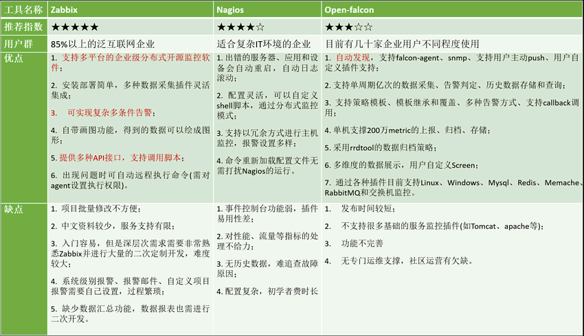

<AutoCatalog />

[参考原文](https://mp.weixin.qq.com/s/N7KEHOJ75reTXh4v-9pAAQ)

运维监控工具千千万，仅开源的解决方案就有流量监控（`MRTG、Cacti、SmokePing、Graphite`等）和性能告警（`Nagios、Zabbix、Zenoss Core、Ganglia、OpenTSDB`等）可供选择。

下面我们将针对目前行业内常用的五种监控工具（`Cacti、Nagios、Zabbix、Grafana、Prometheus、Nightingale、OpenFalcon`）详细介绍各自的特点。

Zabbix、Nagios、Open-Falcon这3大开源运维监控工具的比较:

