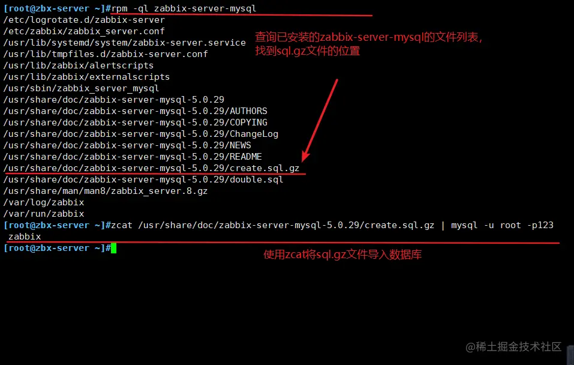
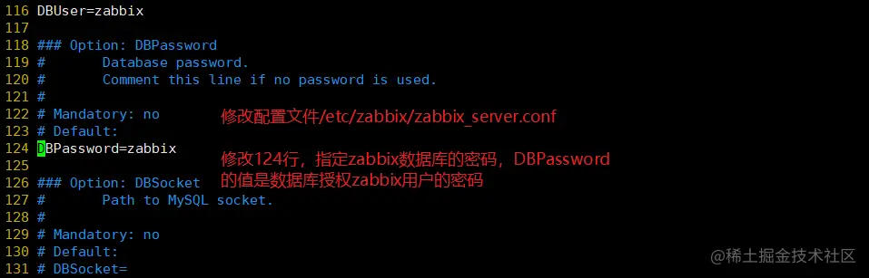
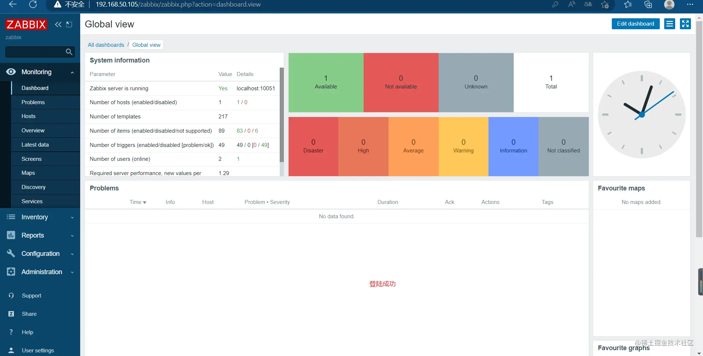
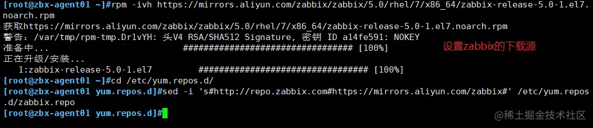
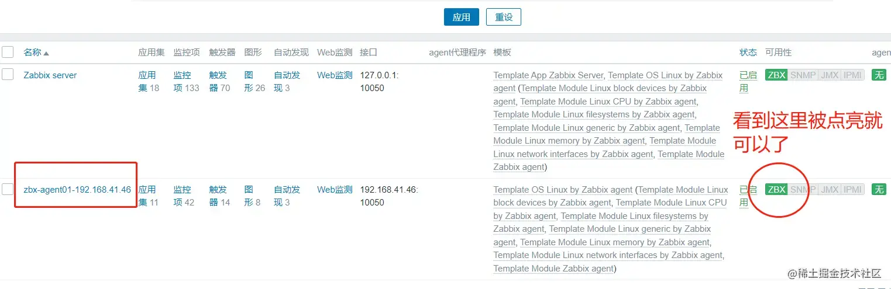

Zabbix概述篇

<!-- more -->

# Zabbix概述篇

## zabbix 是什么？

- zabbix 是一个基于 Web 界面的提供分布式系统监视以及网络监视功能的企业级的开源解决方案。
- zabbix 能监视各种网络参数，保证服务器系统的安全运营；并提供灵活的通知机制以让系统管理员快速定位/解决存在的各种问题。
- zabbix 由 2 部分构成，zabbix server 与可选组件 zabbix agent。通过 C/S 模式采集数据，通过 B/S 模式在 Web 端展示和配置。
- zabbix server 可以通过 SNMP，zabbix agent，ping，端口监视等方法提供对远程服务器/网络状态的监视，数据收集等功能， 它可以运行在 Linux 等平台上。
- zabbix agent 需要安装在被监视的目标服务器上，它主要完成对硬件信息或与操作系统有关的内存，CPU 等信息的收集。

## zabbix 的主要特点

- 安装与配置简单，学习成本低
- 支持多语言（包括中文）
- 免费开源
- 自动发现服务器与网络设备
- 分布式监视以及 WEB 集中管理功能
- 可以无 agent 监视
- 用户安全认证和柔软的授权方式
- 通过 WEB 界面设置或查看监视结果
- email 等通知功能

## zabbix 的主要功能

- CPU 负荷
- 内存使用
- 磁盘使用
- 网络状况
- 端口监视
- 日志监视

## zabbix 监控原理

zabbix agent 安装在被监控的主机上，zabbix agent 负责定期收集客户端本地各项数据，并发送至 zabbix server 端，zabbix server 收到数据后，
将数据存储到数据库中，用户基于 Zabbix WEB 可以看到数据在前端展现图像。当 zabbix 监控某个具体的项目， 该项目会设置一个触发器阈值，当被监控的
指标超过该触发器设定的阈值，会进行一些必要的动作，动作包括：发送信息（邮件、微信、短信）、发送命令（shell 命令、reboot、restart、install 等）。

## zabbix 常见的五个系统

- zabbix 监控部署在系统中，包含常见的五个程序: `zabbix_server`、`zabbix_agent`、`zabbix_proxy`、`zabbix_get`、`zabbix_sender` 等。
- zabbix server：zabbix 服务端守护进程，其中 `zabbix_agent、zabbix_get、zabbix_sender、zabbix_proxy` 的数据最终都提交给 `zabbix server`;
- zabbix agent：客户端守护进程，负责收集客户端数据，例如:收集 CPU 负载、内存、硬盘使用情况等;
- zabbix proxy：zabbix 分布式代理守护进程，通常大于 500 台主机，需要进行分布式监控架构部署;
- zabbix get：zabbix 数据接收工具，单独使用的命令，通常在 server 或者 proxy 端执行获取远程客户端信息的命令;
- zabbix sender：zabbix 数据发送工具，用户发送数据给 server 或 proxy 端，通常用户耗时比较长的检查。

## zabbix 端口号

zabbix 服务端 zabbix_server 默认使用 10051 端口。
客户端 zabbix_agent2 默认使用 10050 端口。

## 安装 zabbix

```shell
zabbix-server  192.168.50.105 zabbix-server-mysql、zabbix-agent
zabbix-agent   192.168.50.110 zabbix-agent2
```

> 部署 zabbix 服务端（端口号 10051）

zabbix-server 内存至少 2G，推荐 4G。

zabbix 服务端同时安装 zabbix-server-mysql 和 zabbix-agent，因为服务端所在主机自己也要被监控。

```sh
关闭防火墙
systemctl disable --now firewalld
setenforce 0
hostnamectl set-hostname zbx-server

#获取 zabbix 的下载源
rpm -ivh https://mirrors.aliyun.com/zabbix/zabbix/5.0/rhel/7/x86_64/zabbix-release-5.0-1.el7.noarch.rpm

#更换 zabbix.repo 为阿里源
cd /etc/yum.repos.d
sed -i 's#http://repo.zabbix.com#https://mirrors.aliyun.com/zabbix#' zabbix.repo

yum clean all && yum makecache

yum install -y zabbix-server-mysql zabbix-agent

#安装SCL(Software Collections)，便于后续安装高版本的 php，默认 yum 安装的 php 版本为 5.4，版本过低，zabbix 5.0 版本对 php 版本最低要 7.2.0 版本。SCL 可以使得在同一台机器上使用多个版本的软件，而又不会影响整个系统的依赖环境。软件包会安装在 /etc/opt/rh 目录下。

yum install -y centos-release-scl

#修改 zabbix-front 前端源，安装 zabbix 前端环境到 scl 环境下
vim zabbix.repo
......
[zabbix-frontend]
......
enabled=1          #开启安装源
......

yum install -y zabbix-web-mysql-scl zabbix-apache-conf-scl

#安装 zabbix 所需的数据库
yum install -y mariadb-server mariadb

systemctl enable --now mariadb

mysql_secure_installation         #初始化数据库，并设置密码，如 abc123

#添加数据库用户，以及 zabbix 所需的数据库信息
mysql -u root -pabc123

CREATE DATABASE zabbix character set utf8 collate utf8_bin;
GRANT all ON zabbix.* TO 'zabbix'@'%' IDENTIFIED BY 'zabbix';
flush privileges;

#导入数据库信息
rpm -ql zabbix-server-mysql   #查询 sql 文件的位置

zcat /usr/share/doc/zabbix-server-mysql-5.0.15/create.sql.gz | mysql -uroot -pabc123 zabbix

#修改 zabbix server 配置文件，修改数据库的密码
vim /etc/zabbix/zabbix_server.conf
......
DBPassword=zabbix     #124行，指定 zabbix 数据库的密码

#修改 zabbix 的 php 配置文件
vim /etc/opt/rh/rh-php72/php-fpm.d/zabbix.conf
......
php_value[date.timezone] = Asia/Shanghai  #24行，取消注释，修改时区

#启动 zabbix 相关服务
systemctl restart zabbix-server zabbix-agent httpd rh-php72-php-fpm
systemctl enable zabbix-server zabbix-agent httpd rh-php72-php-fpm

浏览器访问：http://192.168.50.105/zabbix
点击下一步，设置数据库的密码 zabbix
安装完成后，默认的登录账号和密码为：Admin/zabbix
设置文件界面：点击左边菜单栏的【User settings】，【Language】选择 Chinese(zh_CN)，再点击 Update 更新。

//解决 zabbix-server Web页面中文乱码问题
yum install -y wqy-microhei-fonts

cp -f /usr/share/fonts/wqy-microhei/wqy-microhei.ttc /usr/share/fonts/dejavu/DejaVuSans.ttf
```











> 部署 zabbix 客户端（端口号 10050）

zabbix 5.0 版本采用 golang 语言开发的新版本客户端 agent2 。

zabbix 服务端 zabbix_server 默认使用 10051 端口，客户端 zabbix_agent2 默认使用 10050 端口。

```sh
systemctl disable --now firewalld
setenforce 0
hostnamectl set-hostname zbx-agent01

//服务端和客户端都配置时间同步
yum install -y ntpdate
ntpdate -u ntp.aliyun.com

//客户端配置时区，与服务器保持一致
mv /etc/localtime{,.bak}
ln -s /usr/share/zoneinfo/Asia/Shanghai /etc/localtime

date

//设置 zabbix 的下载源，安装 zabbix-agent2
rpm -ivh https://mirrors.aliyun.com/zabbix/zabbix/5.0/rhel/7/x86_64/zabbix-release-5.0-1.el7.noarch.rpm

cd /etc/yum.repos.d
sed -i 's#http://repo.zabbix.com#https://mirrors.aliyun.com/zabbix#' /etc/yum.repos.d/zabbix.repo

yum install -y zabbix-agent2

//修改 agent2 配置文件
vim /etc/zabbix/zabbix_agent2.conf
......
Server=192.168.50.105
#80行，指定 zabbix 服务端的 IP 地址
ServerActive=192.168.50.105
#120行，指定 zabbix 服务端的 IP 地址
Hostname=zbx-agent01
#131行，指定当前 zabbix 客户端的主机名

//启动 zabbix-agent2
systemctl start zabbix-agent2
systemctl enable zabbix-agent2

netstat -natp | grep zabbix
tcp6       0      0 :::10050                :::*                    LISTEN      43654/zabbix_agent2

//在服务端验证 zabbix-agent2 的连通性
yum install -y zabbix-get    #安装 zabbix 主动获取数据的命令

zabbix_get -s '192.168.50.110' -p 10050 -k 'agent.ping'
1

zabbix_get -s '192.168.50.110' -p 10050 -k 'system.hostname'
zbx-agent01
```








[原作者链接](https://juejin.cn/post/7169047487007686669)（版权归原作者所有，侵删）
