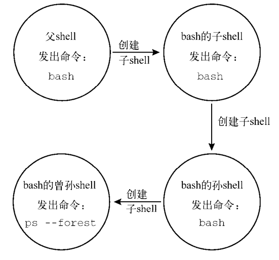

Linux之shell脚本的一些基础知识认识

<!-- more -->

# 基础认识

## 终端仿真器

GNOME Terminal（一般系统默认）  <https://help.gnome.org/users/gnome-terminal/stable>

Konsole Terminal  <http://konsole.kde.org>

Eterm  <http://www.eterm.org>

Final Term  <http://finalterm.org>

Guake  <https://github.com/Guake/guake>

LillyTerm  <http://lilyterm.luna.com.tw/index.html>

LXTerminal  <http://wiki.lxde.org/en/LXTerminal>

mrxvt  <https://code.google.com/p/mrxvt>

ROXTerm  <http://roxterm.sourceforge.net>

Terminator  <https://launchpad.net/terminator>

Terminology  <http://www.enlightenment.org/p.php?p=about/terminology>

UXterm  <http://manpages.ubuntu.com/manpages/gutsy/man1/uxterm.1.html>

Wterm  <http://sourceforge.net/projects/wterm>

xterm  <http://invisible-island.net/xterm>

## shell 类型

```
/bin/bash /bin/sh  /bin/tcsh
/bin/dash /bin/csh
```

## shell 的父子关系-bash

### 1、bash进程

```shell
[root@admin ~]# ps -f
UID         PID   PPID  C STIME TTY          TIME CMD
root       1490   1479  0 10:06 pts/0    00:00:00 -bash
root      12459   1490  0 10:33 pts/0    00:00:00 ps -f
[root@admin ~]#
[root@admin ~]# bash
[root@admin ~]#
[root@admin ~]# ps -f
UID         PID   PPID  C STIME TTY          TIME CMD
root       1490   1479  0 10:06 pts/0    00:00:00 -bash
root      12590   1490  0 10:33 pts/0    00:00:00 bash
root      12661  12590  0 10:33 pts/0    00:00:00 ps -f
```

输入命令 bash 之后，一个子shell就出现了。第二个 ps -f 是在子shell中执行的。可以从显示结果中看到有两个bash shell程序在运行。第一个bash shell程序，也就是父shell进程，其原始进程ID是 *1490* 。第二个bash shell程序，即子shell进程，其PID是 *12590*。注意，子shell的父进程ID（`PPID`）是 *1490* ，指明了这个父shell进程就是该子shell的父进程


在生成子shell进程时，只有部分父进程的环境被复制到子shell环境中。这会对包括变量在内的一些东西造成影响。

```shell
[root@admin ~]# ps -f
UID         PID   PPID  C STIME TTY          TIME CMD
root       1490   1479  0 10:06 pts/0    00:00:00 -bash
root      12590   1490  0 10:33 pts/0    00:00:00 bash
root      14253  12590  0 10:37 pts/0    00:00:00 ps -f
[root@admin ~]#
[root@admin ~]# bash
[root@admin ~]# bash
[root@admin ~]# bash
[root@admin ~]# ps -f
UID         PID   PPID  C STIME TTY          TIME CMD
root       1490   1479  0 10:06 pts/0    00:00:00 -bash
root      12590   1490  0 10:33 pts/0    00:00:00 bash
root      18624  12590  0 10:48 pts/0    00:00:00 bash
root      18655  18624  0 10:48 pts/0    00:00:00 bash
root      18679  18655  0 10:48 pts/0    00:00:00 bash
root      19698  18679  0 10:50 pts/0    00:00:00 ps -f
[root@admin ~]# ps --forest
   PID TTY          TIME CMD
  1490 pts/0    00:00:00 bash
 12590 pts/0    00:00:00  \_ bash
 18624 pts/0    00:00:00      \_ bash
 18655 pts/0    00:00:00          \_ bash
 18679 pts/0    00:00:00              \_ bash
 18730 pts/0    00:00:00                  \_ ps
```

 bash 命令被输入了三次。这实际上创建了三个子shell。 `ps -forest` 命令展示了这些子shell间的嵌套结构。



**参数**


### 退出子进程

exit

```shell
[root@admin ~]# ps -f
UID         PID   PPID  C STIME TTY          TIME CMD
root       1490   1479  0 10:06 pts/0    00:00:00 -bash
root      12590   1490  0 10:33 pts/0    00:00:00 bash
root      18624  12590  0 10:48 pts/0    00:00:00 bash
root      18655  18624  0 10:48 pts/0    00:00:00 bash
root      18679  18655  0 10:48 pts/0    00:00:00 bash
root      21975  18679  0 10:56 pts/0    00:00:00 ps -f
[root@admin ~]# exit
exit
[root@admin ~]# exit
exit
[root@admin ~]# ps -f
UID         PID   PPID  C STIME TTY          TIME CMD
root       1490   1479  0 10:06 pts/0    00:00:00 -bash
root      12590   1490  0 10:33 pts/0    00:00:00 bash
root      18624  12590  0 10:48 pts/0    00:00:00 bash
root      22071  18624  0 10:56 pts/0    00:00:00 ps -f
```

### 2、进程列表

```shell
[root@admin ~]# pwd ; ls ; cd /etc ; pwd ; cd ; pwd ; ls
/root
anaconda-ks.cfg  df.sh  first.sh
/etc
/root
anaconda-ks.cfg  df.sh  first.sh
[root@admin ~]#
[root@admin ~]# (pwd ; ls ; cd /etc ; pwd ; cd ; pwd ; ls)
/root
anaconda-ks.cfg  df.sh  first.sh
/etc
/root
anaconda-ks.cfg  df.sh  first.sh
```

在上面的第一个例子中，所有的命令依次执行，不存在任何问题。不过这并不是进程列表。

命令列表要想成为进程列表，这些命令必须包含在括号里。括号的加入使命令列表变成了进程列表，生成了一个子shell来执行对应的命令。

要想知道是否生成了子shell，得借助一个使用了环境变量的命令。这个命令就是 echo $BASH_SUBSHELL；**如果该命令返回 0 ，就表明没有子shell。如果返回 1 或者其他更大的数字，就表明存在子shell**。如下：

```shell
[root@admin ~]# pwd ; ls ; cd /etc ; pwd ; cd ; pwd ; ls ; echo $BASH_SUBSHELL
/root
anaconda-ks.cfg  df.sh  first.sh
/etc
/root
anaconda-ks.cfg  df.sh  first.sh
0
[root@admin ~]# (pwd ; ls ; cd /etc ; pwd ; cd ; pwd ; ls ; echo $BASH_SUBSHELL)
/root
anaconda-ks.cfg  df.sh  first.sh
/etc
/root
anaconda-ks.cfg  df.sh  first.sh
1
```

你甚至可以在命令列表中嵌套括号来创建子shell的子shell。

```shell
[root@admin ~]# (pwd ; ls ; cd /etc ; pwd ; cd ; pwd ; ls ; (echo $BASH_SUBSHELL))
/root
anaconda-ks.cfg  df.sh  first.sh
/etc
/root
anaconda-ks.cfg  df.sh  first.sh
2
[root@admin ~]# (pwd ; ls ; cd /etc ; pwd ; cd ; pwd ; ls ; (echo $BASH_SUBSHELL))
/root
anaconda-ks.cfg  df.sh  first.sh
/etc
/root
anaconda-ks.cfg  df.sh  first.sh
2
```

### 3、后台模式

`sleep` 命令会在后台（ `&` ）睡眠30秒。当它被置入后台。

使用 `jobs` 命令来显示后台作业信息。 jobs 命令可以显示出当前运行在后台模式中的所有用户的进程（作业）。使用`-l` 来显示进程的 PID。

```shell
[root@admin ~]#  sleep 30&
[1] 35051
[root@admin ~]# ps -f
UID         PID   PPID  C STIME TTY          TIME CMD
root       1490   1479  0 10:06 pts/0    00:00:00 -bash
root      12590   1490  0 10:33 pts/0    00:00:00 bash
root      18624  12590  0 10:48 pts/0    00:00:00 bash
root      35051  18624  0 11:28 pts/0    00:00:00 sleep 30
root      35093  18624  0 11:28 pts/0    00:00:00 ps -f
[root@admin ~]# jobs
[1]+  运行中               sleep 30 &
[root@admin ~]# jobs -l
[1]+ 35051 运行中               sleep 30 &
[root@admin ~]# jobs -l
[1]+ 35051 完成                  sleep 30
```

> 需要提醒的是：后台作业的结束状态可未必会一直等待到合适的时候才现身。当作业结束状态突然出现在屏幕上的时候，你可别吃惊啊。

### 4、将进程列表置入后台

```shell
[root@admin ~]# (sleep 2 ; echo $BASH_SUBSHELL ; sleep 2)
1
[root@admin ~]# (sleep 2 ; echo $BASH_SUBSHELL ; sleep 2)&
[1] 39128
[root@admin ~]# 1  <=== 按回车

[1]+  完成                  ( sleep 2; echo $BASH_SUBSHELL; sleep 2 )
```

把进程列表置入后台会产生一个作业号和进程ID，然后返回到提示符。不过奇怪的是表明单一级子shell的数字 1 显示在了提示符的旁边！不要不知所措，只需要按一下回车键，就会得到另一个提示符。

在CLI中运用子shell的创造性方法之一就是将进程列表置入后台模式。你既可以在子shell中进行繁重的处理工作，同时也不会让子shell的I/O受制于终端。

当然了， sleep 和 echo 命令的进程列表只是作为一个示例而已。

```shell
[root@admin ~]# (tar -cf user1.tar /home/user1 ; tar -cf df.log.tar /home/df.log)&
[3] 2423
[root@admin ~]# ls
anaconda-ks.cfg  df.log.tar user1.tar
```

### 5、协程 coproc

协程可以同时做两件事。它在后台生成一个子shell，并在这个子shell中执行命令。

除了会创建子shell之外，**协程基本上就是将命令置入后台模式**。当输入 coproc 命令及其参数之后，你会发现启用了一个后台作业。屏幕上会显示出后台作业号（ 1 ）以及进程ID（ 43011）

```shell
[root@admin home]# coproc sleep 10
[1] 43011
[root@admin home]# jobs
[1]+  运行中               coproc COPROC sleep 10 &
```

使用命令的扩展语法自己设置这个名字。

---

**说明：** 协程能够让你尽情发挥想象力，发送或接收来自子shell中进程的信息。只有在拥有多个协程的时候才需要对协程进行命名，因为你得和它们进行通信。否则的话，让 coproc 命令将其设置成默认的名字 COPROC 就行了。

---

```shell
[root@admin home]# coproc My_Job { sleep 10; }
bash: 警告:execute_coproc: coproc [43011:COPROC] still exists
[2] 43087
[1]   完成                  coproc COPROC sleep 10
[root@admin home]# jobs
[2]+  完成                  coproc My_Job { sleep 10; }
```

将协程与进程列表结合起来产生嵌套的子shell。只需要输入进程列表，然后把命令 coproc 放在前面就行了。

```shell
[root@admin home]# coproc ( sleep 10; sleep 2 )
[1] 43423
[root@admin home]# jobs
[1]+  运行中               coproc COPROC ( sleep 10; sleep 2 ) &
[root@admin home]# ps --forest
   PID TTY          TIME CMD
  1490 pts/0    00:00:00 bash
 12590 pts/0    00:00:00  \_ bash
 18624 pts/0    00:00:00      \_ bash
 43423 pts/0    00:00:00          \_ bash
 43424 pts/0    00:00:00          |   \_ sleep
 43479 pts/0    00:00:00          \_ ps
```

**记住**：生成子shell的成本不低，而且速度还慢。创建嵌套子shell更是火上浇油！
在命令行中使用子shell能够获得灵活性和便利。要想获得这些优势，重要的是理解子shell的行为方式。对于命令也是如此。

## 理解 shell 的内建命令

内建命令和非内建命令的操作方式大不相同。

### 1、外部命令

外部命令，有时候也被称为文件系统命令，是存在于bash shell之外的程序。它们并不是shell程序的一部分。外部命令程序通常位于`/bin`、`/usr/bin`、`/sbin`或`/usr/sbin`中。

ps 就是一个外部命令。你可以使用 which 和 type 命令找到它:

```shell
[root@admin ~]# which ps
/usr/bin/ps
[root@admin ~]# type -a ps
ps 是 /usr/bin/ps
[root@admin ~]# ls -l /usr/bin/ps
-rwxr-xr-x. 1 root root 100112 10月  1 2020 /usr/bin/ps
```

当外部命令执行时，会创建出一个子进程。这种操作被称为衍生（forking）。外部命令 ps 很方便显示出它的父进程以及自己所对应的衍生子进程。

作为外部命令， ps 命令执行时会创建出一个子进程。


```shell
[root@admin ~]# ps -f
UID         PID   PPID  C STIME TTY          TIME CMD
root       1490   1479  0 10:06 pts/0    00:00:00 -bash
root      49716   1490  0 12:04 pts/0    00:00:00 ps -f
[root@admin ~]# ps -f
UID         PID   PPID  C STIME TTY          TIME CMD
root       1490   1479  0 10:06 pts/0    00:00:00 -bash
root      49723   1490  0 12:04 pts/0    00:00:00 ps -f
[root@admin ~]# ps -f
UID         PID   PPID  C STIME TTY          TIME CMD
root       1490   1479  0 10:06 pts/0    00:00:00 -bash
root      49731   1490  0 12:04 pts/0    00:00:00 ps -f
```

当进程必须执行衍生操作时，它需要花费时间和精力来设置新子进程的环境。所以说，外部命令多少还是有代价的。

---

**说明** 就算衍生出子进程或是创建了子shell，你仍然可以通过发送信号与其沟通，这一点无论是在命令行还是在脚本编写中都是极其有用的。发送信号（signaling）使得进程间可以通过信号进行通信。

---

### 2、内部命令

内建命令不需要使用子进程来执行。它们已经和shell编译成了一体，作为shell工具的组成部分存在。不需要借助外部程序文件来运行

```shell
[root@admin ~]# type cd
cd 是 shell 内嵌
[root@admin ~]# type exit
exit 是 shell 内嵌
[root@admin ~]# type -a echo
echo 是 shell 内嵌
echo 是 /usr/bin/echo
[root@admin ~]#
[root@admin ~]# type -a pwd
pwd 是 shell 内嵌
pwd 是 /usr/bin/pwd
```

既不需要通过衍生出子进程来执行，也不需要打开程序文件，内建命令的**执行速度要更快，效率也更高**。

## linux 环境变量

### 1、全局环境变量

要查看全局变量，可以使用 env 或 printenv 命令：

```shell
[root@admin ~]# printenv
XDG_SESSION_ID=1
HOSTNAME=admin
TERM=xterm
SHELL=/bin/bash
HISTSIZE=1000
SSH_CLIENT=192.168.0.5 9649 22
SSH_TTY=/dev/pts/0

[root@admin ~]# env
XDG_SESSION_ID=1
HOSTNAME=admin
TERM=xterm
SHELL=/bin/bash
HISTSIZE=1000
SSH_CLIENT=192.168.0.5 9649 22
SSH_TTY=/dev/pts/0
USER=root

```

要显示个别环境变量的值，可以使用 printenv 命令，但是不要用 env 命令

```shell
[root@admin ~]# printenv HOME
/root
[root@admin ~]# env HOME
env: HOME: 没有那个文件或目录
[root@admin ~]# echo $HOME
/root
[root@admin ~]# ls $HOME
anaconda-ks.cfg  df.log.tar  df.sh  first.sh  user1.tar
```

### 2、局部环境变量

局部环境变量只能在定义它们的进程中可见。

查看局部环境变量的列表有点复杂。遗憾的是，在Linux系统并没有一个只显示局部环境变量的命令。 set 命令会显示为某个特定进程设置的所有环境变量，包括局部变量、全局变量以及用户定义变量。

```shell
[root@admin ~]# set
BASH=/bin/bash
[...]
BASH_VERSINFO=([0]="4" [1]="2" [2]="46" [3]="2" [4]="release" [5]="x86_64-redhat-linux-gnu")
BASH_VERSION='4.2.46(2)-release'
[...]
HISTFILE=/root/.bash_history
HOME=/root
HOSTNAME=admin
```

---

**说明** 命令 `env` 、 `printenv` 和 `set` 之间的差异很细微。 **set** 命令会显示出全局变量、局部变量以及用户定义变量。它还会按照字母顺序对结果进行排序。 **env** 和 **printenv** 命令同 set 命令的区别在于前两个命令不会对变量排序，也不会输出局部变量和用户定义变量。在这种情况下， env 和 printenv 的输出是重复的。不过 env 命令有一个 printenv 没有的功能，这使得它要更有用一些。

---

### 3、设置用户定义变量

可以通过等号给环境变量赋值，值可以是数值或字符串。

```shell
[root@admin ~]# echo $my_variable

[root@admin ~]# my_variable=Hello
[root@admin ~]# echo $my_variable
Hello
```

非常简单！现在每次引用 my_variable  环境变量的值，只要通过 \$my_variable 引用即可。
如果要给变量赋一个含有空格的字符串值，必须用单引号来界定字符串的首和尾。

```shell
[root@admin ~]# my_variable=Hello World
-bash: World: 未找到命令
[root@admin ~]# my_variable="Hello World"
[root@admin ~]# echo $my_variable
Hello World
```

没有单引号的话，bash shell会以为下一个词是另一个要执行的命令。注意，你定义的局部环境变量用的是小写字母，而到目前为止你所看到的系统环境变量都是大写字母。

---

**注意：** 所有的环境变量名均使用大写字母，这是bash shell的标准惯例。如果是你自己创建的局部变量或是shell脚本，请使用小写字母。变量名区分大小写。在涉及用户定义的局部变量时坚持使用小写字母，这能够避免重新定义系统环境变量可能带来的灾难。

---

设置了局部环境变量后，就能在shell进程的任何地方使用它了。但是，如果生成了另外一个shell，它在子shell中就不可用。

```shell
[root@admin ~]# bash
[root@admin ~]# echo $my_variable

[root@admin ~]# exit
exit
[root@admin ~]# echo $my_variable
Hello World
```

类似地，如果你在子进程中设置了一个局部变量，那么一旦你退出了子进程，那个局部环境变量就不可用。

````shell
[root@admin ~]# bash
[root@admin ~]# my_0="1112323"
[root@admin ~]# echo $my_0
1112323
[root@admin ~]# exit
exit
[root@admin ~]# echo $my_0
````

### 4、设置全局环境变量 export

创建全局环境变量的方法是先创建一个局部环境变量，然后再把它导出到全局环境中（`export`）。

```shell
[root@admin ~]# vmy_variable="I am Global now"
[root@admin ~]# export vmy_variable
[root@admin ~]# echo $vmy_variable
I am Global now
[root@admin ~]# bash
[root@admin ~]# echo $vmy_variable
I am Global now
[root@admin ~]# exit
exit
[root@admin ~]# echo $vmy_variable
I am Global now
```

在定义并导出局部环境变量 my_variable 后， bash 命令启动了一个子shell。在这个子shell中能够正确的显示出变量 my_variable 的值。该变量能够保留住它的值是因为 export 命令使其变成了全局环境变量。

修改子shell中全局环境变量并不会影响到父shell中该变量的值。这种改变只是在子进程中有效，并不会被反映到父shell中。

```shell
[root@admin ~]# bash
[root@admin ~]# vmy_variable="I am Global now 66666"
[root@admin ~]# echo $vmy_variable
I am Global now 66666
[root@admin ~]# exit
exit
[root@admin ~]# echo $vmy_variable
I am Global now
```

### 5、删除环境变量 unset

```shell
[root@admin ~]# echo $vmy_variable
I am Global now
[root@admin ~]# echo $my_variable

[root@admin ~]# unset my_variable
[root@admin ~]# echo $my_variable

```

如果你是在子进程中删除了一个全局环境变量，这只对子进程有效。该全局环境变量在父进程中依然可用。

```shell
[root@admin ~]# bash
[root@admin ~]# echo $vmy_variable
I am Global now
[root@admin ~]# unset my_variable
[root@admin ~]# echo $my_variable

[root@admin ~]# exit
exit
[root@admin ~]# echo $vmy_variable
I am Global now
```

---

**窍门**   如果要用到变量，使用 \$ ；如果要操作变量，不使用 \$ 。这条规则的一
个例外就是使用 printenv 显示某个变量的值。

---

### 6、默认的 shell 环境变量

默认情况下，bash shell会用一些特定的环境变量来定义系统环境。这些变量在你的Linux系统上都已经设置好了，只管放心使用。bash shell源自当初的Unix Bourne shell，因此也保留了Unix Bourne shell里定义的那些环境变量。

```tex
$变量     描述
CDPATH  冒号分隔的目录列表，作为 cd 命令的搜索路径
HOME  当前用户的主目录
IFS   shell用来将文本字符串分割成字段的一系列字符
MAIL  当前用户收件箱的文件名（bash shell会检查这个文件，看看有没有新邮件）
MAILPATH 冒号分隔的当前用户收件箱的文件名列表（bash shell会检查列表中的每个文件，看看有没有新邮件）
OPTARG  getopts 命令处理的最后一个选项参数值
OPTIND  getopts 命令处理的最后一个选项参数的索引号
PATH  shell查找命令的目录列表，由冒号分隔
PS1   shell命令行界面的主提示符
PS2   shell命令行界面的次提示
```

除了默认的Bourne的环境变量，bash shell还提供一些自有的变量

```tex
$变量     描述
BASH   当前shell实例的全路径名
BASH_ALIASES 含有当前已设置别名的关联数组
BASH_ARGC  含有传入子函数或shell脚本的参数总数的数组变量
BASH_ARCV  含有传入子函数或shell脚本的参数的数组变量
BASH_CMDS  关联数组，包含shell执行过的命令的所在位置
BASH_COMMAND shell正在执行的命令或马上就执行的命令
BASH_ENV  设置了的话，每个bash脚本会在运行前先尝试运行该变量定义的启动文件
BASH_EXECUTION_STRING 使用 bash -c 选项传递过来的命令
BASH_LINENO  含有当前执行的shell函数的源代码行号的数组变量
BASH_REMATCH 只读数组，在使用正则表达式的比较运算符=~进行肯定匹配（positive match）时，包含了匹配到的模式和子模式
BASH_SOURCE  含有当前正在执行的shell函数所在源文件名的数组变量
BASH_SUBSHELL 当前子shell环境的嵌套级别（初始值是0）
BASH_VERSINFO 含有当前运行的bash shell的主版本号和次版本号的数组变量
BASH_VERSION 当前运行的bash shell的版本号
BASH_XTRACEFD 若设置成了有效的文件描述符（ 0 、 1 、 2 ），则 'set -x' 调试选项生成的跟踪输出可被重定向。通常用来将跟踪输出到一个文件中
BASHOPTS  当前启用的bash shell选项的列表
BASHPID   当前bash进程的PID
COLUMNS   当前bash shell实例所用终端的宽度
COMP_CWORD  COMP_WORDS 变量的索引值，后者含有当前光标的位置
COMP_LINE  当前命令行
COMP_POINT  当前光标位置相对于当前命令起始的索引
COMP_KEY  用来调用shell函数补全功能的最后一个键
COMP_TYPE  一个整数值，表示所尝试的补全类型，用以完成shell函数补全
COMP_WORDBREAKS  Readline库中用于单词补全的词分隔字符
COMP_WORDS  含有当前命令行所有单词的数组变量
COMPREPLY  含有由shell函数生成的可能填充代码的数组变量
COPROC   占用未命名的协进程的I/O文件描述符的数组变量
DIRSTACK  含有目录栈当前内容的数组变量
EMACS   设置为 't' 时，表明emacs shell缓冲区正在工作，而行编辑功能被禁止
ENV    如果设置了该环境变量，在bash shell脚本运行之前会先执行已定义的启动文件（仅用于当bash shell以POSIX模式被调用时）
EUID   当前用户的有效用户ID（数字形式）
FCEDIT   供 fc 命令使用的默认编辑器
FIGNORE   在进行文件名补全时可以忽略后缀名列表，由冒号分隔
FUNCNAME  当前执行的shell函数的名称
FUNCNEST  当设置成非零值时，表示所允许的最大函数嵌套级数（一旦超出，当前命令即被终止）
GLOBIGNORE  冒号分隔的模式列表，定义了在进行文件名扩展时可以忽略的一组文件名
GROUPS   含有当前用户属组列表的数组变量
histchars  控制历史记录扩展，最多可有3个字符
HISTCMD   当前命令在历史记录中的编号
HISTCONTROL  控制哪些命令留在历史记录列表中
HISTFILE  保存shell历史记录列表的文件名（默认是.bash_history）
HISTFILESIZE 最多在历史文件中存多少行
HISTTIMEFORMAT 如果设置了且非空，就用作格式化字符串，以显示bash历史中每条命令的时间戳
HISTIGNORE  由冒号分隔的模式列表，用来决定历史文件中哪些命令会被忽略
HISTSIZE  最多在历史文件中存多少条命令
HOSTFILE  shell在补全主机名时读取的文件名称
HOSTNAME  当前主机的名称
HOSTTYPE  当前运行bash shell的机器
IGNOREEOF  shell在退出前必须收到连续的 EOF 字符的数量（如果这个值不存在，默认是 1 ）
INPUTRC   Readline初始化文件名（默认是.inputrc）
LANG   shell的语言环境类别
LC_ALL   定义了一个语言环境类别，能够覆盖 LANG 变量
LC_COLLATE  设置对字符串排序时用的排序规则
LC_CTYPE  决定如何解释出现在文件名扩展和模式匹配中的字符
LC_MESSAGES  在解释前面带有 \$ 的双引号字符串时，该环境变量决定了所采用的语言环境设置
LC_NUMERIC  决定着格式化数字时采用的语言环境设置
LINENO   当前执行的脚本的行号
LINES   定义了终端上可见的行数
MACHTYPE  用“CPU  公司  系统”（CPU-company-system）格式定义的系统类型
MAPFILE   一个数组变量，当 mapfile 命令未指定数组变量作为参数时，它存储了 mapfile 所读入的文本
MAILCHECK  shell查看新邮件的频率（以秒为单位，默认值是 60 ）
OLDPWD   shell之前的工作目录
OPTERR   设置为1时，bash shell会显示 getopts 命令产生的错误
OSTYPE   定义了shell所在的操作系统
PIPESTATUS  含有前台进程的退出状态列表的数组变量
POSIXLY_CORRECT  设置了的话，bash会以POSIX模式启动
PPID   bash shell父进程的PID
PROMPT_COMMAND  设置了的话，在命令行主提示符显示之前会执行这条命令
PROMPT_DIRTRIM  用来定义当启用了 \w 或 \W 提示符字符串转义时显示的尾部目录名的数量。被删除的目录名会用一组英文句点替换
PS3    select 命令的提示符
PS4    如果使用了bash的 -x 选项，在命令行之前显示的提示信息
PWD    当前工作目录
RANDOM   返回一个0～32767的随机数（对其的赋值可作为随机数生成器的种子）
READLINE_LINE  当使用 bind –x 命令时，存储Readline缓冲区的内容
READLINE_POINT  当使用 bind –x 命令时，表示Readline缓冲区内容插入点的当前位置
REPLY   read命令的默认变量
SECONDS   自从shell启动到现在的秒数（对其赋值将会重置计数器）
SHELL   bash shell的全路径名
SHELLOPTS  已启用bash shell选项列表，列表项之间以冒号分隔
SHLVL   shell的层级；每次启动一个新bash shell，该值增加1
TIMEFORMAT  指定了shell的时间显示格式
TMOUT   select 和 read 命令在没输入的情况下等待多久（以秒为单位）。默认值为0，表示无限长
TMPDIR   目录名，保存bash shell创建的临时文件
UID    当前用户的真实用户ID（数字形式）
```

### 7、设置 PATH 环境变量

```shell
[root@admin ~]# echo $PATH
/usr/local/sbin:/usr/local/bin:/usr/sbin:/usr/bin:/root/bin
[root@admin ~]# PATH=$PATH:/home/user1
[root@admin ~]# echo $PATH
/usr/local/sbin:/usr/local/bin:/usr/sbin:/usr/bin:/root/bin:/home/user1
```

---

**窍门** 如果希望子shell也能找到你的程序的位置，一定要记得把修改后的 PATH 环境变量导出。

---

### 8、定位系统环境变量

**登录 shell**

当你登录Linux系统时，bash shell会作为登录shell启动。登录shell会从5个不同的启动文件里
读取命令：

- /etc/profile
- $HOME/.bash_profile
- $HOME/.bashrc
- $HOME/.bash_login
- $HOME/.profile

etc/profile文件是系统上默认的bash shell的主启动文件。系统上的每个用户登录时都会执行
这个启动文件。

HOME：提供一个用户专属的启动文件来定义该用户所用到的环境变量。

shell会按照按照下列顺序，运行第一个被找到的文件，余下的则被忽略：

```
$HOME/.bash_profile
$HOME/.bash_login
$HOME/.profile
```

注意，这个列表中并没有$HOME/.bashrc文件。这是因为该文件通常通过其他文件运行的。

### 9、交互式 shell 进程

如果bash是作为交互式shell启动的，它就不会访问/etc/profile文件，只会检查用户HOME目录中的.bashrc文件

```
[root@admin ~]# cat .bashrc
# .bashrc

# User specific aliases and functions

alias rm='rm -i'
alias cp='cp -i'
alias mv='mv -i'

# Source global definitions
if [ -f /etc/bashrc ]; then
        . /etc/bashrc
f
```

### 10、非交互式shell

最后一种shell是非交互式shell。系统执行shell脚本时用的就是这种shell。不同的地方在于它没有命令行提示符。但是当你在系统上运行脚本时，也许希望能够运行一些特定启动的命令。

---

窍门 脚本能以不同的方式执行。只有其中的某一些方式能够启动子shell

---

为了处理这种情况，bash shell提供了 BASH_ENV 环境变量。当shell启动一个非交互式shell进程时，它会检查这个环境变量来查看要执行的启动文件。如果有指定的文件，shell会执行该文件里的命令，这通常包括shell脚本变量设置。

在CentOS Linux发行版中，这个环境变量在默认情况下并未设置。如果变量未设置， printenv 命令只会返回CLI提示符：

```shell
printenv BASH_ENV
```

在Ubuntu发行版中，变量 BASH_ENV 也没有被设置。记住，如果变量未设置， echo 命令会显示一个空行，然后返回CLI提示符：

```shell
echo $BASH_ENV
```

那如果 BASH_ENV 变量没有设置，shell脚本到哪里去获得它们的环境变量呢？别忘了有些shell脚本是通过启动一个子shell来执行的（参见第5章）。子shell可以继承父shell导出过的变量。

举例来说，如果父shell是登录shell，在/etc/profile、/etc/profile.d/ * .sh和$HOME/.bashrc文件中设置并导出了变量，用于执行脚本的子shell就能够继承这些变量。

要记住，由父shell设置但并未导出的变量都是局部变量。子shell无法继承局部变量。

对于那些不启动子shell的脚本，变量已经存在于当前shell中了。所以就算没有设置 BASH_ENV ，也可以使用当前shell的局部变量和全局变量

### 11、环境变量持久化

对全局环境变量来说（Linux系统中所有用户都需要使用的变量），可能更倾向于将新的或修改过的变量设置放在`/etc/profile`文件中，但这可不是什么好主意。如果你升级了所用的发行版，这个文件也会跟着更新，那你所有定制过的变量设置可就都没有了。

最好是在/etc/profile.d目录中创建一个以.sh结尾的文件。把所有新的或修改过的全局环境变量设置放在这个文件中。

在大多数发行版中，存储个人用户永久性bash shell变量的地方是 HOME/.bashrc文件。这一点适用于所有类型的shell进程。但如果设置了 BASH_ENV 变量，那么记住，除非它指向的是 HOME/.bashrc，否则你应该将非交互式shell的用户变量放在别的地方。

### 12、数组变量

要给某个环境变量设置多个值，可以把值放在括号里，值与值之间用空格分隔。

```shell
[root@admin ~]# mytest=(one two three four five)
[root@admin ~]# echo $mytestecho $mytest
one
[root@admin ~]# echo $mytest
one
[root@admin ~]# echo ${mytest[2]}
three
[root@admin ~]# echo ${mytest[*]}
one two three four five
[root@admin ~]# mytest[2]=seven
[root@admin ~]# echo ${mytest[*]}
one two seven four five
[root@admin ~]# unset mytest[2]
[root@admin ~]# echo ${mytest[*]}
one two four five
[root@admin ~]# echo ${mytest[2]}

[root@admin ~]# echo ${mytest[3]}
four
```

## 用户及组权限

### /etc/passwd

```shell
[root@admin ~]# cat /etc/passwd
root:x:0:0:root:/root:/bin/bash
bin:x:1:1:bin:/bin:/sbin/nologin
[....]
nginx:x:385:385:Nginx web server:/var/lib/nginx:/sbin/nologin
mysql:x:27:27:MySQL Server:/var/lib/mysql:/bin/false
user1:x:1001:1001::/home/user1:/bin/bash
```

- 登录用户名
- 用户密
- 用户账户的UID（数字形式）
- 用户账户的组ID（GID）（数字形式）
- 用户账户的文本描述（称为备注字段）
- 用户HOME目录的位置
- 用户的默认shell

### /etc/shadow

```shell
[root@admin ~]# cat /etc/shadow
root:$6$IuU9ujIkCecQ7kzi$TCClr5k7U9Zj8yJBxmqg0jpJOGTuJX0bci2YWVl70pRBrGWVSgZ529BI8BFZvhWgJCd0GbPSk4BtgFS6WL0jq.::0:99999:7:::
bin:*:18353:0:99999:7:::
daemon:*:18353:0:99999:7:::
...
```

- 与/etc/passwd文件中的登录名字段对应的登录名
- 加密后的密码
- 自上次修改密码后过去的天数密码（自1970年1月1日开始计算）
- 多少天后才能更改密码
- 多少天后必须更改密码
- 密码过期前提前多少天提醒用户更改密码
- 密码过期后多少天禁用用户账户
- 用户账户被禁用的日期（用自1970年1月1日到当天的天数表示）
- 预留字段给将来使用

### /etc/group

```shell
[root@admin ~]# cat /etc/group
root:x:0:
bin:x:1:
daemon:x:2:
sys:x:3:
[...]
nginx:x:385:
docker:x:384:
mysql:x:27:
user1:x:1001:
```

- 组名
- 组密码
- GID
- 属于该组的用户列表

**千万不能通过直接修改/etc/group文件来添加用户到一个组，要用 usermod 命令**

需要参考基础知识：

- [参考：用户及权限管理](/linux/basis/basis.html#用户及权限管理)
- [参考：目录文件管理](/linux/basis/basis.html#目录文件管理)
- [参考：磁盘管理](/linux/basis/basis.html#磁盘管理)
- 等等
