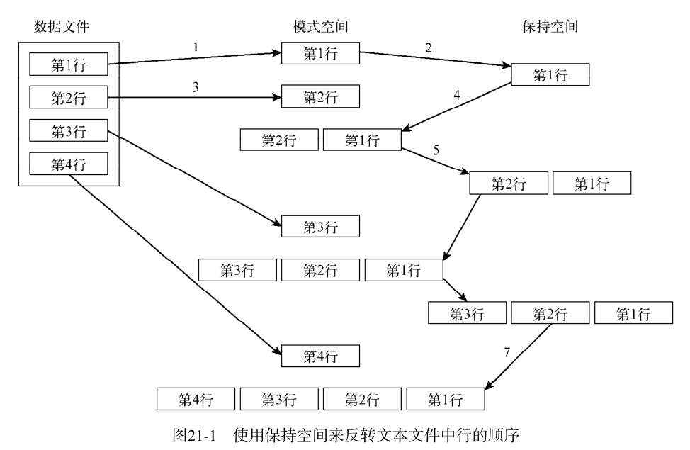

shell脚本高级实战案例篇之Sed

<!-- more -->

# Shell脚本编程-高级篇之sed


## sed

### 基础

sed编辑器被称作流编辑器（stream editor），和普通的交互式文本编辑器恰好相反。在交互式文本编辑器中（比如vim），你可以用键盘命令来交互式地插入、删除或替换数据中的文本。

sed编辑器会执行下列操作:

- (1) 一次从输入中读取一行数据。
- (2) 根据所提供的编辑器命令匹配数据。
- (3) 按照命令修改流中的数据。
- (4) 将新的数据输出到 STDOUT 。

语法格式：

> sed options script file

```
选 项    描 述
-e script  在处理输入时，将 script 中指定的命令添加到已有的命令中
-f file  在处理输入时，将 file 中指定的命令添加到已有的命令中
-n  不产生命令输出，使用 print 命令来完成输出
```

```shell
[root@admin shell]# echo "This is a test" | sed 's/test/big test/'
This is big test
[root@admin shell]#  cat data1.txt
The quick brown fox jumps over the lazy dog.
The quick brown fox jumps over the lazy dog.
The quick brown fox jumps over the lazy dog.
The quick brown fox jumps over the lazy dog.
[root@admin shell]# sed 's/dog/cat/' data1.txt
The quick brown fox jumps over the lazy cat.
The quick brown fox jumps over the lazy cat.
The quick brown fox jumps over the lazy cat.
The quick brown fox jumps over the lazy cat.

[root@admin shell]# sed -e 's/brown/green/; s/dog/cat/' data1.txt
The quick green fox jumps over the lazy cat.
The quick green fox jumps over the lazy cat.
The quick green fox jumps over the lazy cat.
The quick green fox jumps over the lazy cat.

```

从文件中读取 sed 编辑器命令

```shell
[root@admin shell]# cat script1.sed
s/brown/green/
s/fox/elephant/
s/dog/cat/
[root@admin shell]# sed -f script1.sed data1.txt
The quick green elephant jumps over the lazy cat.
The quick green elephant jumps over the lazy cat.
The quick green elephant jumps over the lazy cat.
The quick green elephant jumps over the lazy cat.

```

#### 替换标记

```shell
[root@admin shell]# cat data4.txt
This is a test of the test script.
This is the second test of the test script.
[root@admin shell]# sed 's/test/trial/' data4.txt
This is a trial of the test script.
This is the second trial of the test script.
```

默认情况下它只替换每行中出现的第一处；替换标记 `flags` 会在替换命令字符串之后设置。

> s/pattern/replacement/flags

有4种可用的替换标记：

- 数字，表明新文本将替换第几处模式匹配的地方；
- g ，表明新文本将会替换所有匹配的文本；
- p ，表明原先行的内容要打印出来；打印与替换命令中指定的模式匹配的行。这通常会和 sed 的 `-n` 选项一起使用；将二者配合使用的效果就是只输出被替换命令修改过的行。
- w file ，将替换的结果写到文件中。

```shell
[root@admin shell]# sed 's/test/trial/2' data4.txt
This is a test of the trial script.
This is the second test of the trial script.

[root@admin shell]# sed 's/test/trial/g' data4.txt
This is a trial of the trial script.
This is the second trial of the trial script.

[root@admin shell]# cat data5.txt
This is a test line.
This is a different line.
[root@admin shell]# sed -n 's/test/trial/p' data5.txt
This is a trial line.

[root@admin shell]# sed 's/test/trial/w test.txt' data5.txt
This is a trial line.
This is a different line.
[root@admin shell]# cat test.txt
This is a trial line.

[root@admin shell]#
```

#### 替换字符

```shell
sed 's/\/bin\/bash/\/bin\/csh/' /etc/passwd
sed 's!/bin/bash!/bin/csh!' /etc/passwd
```

感叹号被用作字符串分隔符，这样路径名就更容易阅读和理解了。

#### 使用地址

默认情况下，在sed编辑器中使用的命令会作用于文本数据的所有行。如果只想将命令作用于特定行或某些行，则必须用行寻址（line addressing）。

在sed编辑器中有两种形式的行寻址：

- 以数字形式表示行区间
- 用文本模式来过滤出行

两种形式都使用相同的格式来指定地址：

> [address]command

也可以将特定地址的多个命令分组：

```shell
address {
  command1
  command2
  command3
}
 ```

- 数字方式的行寻址 `M 单行匹配` 、 `M,N 区间M到N行` 、 `M,$ 从某行开始的所有行`

sed编辑器会将文本流中的第一行编号为1，以此类。

```shell
[root@admin shell]# sed '2s/dog/cat/' data1.txt
The quick brown fox jumps over the lazy dog
The quick brown fox jumps over the lazy cat
The quick brown fox jumps over the lazy dog

[root@admin shell]# sed '2,3s/dog/cat/' data1.txt
The quick brown fox jumps over the lazy dog
The quick brown fox jumps over the lazy cat
The quick brown fox jumps over the lazy cat
The quick brown fox jumps over the lazy dog

[root@admin shell]# sed '2,$s/dog/cat/' data1.txt
The quick brown fox jumps over the lazy dog
The quick brown fox jumps over the lazy cat
The quick brown fox jumps over the lazy cat
The quick brown fox jumps over the lazy cat
```

- 使用文本模式过滤器

格式：/pattern/command

例如：只修改用户Samantha的默认shell，可以使用 sed 命令。

```shell
grep Samantha /etc/passwd
Samantha:x:502:502::/home/Samantha:/bin/bash

sed '/Samantha/s/bash/csh/' /etc/passwd
root:x:0:0:root:/root:/bin/bash
[...]
Samantha:x:502:502::/home/Samantha:/bin/csh
Timothy:x:503:503::/home/Timothy:/bin/bash
```

- 命令组合

```shell
[root@admin shell]# sed '2{
> s/fox/elephant/
> s/dog/cat/
> }' data1.txt
The quick brown fox jumps over the lazy dog.
The quick brown elephant jumps over the lazy cat.
The quick brown fox jumps over the lazy dog.
The quick brown fox jumps over the lazy dog.

[root@admin shell]# sed '3,${
> s/brown/green/
> s/lazy/active/
> }' data1.txt
The quick brown fox jumps over the lazy dog.
The quick brown fox jumps over the lazy dog.
The quick green fox jumps over the active dog.
The quick green fox jumps over the active dog.

```

#### 删除行 d

`M 单行匹配` 、 `M,N 区间M到N行` 、 `M,$ 从某行开始的所有行` 、`结尾字符`

它会删除匹配指定寻址模式的所有行。使用该命令时要特别小心，如果你忘记加入寻址模式的话，流中的所有文本行都会被删除。

```shell
cat data1.txt
The quick brown fox jumps over the lazy dog 1
The quick brown fox jumps over the lazy dog 2
The quick brown fox jumps over the lazy dog 3
The quick brown fox jumps over the lazy dog 4

sed 'd' data1. && cat data1.txt

sed '1d' data1.txt && cat data1.txt
The quick brown fox jumps over the lazy dog 2
The quick brown fox jumps over the lazy dog 3
The quick brown fox jumps over the lazy dog 4

sed '2,3d' data1.txt && cat data1.txt
The quick brown fox jumps over the lazy dog 1
The quick brown fox jumps over the lazy dog 4

sed '3,$d' data1.txt && cat data1.txt
The quick brown fox jumps over the lazy dog 1
The quick brown fox jumps over the lazy dog 2

sed '/dog 1/d' data1.txt && cat data1.txt
The quick brown fox jumps over the lazy dog 2
The quick brown fox jumps over the lazy dog 3
The quick brown fox jumps over the lazy dog 4
```

特殊情况

```shell
cat data7.txt
This is line number 1.
This is line number 2.
This is line number 3.
This is line number 4.
This is line number 1 again.
This is text you want to keep.
This is the last line in the file.

sed '/1/,/3/d' data7.txt
This is line number 4.
```

第二个出现数字“1”的行再次触发了删除命令，因为没有找到停止模式，所以就将数据流中的剩余行全部删除了。当然，如果你指定了一个从未在文本中出现的停止模式，显然会出现另外一个问题。

> $ sed '/1/,/5/d' data7.txt

#### 插入和附加文本 i a

- 插入（ insert ）命令（ i ）会在指定行前增加一个新行；
- 附加（ append ）命令（ a ）会在指定行后增加一个新行。

```shell
echo "Test Line 2" | sed 'i\Test Line 1'
Test Line 1
Test Line 2

echo "Test Line 2" | sed 'i\Test Line 3'
Test Line 2
Test Line 3
```

将一个新行插入到数据流第三行前，起始位置增加一个新行 `1i`

```shell
sed '3i\This is an inserted line.' data6.txt
This is line number 1.
This is line number 2.
This is an inserted line.
This is line number 3.
This is line number 4.
```

将一个新行附加到数据流中第三行后

````shell
sed '3a\This is an appended line.' data6.txt
This is line number 1.
This is line number 2.
This is line number 3.
This is an appended line.
This is line number 4.
````

将新行附加到数据流的末尾

```shell
sed '$a\This is an appended line.' data6.txt
This is line number 1.
This is line number 2.
This is line number 3.
This is line number 4.
This is an appended line.
```

#### 修改行c

修改（ change ）命令允许修改数据流中整行文本的内容。它跟插入和附加命令的工作机制一样，你必须在 sed 命令中单独指定新行。

```shell
sed '3c\This is a changed line of text.' data6.txt
This is line number 1.
This is line number 2.
This is a changed line of text.
This is line number 4.

sed '/number 3/c\This is a changed line of text.' data6.txt
This is line number 1.
This is line number 2.
This is a changed line of text.
This is line number 4.

#你可以在修改命令中使用地址区间，但结果未必如愿。
sed '2,3c\This is a new line of text.' data6.txt
This is line number 1.
This is a new line of text.
This is line number 4.
```

#### 转换命令 y

转换（ transform ）命令（ y ）是唯一可以处理单个字符的sed编辑器命令。转换命令格式如下。

> [address]y/inchars/outchars/

转换命令会对 inchars 和 outchars 值进行一对一的映射。 inchars 中的第一个字符会被转换为 outchars 中的第一个字符，以此类推。这个映射过程会一直持续到处理完指定字符；如果 inchars 和 outchars 的长度不同，则sed编辑器会产生一条错误消息。

```shell
sed 'y/123/789/' data8.txt
This is line number 7.
This is line number 8.
This is line number 9.
This is line number 4.
This is line number 7 again.
This is yet another line.
This is the last line in the file.

echo "This 1 is a test of 1 try." | sed 'y/123/456/'
This 4 is a test of 4 try.
```

#### 打印 p = l

打印数据流中的信息：

- p 命令用来打印文本行；
- =  命令用来打印行号；
- l （小写的L）命令用来列出行。

```shell
echo "this is a test" | sed 'p'
this is a test
this is a test

cat data6.txt
This is line number 1.
This is line number 2.
This is line number 3.
This is line number 4.

sed -n '/number 3/p' data6.txt
This is line number 3.

sed -n '2,3p' data6.txt
This is line number 2.
This is line number 3.

##修改行之前显示该行
sed -n '/3/{
> p
> s/line/test/p
> }' data6.txt
This is line number 3.
This is test number 3.

```

```shell
cat data1.txt
The quick brown fox jumps over the lazy dog.
The quick brown fox jumps over the lazy dog.
The quick brown fox jumps over the lazy dog.
The quick brown fox jumps over the lazy dog.

sed '=' data1.txt
1
The quick brown fox jumps over the lazy dog.
2
The quick brown fox jumps over the lazy dog.
3
The quick brown fox jumps over the lazy dog.
4
The quick brown fox jumps over the lazy dog.


sed -n '/number 4/{
> =
> p
> }' data6.txt
4
This is line number 4.
```

```shell
cat data9.txt
This line contains tabs.

sed -n 'l' data9.txt
This\tline\tcontains\ttabs.
--------------------
--------------------
cat data10.txt
This line contains an escape character.

sed -n 'l' data10.txt
This line contains an escape character. \a$
```

#### 使用sed处理文件w

- 写入文件

w 命令用来向文件写入行。该命令的格式如下：

[address]w filename

`filename` 可以使用相对路径或绝对路径；用户都必须有文件的写权限。

将数据流中的前两行打印到一个文本文件中：

```shell
sed '1,2w test.txt' data6.txt
This is line number 1.
This is line number 2.
This is line number 3.
This is line number 4.

cat test.txt
This is line number 1.
This is line number 2.
```

如果要根据一些公用的文本值从主文件中创建一份数据文件

```shell
cat data11.txt
Blum, R Browncoat
McGuiness, A Alliance
Bresnahan, C Browncoat
Harken, C Alliance

sed -n '/Browncoat/w Browncoats.txt' data11.txt

cat Browncoats.txt
Blum, R Browncoat
Bresnahan, C Browncoat
```

- 从文件读取数据 r

```shell
cat data12.txt
This is an added line.
This is the second added line.

sed '3r data12.txt' data6.txt
This is line number 1.
This is line number 2.
This is line number 3.
This is an added line.
This is the second added line.
This is line number 4.

sed '/number 2/r data12.txt' data6.txt
This is line number 1.
This is line number 2.
This is an added line.
This is the second added line.
This is line number 3.
This is line number 4.

sed '$r data12.txt' data6.txt
This is line number 1.
This is line number 2.
This is line number 3.
This is line number 4.
This is an added line.
This is the second added line.

sed '1r data12.txt' data6.txt
This is line number 1.
This is line number 2.
This is line number 3.
This is line number 4.
This is an added line.
This is the second added line.
```

读取命令的另一个很酷的用法是和删除命令配合使用：利用另一个文件中的数据来替换文件中的占位文本。举例来说，假定你有一份套用信件保存在文本文件中：

```shell
cat notice.std
Would the following people:
LIST
please report to the ship's captain.
```

套用信件将通用占位文本 LIST 放在人物名单的位置。要在占位文本后插入名单，只需读取命令就行了。但这样的话，占位文本仍然会留在输出中。要删除占位文本的话，你可以用删除命令。结果如下：

```shell
sed '/LIST/{
> r data11.txt
> d
> }' notice.std
Would the following people:
Blum, R Browncoat
McGuiness, A Alliance
Bresnahan, C Browncoat
Harken, C Alliance
please report to the ship's captain.
```

现在占位文本已经被替换成了数据文件中的名单。

### 多行命令

处理多行文本的特殊命令：

- N ：将数据流中的下一行加进来创建一个多行组（multiline group）来处理。
- D ：删除多行组中的一行
- P ：打印多行组中的一行。

#### next 命令

首先需要看一下单行版本的 next 命令是如何工作的，然后就比
较容易理解多行版本的 next 命令是如何操作的了。

- 1、单行的 next 命令 `n`

小写的 n 命令会告诉sed编辑器移动到数据流中的下一文本行，而不用重新回到命令的最开始再执行一遍。记住，通常sed编辑器在移动到数据流中的下一文本行之前，会在当前行上执行完所有定义好的命令。单行 next 命令改变了这个流程。

这听起来可能有些复杂，没错，有时确实是。在这个例子中，你有个数据文件，共有5行内容，其中的两行是空的。目标是删除首行之后的空白行，而留下最后一行之前的空白行。如果写一个删掉空白行的sed脚本，你会删掉两个空白行。

```shell
cat data1.log
This is the header line.

This is a data line.

This is the last line.
--------------------------
sed '/^$/d' data1.log
This is the header line.
This is a data line.
This is the last line.
```

解决办法是用 n 命令

```shell
sed '/header/{n ; d}' data1.log
This is the header line.
This is a data line.

This is the last line.
```

- 合并文本行 `N`

了解了单行版的 next 命令，现在来看看多行版的。单行 next 命令会将数据流中的下一文本行移动到sed编辑器的工作空间（称为模式空间）。多行版本的 next 命令（用大写N）会将下一文本行添加到模式空间中已有的文本后。

这样的作用是将数据流中的两个文本行合并到同一个模式空间中。文本行仍然用换行符分隔，但sed编辑器现在会将两行文本当成一行来处理。

```shell
cat data2.txt
This is the header line.
This is the first data line.
This is the second data line.
This is the last line.

sed '/first/{ N ; s/\n/ / }' data2.txt
This is the header line.
This is the first data line. This is the second data line.
This is the last line.
```

> sed编辑器脚本查找含有单词first的那行文本。找到该行后，它会用 N 命令将下一行合并到那行，然后用替换命令 s 将换行符替换成空格。结果是，文本文件中的两行在sed编辑器的输出中成了一行。

如果要在数据文件中查找一个可能会分散在两行中的文本短语的话，这是个很实用的应用程序。

```shell
cat data3.txt
On Tuesday, the Linux System
Administrator's group meeting will be held.
All System Administrators should attend.
Thank you for your attendance.

sed 'N ; s/System Administrator/Desktop User/' data3.txt
On Tuesday, the Linux System
Administrator's group meeting will be held.
All Desktop Users should attend.
Thank you for your attendance.
```

替换命令会在文本文件中查找特定的双词短语 System Administrator 。如果短语在一行中的话，事情很好处理，替换命令可以直接替换文本。但如果短语分散在两行中的话，替换命令就没法识别匹配的模式了。
这时 N 命令就可以派上用场了。

```shell
sed 'N ; s/System.Administrator/Desktop User/' data3.txt
On Tuesday, the Linux Desktop User's group meeting will be held.
All Desktop Users should attend.
Thank you for your attendance.
```

> 用 N 命令将发现第一个单词的那行和下一行合并后，即使短语内出现了换行，你仍然可以找到它。
> **注意**，替换命令在 System 和 Administrator 之间用了通配符模式（.）来匹配空格和换行符这两种情况。但当它匹配了换行符时，它就从字符串中删掉了换行符，导致两行合并成一行。这可能不是你想要的。

要解决这个问题，可以在sed编辑器脚本中用两个替换命令：一个用来匹配短语出现在多行中的情况，一个用来匹配短语出现在单行中的情况。

```shell
sed 'N
> s/System\nAdministrator/Desktop\nUser/
> s/System Administrator/Desktop User/
> ' data3.txt
On Tuesday, the Linux Desktop
User's group meeting will be held.
All Desktop Users should attend.
Thank you for your attendance.
```

> 但这个脚本中仍有个小问题。这个脚本总是在执行sed编辑器命令前将下一行文本读入到模式空间。当它到了最后一行文本时，就没有下一行可读了，所以 N 命令会叫sed编辑器停止。如果要匹配的文本正好在数据流的最后一行上，命令就不会发现要匹配的数据。

```shell
cat data4.txt
On Tuesday, the Linux System
Administrator's group meeting will be held.
All System Administrators should attend.

sed 'N
> s/System\nAdministrator/Desktop\nUser/
> s/System Administrator/Desktop User/
> ' data4.txt
On Tuesday, the Linux Desktop
User's group meeting will be held.
All System Administrators should attend.
```

由于 System Administrator 文本出现在了数据流中的最后一行， N 命令会错过它，因为没有其他行可读入到模式空间跟这行合并。你可以轻松地解决这个问题——将单行命令放到 N 命令前面，并将多行命令放到 N 命令后面，像这样：

```shell
sed '
> s/System Administrator/Desktop User/
> N
> s/System\nAdministrator/Desktop\nUser/
> ' data4.txt
On Tuesday, the Linux Desktop
User's group meeting will be held.
All Desktop Users should attend.
```

#### 多行删除命令 D

单行删除命令（ d ）。sed编辑器用它来删除模式空间中的当前行。但和 N 命令一起使用时，使用单行删除命令就要小心了。

```shell
sed 'N ; /System\nAdministrator/d' data4.txt
All System Administrators should attend.
```

删除命令会在不同的行中查找单词System和Administrator，然后在模式空间中将两行都删掉。这未必是你想要的结果。

sed编辑器提供了多行删除命令 D ，它只删除模式空间中的第一行。该命令会删除到换行符（含换行符）为止的所有字符。

```shell
sed 'N ; /System\nAdministrator/D' data4.txt
Administrator's group meeting will be held.
All System Administrators should attend.
```

文本的第二行被 N 命令加到了模式空间，但仍然完好。如果需要删掉目标数据字符串所在行的前一文本行，它能派得上用场。

这里有个例子，它会删除数据流中出现在第一行前的空白行。

```shell
cat data5.txt

This is the header line.
This is a data line.

This is the last line.

sed '/^$/{N ; /header/D}' data5.txt
This is the header line.
This is a data line.

This is the last line.
```

> sed编辑器脚本会查找空白行，然后用 N 命令来将下一文本行添加到模式空间。如果新的模式空间内容含有单词header，则 D 命令会删除模式空间中的第一行。如果不结合使用 N 命令和 D 命令，就不可能在不删除其他空白行的情况下只删除第一个空白行。

#### 多行打印命令 P

它只打印多行模式空间中的第一行。这包括模式空间中直到换行符为止的所有字符。

用 -n 选项来阻止脚本输出时，它和显示文本的单行 p 命令的用法大同小异。

```shell
sed -n 'N ; /System\nAdministrator/P' data3.txt
On Tuesday, the Linux System
```

当多行匹配出现时， P 命令只会打印模式空间中的第一行。多行 P 命令的强大之处在和 N 命令及 D 命令组合使用时才能显现出来。

D 命令的独特之处在于强制sed编辑器返回到脚本的起始处，对同一模式空间中的内容重新执行这些命令（它不会从数据流中读取新的文本行）。在命令脚本中加入 N 命令，你就能单步扫过整个模式空间，将多行一起匹配。

接下来，使用 P 命令打印出第一行，然后用 D 命令删除第一行并绕回到脚本的起始处。一旦返回， N 命令会读取下一行文本并重新开始这个过程。这个循环会一直继续下去，直到数据流结束。

### 保持空间

模式空间（pattern space）是一块活跃的缓冲区，在sed编辑器执行命令时它会保存待检查的文本。但它并不是sed编辑器保存文本的唯一空间。

sed编辑器有另一块称作保持空间（hold space）的缓冲区域。在处理模式空间中的某些行时，可以用保持空间来临时保存一些行。有5条命令可用来操作保持空间

```shell
命 令   描 述
h  将模式空间复制到保持空间
H  将模式空间附加到保持空间
g  将保持空间复制到模式空间
G  将保持空间附加到模式空间
x  交换模式空间和保持空间的内容
```

这些命令用来将文本从模式空间复制到保持空间。这可以清空模式空间来加载其他要处理的字符串。

通常，在使用 h 或 H 命令将字符串移动到保持空间后，最终还要用 g 、 G 或 x 命令将保存的字符串移回模式空间（否则，你就不用在一开始考虑保存它们了）。

由于有两个缓冲区域，弄明白哪行文本在哪个缓冲区域有时会比较麻烦。这里有个简短的例子演示了如何用 h 和 g 命令来将数据在sed编辑器缓冲空间之间移动。

```shell
cat data2.txt
This is the header line.
This is the first data line.
This is the second data line.
This is the last line.

sed -n '/first/ {h ; p ; n ; p ; g ; p }' data2.txt
This is the first data line.
This is the second data line.
This is the first data line.
```

> 我们来一步一步看上面这个代码例子：
>
> - (a) sed脚本在地址中用正则表达式来过滤出含有单词first的行；
>
> - (b) 当含有单词first的行出现时， h 命令将该行放到保持空间；
>
> - (c)  p 命令打印模式空间也就是第一个数据行的内容；
>
> - (d)  n 命令提取数据流中的下一行（ This is the second data line ），并将它放到模式空间；
>
> - (e)  p 命令打印模式空间的内容，现在是第二个数据行；
>
> - (f)  g 命令将保持空间的内容（ This is the first data line ）放回模式空间，替换当前文本；
>
> - (g)  p 命令打印模式空间的当前内容，现在变回第一个数据行了。

通过使用保持空间来回移动文本行，你可以强制输出中第一个数据行出现在第二个数据行后面。如果丢掉了第一个 p 命令，你可以以相反的顺序输出这两行。

```shell
sed -n '/first/ {h ; n ; p ; g ; p }' data2.txt
This is the second data line.
This is the first data line.
```

这是个有用的开端。你可以用这种方法来创建一个sed脚本将整个文件的文本行反转！但要那么做的话，你需要了解sed编辑器的排除特性

#### 排除命令

感叹号命令（ ! ）用来排除（ negate ）命令，也就是让原本会起作用的命令不起作用。下面的例子演示了这一特性

```shell
sed -n '/header/!p' data2.txt
This is the first data line.
This is the second data line.
This is the last line.
```

> 除了包含单词header那一行外，文件中其他所有的行都被打印出来了。

sed编辑器无法处理数据流中最后一行文本，因为之后再没有其他行了。可以用感叹号来解决这个问题

```shell
sed 'N;
> s/System\nAdministrator/Desktop\nUser/
> s/System Administrator/Desktop User/
> ' data4.txt
On Tuesday, the Linux Desktop
User's group meeting will be held.
All System Administrators should attend.

sed '$!N;
> s/System\nAdministrator/Desktop\nUser/
> s/System Administrator/Desktop User/
> ' data4.txt
On Tuesday, the Linux Desktop
User's group meeting will be held.
All Desktop Users should attend.
```

这个例子演示了如何配合使用感叹号与 N 命令以及与美元符特殊地址。美元符表示数据流中的最后一行文本，所以当sed编辑器到了最后一行时，它没有执行 N 命令，但它对所有其他行都执行了这个命令。

使用这种方法，你可以反转数据流中文本行的顺序。要实现这个效果（先显示最后一行，最后显示第一行），你得利用保持空间做一些特别的铺垫工作。
你得像这样使用模式空间：

- (1) 在模式空间中放置一行；
- (2) 将模式空间中的行放到保持空间中；
- (3) 在模式空间中放入下一行；
- (4) 将保持空间附加到模式空间后；
- (5) 将模式空间中的所有内容都放到保持空间中；
- (6) 重复执行第(3)~(5)步，直到所有行都反序放到了保持空间中；
- (7) 提取并打印行。

在使用这种方法时，你不想在处理时打印行。这意味着要使用 sed 的 -n 命令行选项。下一步是决定如何将保持空间文本附加到模式空间文本后面。这可以用 G 命令完成。唯一的问题是你不想将保持空间附加到要处理的第一行文本后面。这可以用感叹号命令轻松解决：

1!G

下一步就是将新的模式空间（含有已反转的行）放到保持空间。这也非常简单，只要用 h 命令就行。

将模式空间中的整个数据流都反转了之后，你要做的就是打印结果。当到达数据流中的最后一行时，你就知道已经得到了模式空间的整个数据流。打印结果要用下面的命令：

\$p



这些都是你创建可以反转行的sed编辑器脚本所需的操作步骤。现在可以运行一下试试：

```shell
cat data2.txt
This is the header line.
This is the first data line.
This is the second data line.
This is the last line.

sed -n '{1!G ; h ; $p }' data2.txt
This is the last line.
This is the second data line.
This is the first data line.
This is the header line.
```

---

**说明** 可能你想说，有个Linux命令已经有反转文本文件的功能了。 tac 命令会倒序显示一个文本文件。你也许已经注意到了，这个命令的名字很巧妙，它执行的正好是与 cat 命令相反的功能。

---

### 改变流

通常，sed编辑器会从脚本的顶部开始，一直执行到脚本的结尾（ D 命令是个例外，它会强制sed编辑器返回到脚本的顶部，而不读取新的行）。sed编辑器提供了一个方法来改变命令脚本的执行流程，其结果与结构化编程类似。

#### 分支b

在前面一节中，你了解了如何用感叹号命令来排除作用在某行上的命令。sed编辑器提供了一种方法，可以基于地址、地址模式或地址区间排除一整块命令。这允许你只对数据流中的特定行执行一组命令。
分支（ branch ）命令 b 的格式如下：

[ address ]b [ label ]

address 参数决定了哪些行的数据会触发分支命令。 label 参数定义了要跳转到的位置。如果没有加 label 参数，跳转命令会跳转到脚本的结尾。

```shell
cat data2.txt
This is the header line.
This is the first data line.
This is the second data line.
This is the last line.

sed '{2,3b ; s/This is/Is this/ ; s/line./test?/}' data2.txt

Is this the header test?
This is the first data line.
This is the second data line.
Is this the last test?
```

分支命令在数据流中的第2行和第3行处跳过了两个替换命令。

要是不想直接跳到脚本的结尾，可以为分支命令定义一个要跳转到的标签。标签以冒号开始，最多可以是7个字符长度。

要指定标签，将它加到 b 命令后即可。使用标签允许你跳过地址匹配处的命令，但仍然执行脚本中的其他命令。

```shell
sed '{/first/b jump1 ; s/This is the/No jump on/
> :jump1
> s/This is the/Jump here on/}' data2.txt

No jump on header line
Jump here on first data line
No jump on second data line
No jump on last line
```

跳转命令指定如果文本行中出现了 first ，程序应该跳到标签为 jump1 的脚本行。如果分支命令的模式没有匹配，sed编辑器会继续执行脚本中的命令，包括分支标签后的命令（因此，所有的替换命令都会在不匹配分支模式的行上执行）。

如果某行匹配了分支模式， sed编辑器就会跳转到带有分支标签的那行。因此，只有最后一个替换命令会执行。

这个例子演示了跳转到sed脚本后面的标签上。

也可以跳转到脚本中靠前面的标签上，这样就达到了循环的效果。

```shell
echo "This, is, a, test, to, remove, commas." | sed -n '{
> :start
> s/,//1p
> b start
> }'

This is, a, test, to, remove, commas.
This is a, test, to, remove, commas.
This is a test, to, remove, commas.
This is a test to, remove, commas.
This is a test to remove, commas.
This is a test to remove commas.
^C
```

脚本的每次迭代都会删除文本中的第一个逗号，并打印字符串。这个脚本有个问题：它永远不会结束。这就形成了一个无穷循环，不停地查找逗号，直到使用Ctrl+C组合键发送一个信号，手动停止这个脚本。

要防止这个问题，可以为分支命令指定一个地址模式来查找。如果没有模式，跳转就应该结束：

```shell
echo "This, is, a, test, to, remove, commas." | sed -n '{
> :start
> s/,//1p
> /,/b start
> }'
This is, a, test, to, remove, commas.
This is a, test, to, remove, commas.
This is a test, to, remove, commas.
This is a test to, remove, commas.
This is a test to remove, commas.
This is a test to remove commas.
```

> 现在分支命令只会在行中有逗号的情况下跳转。在最后一个逗号被删除后，分支命令不会再执行，脚本也就能正常停止了。

#### 测试t

类似于分支命令，测试（ test ）命令（ t ）也可以用来改变sed编辑器脚本的执行流程。测试命令会根据替换命令的结果跳转到某个标签，而不是根据地址进行跳转。

如果替换命令成功匹配并替换了一个模式，测试命令就会跳转到指定的标签。如果替换命令未能匹配指定的模式，测试命令就不会跳转。测试命令使用与分支命令相同的格式。

[ address ]t [ label ]

跟分支命令一样，在没有指定标签的情况下，如果测试成功，sed会跳转到脚本的结尾。

测试命令提供了对数据流中的文本执行基本的 if-then 语句的一个低成本办法。举个例子，如果已经做了一个替换，不需要再做另一个替换，那么测试命令能帮上忙。

```shell
sed '{
> s/first/matched/
> t
> s/This is the/No match on/
> }' data2.txt
No match on header line
This is the matched data line
No match on second data line
No match on last line
```

> 第一个替换命令会查找模式文本 first 。如果匹配了行中的模式，它就会替换文本，而且测试命令会跳过后面的替换命令。如果第一个替换命令未能匹配模式，第二个替换命令就会被执行。

有了测试命令，你就能结束之前用分支命令形成的无限循环:

```shell
echo "This, is, a, test, to, remove, commas. " | sed -n '{
> :start
> s/,//1p
> t start
> }'
This is, a, test, to, remove, commas.
This is a, test, to, remove, commas.
This is a test, to, remove, commas.
This is a test to, remove, commas.
This is a test to remove, commas.
This is a test to remove commas.
```

### 模式替代

你已经知道了如何在 sed 命令中使用模式来替代数据流中的文本。然而在使用通配符时，很难知道到底哪些文本会匹配模式。

举个例子，假如你想在行中匹配的单词两边上放上引号。如果你只是要匹配模式中的一个单词，那就非常简单。

```shell
echo "The cat sleeps in his hat." | sed 's/cat/"cat"/'
The "cat" sleeps in his hat.
```

但如果你在模式中用通配符（.）来匹配多个单词呢？

```shell
echo "The cat sleeps in his hat." | sed 's/.at/".at"/g'
The ".at" sleeps in his ".at".
```

模式字符串用点号通配符来匹配at前面的一个字母。遗憾的是，用于替代的字符串无法匹配已匹配单词中的通配符字符。

#### \&符号

sed编辑器提供了一个解决办法。 & 符号可以用来代表替换命令中的匹配的模式。不管模式匹配的是什么样的文本，你都可以在替代模式中使用 & 符号来使用这段文本。这样就可以操作模式所匹配到的任何单词了。

```shell
echo "The cat sleeps in his hat." | sed 's/.at/"&"/g'
The "cat" sleeps in his "hat".
```

当模式匹配了单词`cat`，"cat"就会出现在了替换后的单词里。当它匹配了单词`hat`，"hat" 就出现在了替换后的单词中。

#### 替代单独的单词

\& 符号会提取匹配替换命令中指定模式的整个字符串。有时你只想提取这个字符串的一部分。

当然可以这么做，只是要稍微花点心思而已。

sed编辑器用圆括号来定义替换模式中的子模式。你可以在替代模式中使用特殊字符来引用每个子模式。替代字符由反斜线和数字组成。数字表明子模式的位置。sed编辑器会给第一个子模式分配字符 `\1` ，给第二个子模式分配字符 `\2` ，依此类推。

---

**警告** 当在替换命令中使用圆括号时，必须用转义字符将它们标示为分组字符而不是普通的圆括号。这跟转义其他特殊字符正好相反。

---

来看一个在sed编辑器脚本中使用这个特性的例子。

```shell
echo "The System Administrator manual" | sed '
> s/\(System\) Administrator/\1 User/'
The System User manual
```

这个替换命令用一对圆括号将单词System括起来，将其标示为一个子模式。然后它在替代模式中使用 \1 来提取第一个匹配的子模式。这没什么特别的，但在处理通配符模式时却特别有用。

如果需要用一个单词来替换一个短语，而这个单词刚好是该短语的子字符串，但那个子字符串碰巧使用了通配符，这时使用子模式会方便很多。

```shell
echo "That furry cat is pretty" | sed 's/furry \(.at\)/\1/'
That cat is pretty

echo "That furry hat is pretty" | sed 's/furry \(.at\)/\1/'
That hat is pretty
```

在这种情况下，你不能用 & 符号，因为它会替换整个匹配的模式。子模式提供了答案，允许你选择将模式中的某部分作为替代模式。
当需要在两个或多个子模式间插入文本时，这个特性尤其有用。这里有个脚本，它使用子模式在大数字中插入逗号。

```shell
echo "1234567" | sed '{
> :start
> s/\(.*[0-9]\)\([0-9]\{3\}\)/\1,\2/
> t start
> }'
1,234,567
```

这个脚本将匹配模式分成了两部分。

```shell
.*[0-9]
[0-9]{3}
```

这个模式会查找两个子模式。第一个子模式是以数字结尾的任意长度的字符。第二个子模式是若干组三位数字。如果这个模式在文本中找到了，替代文本会在两个子模式之间加一个逗号，每个子模式都会通过其位置来标示。

这个脚本使用测试命令来遍历这个数字，直到放置好所有的逗号。

### 在脚本中使用sed

#### 使用包装脚本

这里有个将命令行参数变量作为sed脚本输入的例子

```shell
cat reverse.sh
#!/bin/bash
sed -n '{ 1!G ; h ; $p }' $1
```

名为reverse的shell脚本用sed编辑器脚本来反转数据流中的文本行。它使用shell参数 `$1` 从命令行中提取第一个参数，这正是需要进行反转的文件名。

```shell
./reverse.sh data2.txt
This is the last line.
This is the second data line.
This is the first data line.
This is the header line.
```

现在你能在任何文件上轻松使用这个sed编辑器脚本，再不用每次都在命令行上重新输入了。

#### 重定向 sed 的输出

默认情况下，sed编辑器会将脚本的结果输出到 STDOUT 上。你可以在shell脚本中使用各种标准方法对sed编辑器的输出进行重定向。

可以在脚本中用 `$()` 将sed编辑器命令的输出重定向到一个变量中，以备后用。下面的例子使用sed脚本来向数值计算结果添加逗号

```shell
cat fact.sh
#!/bin/bash
factorial=1
counter=1
number=$1

while [ $counter -le $number ]
do
    factorial=$[ $factorial * $counter ]
    counter=$[ $counter + 1 ]
done

result=$(echo $factorial | sed '{
:start
s/\(.*[0-9]\)\([0-9]\{3\}\)/\1,\2/
t start
}')

echo "The result is $result"
```

```shell
./fact.sh 20
The result is 2,432,902,008,176,640,000
```

在使用普通的阶乘计算脚本后，脚本的结果会被作为sed编辑器脚本的输入，它会给结果加上逗号。然后 `echo` 语句使用这个值产生最终结果

### 创建sed实用工具

#### 加倍行间距

首先，让我们看一个向文本文件的行间插入空白行的简单sed脚本。

```shell
sed 'G' data2.txt
This is the header line.

This is the first data line.

This is the second data line.

This is the last line.

```

看起来相当简单！这个技巧的关键在于保持空间的默认值。记住， G 命令会简单地将保持空间内容附加到模式空间内容后。当启动sed编辑器时，保持空间只有一个空行。将它附加到已有行后面，你就在已有行后面创建了一个空白行。

你可能已经注意到了，这个脚本在数据流的最后一行后面也加了一个空白行，使得文件的末尾也产生了一个空白行。如果你不想要这个空白行，可以用排除符号`!`和尾行符号`$`来确保脚本不会将空白行加到数据流的最后一行后面。

```shell
sed '$!G' data2.txt
This is the header line.

This is the first data line.

This is the second data line.

This is the last line.
```

现在看起来好一些了。只要该行不是最后一行， G 命令就会附加保持空间内容。当sed编辑器到了最后一行时，它会跳过 G 命令。

#### 对可能含有空白行的文件加倍行间距

如果文本文件已经有一些空白行，但你想给所有行加倍行间距要怎么办呢？如果用前面的脚本，有些区域会有太多的空白行，因为每个已有的空白行也会被加倍

```shell
cat data6.txt
This is line one.
This is line two.

This is line three.
This is line four.
$
$ sed '$!G' data6.txt
This is line one.

This is line two.


This is line three.

This is line four.
```

现在，在原来空白行的位置有了三个空白行。这个问题的解决办法是，首先删除数据流中的所有空白行，然后用 G 命令在所有行后插入新的空白行。要删除已有的空白行，需要将 d 命令和一个匹配空白行的模式一起使用。

> `/^$/d`

这个模式使用了行首符号`^`和行尾符号`$`。将这个模式加到脚本中会生成想要的结果

```shell
sed '/^$/d ; $!G' data6.txt
This is line one.

This is line two.

This is line three.

This is line four.
```

#### 给文件中的行编号

在查看错误消息的行号时，这是一个很好用的小工具。

用等号来显示数据流中行的行号。

```shell
sed '=' data2.txt
1
This is the header line.
2
This is the first data line.
3
This is the second data line.
4
This is the last line.
```

```shell
sed '=' data2.txt | sed 'N; s/\n/ /'
1 This is the header line.
2 This is the first data line.
3 This is the second data line.
4 This is the last line.

nl data2.txt
1 This is the header line.
2 This is the first data line.
3 This is the second data line.
4 This is the last line.

cat -n data2.txt
1 This is the header line.
2 This is the first data line.
3 This is the second data line.
4 This is the last line.
```

#### 打印末尾行

到目前为止，你已经知道如何用 p 命令来打印数据流中所有的或者是匹配某个特定模式的行。
如果只需处理一个长输出（比如日志文件）中的末尾几行，要怎么办呢？
美元符代表数据流中最后一行，所以只显示最后一行很容易。

```shell
sed -n '$p' data2.txt
This is the last line.
```

那么，如何用美元符来显示数据流末尾的若干行呢？答案是创建滚动窗口。
滚动窗口是检验模式空间中文本行块的常用方法，它使用 N 命令将这些块合并起来。 N 命令将下一行文本附加到模式空间中已有文本行后面。一旦你在模式空间有了一个10行的文本块，你可以用美元符来检查你是否已经处于数据流的尾部。如果不在，就继续向模式空间增加行，同时删除原来的行（记住， D 命令会删除模式空间的第一行）。

通过循环 N 命令和 D 命令，你在向模式空间的文本行块增加新行的同时也删除了旧行。分支命令非常适合这个循环。要结束循环，只要识别出最后一行并用 q 命令退出就可以了。
最终的sed编辑器脚本看起来如下

```shell
cat data7.txt
This is line 1.
This is line 2.
This is line 3.
This is line 4.
This is line 5.
This is line 6.
This is line 7.
This is line 8.
This is line 9.
This is line 10.
This is line 11.
This is line 12.
This is line 13.
This is line 14.
This is line 15.

sed '{
> :start
> $q ; N ; 11,$D
> b start
> }' data7.txt
This is line 6.
This is line 7.
This is line 8.
This is line 9.
This is line 10.
This is line 11.
This is line 12.
This is line 13.
This is line 14.
This is line 15.
```

这个脚本会首先检查这行是不是数据流中最后一行。如果是，退出（ quit ）命令会停止循环。 N 命令会将下一行附加到模式空间中当前行之后。如果当前行在第10行后面， 11,$D 命令会删除模式空间中的第一行。这就会在模式空间中创建出滑动窗口效果。因此，这个sed程序脚本只会显示出data7.txt文件最后10行

#### 删除行

- 删除连续的空白行

数据文件中出现多余的空白行会非常让人讨厌。通常，数据文件中都会有空白行，但有时由于数据行的缺失，会产生过多的空白行（就像之前加倍行间距例子中所见到的那样）。

删除连续空白行的最简单办法是用地址区间来检查数据流。删除连续空白行的关键在于创建包含一个非空白行和一个空白行的地址区间。如果sed编辑器遇到了这个区间，它不会删除行。但对于不匹配这个区间的行（两个或更多的空白行），它会删除这些行。

下面是完成这个操作的脚本

> `/./,/^$/!d`

区间是 `/./` 到 `/^$/` 。区间的开始地址会匹配任何含有至少一个字符的行。区间的结束地址会匹配一个空行。在这个区间内的行不会被删除

```shell
cat data8.txt
This is line one.


This is line two.

This is line three.


This is line four.

sed '/./,/^$/!d' data8.txt
This is line one.

This is line two.

This is line three.

This is line four.
```

无论文件的数据行之间出现了多少空白行，在输出中只会在行间保留一个空白行

- 删除开头的空白行

数据文件开头有多个空白行时也很烦人。通常，在将数据从文本文件导入到数据库时，空白行会产生一些空项，涉及这些数据的计算都得作废。

删除数据流顶部的空白行不难。下面是完成这个功能的脚本。

> `/./,$!d`

这个脚本用地址区间来决定哪些行要删掉。这个区间从含有字符的行开始，一直到数据流结束。在这个区间内的任何行都不会从输出中删除。这意味着含有字符的第一行之前的任何行都会删除。

```shell
cat data9.txt

This is line one.

This is line two.

sed '/./,$!d' data9.txt
This is line one.

This is line two.
```

测试文件在数据行之前有两个空白行。这个脚本成功地删除了开头的两个空白行，保留了数据中的空白行。

- 删除结尾的空白行

很遗憾，删除结尾的空白行并不像删除开头的空白行那么容易。就跟打印数据流的结尾一样，删除数据流结尾的空白行也需要花点心思，利用循环来实现。
在开始讨论前，先看看脚本是什么样的

```shell
sed '{
:start
/^\n*$/{$d; N; b start }
}'
```

```shell
cat data10.txt
This is the first line.
This is the second line.


sed '{
> :start
> /^\n*$/{$d ; N ; b start }
> }' data10.txt
This is the first line.
This is the second line.
```

#### 删除HTML标签

```html
cat data11.txt
<html>
<head>
<title>This is the page title</title>
</head>
<body>
<p>
This is the <b>first</b> line in the Web page.
This should provide some <i>useful</i>
information to use in our sed script.
</body>
</html>
```

```shell
sed 's/<[^>]*>//g' data11.txt

This is the page title


This is the first line in the Web page.
This should provide some useful
information to use in our sed script.
```

可以加一条删除命令来删除多余的空白行

```shell
sed 's/<[^>]*>//g ; /^$/d' data11.txt
This is the page title
This is the first line in the Web page.
This should provide some useful
information to use in our sed script.
```
