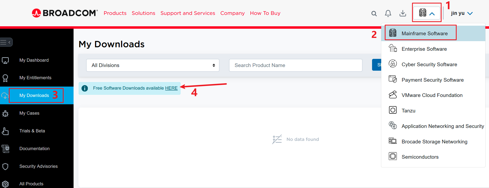
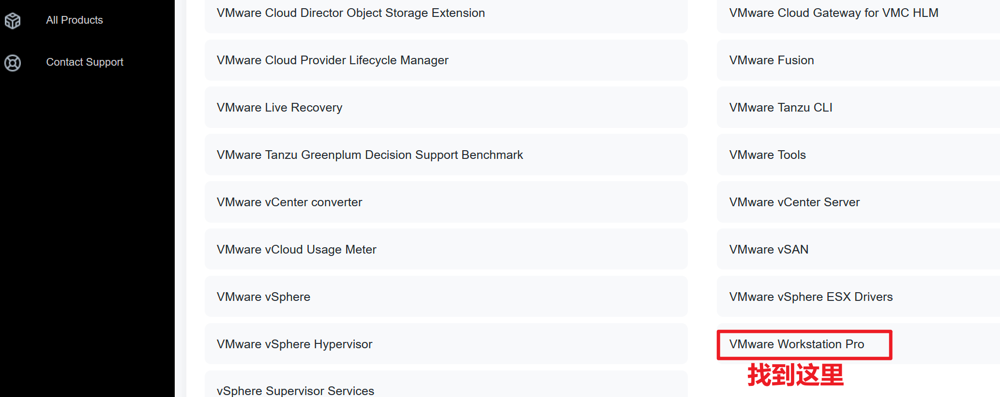
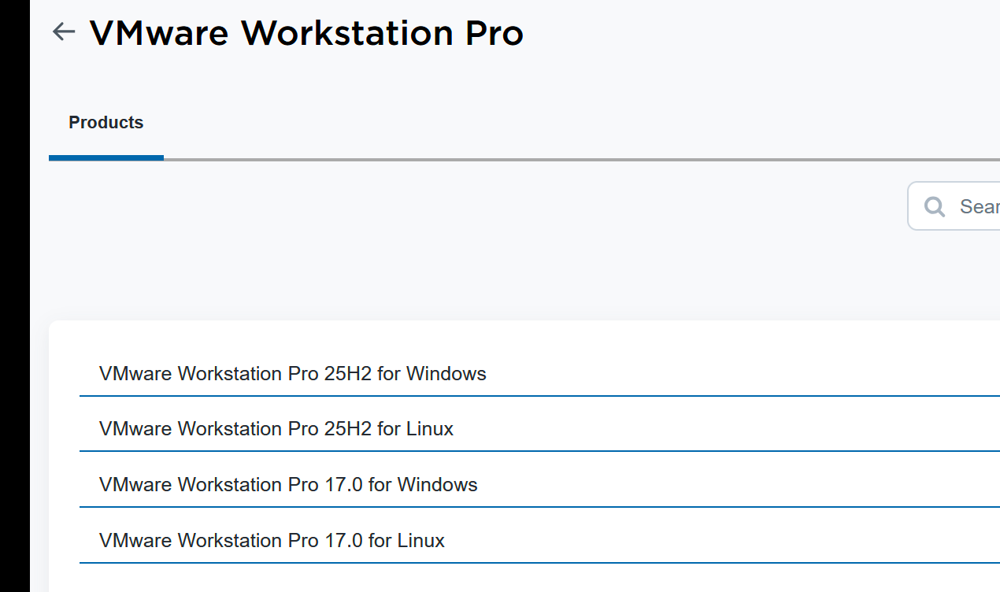
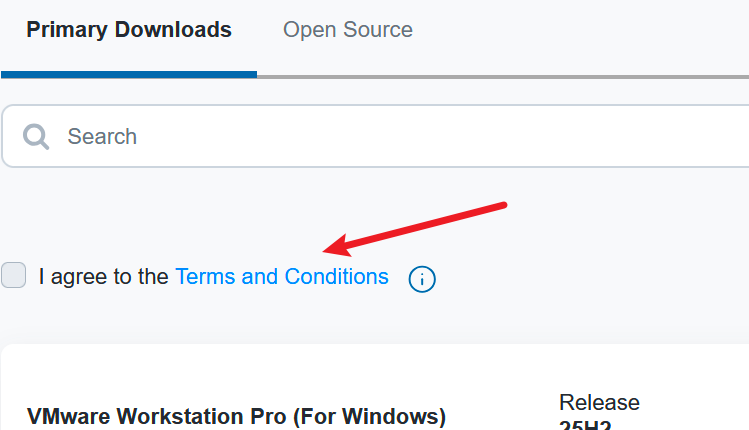
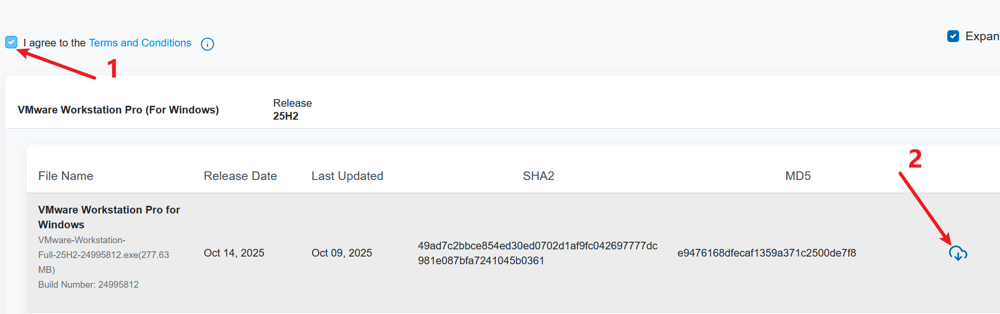
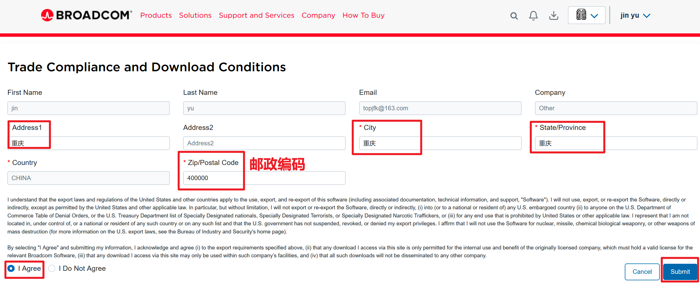
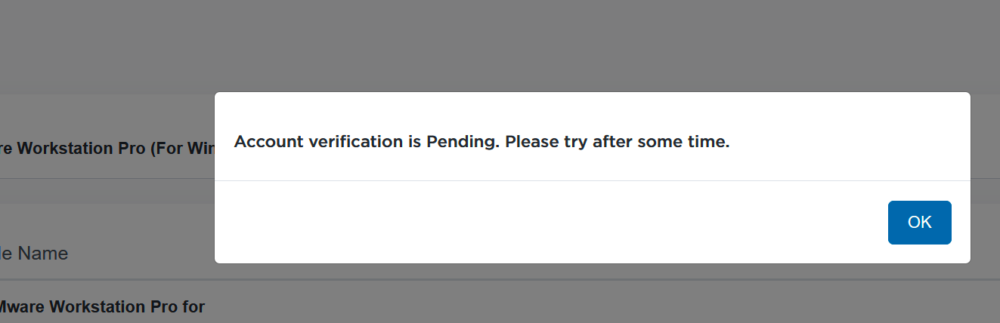

下载安装VMware25

<!-- more -->


## 最新VMware安装教程

**说明**：博通公司宣布 VMware Workstation Pro系列正式免费开放，不再需要许可证授权。

[博通下载地址](https://support.broadcom.com/group/ecx/downloads)，然后注册登录

- [vmware-16.2.5百度网盘](https://pan.baidu.com/s/1MYvYkBpDnly6J3Xo8DmNzQ)，提取码：`1234`
- [vmware-full-17百度网盘](https://pan.baidu.com/s/1ldEwKNaqLqHDKsPdyfpCfw)，提取码：`1234`
- [vmware-full-25百度网盘](https://pan.baidu.com/s/1mW67dIoKmDjEDgQix7FOHg)，提取码：`1234`
- [Centos7下载-aliyun](https://mirrors.aliyun.com/centos/7.9.2009/isos/x86_64/)
- [Centos7下载-huawei](https://mirrors.huaweicloud.com/centos/7/isos/x86_64/)


下载地址 <https://support.broadcom.com/group/ecx/downloads>，然后注册登录



下滑找到 `VMware Workstation Pro`



选择需要的版本



下载，点击 `Terms and Conditions` 查看协议，再回来吧前面框勾上





填写信息，提交后等待验证






## 解锁MacOS安装选项

1 下载 Unlocker，Vmware 默认不会开启对 MacOS 的支持，需进行解锁。解锁工具为Unlocker：<https://github.com/DrDonk/unlocker>（DrDonk项目已存档）、<https://github.com/BDisp/unlocker/releases>


进入 “Windows” 目录，右击“unlock.exe”程序


## 汉化Vmware 25H2

把老版本17的 `zh_CN` 语言包文件夹拷贝到安装目录下 `\VMware\messages` 目录下；

**方式1、在应用配置文件里配置：**

编辑 `C:\Users\你的电脑用户名\AppData\Roaming\VMware\preferences.ini`文件，在结尾添加 `pref.locale = "zh_CN"`


**方式2、在快捷方式里配置：**

在`C:\ProgramData\Microsoft\Windows\Start Menu\Programs\VMware` 目录下的 `VMware Workstation Pro` 快捷方式，右键打开属性，在 `目标` 末尾添加 `--locale zh_CN.` ，

如： `E:\xxx\VMware\vmware.exe --locale zh_CN.` `--`前面空格，最后CN后面一个点`.`，可以显示中文跟正确的版本号；

但发现问题：加点时版本号正确，但会出现翻译不全，把点去掉显示中文正常。


## 安装window11异常

**建议先断开网络**

**提示"这台电脑当前不满足Windows11系统要求"**

解决一：

1. 按下`Shift + F10`，打开cmd
2. 输入`regedit`，打开注册表
3. 依次展开`HKEY_LOCAL_MACHINE > SYSTEM > Setup`
4. 右键点击`Setup`，选择 **新建 > 项**，新建一个名为`LabConfig`的项
5. 在`LabConfig`中，右键点击空白处，选择 **新建 > DWORD (32位)值**，【`BypassSecureBootCheck`、`BypassTPMCheck`、`BypassCPUCheck`、`BypassRAMCheck`、`BypassStorageCheck`】，将数值设置为`1`
6. 关闭注册表编辑器，输入exit退出，返回安装界面，继续安装。


解决二：

 TPM绕过方案升级（新增注册表自动化脚本）

一键解决方案：

1. 创建 `BypassCheck.reg` 文件，输入以下内容：Windows Registry Editor Version 5.00

```
[HKEY_LOCAL_MACHINE\SYSTEM\Setup\LabConfig]
"BypassTPMCheck"=dword:00000001
"BypassSecureBootCheck"=dword:00000001
"BypassRAMCheck"=dword:00000001
"BypassStorageCheck"=dword:00000001
"BypassCPUCheck"=dword:00000001
```

2. 在命令行执行：`regedit /s BypassCheck.reg`


## Linux安装vm


安装：
`sudo chmod +x VM......`
`sudo ./VM.....`

卸载：
`sudo vmware-installer --uninstall-product vmware-workstation`

是否要保留配置文件？no

`whereis vmware`
位置：
`/usr/lib/vmware`
`/etc/vmware`
`/usr/share/man/man4/vmware.4.gz`

