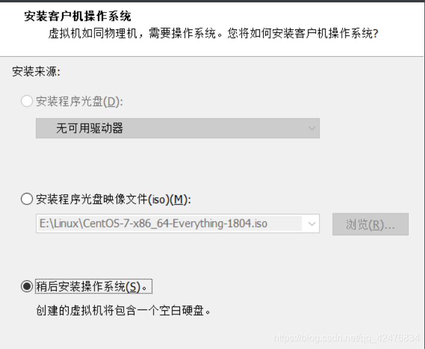

使用VMware安装centos7.x系统

<!-- more -->

## 安装VMware虚拟机

- [vmware官网下载](https://www.vmware.com/cn/products/workstation-pro/workstation-pro-evaluation.html)
- [vmware16官网下载](https://my.vmware.com/cn/web/vmware/downloads/info/slug/desktop_end_user_computing/vmware_workstation_pro/16_0)
- [vmware-16.2.5百度网盘](https://pan.baidu.com/s/1MYvYkBpDnly6J3Xo8DmNzQ)，提取码：`1234`
- [vmware-full-17.5.1百度网盘](https://pan.baidu.com/share/init?surl=PfQ8AHEo6BHtVjs6qFcIdg)，提取码：`1234` 使用微信扫一扫
- [Centos7下载-aliyun](https://mirrors.aliyun.com/centos/7.9.2009/isos/x86_64/)
- [Centos7下载-huawei](https://mirrors.huaweicloud.com/centos/7/isos/x86_64/)

### 密钥

**所有密钥均来源于网络**

15密钥

```
ZC10K-8EF57-084QZ-VXYXE-ZF2XF
UF71K-2TW5J-M88QZ-8WMNT-WKUY4
AZ7MK-44Y1J-H819Z-WMYNC-N7ATF
CU702-DRD1M-H89GP-JFW5E-YL8X6
YY5EA-00XDJ-480RP-35QQV-XY8F6
VA510-23F57-M85PY-7FN7C-MCRG0
UY758-0RXEQ-M81WP-8ZM7Z-Y3HDA
VF750-4MX5Q-488DQ-9WZE9-ZY2D6
UU54R-FVD91-488PP-7NNGC-ZFAX6
YC74H-FGF92-081VZ-R5QNG-P6RY4
YC34H-6WWDK-085MQ-JYPNX-NZRA2
```

16pro密钥

```
ZF3R0-FHED2-M80TY-8QYGC-NPKYF
YF390-0HF8P-M81RQ-2DXQE-M2UT6
ZF71R-DMX85-08DQY-8YMNC-PPHV8
```

17pro密钥

```
MC60H-DWHD5-H80U9-6V85M-8280D
4A4RR-813DK-M81A9-4U35H-06KND
NZ4RR-FTK5H-H81C1-Q30QH-1V2LA
JU090-6039P-08409-8J0QH-2YR7F
4Y09U-AJK97-089Z0-A3054-83KLA
4C21U-2KK9Q-M8130-4V2QH-CF810
JU090-6039P-08409-8J0QH-2YR7F
ZA5RU-6FYD5-48EPY-3XXEE-PAUGD
```

VMware Fusion Pro 12 序列号

```
ZF3R0-FHED2-M80TY-8QYGC-NPKYF
YF390-0HF8P-M81RQ-2DXQE-M2UT6
ZF71R-DMX85-08DQY-8YMNC-PPHV8
```


## Linux安装vmware

安装：

`sudo chmod +x VM......`
`sudo ./VM.....`

卸载：

`sudo vmware-installer --uninstall-product vmware-workstation`

是否要保留配置文件？no

`whereis vmware`

位置：

`/usr/lib/vmware`
`/etc/vmware`
`/usr/share/man/man4/vmware.4.gz`

## mac系统加速（beamoff）

<https://blog.csdn.net/qq_42095701/article/details/115008088>

VMware 兼容 macOS-unlocker：<https://github.com/BDisp/unlocker/releases>

```text
smc.version = 0
```

### a、应用程序副本已损坏/已过期

打开“终端”：date 092614102019：09是月，26是日，14是时，10是分，2019是年

```
macOS Catalina 	10.15.7 2020-09-24
macOS Mojave 		10.14.6 2019-09-26
macOS High Sierra 	10.13.6 2019-10-19
```

```
date 010514102017.30（macOS Sierra 10.12适用）
date 062614102014.30 （10.13、10.14适用）
date 121212122019 （10.15）
date 032208102015.20
date 112202022015
```

在您的计算机上尚未找到用于此虚拟机的 VMware Tools。安装将无法继续。可能存在一个可用的在线版本；您要下载并安装 VMware Tools 吗 (如果找到)?

### b、无法在更新服务器上找到组件。请联系 VMware 技术支持或您的系统管理员

1、在VMware 上安装的Mac OSX 安装 VMware Tools 需要用到一个叫 **darwin.iso** 的文件。

2、[下载 VMware-Fusion](http://softwareupdate.vmware.com/cds/vmw-desktop/fusion/12.2.4)

[VMware-Fusion 说明文档](https://docs.vmware.com/en/VMware-Fusion/12/rn/VMware-Fusion-12-Release-Notes.html)

`VMware-Fusion-12.2.0 ：支持 >= macOS 11.X`

`VMware-Fusion-12.1.2 ：支持 >= macOS 10.15`

`VMware-Fusion-11.5.3 起：仅支持 macOS 10.14、10.15`

### c、VMware-Fusion-12安装

<https://customerconnect.vmware.com/cn/downloads/info/slug/desktop_end_user_computing/vmware_fusion/12_0>


3、打开压缩文件，在payload目录中可以找到**darwin.iso**文件，将其解压并放到VMware的安装根目录

​	**Linux路劲【/usr/lib/vmware/isoimages】**

​	**windows路劲【安装目录下】**

4、在虚拟机设置中将CD/DVD指定为 **darwin.iso**：

5、启动系统，在桌面右边可以看到VMware Tools，双击打开：

### d、模块“Disk”启动失败，未能启动虚拟机

```
该物理磁盘上的分区表在该磁盘创建后发生过更改。请从虚拟机中移除该物理磁盘，然后重新添加打不开磁盘“D:\wind-vm\macOS 11.5\macOS 11.5.vmdk”或它所依赖的某个快照磁盘。模块“Disk”启动失败。未能启动虚拟机。
```

`xxx.vmx <---> vmci0.present = "TRUE"` 修改为 FALSE即可。


## 步骤一、新建虚拟机

文件—新建虚拟机—选择典型—稍后安装操作系统—linux—版本centos 7 64—划分20G模拟磁盘大小，虚拟磁盘拆分多个文件—点击完成：





然后点击下一步、点击完成：


## 步骤二、配置系统

点击系统centos，右键，选择设置，内存设置1G以上，点击cd/dvd设备选择iso映像文件


或：


## 步骤三、开始安装虚拟机

ctrl+alt键显示鼠标


### 选择安装语言


### 选择软件类型


### 分区设置

```txt
linux一般来说分为4个基本区：
    用户分区：home——保存用户信息
    启动分区：boot ——保存系统启动的数据，一般100到200m
    交换分区：swap——理解为虚拟内存，真实内存不够的时候临时会使用swap分区，一般是内存的两倍，2G
    根分区：/ 
```


其他分区类似操作，完成分区结果如下：（最后添加 “/” 目录时不需要指定分区大小，直接点击 “添加挂载点”，系统会自动把当前分区的总空间剩余空间分配到 “/” 目录），最后点击完成按钮


### 设置网络主机名：（主机名默认是：localhost）


### 设置root用户密码


### 设置普通用户极密码


### 最后等待安装


### 登录：输入用户名与密码


