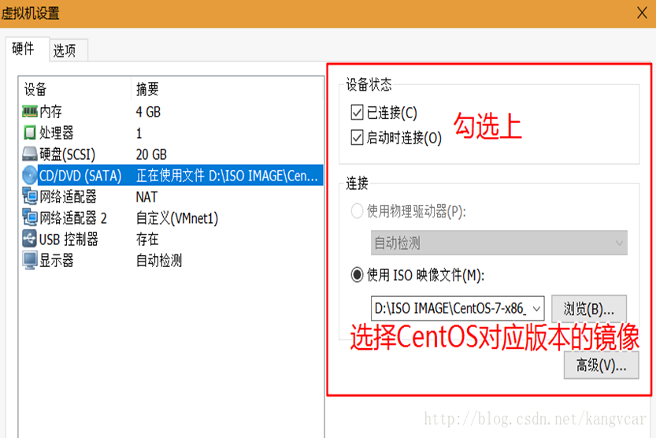

YUM 源配置

<!-- more -->

[https://blog.csdn.net/qq_42476834/article/details/121433712](https://blog.csdn.net/qq_42476834/article/details/121433712)

**查看系统的版本：**`cat /etc/redhat-release`

## 一、用Centos镜像搭建本地yum源

### 1.安装Centos后默认的yum源 如下

```shell
ll /etc/yum.repos.d/
```

### 2.把默认yum源备份(可选)

```shell
cp CentOS-Base.repo  CentOS-Base-cp.repo
```

### 3.在虚拟机上挂载CentOS镜像文件



```shell
(1) mount -t iso9660 /dev/sr0 /opt/centos

(2) mount /dev/cdrom /mnt/cdrom
```

**自定义配置文件名：**`vim /etc/yum.repos.d/local.repo`

```shell
[local]           #标签
name=local        #设置yum源名称
baseurl=file:///opt/centos  #挂载源
enabled=1         #可用性
gpgcheck=0        #校验
```

### 5.清除缓存

- **yum clean all**         //全部消除缓存
- **yum makecache**          //把yum源缓存到本地，加快软件的搜索好安装速度
- **yum -y update**          //更新yum库存
- **yum repolist**           //列出个包

## 二、把默认的CentOS yum源修改成国内的aliyun-yum源

### 1.进入yum目录

```shell
cd /etc/yum.repos.d/
```

### 2.把默认yum源备份(可选项)

```shell
cp CentOS-Base.repo  CentOS-Base.repo-cp
```

### 3.下载ailiyun的yum源配置文件到/etc/yum.repos.d/

[centos-yum-阿里官网配置](https://developer.aliyun.com/mirror/centos?spm=a2c6h.13651102.0.0.613b1b11Q4GiOU)

**CentOS 6：**

```shell
wget -O /etc/yum.repos.d/CentOS-Base.repo https://mirrors.aliyun.com/repo/Centos-6.repo
或者
curl -o /etc/yum.repos.d/CentOS-Base.repo https://mirrors.aliyun.com/repo/Centos-6.repo
```

**CentOS 7：**

```shell
wget -O /etc/yum.repos.d/CentOS-Base.repo https://mirrors.aliyun.com/repo/Centos-7.repo
或者
curl -o /etc/yum.repos.d/CentOS-Base.repo https://mirrors.aliyun.com/repo/Centos-7.repo
```

**CentOS 8：**

```shell
wget -O /etc/yum.repos.d/CentOS-Base.repo https://mirrors.aliyun.com/repo/Centos-8.repo
或者
curl -o /etc/yum.repos.d/CentOS-Base.repo https://mirrors.aliyun.com/repo/Centos-8.repo
```

### 4.清除缓存

- **yum clean all**         //全部消除缓存
- **yum makecache**          //把yum源缓存到本地，加快软件的搜索好安装速度
- **yum -y update**          //更新yum库存
- **yum repolist**           //列出个包

## 三、把默认的CentOS yum源修改成国内的163源

### 1.安装Centos后默认的yum源如下

```shell
ll /etc/yum.repos.d/
```

### 2.把默认yum源备份(可选)

```shell
cp CentOS-Base.repo  CentOS-Base.repo-cp
```

### 3.下载163 yum源repo文件

**CentOS 5：**

`wget http://mirrors.163.com/.help/CentOS5-Base-163.repo`

**CentOS 6：**

`wget http://mirrors.163.com/.help/CentOS6-Base-163.repo`

**CentOS 7：**

`wget http://mirrors.163.com/.help/CentOS7-Base-163.repo`

**CentOS 8：**

`wget http://mirrors.163.com/.help/CentOS8-Base-163.repo`

*运行*

`wget -O /etc/yum.repos.d/CentOS8-Base-163.repo http://mirrors.163.com/.help/CentOS8-Base-163.repo`

```shell
Saving to: ‘/etc/yum.repos.d/CentOS8-Base-163.repo’100%[=>] 1,572       --.-K/s   in 0s      2017-06-20 06:29:47 (293 MB/s) - ‘/etc/yum.repos.d/CentOS8-Base-163.repo’ saved [1572/1572]
```

### 4.清除缓存

- **yum clean all**         //全部消除缓存
- **yum makecache**          //把yum源缓存到本地，加快软件的搜索好安装速度
- **yum -y update**          //更新yum库存
- **yum repolist**           //列出个包

==下面可忽略==

## 四、修改yum源的优先级

### 1.查看系统是否安装了优先级的插件

```bash
rpm -qa | grep yum-plugin-
yum-plugin-fastestmirror-1.1.31-34.el7.noarch        
//这里看到没有安装yum-plugin-priorities.noarch这个插件

yum search yum-plugin-priorities  
      
//用search查看是否有此插件可用
Loaded plugins: fastestmirror
Loading mirror speeds from cached hostfile
* base: mirrors.aliyun.com
* extras: mirrors.aliyun.com
* updates: mirrors.aliyun.com
====================================================== N/S matched: yum-plugin-priorities =======================================================
yum-plugin-priorities.noarch : plugin to give priorities to packages from different repos
```

### 2.安装yum-plugin-priorities.noarch插件

>yum -y install yum-plugin-priorities.noarch

### 3.查看插件是否启用

```bash
cat /etc/yum/pluginconf.d/priorities.conf
[main]
enabled = 1   #1为启用；0为禁用
```

### 4.修改本地yum源优先使用

```bash
ll /etc/yum.repos.d/
total 8
-rw-r--r--. 1 root root 2573 May 15  2015 CentOS-Base.repo
-rw-r--r--. 1 root root   67 Jun 20 06:04 local.repo//有两个repo文件

vi /etc/yum.repos.d/local.repo
[local]
name=local
baseurl=file:///opt/centos
enabled=1
gpgcheck=0
priority=1//在原基础上加入priority=1 ；数字越小优先级越高//可以继续修改其他源的priority值，经测试仅配置本地源的优先级为priority=1就会优先使用本地源了
```

### 5.测试

```bash
配置优先级前：(使用阿里云yum源)
1# yum -y install vimDependencies Resolved
=================================================================================================================================================
Package                            Arch                         Version                                     Repository                     Size
=================================================================================================================================================
Installing:
vim-enhanced                       x86_64                       2:7.4.160-1.el7_3.1                         updates                       1.0 M
Updating for dependencies:
vim-common                         x86_64                       2:7.4.160-1.el7_3.1                         updates                       5.9 M
省略···
```

```bash
配置优先级后：(使用本地yum源)
1# yum -y install vimDependencies Resolved
=================================================================================================================================================
Package                                     Arch                        Version                                Repository                  Size
=================================================================================================================================================
Installing:
vim-enhanced                                x86_64                      2:7.4.160-1.el7                        local                      1.0 M
Installing for dependencies:
gpm-libs                                    x86_64                      1.20.7-5.el7                           local                       32 k
perl                                        x86_64                      4:5.16.3-286.el7                       local                      8.0 M
perl-Carp                                   noarch                      1.26-244.el7                           local                       19 k
perl-Encode                                 x86_64                      2.51-7.el7                             local                      1.5 M
perl-Exporter                               noarch                      5.68-3.el7                             local                       28 k
perl-File-Path                              noarch                      2.09-2.el7                             local                       26 k
perl-File-Temp                              noarch                      0.23.01-3.el7                          local                       56 k
省略···
```
