ElasticSearch 全文检索

<!-- more -->

# ElasticSearch

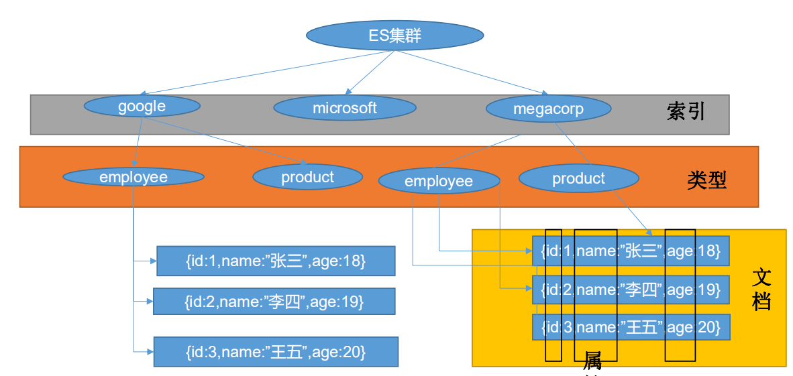

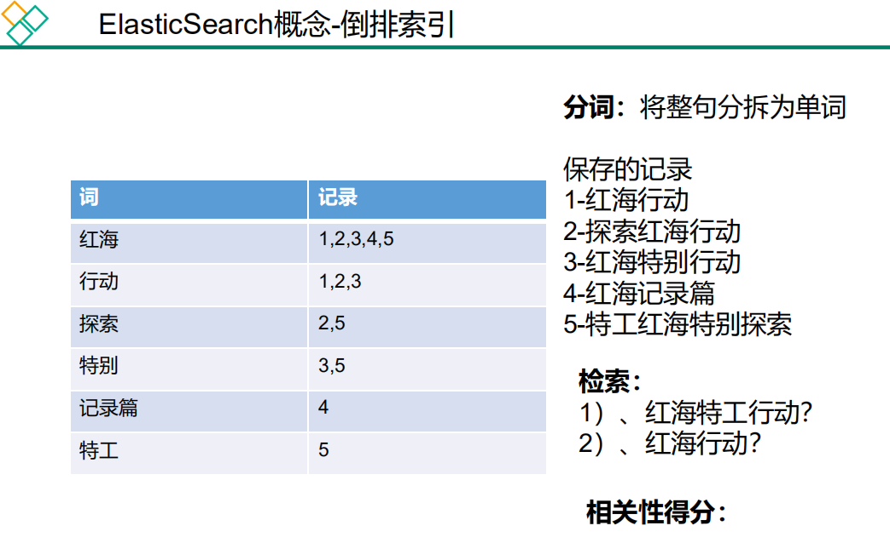

## 1. ElasticSearch概念

### 1.1 ES介绍

应用程序搜索 网站搜索 企业搜索 日志处理和分析

基础设施指标和容器监测 应用程序性能监测

地理空间数据分析和可视化 安全分析 业务分析

官方文档 : <https://www.elastic.co/guide/en/elasticsearch/reference/current/index.html>

官方中文 : <https://www.elastic.co/guide/cn/elasticsearch/guide/current/foreword_id.html>

社区中文: <https://es.xiaoleilu.com/index.html、http://doc.codingdict.com/elasticsearch/0/>

### 1.2 基本概念

Elasticsearch也是基于Lucene的全文检索库，本质也是存储数据，很多概念与MySQL类似的。

对比关系：

```
索引（indices）----------------------Databases 数据库

  类型（type）--------------------------Table 数据表

     文档（Document）----------------------Row 行

     字段（Field）-------------------------Columns 列 
```

index:索引

type: 数据类型

document

```text
保存 在 某 个 索引 (Index) 下 ， 某 种 类 型 Type) 的 一 个 数据 (Document) ， 文 档 是 JSON 格
式 的 ，Document 就 像 是 MySQL 中 的 某 个 Table 里 面 的 内 容 
```

要注意的是：Elasticsearch本身就是分布式的，因此即便你只有一个节点，Elasticsearch默认也会对你的数据进行分片和副本操作，
当你向集群添加新数据时，数据也会在新加入的节点中进行平衡。

## 2 安装

[downloads](https://www.elastic.co/cn/downloads/elasticsearch#ga-release)

> docker pull elasticsearch:7.14.0      存储和检索数据
>
> docker pull kibana:7.14.0        可视化数据

[教程](https://blog.csdn.net/qq_42476834/article/details/112675953)

[具体 Docker 安装配置-站内跳转](/tools/docker/docker-install-mysql-redis-nginx-nacos-mq-es.html#elasticsearch-kibana)

### 查看 elasticsearch

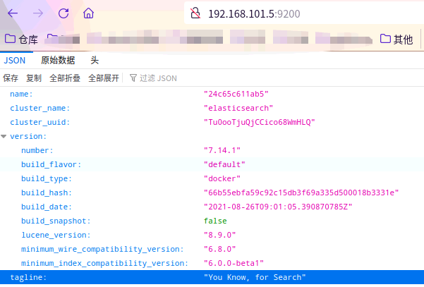

### 查看 kibana

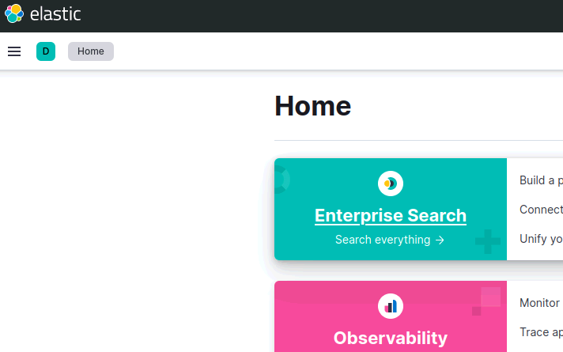

## 3 索引操作（indices）

### 3.1 查询索引

```text
/_cat/indices?v 有哪些索引库
/_cat/nodes 查看节点信息
/_cat/health 查看es健康状态
/_cat/master 查看主节点
/_cat/indices 查看所有索引
```

es 中会默认存在一个名为.kibana和.kibana_task_manager的索引

表头的含义

|      字段名       | 含义说明                                      |
|:--------------:|:------------------------------------------|
|     health     | green(集群完整) yellow(单点正常、集群不完整) red(单点不正常) |
|     status     | 是否能使用                                     |
|     index      | 索引名                                       |
|      uuid      | 索引统一编号                                    |
|      pri       | 主节点几个                                     |
|      rep       | 从节点几个                                     |
|   docs.count   | 文档数                                       |
|  docs.deleted  | 文档被删了多少                                   |
|   store.size   | 整体占空间大小                                   |
| pri.store.size | 主节点占                                      |

### 3.2 创建索引

保存: PUT /index/type/标识id

如: PUT /customer/demo/1

**PUT 和 POST都可以.**

*POST* 新增。如果不指定id，会自动生成id。指定id就会修改这个数据，并新增版本号

*PUT* 可以新增&修改。PUT必须指定id,由于PUT需要指定id，我们一般都用来做修改操作，不指定id会报错 。

#### 响应结果 <a name='响应结果' />

```text
{
    "_index": "customer", #索引
    "_type": "demo", #类型
    "_id": "1", #id
    "_version": 5, #版本
    "result": "updated", #状态
    "_shards": {
        "total": 2,
        "successful": 1,
        "failed": 0
    },
    "_seq_no": 5, #并发控制字段，每次更新就会+1，用来做乐观锁
    "_primary_term": 1 #同上,主分片重新分配，如重启，就会变化
}
```

#### PUT

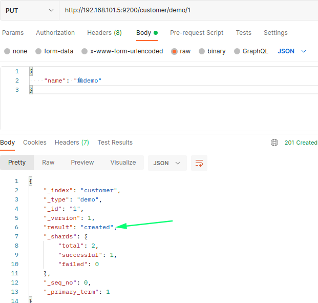

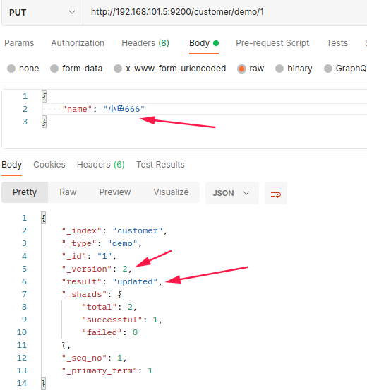

不指定ID报错

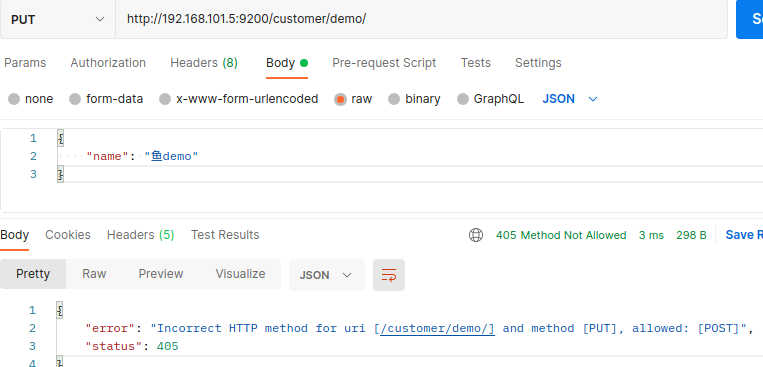

#### POST

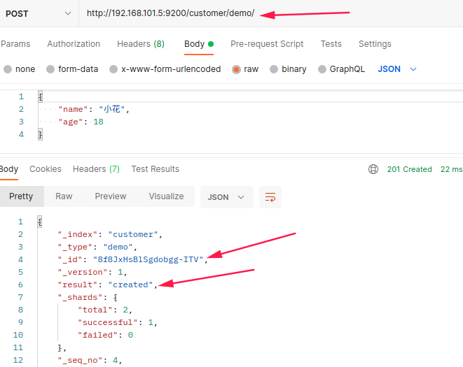

### 3.3 get 查询文档&乐观锁

[响应结果](#响应结果)

get <http://192.168.101.5:9200/customer/demo/1>

```json
{
    "_index": "customer",
    "_type": "demo",
    "_id": "1",
    "_version": 8,
    "_seq_no": 14,
    "_primary_term": 1,
    "found": true,
    "_source": {
        "name": "小鱼666"
    }
}
```

> 更新携带 ?if_seq_no=14&if_primary_term=1

#### 并发修改测试:多个人同时修改一个数据

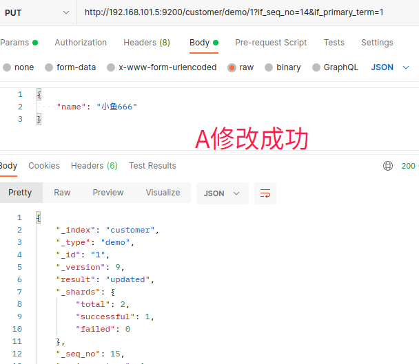

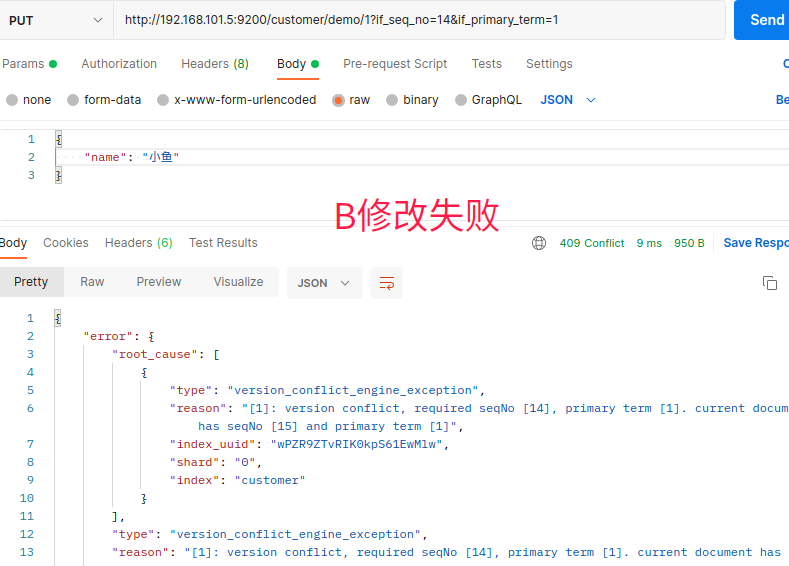

读取

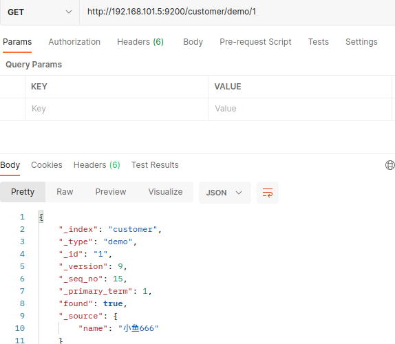

如果想要修改成功,就需要获取最新的_seq_no

### 3.4 post 更新文档

更新1

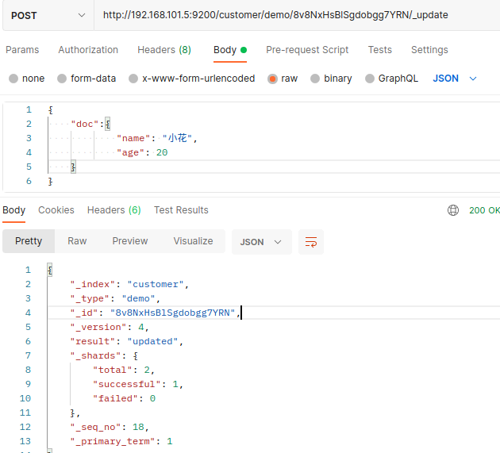

读取

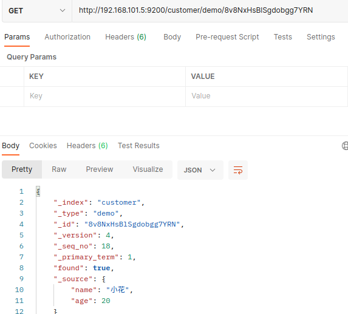

更新2

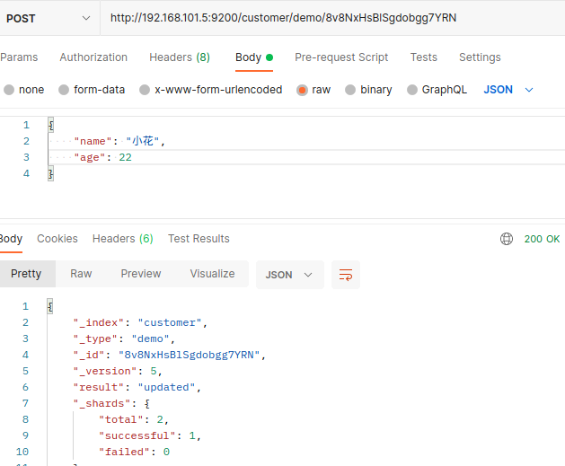

### 3.5 删除文档&索引

删除ID: <http://192.168.101.5:9200/customer/demo/id/>

```json
{
    "_index": "customer",
    "_type": "demo",
    "_id": "8v8NxHsBlSgdobgg7YRN",
    "_version": 6,
    "result": "deleted",
    "_shards": {
        "total": 2,
        "successful": 1,
        "failed": 0
    },
    "_seq_no": 20,
    "_primary_term": 1
}
```

删除索引: <http://192.168.101.5:9200/customer/>

```json
{
    "acknowledged": true
}
```

查看索引: <http://192.168.101.5:9200/_cat/indices>

### 3.6 post bulk批量导入 API

#### 使用postman请求

```text
{"index":{"_id":"1"}}
{"name": "小霞"}
{"index":{"_id": "2"}}
{"name": "小花"}
```

post <http://192.168.101.5:9200/customer/demo/_bulk>

```json
{
    "took": 1,
    "errors": false,
    "items": [
        {
            "index": {
                "_index": "customer",
                "_type": "demo",
                "_id": "1",
                "_version": 2,
                "result": "updated",
                "_shards": {
                    "total": 2,
                    "successful": 1,
                    "failed": 0
                },
                "_seq_no": 1,
                "_primary_term": 1,
                "status": 200
            }
        },
        {
            "index": {
                "_index": "customer",
                "_type": "demo",
                "_id": "2",
                "_version": 1,
                "result": "created",
                "_shards": {
                    "total": 2,
                    "successful": 1,
                    "failed": 0
                },
                "_seq_no": 2,
                "_primary_term": 1,
                "status": 201
            }
        }
    ]
}
```

<http://192.168.101.5:9200/customer/demo/1>

#### 可视化操作

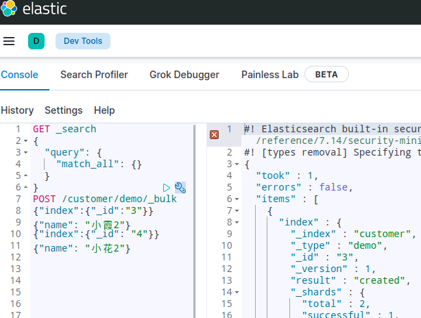

POST /_bulk

```json
{
  "delete": {
    "_index": "website",
    "_type": "blog",
    "_id": "123"
  },
  "create": {
    "_index": "website",
    "_type": "blog",
    "_id": "123"
  },
  "title": "My first blog post",
  "index": { "_index": "website", "_type": "blog"},
  "title": "My second blog post",
  "update": { "_index": "website", "_type": "blog", "_id": "123"},
  "doc": {"title": "My updated blog post"}
}
```

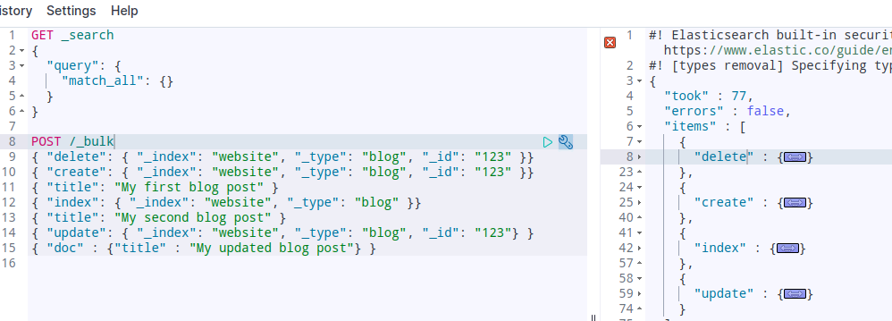

#### 样本测试数据

[accounts.zip](https://download.elastic.co/demos/kibana/gettingstarted/accounts.zip)

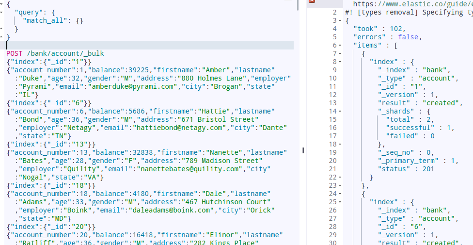

## 4 映射配置（_mapping）

索引有了，接下来肯定是添加数据。但是，在添加数据之前必须定义映射。

什么是映射？

映射是定义文档的过程，文档包含哪些字段，这些字段是否保存，是否索引，是否分词等

只有配置清楚，Elasticsearch才会帮我们进行索引库的创建（不一定）

### 4.1 PUT 创建映射字段

PUT /索引库名/_mapping/类型名称

```json
{
  "properties": {
    "字段名": {
      "type": "类型",
      "index": true,
      "store": true,
      "analyzer": "分词器"
    }
  }
}
```

类型名称：就是前面将的type的概念，类似于数据库中的不同表

字段名：类似于列名，properties下可以指定许多字段。

每个字段可以有很多属性。例如：

- type：类型，可以是text、long、short、date、integer、object等
- index：是否索引，默认为true
- store：是否存储，默认为false
- analyzer：分词器，这里使用ik分词器：`ik_max_word`或者`ik_smart`

**示例**

发起请求：

**示例1**

PUT atguigu/_mapping/goods

```json
{
  "properties": {
    "title": {
      "type": "text",
      "analyzer": "ik_max_word"
    },
    "images": {
      "type": "keyword",
      "index": "false"
    },
    "price": {
      "type": "long"
    }
  }
}
```

**示例2**

PUT /my_index

```json
{
  "mappings": {
    "properties": {
      "age":{"type":"integer"},
      "email":{"type":"keyword"},
      "name":{"type":"text"}
    }
  }
}
```

**响应结果：**

```json
{
  "acknowledged": true
}
```

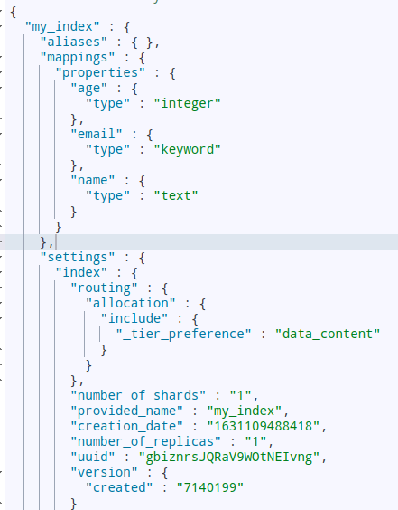

### 4.2 GET 查看映射关系

语法：

```text
GET /索引库名/_mapping
```

示例：

```text
GET /atguigu/_mapping
```

响应：

```json
{
  "atguigu" : {
    "mappings" : {
      "goods" : {
        "properties" : {
          "images" : {
            "type" : "keyword",
            "index" : false
          },
          "price" : {
            "type" : "long"
          },
          "title" : {
            "type" : "text",
            "analyzer" : "ik_max_word"
          }
        }
      }
    }
  }
}
```

type：字段类型。String（text  keyword） Numeric（long integer float double） date boolean

index：是否创建索引

analyzer：分词器（ik_max_word）

### 4.3 PUT 添加索引字段

PUT /my_index/_mapping

```text
{
  "properties": {
    "employee-id":{ #字段
      "type":"keyword",  #类型
      "index":false   #可检索
    }
  }
}
```

对于已经存在的映射字段，我们不能更新。更新必须创建新的索引进行数据迁移

### 4.4 映射 PUT 数据迁移

_type="account" 变为>_type: "_doc",，取消了type，6.0之后取消了type

GET /bank/_mapping

PUT /newbank

```json
{
  "mappings": {
    "properties": {
      "account_number": {
        "type": "long"
      },
      "address": {
        "type": "text"
      },
      "age": {
        "type": "integer"
      },
      "balance": {
        "type": "integer"
      },
      "city": {
        "type": "keyword"
      },
      "email": {
        "type": "keyword"
      },
      "employer": {
        "type": "keyword"
      },
      "firstname": {
        "type": "text"
      },
      "gender": {
        "type": "keyword"
      },
      "lastname": {
        "type": "text"
      },
      "state": {
        "type": "keyword"
      }
    }
  }
}
```

GET /newbank

POST _reindex

```json
{
  "source":{
    "index":"bank",
    "type":"account"
  },
  "dest":{
    "index":"newbank"
  }
}
```

> GET /newbank/_search #_type="account" 变为> _type: "_doc",，取消了type，6.0之后取消了type

## 5 新增文档（document）

有了索引、类型和映射，就可以对文档做增删改查操作了。

### 5.1 基本玩法

如果我们想要自己新增的时候指定id，可以这么做：

```text
POST /索引库名/类型/id值
{
    ...
}
```

演示：

查询得到两条数据：小米手机的id是我们指定的id

- `_source`：源文档信息，所有的数据都在里面。
- `_id`：这条文档的唯一标示，与文档自己的id字段没有关联

### 5.2 智能判断

事实上Elasticsearch非常智能，你不需要给索引库设置任何mapping映射，它也可以根据你输入的数据来判断类型，动态添加数据映射。

测试一下：

POST /atguigu/goods/2

```json
{
    "title":"小米手机",
    "images":"http://image.jd.com/12479122.jpg",
    "price":2899,
    "stock": 200,
    "saleable":true,
    "attr": {
        "category": "手机",
        "brand": "小米"
    }
}
```

我们额外添加了stock库存，saleable是否上架，attr其他属性几个字段。

来看结果：`GET /atguigu/_search`

GET /atguigu/_search

```json
{
  "took" : 7,
  "timed_out" : false,
  "_shards" : {
    "total" : 2,
    "successful" : 2,
    "skipped" : 0,
    "failed" : 0
  },
  "hits" : {
    "total" : 2,
    "max_score" : 1.0,
    "hits" : [
      {
        "_index" : "atguigu",
        "_type" : "goods",
        "_id" : "1",
        "_score" : 1.0,
        "_source" : {
          "title" : "华为手机",
          "images" : "http://image.jd.com/12479122.jpg",
          "price" : 4288
        }
      },
      {
        "_index" : "atguigu",
        "_type" : "goods",
        "_id" : "2",
        "_score" : 1.0,
        "_source" : {
          "title" : "小米手机",
          "images" : "http://image.jd.com/12479122.jpg",
          "price" : 2899,
          "stock" : 200,
          "saleable" : true,
          "attr" : {
            "category" : "手机",
            "brand" : "小米"
          }
        }
      }
    ]
  }
}
```

再看下索引库的映射关系: `GET /atguigu/_mapping`

```json
{
  "atguigu" : {
    "mappings" : {
      "goods" : {
        "properties" : {
          "attr" : {
            "properties" : {
              "brand" : {
                "type" : "text",
                "fields" : {
                  "keyword" : {
                    "type" : "keyword",
                    "ignore_above" : 256
                  }
                }
              },
              "category" : {
                "type" : "text",
                "fields" : {
                  "keyword" : {
                    "type" : "keyword",
                    "ignore_above" : 256
                  }
                }
              }
            }
          },
          "images" : {
            "type" : "keyword",
            "index" : false
          },
          "price" : {
            "type" : "long"
          },
          "saleable" : {
            "type" : "boolean"
          },
          "stock" : {
            "type" : "long"
          },
          "title" : {
            "type" : "text",
            "analyzer" : "ik_max_word"
          }
        }
      }
    }
  }
}
```

stock，saleable，attr都被成功映射了。

如果是字符串类型的数据，会添加两种类型：text + keyword。如上例中的category 和 brand

## 6 删除数据

删除使用DELETE请求，同样，需要根据id进行删除：

**语法**

```text
DELETE /索引库名/类型名/id值
```

**示例：**

```text
DELETE /atguigu/goods/3
```

**结果：**

```json
{
  "_index" : "atguigu",
  "_type" : "goods",
  "_id" : "3",
  "_version" : 2,
  "result" : "deleted",
  "_shards" : {
    "total" : 4,
    "successful" : 1,
    "failed" : 0
  },
  "_seq_no" : 1,
  "_primary_term" : 1
}
```

## 7 分词

### 7.1 默认分词器，对中文不友好

POST _analyze

```text
{
  "analyzer": "standard",
  "text": "Bucket aggregations don’t calculate metrics over fields like"
}

结果:

 {
      "tokens" : [
        {
          "token" : "bucket",
          "start_offset" : 0,
          "end_offset" : 6,
          "type" : "<ALPHANUM>",
          "position" : 0
        },
        {
          "token" : "aggregations",
          "start_offset" : 7,
          "end_offset" : 19,
          "type" : "<ALPHANUM>",
          "position" : 1
        },
--------------------
POST _analyze

{
  "analyzer": "standard",
  "text": "我爱你java"
}

结果：

    {
      "tokens" : [
        {
          "token" : "学",
          "start_offset" : 0,
          "end_offset" : 1,
          "type" : "<IDEOGRAPHIC>",
          "position" : 0
        },
        {
          "token" : "校",
          "start_offset" : 1,
          "end_offset" : 2,
          "type" : "<IDEOGRAPHIC>",
          "position" : 1
        },
        {
          "token" : "我",
          "start_offset" : 2,
          "end_offset" : 3,
          "type" : "<IDEOGRAPHIC>",
          "position" : 2
        },
```

### 7.2 ik 分词器

[github 下载](https://github.com/medcl/elasticsearch-analysis-ik/releases)

解压到es：plugins

重启es

```text
# 分词失败
POST _analyze
{
  "analyzer": "standard",
  "text": "我爱你中国"
}

# 分词ok
POST _analyze
{
  "analyzer": "ik_smart",
  "text": "我爱你中国"
}

# 多词组合【如下图】
POST _analyze
{
  "analyzer": "ik_max_word",
  "text": "我爱你中国"
}
```

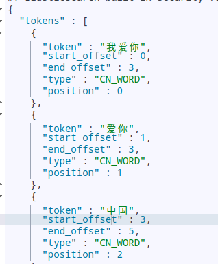

### 7.3 自定义分词

**nginx 配置**

<http://localhost:50005/es/fenci.txt>

ik/config/IKAnalyzer.cfg.xml:

`<entry key="remote_ext_dict">http://localhost:50005/es/fenci.txt</entry>`

重启es

## 8 查询

### 8.1 2种查询  <a name="2种查询" />

| took            | Elasticsearch执行搜索的时间(毫秒)      |
|-----------------|-------------------------------|
| time_out        | 告诉我们搜索是否超时                    |
| _shards         | 告诉我们多少个分片被搜索了，以及统计了成功/失败的搜索分片 |
| hits            | 搜索结果                          |
| hits.total      | 搜索结果                          |
| hits.hits       | 实际的搜索结果数组(默认为前10的文档)          |
| sort            | 结果的排序key (键) (没有则按score排序)    |
| score和max_score | 相关性得分和最高分                     |

GET bank/_search?q=*&sort=account_number:asc

GET bank/_search

```json
{
  "query":{
    "match_all": {}
  },
  "sort": [
    {
      "account_number": "asc"
    },
    {
      "balance": "desc"
    }
  ]
}
```

查询所有：

```text
GET /{index}/_search
```

根据id查询：

```text
GET /{index}/{type}/{id}
```

除了上述简单查询之外。elasticsearch作为搜索引擎，最复杂最强大的功能就是搜索查询功能。包括：匹配查询、词条查询、模糊查询、组合查询、范围查询、高亮、排序、分页等等查询功能。

基本查询语法如下：

GET /索引库名/_search

```json
{
    "query":{
        "查询类型":{
            "查询条件":"查询条件值"
        }
    }
}
```

这里的query代表一个查询对象，里面可以有不同的查询属性

- 查询类型：
  - 例如：`match_all`， `match`，`term` ， `range` 等等
- 查询条件：查询条件会根据类型的不同，写法也有差异，后面详细讲解

查询结果：

- took：查询花费时间，单位是毫秒
- time_out：是否超时
- _shards：分片信息
- hits：搜索结果总览对象
  - total：搜索到的总条数
  - max_score：所有结果中文档得分的最高分
  - hits：搜索结果的文档对象数组，每个元素是一条搜索到的文档信息
    - _index：索引库
    - _type：文档类型
    - _id：文档id
    - _score：文档得分
    - _source：文档的源数据

### 8.2 数据准备

POST /atguigu/goods/_bulk

```text
{"index":{"_id":1}}
{ "title":"小米手机", "images":"http://image.jd.com/12479122.jpg", "price":1999, "stock": 200, "attr": { "category": "手机", "brand": "小米" } }
{"index":{"_id":2}}
{"title":"超米手机", "images":"http://image.jd.com/12479122.jpg", "price":2999, "stock": 300, "attr": { "category": "手机", "brand": "小米" } }
{"index":{"_id":3}}
{ "title":"小米电视", "images":"http://image.jd.com/12479122.jpg", "price":3999, "stock": 400, "attr": { "category": "电视", "brand": "小米" } }
{"index":{"_id":4}}
{ "title":"小米笔记本", "images":"http://image.jd.com/12479122.jpg", "price":4999, "stock": 200, "attr": { "category": "笔记本", "brand": "小米" } }
{"index":{"_id":5}}
{ "title":"华为手机", "images":"http://image.jd.com/12479122.jpg", "price":3999, "stock": 400, "attr": { "category": "手机", "brand": "华为" } }
{"index":{"_id":6}}
{ "title":"华为笔记本", "images":"http://image.jd.com/12479122.jpg", "price":5999, "stock": 200, "attr": { "category": "笔记本", "brand": "华为" } }
{"index":{"_id":7}}
{ "title":"荣耀手机", "images":"http://image.jd.com/12479122.jpg", "price":2999, "stock": 300, "attr": { "category": "手机", "brand": "华为" } }
{"index":{"_id":8}}
{ "title":"oppo手机", "images":"http://image.jd.com/12479122.jpg", "price":2799, "stock": 400, "attr": { "category": "手机", "brand": "oppo" } }
{"index":{"_id":9}}
{ "title":"vivo手机", "images":"http://image.jd.com/12479122.jpg", "price":2699, "stock": 300, "attr": { "category": "手机", "brand": "vivo" } }
{"index":{"_id":10}}
{ "title":"华为nova手机", "images":"http://image.jd.com/12479122.jpg", "price":2999, "stock": 300, "attr": { "category": "手机", "brand": "华为" } }
```

对非文本数据检索用 trem，对文本|全文检索就用 match

### 8.3 匹配查询（match && match_all）

#### 8.3.1 查询所有（match_all ）

GET /atguigu/_search

```text
{
  "query":{ #查询规则
    "match_all": {} #查询所有
  },
  "from": 0, #开始位置
  "size": 4, #选取条数
  "sort": [ #排序
    {
      "balance":{ #处理的字段
        "order": "desc" # 排序规则
      }
    }
  ],
  "_source": ["balance","lastname"] #显示字段
}
```

- `query`：代表查询对象
- `match_all`：代表查询所有

#### 8.3.2 条件匹配（match ）

GET /atguigu/_search

```json
{
  "query": {
    "match": {
      "title": "小米手机"
    }
  }
}
```

查询出很多数据，不仅包括`小米手机`，而且与`小米`或者`手机`相关的都会查询到，说明多个词之间是`or`的关系。

某些情况下，我们需要更精确查找，我们希望这个关系变成`and`，可以这样做：

GET /atguigu/_search

```json
{
  "query": {
    "match": {
      "title": {
        "query": "小米手机",
        "operator": "and"
      }
    }
  }
}
```

查询结果：

```json
{
  "took" : 26,
  "timed_out" : false,
  "_shards" : {
    "total" : 2,
    "successful" : 2,
    "skipped" : 0,
    "failed" : 0
  },
  "hits" : {
    "total" : 1,
    "max_score" : 1.7037868,
    "hits" : [
      {
        "_index" : "atguigu",
        "_type" : "goods",
        "_id" : "1",
        "_score" : 1.7037868,
        "_source" : {
          "title" : "小米手机",
          "images" : "http://image.jd.com/12479122.jpg",
          "price" : 1999,
          "stock" : 200,
          "attr" : {
            "category" : "手机",
            "brand" : "小米"
          }
        }
      }
    ]
  }
}
```

#### 8.3.3 短语匹配 （match phrase） <a name="短语匹配" />

GET bank/_search

```json
{
  "query": {
    "match_phrase": {
      "address": "mill lane"
    }
  }
}
```

只会包含 address=mill lane 记录

#### 8.3.4 子属性匹配（字段.xx） <a name="子属性匹配" />

GET /atguigu/_search

```json
{
  "query": {
    "match": {
      "attr.brand": "小米"
    }
  }
}
```

#### 8.3.5 多字段匹配（multi_match） <a name="多字段匹配" />

`match`只能根据一个字段匹配查询，如果要根据多个字段匹配查询可以使用`multi_match`

GET /atguigu/_search

```json
{
    "query":{
        "multi_match": {
            "query": "小米",
            "fields": ["title", "attr.brand.keyword"]
        }
 }
}
```

GET /atguigu/_search

```json
{
  "query": {
    "multi_match": {
      "query": "mill",
      "fields": ["address","city"]
    }
  }
}
```

fields值匹配到query

### 8.4 词条查询，精确值匹配（term）

`term` 查询被用于精确值 匹配，这些精确值可能是数字、时间、布尔或者那些**未分词**的字符串。

```text
GET /atguigu/_search

{
    "query":{
        "term":{
            "price": 4999
        }
    }
}

# 对非文本数据检索用trem，对文本|全文检索就用match
GET bank/_search

{
  "query": {
    "term": {
        "age": "28"
    }
  }
}

GET bank/_search

{
  "query": {
    "term": {
        "address": "mill" ########会取不到数据
    }
  }
}

GET bank/_search

{
  "query": {
    "match": {
      "address": "990 mill"
    }
  }
}

GET bank/_search

{
  "query": {
    "match": {
      "address.keyword": "990 mill" # 精确匹配
    }
  }
}

GET bank/_search

{
  "query": {
    "match_phrase": {
      "address": "990 mill"
    }
  }
}
```

### 8.5 范围查询（range）

`range` 查询找出那些落在指定区间内的数字或者时间

GET /atguigu/_search

```json
{
    "query":{
        "range": {
            "price": {
                "gte":  1000,
                "lt":   3000
            }
     }
    }
}
```

#### range查询允许以下字符：gt、gte、lt、lte

| 操作符 |  说明  |
|:---:|:----:|
| gt  |  大于  |
| gte | 大于等于 |
| lt  |  小于  |
| lte | 小于等于 |

### 8.6 布尔组合（bool)

布尔查询又叫 **组合查询、复合查询**

`bool`把各种其它查询通过`must`（与）、`must_not`（非）、`should`（或）的方式进行组合

GET /atguigu/_search

```json
{
    "query":{
        "bool":{
         "must": [
           {
             "range": {
               "price": {
                 "gte": 1000,
                 "lte": 3000
               }
             }
           },
           {
             "range": {
               "price": {
                 "gte": 2000,
                 "lte": 4000
               }
             }
           }
         ]
        }
    }
}
```

GET bank/_search

```json
{
  "query": {
    "bool": {
      "must": [
        {
          "match": {
            "gender": "F"
          }
        },
        {
          "match": {
            "address": "Mill"
          }
        }
      ]
    }
  }
}
```

查询gender=M并且address=Mill

GET bank/_search

```text
{
  "query": {
    "bool": {
      "must": [ #必须是什么
        {
          "match": {
            "gender": "M"
          }
        },
        {
          "match": {
            "address": "Mill"
          }
        }
      ],
      "must_not": [ #必须不是什么
        {
          "match": {
            "age": 38
          }
        }
      ],
   "should": [ #应该，能匹配到最好，没匹配到也不伤大雅，满足的话max_score会更高
        {
          "match": {
            "lastname": "Wallace"
          }
        }
      ]
    }
  }
}
```

> 查询gender=F & address=Mill & age!=38 ，lastname能匹配到最好，没匹配到也不伤大雅

注意：一个组合查询里面只能出现一种组合，不能混用

### 8.7 过滤（filter）

所有的查询都会影响到文档的评分及排名。如果我们需要在查询结果中进行过滤，并且不希望过滤条件影响评分，那么就不要把过滤条件作为查询条件来用。而是使用`filter`方式：

```text
GET /atguigu/_search

{
  "query": {
    "bool": {
      "must": {
        "match": { "title": "小米手机" }
      },
      "filter": {
        "range": {
          "price": { "gt": 2000, "lt": 3000 }
        }
      }
    }
  }
}

# filter不会计算相关性得分_score，must反之

GET bank/_search

{
  "query": {
    "bool": {
      "must": [
        {
          "range": {
            "age": {
              "gte": 18,
              "lte": 30
            }
          }
        }
      ]
    }
  }
}

--------------
GET bank/_search

{
  "query": {
    "bool": {
      "filter": {
          "range": {
            "age": {
              "gte": 18,
              "lte": 30
            }
          }
      }
    }
  }
}

# filter 最好是放在最后过滤，这样不会影响查询条件和相关性得分
GET bank/_search

{
  "query": {
    "bool": {
      "must": [
        {
          "match": {
            "gender": "M"
          }
        },
        {
          "match": {
            "address": "Mill"
          }
        }
      ],
      "must_not": [
        {
          "match": {
            "age": 18
          }
        }
      ],
      "should": [
        {
          "match": {
            "lastname": "Holland"
          }
        }
      ],
      "filter": {
          "range": {
            "age": {
              "gte": 18,
              "lte": 30
            }
          }
      }
    }
  }
}
```

注意：filter 最好是放在最后过滤，这样不会影响查询条件和相关性得分。`filter`中还可以再次进行`bool`组合条件过滤。

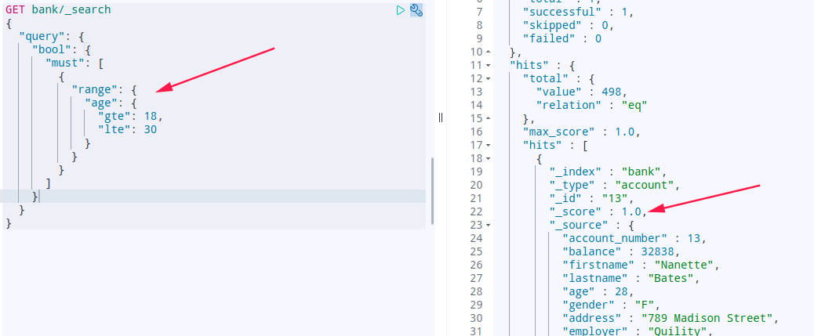

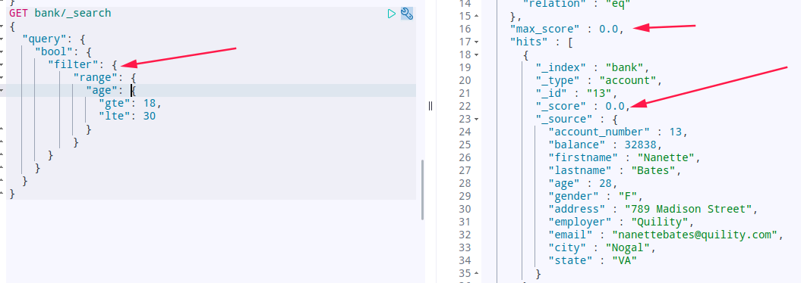

### 8.8 排序（sort）

`sort` 可以让我们按照不同的字段进行排序，并且通过`order`指定排序的方式

GET /atguigu/_search

```json
{
  "query": {
    "match": {
      "title": "小米手机"
    }
  },
  "sort": [
    {
      "price": { "order": "desc" }
    },
    {
      "_score": { "order": "desc"}
    }
  ]
}
```

### 8.9 分页（from/size）

GET /atguigu/_search

```json
{
  "query": {
    "match": {
      "title": "小米手机"
    }
  },
  "from": 2,
  "size": 2
}
```

from：从那一条开始

size：取多少条

### 8.10 高亮（highlight）

发现：高亮的本质是给关键字添加了 `<em>` 标签，在前端再给该标签添加样式即可。

GET /atguigu/_search

```json
{
  "query": {
    "match": {
      "title": "小米"
    }
  },
  "highlight": {
    "fields": {"title": {}}, 
    "pre_tags": "<em>",
    "post_tags": "</em>"
  }
}
```

fields：高亮字段

pre_tags：前置标签

post_tags：后置标签

查询结果如下：

### 8.11 结果过滤（_source）

默认情况下，elasticsearch在搜索的结果中，会把文档中保存在`_source`的所有字段都返回。

如果我们只想获取其中的部分字段，可以添加`_source`的过滤

GET /atguigu/_search

```json
{
  "_source": ["title","price"],
  "query": {
    "term": {
      "price": 2699
    }
  }
}
```

返回结果，只有两个字段：

```json
{
  "took" : 9,
  "timed_out" : false,
  "_shards" : {
    "total" : 2,
    "successful" : 2,
    "skipped" : 0,
    "failed" : 0
  },
  "hits" : {
    "total" : 1,
    "max_score" : 1.0,
    "hits" : [
      {
        "_index" : "atguigu",
        "_type" : "goods",
        "_id" : "9",
        "_score" : 1.0,
        "_source" : {
          "price" : 2699,
          "title" : "vivo手机"
        }
      }
    ]
  }
}
```

## 9 聚合（aggregations）

*搜索address中包含mill的所有人的年龄分布以及平均年龄，但不显示这些人的详情*

GET bank/_search

```json
{
  "query": {
    "match": {
      "address": "mill"
    }
  },
  "aggs": {
    "ageAgg": {
        "terms": {
          "field": "age",
          "size": 10
        } 
    },
    "ageAvg": {
        "avg": {
          "field": "age"
        } 
    },
    "balanceAvg": {
        "avg": {
          "field": "balance"
        } 
    }
  },
  "size": 0
}
```

*按照年龄聚合，并且请求这些年龄段的这些人的平均薪资*

GET bank/_search

```json
{
  "query": {
    "match_all": {}
  },
  "aggs": {
    "ageAgg": {
      "terms": {
        "field": "age",
        "size": 100
      },
      "aggs": {
        "ageAvg": {
          "avg": {
            "field": "balance"
          }
        }
      }
    }
  },
  "size": 0
}
```

*查出所有年龄分布，并且这些年隆段中M的平均薪资和F的平均薪资以及这个年龄段的总体平均薪资*

GET bank/_search

```json
{
  "query": {
    "match_all": {}
  },
  "aggs": {
    "ageAgg": {
      "terms": {
        "field": "age",
        "size": 100
      },
      "aggs": {
        "genderAgg": {
          "terms": {
            "field": "gender.keyword",
            "size": 10
          }, 
          "aggs": {
            "balanceAvg": {
              "avg": {
                "field": "balance"
              }
            }
          }
        },
        "ageAvg": {
          "avg": {
            "field": "balance"
          }
        }
      }
    }
  },
  "size": 1
}
```

聚合可以让我们极其方便的实现对数据的统计、分析。例如：

- 什么品牌的手机最受欢迎？
- 这些手机的平均价格、最高价格、最低价格？
- 这些手机每月的销售情况如何？

实现这些统计功能的比数据库的sql要方便的多，而且查询速度非常快，可以实现实时搜索效果。

### 9.1 基本概念

Elasticsearch中的聚合，包含多种类型，最常用的两种，一个叫`桶`，一个叫`度量`：

**桶（bucket）**

桶的作用，是按照某种方式对数据进行分组，每一组数据在ES中称为一个`桶`，例如我们根据国籍对人划分，可以得到`中国桶`、`英国桶`，`日本桶`
或者我们按照年龄段对人进行划分：`0~10,10~20,20~30,30~40`等。

Elasticsearch中提供的划分桶的方式有很多：

- Date Histogram Aggregation：根据日期阶梯分组，例如给定阶梯为周，会自动每周分为一组
- Histogram Aggregation：根据数值阶梯分组，与日期类似
- Terms Aggregation：根据词条内容分组，词条内容完全匹配的为一组
- Range Aggregation：数值和日期的范围分组，指定开始和结束，然后按段分组

bucket aggregations 只负责对数据进行分组，并不进行计算，因此往往bucket中往往会嵌套另一种聚合：metrics aggregations即度量

**度量（metrics）**

分组完成以后，我们一般会对组中的数据进行聚合运算，例如求平均值、最大、最小、求和等，这些在ES中称为`度量`

比较常用的一些度量聚合方式：

- Avg Aggregation：求平均值
- Max Aggregation：求最大值
- Min Aggregation：求最小值
- Percentiles Aggregation：求百分比
- Stats Aggregation：同时返回avg、max、min、sum、count等
- Sum Aggregation：求和
- Top hits Aggregation：求前几
- Value Count Aggregation：求总数

### 9.2 聚合为桶

首先，我们按照手机的品牌`attr.brand.keyword`来划分`桶`

GET /atguigu/_search

```json
{
    "size" : 0,
    "aggs" : { 
        "brands" : { 
            "terms" : { 
              "field" : "attr.brand.keyword"
            }
        }
    }
}
```

- size： 查询条数，这里设置为0，因为我们不关心搜索到的数据，只关心聚合结果，提高效率
- aggs：声明这是一个聚合查询，是aggregations的缩写
  - brands：给这次聚合起一个名字，任意。
    - terms：划分桶的方式，这里是根据词条划分
      - field：划分桶的字段

结果：

```json
{
  "took" : 124,
  "timed_out" : false,
  "_shards" : {
    "total" : 2,
    "successful" : 2,
    "skipped" : 0,
    "failed" : 0
  },
  "hits" : {
    "total" : 10,
    "max_score" : 0.0,
    "hits" : [ ]
  },
  "aggregations" : {
    "brands" : {
      "doc_count_error_upper_bound" : 0,
      "sum_other_doc_count" : 0,
      "buckets" : [
        {
          "key" : "华为",
          "doc_count" : 4
        },
        {
          "key" : "小米",
          "doc_count" : 4
        },
        {
          "key" : "oppo",
          "doc_count" : 1
        },
        {
          "key" : "vivo",
          "doc_count" : 1
        }
      ]
    }
  }
}
```

- hits：查询结果为空，因为我们设置了size为0
- aggregations：聚合的结果
- brands：我们定义的聚合名称
- buckets：查找到的桶，每个不同的品牌字段值都会形成一个桶
  - key：这个桶对应的品牌字段的值
  - doc_count：这个桶中的文档数量

### 9.3 桶内度量

前面的例子告诉我们每个桶里面的文档数量，这很有用。 但通常，我们的应用需要提供更复杂的文档度量。 例如，每种品牌手机的平均价格是多少？

因此，我们需要告诉Elasticsearch`使用哪个字段`，`使用何种度量方式`进行运算，这些信息要嵌套在`桶`内，`度量`的运算会基于`桶`内的文档进行

现在，我们为刚刚的聚合结果添加 求价格平均值的度量：

GET /atguigu/_search

```json
{
    "size" : 0,
    "aggs" : { 
        "brands" : { 
            "terms" : { 
              "field" : "attr.brand.keyword"
            },
            "aggs":{
                "avg_price": { 
                   "avg": {
                      "field": "price" 
                   }
                }
            }
        }
    }
}
```

- aggs：我们在上一个aggs(brands)中添加新的aggs。可见`度量`也是一个聚合
- avg_price：聚合的名称
- avg：度量的类型，这里是求平均值
- field：度量运算的字段

结果：

```json
{
  "took" : 41,
  "timed_out" : false,
  "_shards" : {
    "total" : 2,
    "successful" : 2,
    "skipped" : 0,
    "failed" : 0
  },
  "hits" : {
    "total" : 10,
    "max_score" : 0.0,
    "hits" : [ ]
  },
  "aggregations" : {
    "brands" : {
      "doc_count_error_upper_bound" : 0,
      "sum_other_doc_count" : 0,
      "buckets" : [
        {
          "key" : "华为",
          "doc_count" : 4,
          "avg_price" : {
            "value" : 3999.0
          }
        },
        {
          "key" : "小米",
          "doc_count" : 4,
          "avg_price" : {
            "value" : 3499.0
          }
        },
        {
          "key" : "oppo",
          "doc_count" : 1,
          "avg_price" : {
            "value" : 2799.0
          }
        },
        {
          "key" : "vivo",
          "doc_count" : 1,
          "avg_price" : {
            "value" : 2699.0
          }
        }
      ]
    }
  }
}

```

可以看到每个桶中都有自己的`avg_price`字段，这是度量聚合的结果

### 9.4 桶内嵌套桶

刚刚的案例中，我们在桶内嵌套度量运算。事实上桶不仅可以嵌套运算， 还可以再嵌套其它桶。也就是说在每个分组中，再分更多组。

比如：我们想统计每个品牌都生产了那些产品，按照`attr.category.keyword`字段再进行分桶

GET /atguigu/_search

```json
{
    "size" : 0,
    "aggs" : { 
        "brands" : { 
            "terms" : { 
              "field" : "attr.brand.keyword"
            },
            "aggs":{
                "avg_price": { 
                   "avg": {
                      "field": "price" 
                   }
                },
                "categorys": {
                  "terms": {
                    "field": "attr.category.keyword"
                  }
                }
            }
        }
    }
}
```

部分结果：

```json
{
  "took" : 19,
  "timed_out" : false,
  "_shards" : {
    "total" : 2,
    "successful" : 2,
    "skipped" : 0,
    "failed" : 0
  },
  "hits" : {
    "total" : 10,
    "max_score" : 0.0,
    "hits" : [ ]
  },
  "aggregations" : {
    "brands" : {
      "doc_count_error_upper_bound" : 0,
      "sum_other_doc_count" : 0,
      "buckets" : [
        {
          "key" : "华为",
          "doc_count" : 4,
          "categorys" : {
            "doc_count_error_upper_bound" : 0,
            "sum_other_doc_count" : 0,
            "buckets" : [
              {
                "key" : "手机",
                "doc_count" : 3
              },
              {
                "key" : "笔记本",
                "doc_count" : 1
              }
            ]
          },
          "avg_price" : {
            "value" : 3999.0
          }
        },
        {
          "key" : "小米",
          "doc_count" : 4,
          "categorys" : {
            "doc_count_error_upper_bound" : 0,
            "sum_other_doc_count" : 0,
            "buckets" : [
              {
                "key" : "手机",
                "doc_count" : 2
              },
              {
                "key" : "电视",
                "doc_count" : 1
              },
              {
                "key" : "笔记本",
                "doc_count" : 1
              }
            ]
          },
          "avg_price" : {
            "value" : 3499.0
          }
        },
        {
          "key" : "oppo",
          "doc_count" : 1,
          "categorys" : {
            "doc_count_error_upper_bound" : 0,
            "sum_other_doc_count" : 0,
            "buckets" : [
              {
                "key" : "手机",
                "doc_count" : 1
              }
            ]
          },
          "avg_price" : {
            "value" : 2799.0
          }
        },
        {
          "key" : "vivo",
          "doc_count" : 1,
          "categorys" : {
            "doc_count_error_upper_bound" : 0,
            "sum_other_doc_count" : 0,
            "buckets" : [
              {
                "key" : "手机",
                "doc_count" : 1
              }
            ]
          },
          "avg_price" : {
            "value" : 2699.0
          }
        }
      ]
    }
  }
}

```

- 我们可以看到，新的聚合`categorys`被嵌套在原来每一个`brands`的桶中。
- 每个品牌下面都根据 `attr.category.keyword`字段进行了分组
- 我们能读取到的信息：
  - 华为有4中产品
  - 华为产品的平均售价是 3999.0美元。
  - 其中3种手机产品，1种笔记本产品

## 10 SpringData-Elasticsearch

### 10.1 介绍

目前市面上有两类客户端

一类是TransportClient 为代表的ES原生客户端，不能执行原生dsl语句必须使用它的Java api方法。

另外一种是以Rest Api为主的missing client，最典型的就是jest。 这种客户端可以直接使用dsl语句拼成的字符串，直接传给服务端，然后返回json字符串再解析。

两种方式各有优劣，但是最近elasticsearch官网，宣布计划在7.0以后的版本中废除TransportClient。以RestClient为主。

由于原生的Elasticsearch客户端API非常麻烦。所以这里直接学习Spring提供的套件：Spring Data Elasticsearch。

**spring-data-Elasticsearch 使用之前,必须先确定版本,elasticsearch 对版本的要求比较高。**

java-API选择：<https://www.elastic.co/guide/en/elasticsearch/client/index.html>

选择：Java REST Client [7.14\]](https://www.elastic.co/guide/en/elasticsearch/client/java-rest/current/index.html) => JavaHighLevelRESTClient [文档](https://www.elastic.co/guide/en/elasticsearch/client/java-rest/current/java-rest-high.html)

### 10.2 创建springboot 项目

创建单独项目 yumall-search

```text
<properties>
    <elasticsearch.version>7.14.0</elasticsearch.version>
</properties>  

<dependency>
     <groupId>org.elasticsearch.client</groupId>
     <artifactId>elasticsearch-rest-high-level-client</artifactId>
     <version>7.14.0</version>
</dependency>

<dependency>
    <groupId>org.springframework.boot</groupId>
    <artifactId>spring-boot-starter-data-elasticsearch</artifactId>
    <exclusions>
        <exclusion>
            <groupId>org.elasticsearch.client</groupId>
            <artifactId>elasticsearch-rest-high-level-client</artifactId>
        </exclusion>
        <exclusion>
            <groupId>org.elasticsearch.client</groupId>
            <artifactId>transport</artifactId>
        </exclusion>
    </exclusions>
</dependency>
<dependency>
    <groupId>org.elasticsearch.client</groupId>
    <artifactId>elasticsearch-rest-high-level-client</artifactId>
    <version>6.8.1</version>
</dependency>
<dependency>
    <groupId>org.elasticsearch.client</groupId>
    <artifactId>transport</artifactId>
    <version>6.8.1</version>
</dependency>
```

加入nacos、common、@EnableDiscoveryClient

```yml
#开启服务发现
spring:
  cloud:
    nacos:
      discovery:
        server-addr: 127.0.0.1:8848
```

### 10.3 ban测试

创建配置类

```java
 //   RestClient builder = RestClient.builder(new HttpHost("192.168.101.5", 9200, "http"));
 //   new RestHighLevelClient(builder);
```

测试

```java
public class Demo {
  @Autowired
  private RestHighLevelClient client;

  @Test
  public void getClientBan() {
    System.out.println(client);//null
  }
}

///Junit4 测试类加上注解，在运行：org.elasticsearch.client.RestHighLevelClient@6f6f65a4
@RunWith(SpringRunner.class)
@SpringBootTest
public class DemoTesst{}

```

### 10.4 测试保存

```java
@SpringBootTest
public class DemoTest {
  @Test
  public void indexData() throws IOException {
    IndexRequest indexRequest = new IndexRequest("users");
    indexRequest.id("1");
//        indexRequest.source("name","xiaoyu","age","19");
    User user = new User();
    user.setName("小华");
    user.setGender("男");
    user.setAge(20);
    String jsonString = JSON.toJSONString(user);
    indexRequest.source(jsonString, XContentType.JSON);//要保存的数据json
    //开始保存
    IndexResponse indexResponse = client.index(indexRequest, ElasticSearchConfig.COMMON_OPTIONS);
    System.out.println("indexResponse = " + indexResponse);
  }
}    
```

### 10.5 测试检索

#### 结构

```text
//1、创建检索请求 SearchRequest > sourceBuilder[添加聚合？] > searchRequest.source(sourceBuilder);
//2、执行结果 SearchResponse=client.search(searchRequest,自定义OPTIONS);
//3、分析结果 searchResponse:getHits获取数据,getAggregations获取聚合
```

#### 实例

```java
public class Demo {
  public void serachData() throws IOException {
    //1、创建检索请求
    SearchRequest searchRequest = new SearchRequest();
    //指定索引
    searchRequest.indices("bank");
    //指定DSL，检索条件
    //SearchSourceBuilder sourceBuilde 封装的条件
    SearchSourceBuilder sourceBuilder = new SearchSourceBuilder();
    //1.1)、构造检索条件
    //sourceBuilder.query();
    //sourceBuilder.from();
    //sourceBuilder.size();
    //sourceBuilder.aggregatipn()
    sourceBuilder.query(QueryBuilders.matchQuery("address", "mill"));

//1.2)、按照年龄的值分布进行聚合
    TermsAggregationBuilder ageAgg = AggregationBuilders.terms("ageAgg").field("age").size(100);
    sourceBuilder.aggregation(ageAgg);

//1.3)、平均薪资
    AvgAggregationBuilder balanceAvg = AggregationBuilders.avg("balanceAvg").field("balance");
    sourceBuilder.aggregation(balanceAvg);

    System.out.println("检索条件：" + sourceBuilder.toString());

    //要检索内容
    searchRequest.source(sourceBuilder);

    //2、执行结果        SearchResponse
    SearchResponse searchResponse = client.search(searchRequest, ElasticSearchConfig.COMMON_OPTIONS);

    //3、分析结果
//        System.out.println("检索结果：" + searchResponse.toString());
//        Map map = JSON.parseObject(searchResponse.toString(), Map.class);
    //3.1)、获取所有数据;
    SearchHits hits = searchResponse.getHits();
    SearchHit[] searchHits = hits.getHits();
    for (SearchHit hit : searchHits) {
            /*
                "_index":"bank",
                "_type":"account",
                "_id":"970",
                "_score":5.4032025,
                "_source":{数据
             */
//            hit.getIndex();hit.getType();hit.getId();
      String string = hit.getSourceAsString();
      Account account = JSON.parseObject(string, Account.class);
      System.out.println("account = " + account);
    }

    //3.2)、获取这次检索到的分析信息;
    Aggregations aggregations = searchResponse.getAggregations();
    for (Aggregation aggregation : aggregations.asList()) {
      System.out.println("当前聚合" + aggregation.getName());
    }
    Terms ageAgg1 = aggregations.get("ageAgg");
    for (Terms.Bucket bucket : ageAgg1.getBuckets()) {
      String keyAsString = bucket.getKeyAsString();
      System.out.println("年龄: " + keyAsString + "==>" + bucket.getDocCount());
    }
  }
}
```

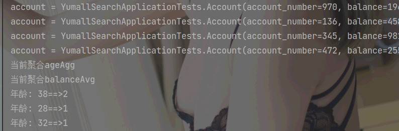

### 10.6 创建module

在application.properties中添加配置

```properties
spring.elasticsearch.rest.uris=http://172.16.116.100:9200
# 集群情况下
spring.elasticsearch.rest.uris[0]=http://172.16.116.100:9200
spring.elasticsearch.rest.uris[1]=http://172.16.116.100:9200
```

### 10.7 实体类

```java
@Data
@AllArgsConstructor
@NoArgsConstructor
@Document(indexName = "user", type = "info", shards = 3, replicas = 2)
public class User {
    @Id
    private Long id;
    @Field(type = FieldType.Text, analyzer = "ik_max_word")
    private String name;
    @Field(type = FieldType.Integer)
    private Integer age;
    @Field(type = FieldType.Keyword)
    private String password;
}
```

Spring Data通过注解来声明字段的映射属性，有下面的三个注解：

- `@Document` 作用在类，标记实体类为文档对象，一般有四个属性
  - indexName：对应索引库名称
  - type：对应在索引库中的类型
  - shards：分片数量，默认5
  - replicas：副本数量，默认1
- `@Id` 作用在成员变量，标记一个字段作为id主键
- `@Field` 作用在成员变量，标记为文档的字段，并指定字段映射属性：
  - type：字段类型，取值是枚举：FieldType
  - index：是否索引，布尔类型，默认是true
  - store：是否存储，布尔类型，默认是false
  - analyzer：分词器名称：ik_max_word

### 10.8 创建索引及映射

```java
@SpringBootTest
class EsDemoApplicationTests {

    // ElasticsearchTemplate 是 TransportClient 客户端
    // ElasticsearchRestTemplate 是 RestHighLevel 客户端
    @Autowired
    ElasticsearchRestTemplate restTemplate;

    @Test
    void contextLoads() {
        // 创建索引
        this.restTemplate.createIndex(User.class);
        // 创建映射
        this.restTemplate.putMapping(User.class);
        // 删除索引
        // this.restTemplate.deleteIndex("user");
    }

}
```

### 10.9 Repository文档操作

Spring Data 的强大之处，就在于你不用写任何DAO处理，自动根据方法名或类的信息进行CRUD操作。只要你定义一个接口，然后继承Repository提供的一些子接口，就能具备各种基本的CRUD功能。

其中ElasticsearchRepository接口功能最强大。该接口的方法包括：

#### 10.9.1 新增

```java
public class Demo {
  @Autowired
  UserRepository userRepository;

  @Test
  void testAdd() {
    this.userRepository.save(new User(1l, "zhang3", 20, "123456"));
  }
}
```

修改和新增是同一个接口，区分的依据就是id，这一点跟我们在页面发起PUT请求是类似的。

#### 10.9.2 删除

```java
public class Demo {
  @Test
  void testDelete() {
    this.userRepository.deleteById(1l);
  }
}
```

### 10.10 查询

#### 10.10.1 基本查询

查询一个：

```java
public class Demo {
  @Test
  void testFind() {
    System.out.println(this.userRepository.findById(1l).get());
  }
}
```

#### 10.10.2 条件查询

Spring Data 的另一个强大功能，是根据方法名称自动实现功能。

比如：你的方法名叫做：findByTitle，那么它就知道你是根据title查询，然后自动帮你完成，无需写实现类。

当然，方法名称要符合一定的约定：

| Keyword               | Sample                                     | Elasticsearch Query String                                                                                             |
|-----------------------|--------------------------------------------|------------------------------------------------------------------------------------------------------------------------|
| `And`                 | `findByNameAndPrice`                       | `{"bool" : {"must" : [ {"field" : {"name" : "?"}}, {"field" : {"price" : "?"}} ]}}`                                    |
| `Or`                  | `findByNameOrPrice`                        | `{"bool" : {"should" : [ {"field" : {"name" : "?"}}, {"field" : {"price" : "?"}} ]}}`                                  |
| `Is`                  | `findByName`                               | `{"bool" : {"must" : {"field" : {"name" : "?"}}}}`                                                                     |
| `Not`                 | `findByNameNot`                            | `{"bool" : {"must_not" : {"field" : {"name" : "?"}}}}`                                                                 |
| `Between`             | `findByPriceBetween`                       | `{"bool" : {"must" : {"range" : {"price" : {"from" : ?,"to" : ?,"include_lower" : true,"include_upper" : true}}}}}`    |
| `LessThanEqual`       | `findByPriceLessThan`                      | `{"bool" : {"must" : {"range" : {"price" : {"from" : null,"to" : ?,"include_lower" : true,"include_upper" : true}}}}}` |
| `GreaterThanEqual`    | `findByPriceGreaterThan`                   | `{"bool" : {"must" : {"range" : {"price" : {"from" : ?,"to" : null,"include_lower" : true,"include_upper" : true}}}}}` |
| `Before`              | `findByPriceBefore`                        | `{"bool" : {"must" : {"range" : {"price" : {"from" : null,"to" : ?,"include_lower" : true,"include_upper" : true}}}}}` |
| `After`               | `findByPriceAfter`                         | `{"bool" : {"must" : {"range" : {"price" : {"from" : ?,"to" : null,"include_lower" : true,"include_upper" : true}}}}}` |
| `Like`                | `findByNameLike`                           | `{"bool" : {"must" : {"field" : {"name" : {"query" : "?*","analyze_wildcard" : true}}}}}`                              |
| `StartingWith`        | `findByNameStartingWith`                   | `{"bool" : {"must" : {"field" : {"name" : {"query" : "?*","analyze_wildcard" : true}}}}}`                              |
| `EndingWith`          | `findByNameEndingWith`                     | `{"bool" : {"must" : {"field" : {"name" : {"query" : "*?","analyze_wildcard" : true}}}}}`                              |
| `Contains/Containing` | `findByNameContaining`                     | `{"bool" : {"must" : {"field" : {"name" : {"query" : "**?**","analyze_wildcard" : true}}}}}`                           |
| `In`                  | `findByNameIn(Collection<String>names)`    | `{"bool" : {"must" : {"bool" : {"should" : [ {"field" : {"name" : "?"}}, {"field" : {"name" : "?"}} ]}}}}`             |
| `NotIn`               | `findByNameNotIn(Collection<String>names)` | `{"bool" : {"must_not" : {"bool" : {"should" : {"field" : {"name" : "?"}}}}}}`                                         |
| `Near`                | `findByStoreNear`                          | `Not Supported Yet !`                                                                                                  |
| `True`                | `findByAvailableTrue`                      | `{"bool" : {"must" : {"field" : {"available" : true}}}}`                                                               |
| `False`               | `findByAvailableFalse`                     | `{"bool" : {"must" : {"field" : {"available" : false}}}}`                                                              |
| `OrderBy`             | `findByAvailableTrueOrderByNameDesc`       | `{"sort" : [{ "name" : {"order" : "desc"} }],"bool" : {"must" : {"field" : {"available" : true}}}}`                    |

准备一组数据：

```java
public class Demo {
  @Test
  void testAddAll() {
    List<User> users = new ArrayList<>();
    users.add(new User(1l, "柳岩", 18, "123456"));
    users.add(new User(2l, "范冰冰", 19, "123456"));
    users.add(new User(3l, "李冰冰", 20, "123456"));
    users.add(new User(4l, "锋哥", 21, "123456"));
    users.add(new User(5l, "小鹿", 22, "123456"));
    users.add(new User(6l, "韩红", 23, "123456"));
    this.userRepository.saveAll(users);
  }
}
```

在UserRepository中定义一个方法：

第一种写法：

```java
public interface UserRepository extends ElasticsearchRepository<User, Long> {

    /**
     * 根据年龄区间查询
     * @param age1
     * @param age2
     * @return
     */
    List<User> findByAgeBetween(Integer age1, Integer age2);
}
```

测试：

```java
public class Demo {
  @Test
  void testFindByAgeBetween() {
    System.out.println(this.userRepository.findByAgeBetween(20, 30));
  }
}
```

第二种写法：

```java
public interface Demo {
  @Query("{\n" +
          "    \"range\": {\n" +
          "      \"age\": {\n" +
          "        \"gte\": \"?0\",\n" +
          "        \"lte\": \"?1\"\n" +
          "      }\n" +
          "    }\n" +
          "  }")
  List<User> findByQuery(Integer age1, Integer age2);
}
```

测试：

```java
public class Demo {
  @Test
  void testFindByQuery() {
    System.out.println(this.userRepository.findByQuery(20, 30));
  }
}
```

#### 10.10.3 自定义查询

```java
public class Demo {
  @Test
  public void testNative() {
    // 初始化自定义查询对象
    NativeSearchQueryBuilder queryBuilder = new NativeSearchQueryBuilder();
    // 构建查询
    queryBuilder.withQuery(QueryBuilders.matchQuery("name", "冰冰"));
    // 排序
    queryBuilder.withSort(SortBuilders.fieldSort("age").order(SortOrder.ASC));
    // 分页
    queryBuilder.withPageable(PageRequest.of(0, 2));
    // 高亮
    queryBuilder.withHighlightBuilder(new HighlightBuilder().field("name").preTags("<em>").postTags("</em>"));
    // 执行查询，获取分页结果集
    Page<User> userPage = this.userRepository.search(queryBuilder.build());
    // 总页数
    System.out.println(userPage.getTotalPages());
    // 总记录数
    System.out.println(userPage.getTotalElements());
    // 当前页数据
    System.out.println(userPage.getContent());
  }
}
```

NativeSearchQueryBuilder：Spring提供的一个查询条件构建器，帮助构建json格式的请求体

`Page<item>`：默认是分页查询，因此返回的是一个分页的结果对象，包含属性：

- totalElements：总条数
- totalPages：总页数
- Iterator：迭代器，本身实现了Iterator接口，因此可直接迭代得到当前页的数据
