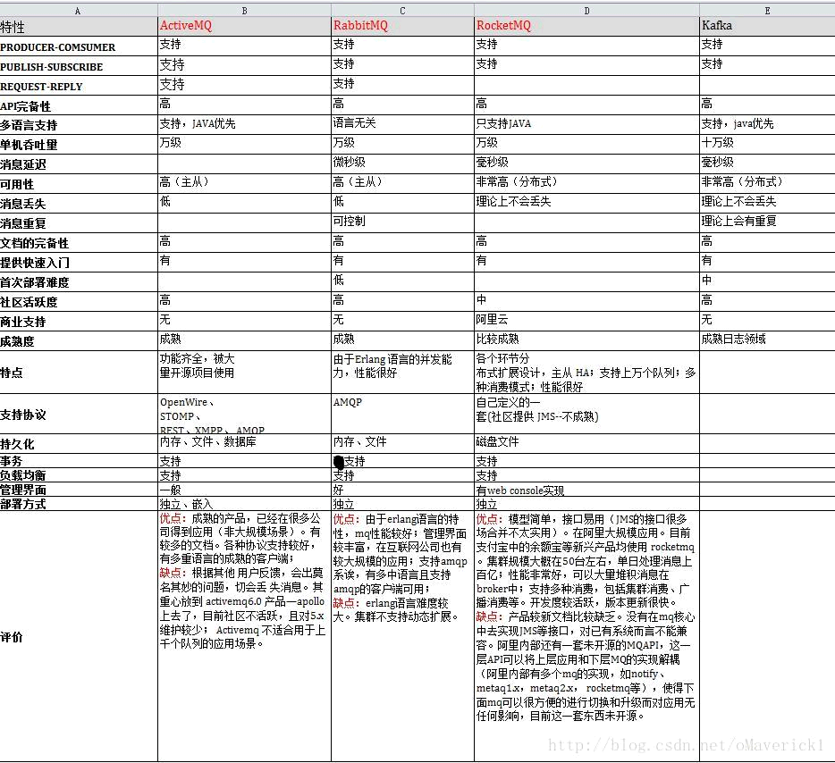

## 总览

## 概念定义

**Producer** 消息生产者

​  **Producer Group** 生产者组，简单来说就是多个发送同一类消息的生产者称之为一个生产者组。在这里可以不用关心，只要知道有这么一个概念即可。

**Consumer** 消息消费者，简单来说，消费 MQ 上的消息的应用程序就是消费者，至于消息是否进行逻辑处理，还是直接存储到数据库等取决于业务需要。

​  **Consumer Group** 消费者组

**Topic** 是一种消息的逻辑分类，比如说你有订单类的消息，也有库存类的消息，那么就需要进行分类，一个是订单Topic 存放订单相关的消息，一个是库存 Topic 存储库存相关的消息。

**Message** 是消息的载体。必须指定 topic，相当于寄信的地址。可选的 tag，以便消费端可以基于 tag 进行过滤消息。也可以添加额外的键值对，例如你需要一个业务 key 来查找 broker 上的消息，方便在开发过程中诊断问题。

**Tag** 标签可以被认为是对 Topic 进一步细化。一般在相同业务模块中通过引入标签来标记不同用途的消息。

**Broker** 接收来自生产者的消息，储存以及为消费者拉取消息的请求做好准备。

**Name Server** 为 producer 和 consumer 提供路由信息。

## 场景应用：解耦，流量控制

1.大多应用中，可通过消息服务中间件来提升系统 **异步通信**、**扩展解耦能力**
