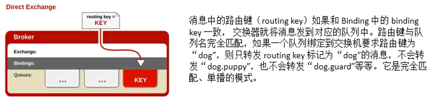

RabbitMQ消息中间件

<!-- more -->

# RabbitMQ

<https://www.rabbitmq.com/>

## 1、简介、安装配置

### 1.1、简介

2.消息服务中两个重要概念:

**消息代理(message broker)和目的地(destination)**：当消息发送者发送消息以后，将由消息代理接管，消息代理保证消息传递到指定目的地。

3.消息队列主要有两种形式的目的地:

**队列(queue)** : 点对点消息通信(point-to-point)

**主题(topic)** : 发布(publish)  / 订阅(subscribe) 消息通信

4.点对点式

：消息发送者发送消息，消息代理将其放入1个队列中，消息接收者从队列中获取消息内容,消息读取后被移出队列。

：消息只有唯一的发送者和接受者,但并不是说只能有一个接收者

5.发布订阅式

：发送者(发布者)发送消息到主题，多个接收者(订阅者)监听(订阅)这个主题，那么就会在消息到达时同时收到消息

6.JMS (Java Message Service) JAVA消息服务

：基于JVM消息代理的规范。ActiveMQ、 HornetMQ是JMS实现

7.AMQP (Advanced Message Queuing Protocol)

：高级消息队列协议，也是一个消息代理的规范，兼容JMS

：RabbitMQ是AMQP的实现

8.Spring 支持

```
-spring-jms提供了对JMS的支持
-spring-rabbit提供了对AMQP的支持
-需要ConnectionFactory的实现来连接消息代理
-提供JmsTemplate、RabbitTemplate来发送消息
-@JmsListener (JMS) 、@RabbitListener (AMQP) 注解在方法上监听消息代理发布的消息
-@EnableJms、 @EnableRabbit 开启支持
```

9.Spring Boot自动配置

> -JmsAutoConfiguration
>
> -RabbitAutoConfiguration

### 1.2、概念

Publisher、message、虚拟机VHost、broker、Exchange、binding、Queue、Connection(长连接)、Consumer


### 1.3、docker 安装

<https://www.rabbitmq.com/networking.html>

```bash
dkpull rabbitmq:management(默认最新)
dkpull rabbitmq:3.8.23-management
dkpull rabbitmq:3.9.7-management

docker run -d --name rabbitmq3.8.23 -p 5671:5671 -p 5672:5672 -p 4369:4369 -p 25672:25672 -p 15672:15672 rabbitmq:3.8.23-management
docker update rabbitmq3.8.23 --restart=always

docker run -d --name rabbitmq3.8.23 -p 5671:5671 -p 5672:5672 -p 4369:4369 -p 25672:25672 -p 15672:15672 rabbitmq:3.8.23-management

4369, 25672 (Erlang发现&集群端口)
5672, 5671 (AMQP端口)
15672 (web管理后台端口)
61613, 61614 (STOMP协议端口)
1883, 8883 (MQTT协议端口)
```

<http://localhost:15672/#/> 密码：默认（user：guest；pass：guest）


### 1.4、运行机制


### 1.5、Exchange类型：点对点（direct、header）、订阅（fanout、topic）


目前用：direct、fanout、topid

#### direct 点对点，精准匹配（完全匹配、单播模式）



#### fanout 订阅：广播模式


#### topic 订阅：订阅模式


### 1.6、测试：创建交换机、队列、绑定 binding

#### 创建交换机


---

#### 创建队列


#### 绑定binding


### 1.7、实例


#### 创建 交换机

exchange.direct、exchange.fanout、exchange.topic


#### 创建 消息队列

队列: kong、kong.emps、kong.news、kong004.news


#### direct 绑定 binding

exchange.direct: -> kong、kong.emps、kong.news、kong004.news

##### 发消息


##### 读消息


---

Ack Mode（确认模式：）: Nack message requeue true（Nack 消息重新排队，true查看后不会清除消息队列，false反之）Automatic ack（自动确认）、Reject requeue true|false（拒绝重新排队，true查看后不会清除消息队列，false反之）、

#### fanout 绑定 binding

exchange.fanout: -> kong、kong.emps、kong.news、kong004.news

##### 发消息


##### 读消息


#### topic 绑定 binding

exchange.topic: -> kong、kong.emps、kong.news、kong004.news


##### 发消息


##### 读消息


## 2、整合java

### 2.1、配置 \<a name="配置">


```xml
<!-- https://mvnrepository.com/artifact/org.springframework.boot/spring-boot-starter-amqp -->
        <!-- rabbitMQ 管理-->
        <dependency>
            <groupId>org.springframework.boot</groupId>
            <artifactId>spring-boot-starter-amqp</artifactId>
            <version>2.7.1</version>
        </dependency>
        <!--dependency>
            <groupId>com.rabbitmq</groupId>
            <artifactId>amqp-client</artifactId>
            <version>5.14.2</version>
        </dependency>-->
```

```properties
# RabbitMQ配置
spring.rabbitmq.host=192.168.100.4
spring.rabbitmq.port=5672
# 虚拟主机配置
spring.rabbitmq.virtual-host=/
# 开启发送端消息抵达Broker确认
spring.rabbitmq.publisher-confirms=true
# 开启发送端消息抵达Queue确认
spring.rabbitmq.publisher-returns=true
# 只要消息抵达Queue，就会异步发送优先回调returnfirm
spring.rabbitmq.template.mandatory=true
# 手动ack消息，不使用默认的消费端确认
spring.rabbitmq.listener.simple.acknowledge-mode=manual

spring: 
  rabbitmq:
    host: localhost
    port: 5672
    username: guest
    password: guest
    # 虚拟主机配置
    virtual-host: /
    # 开启发送端消息抵达Broker确认类型【simple、correlated、none】
    publisher-confirm-type: simple
    # 开启发送端消息抵达Queue确认
    publisher-returns: true
    # 只要消息抵达Queue，就会异步发送优先回调 returnfirm
    template:
      mandatory: true
    # 手动ack消息，不使用默认的消费端确认
    listener:
      simple:
        acknowledge-mode: manual
```

```java
package cn.jf.system.config;

import lombok.extern.slf4j.Slf4j;
import org.springframework.amqp.core.ReturnedMessage;
import org.springframework.amqp.rabbit.connection.CorrelationData;
import org.springframework.amqp.rabbit.core.RabbitTemplate;
import org.springframework.amqp.support.converter.Jackson2JsonMessageConverter;
import org.springframework.amqp.support.converter.MessageConverter;
import org.springframework.beans.factory.annotation.Autowired;
import org.springframework.context.annotation.Bean;
import org.springframework.context.annotation.Configuration;

import javax.annotation.PostConstruct;

/**
 * RabbitMQ配置类
 *
 * @author jf
 * @version 1.0
 * @Description 描述
 * @date 2022/07/05 15:47
 */
@Slf4j
@Configuration
public class MyRabbitMQConfig {

    @Autowired
//    @Qualifier("redisTemplate")
    private RabbitTemplate rabbitTemplate;

//    @Primary
//    @Bean(name = "rabbitTemplate")
//    public RabbitTemplate rabbitTemplate(ConnectionFactory connectionFactory) {
//        RabbitTemplate rabbitTemplate = new RabbitTemplate(connectionFactory);
//        rabbitTemplate.setMessageConverter(messageConverter());
//        initRabbitTemplate();
//        return rabbitTemplate;
//    }

    @Bean
    public MessageConverter messageConverter() {
        return new Jackson2JsonMessageConverter();
    }

    /**
     * 定制RabbitTemplate<p>
     * -@PostConstruct： MyRabbitMQConfig 对象创建完成以后，执行这个方法<p>
     * 1、服务收到消息就会回调<p>
     * ---- spring.rabbitmq.publisher-confirms: true<p>
     * ---- 设置确认回调 setConfirmCallback<p>
     * 2、消息正确抵达队列就会进行回调<p>
     * ---- spring.rabbitmq.publisher-returns: true<p>
     * ---- spring.rabbitmq.template.mandatory: true<p>
     * ---- 设置确认回调ReturnCallback<p>
     * <p>
     * 3、消费端确认(保证每个消息都被正确消费，此时才可以broker删除这个消息)<p>
     * ---- 默认是自动确认的，只要消息接收到，客户端会自动确认，服务端就会移除这个消息<p>
     * -------- 问题： 在处理信息时宕机了，会把所有的消息确认了，<p>
     * -------- 解决：需要手动确认信息，手动ack消息，不使用默认的消费端确认 spring.rabbitmq.listener.simple.acknowledge-mode=manual<p>
     * ---- 签收了货物 channel.basicAck(deliveryTag, false);拒绝签收货物channel.basicNack(deliveryTag, false, false);<p>
     */
    @PostConstruct
    public void initRabbitTemplate() {
        /*
         * 设置确认回调
         * 1、只要消息抵达Broker就ack=true
         * correlationData：当前消息的唯一关联数据(这个是消息的唯一id)
         * ack：消息是否成功收到
         * cause：失败的原因
         */
        rabbitTemplate.setConfirmCallback(new RabbitTemplate.ConfirmCallback() {
            @Override
            public void confirm(CorrelationData correlationData, boolean ack, String cause) {
                log.info("confirm." + correlationData + "==>ack:[" + ack + "]==>errorMsg:[" + cause + "]");
            }
        });
        /*
         * 只要消息没有投递给指定的队列，就触发这个失败回调
         * message：投递失败的消息详细信息
         * replyCode：回复的状态码
         * replyText：回复的文本内容
         * exchange：当时这个消息发给哪个交换机
         * routingKey：当时这个消息用哪个路由键
         */
        rabbitTemplate.setReturnsCallback(new RabbitTemplate.ReturnsCallback() {
            @Override
            public void returnedMessage(ReturnedMessage returned) {
                log.error("==>errorMsg[" + returned.getMessage() + "] ==>code[" + returned.getReplyCode() + "]" +
                        "==>text[" + returned.getReplyText() + "] ==>exchange[" + returned.getExchange() + "] ==>routingKey[" + returned.getRoutingKey() + "].\r\n");
            }
        });
    }
}
```

启动类开始RabbitMQ

@EnableRabbit

### 2.2 amqpAdmin 管理组件

private AmqpAdmin amqpAdmin;

#### 创建交换机、创建队列、绑定binding

```java
//创建交换机：
Exchange directExchange = new DirectExchange("hello-java-exchange", true, false);
amqpAdmin.declareExchange(directExchange);
//创建队列：
Queue queue = new Queue("hello-java-queue", true, false, false);
amqpAdmin.declareQueue(queue);
//绑定binding：
Binding binding = new Binding("hello-java-queue",
    Binding.DestinationType.QUEUE,
    "hello-java-exchange",
    "hello.java",
    null);
amqpAdmin.declareBinding(binding);
```

### 2.3 RabbitTemplate 消息

private RabbitTemplate rabbitTemplate;

#### 发消息

```java
public void sendMessageTest(){
   OrderReturnReasonEntity reasonEntity = new OrderReturnReasonEntity();
   reasonEntity.setId(1L);
   reasonEntity.setCreateTime(new Date());
   reasonEntity.setName("reason");
   reasonEntity.setStatus(1);
   reasonEntity.setSort(2);
   String msg = "Hello World";
    
   //1、发送消息,如果发送的消息是个对象，会使用序列化机制，将对象写出去，对象必须实现Serializable接口
   //2、发送的对象类型的消息，可以是一个json
   rabbitTemplate.convertAndSend("hello-java-exchange", "hello.java",
         reasonEntity, new CorrelationData(UUID.randomUUID().toString()));
   log.info("消息发送完成:{}", reasonEntity);
}
```

#### 监听队列

**注意**：*同一个消息，只能有一个客户端收到；只有一个消息完全处理完，方法运行结束，我们就可以接收到下一个消息*

#### @RabbitListener 作用在类+方法上 (监听哪些队列即可）

```java
/**
     * queues：声明需要监听的队列<p>
     * Channel：当前传输数据的通道<p>
     * message：原生消息信息（包含信息头+消息体）<p>
     * content：信息具体内容<p>
     * <p>
     * -@RabbitListener 类+方法上 (监听哪些队列即可）<p>
     * -@RabbitHandler: 标在方法上(重载区分不同的消息)<p>
     * --- 使用`RabbitHandler`时，把`RabbitListener`添加在类上监听
     */
 @RabbitListener(queues = {"hello-java-queue"})
 public void revieveMessage(Message message, OrderReturnReasonEntity content, Channel channel) throws InterruptedException{
  System.out.println("原生消息信息--"+message+"\r\n===内容："+content);
  System.out.println("----OrderReturnReasonEntity 消息处理完成----");
 }
```

#### @RabbitHandler 仅作用在方法（重载区分不同的消息）与`RabbitListener-写于类上` 一同使用

如何区分不同的消息的：通过方法第一个参数类型来判断

```java
@RabbitListener(queues = "demo.release.order.queue")
@Component
public class DemoListener {
    
    @RabbitHandler
    public void revieveMessage02(MqEntity content, Channel channel, Message message) {
        log.error("RabbitHandler---revieveMessage02() to MqEntity.class");
    }
    @RabbitHandler
    public void revieveMessage02(SysConfig content, Channel channel, Message message) {
        log.error("RabbitHandler---revieveMessage02() to SysConfig.class");
    }
}    
```

<http://localhost:8200/order/order/sendMQ>

```java
@RequestMapping("sendMQ")
 public String sendMessage(@RequestParam(value = "num", defaultValue = "10") Integer num){
  for(int i = 0; i < num; i++){
   if(i%2 == 0){
    OrderReturnReasonEntity reasonEntity = new OrderReturnReasonEntity();
    reasonEntity.setName("--OrderReturnReasonEntity--"+i);
    rabbitTemplate.convertAndSend("hello-java-exchange", "hello-java-queue.java",
      reasonEntity, new CorrelationData(UUID.randomUUID().toString()));
   }else{
    OrderEntity orderEntity = new OrderEntity();
    orderEntity.setOrderSn(UUID.randomUUID().toString());
    orderEntity.setReceiverName("--OrderEntity--"+i);
    rabbitTemplate.convertAndSend("hello-java-exchange", "hello-java-queue.java",
      orderEntity, new CorrelationData(UUID.randomUUID().toString()));
   }
  }
  return "消息发送完成";
 }

@RabbitHandler
public void revieveMessage02(OrderReturnReasonEntity content){
   System.out.println("原生消息信息--"+content);
   System.err.println("----OrderReturnReasonEntity 消息处理完成----");
}

@RabbitHandler
public void revieveMessage03(OrderEntity content){
   System.out.println("原生消息信息--"+content);
   System.err.println("----OrderEntity 消息处理完成----");
}
```

## 3、投递消息-安全到达


<https://www.rabbitmq.com/reliability.html>


[请看2.1 配置]()

### 3.1、发送端确认

[请看2.1 配置config]()：setConfirmCallback、setReturnCallback

### 3.2、消费端确认

```
3、消费端确认(保证每个消息都被正确消费，此时才可以broker删除这个消息)<p>
---- 默认是自动确认的，只要消息接收到，客户端会自动确认，服务端就会移除这个消息
-------- 问题： 在处理信息时宕机了，会把所有的消息确认了，
-------- 解决：需要手动确认信息，手动ack消息，不使用默认的消费端确认spring.rabbitmq.listener.simple.acknowledge-mode=manual
---- 签收了货物 channel.basicAck(deliveryTag, false);拒绝签收货物channel.basicNack(deliveryTag, false, false);
```


```java
@RabbitHandler
public void revieveMessage02(Message message, OrderReturnReasonEntity content, Channel channel){
   System.out.println("原生消息信息--"+content);
   long deliveryTag = message.getMessageProperties().getDeliveryTag();
   //签收货物,非批量模式
   try{
      if(deliveryTag%2 == 0){
         //收货
         channel.basicAck(deliveryTag, false);
         System.out.println("签收了货物... "+deliveryTag);
      }else{
         //退货requeue=false 丢弃requeue=true 发回服务器，服务器重新入队。
         //long deliveryTag, boolean multiple, boolean requeue
         channel.basicNack(deliveryTag, false, false);
         //Long deliveryTag, boolean requeue
         //channel.basicReject();
         System.out.println("没有签收了货物..."+deliveryTag);
      }
   }catch(Exception e){
      //网络中断
   }

   System.err.println("----OrderReturnReasonEntity 消息处理完成----");
}
```

## 4、MQ延迟队列

### 4.1、使用场景

场景:
 比如未付款订单，超过一定时间后，系统自动取消订单并释放占有物品。

常用解决方案:
 spring的schedule *定时任务* 轮询数据库
  缺点：消耗系统内存、增加了数据库的压力、存在较大的时间误差
解决：rabbitmq的消息 TTL 和死信 Exchange 结合


### 4.2、时效性问题


### 4.3、TTL（消息的存活时间）和死信 Exchange

```bash
#·消息的TTL就是消息的存活时间。
#·RabbitMQ可以对队列和消息分别设置TTL：
    #-对队列设置就是队列没有消费者连着的保留时间，也可以对每一个单独的消息做单独的设置。超过了这个时间，我们认为这个消息就死了，称之为死信。
    #- 如果队列设置了，消息也设置了,那么会取小的。所以一个消息如果被路由到不同的队列中，这个消息死亡的时间有可能不一-样(不同的队列设置)。这里单讲单个消息的TTL,因为它才是实现延迟任务的关键。可以通过设置消息的expiration字段或者x-message-ttI属性来设置时间，两者是一样的效果。

```

### 4.4、延迟队列实现

#### - - 设置 队列 过期时间

设计建议规范：（基于事件模型的交换机设计）
 1、交换机命名：业务+ exchange; 交换机为Topic
 2、路由键：事件+需要感知的业务(可以不写)
 3、队列命名：事件+想要监听服务名+ queue
 4、绑定关系：事件+感知的业务(#)


1


```java
/**
 * 死信队列
 * <p>
 * 对队列设置过期，而不是对消息设置过期
 *
 * @return
 */
@Bean
public Queue orderDelayQueue(){
  HashMap<String, Object> arguments = new HashMap<>();
  arguments.put("x-dead-letter-exchange", "order-event-exchange");
  arguments.put("x-dead-letter-routing-key", "order.release.order");
  // 消息过期时间 1分钟
  arguments.put("x-message-ttl", 60000);
  //消息过期后丢到order.delay.queue队列，而不是删除
  return new Queue("order.delay.queue", true, false, false, arguments);
}
```

#### - - 设置 消息 过期时间


#### - - 创建业务交换机&队列

## 5、模拟订单超时自动关闭订单及释放库存

### springBean自动创建交换机、队列（订单超时-死信队列）、绑定

```java
package cn.jf.system.config;

import org.springframework.amqp.core.*;
import org.springframework.context.annotation.Bean;
import org.springframework.context.annotation.Configuration;

import java.util.HashMap;

/**
 * 自动创建 Exchange类型：点对点（direct：精准匹配（完全匹配、单播模式）、header）、订阅（fanout：广播模式、topic：路由键模式）、队列、绑定<br/>
 * <p>
 * -- new Exchange (字符串名称、布尔持久型、布尔型自动删除、参数);<br/><p>
 * ---- String name, boolean durable, boolean autoDelete, Map< String, Object> arguments<br/><p>
 * -- new Queue(队列名字, 是否持久化, 是否独占, 是否自动删除, 参数);<br/><p>
 * ---- name - 队列的名称 - 不能为空；设置为 "" 让代理生成名称。<br/>
 * ---- durable - 持久 - 如果我们声明一个持久队列，则为真（该队列将在服务器重新启动后继续存在）<br/>
 * ---- exclusive - 独占 - 如果我们声明一个独占队列，则为真（该队列将仅由声明者的连接使用）<br/>
 * ---- autoDelete – 如果服务器在不再使用队列时应该删除队列，则为 true<br/>
 * ---- arguments - 用于声明队列的参数<br/>
 * <p>
 * 容器中的Queue、Exchange、Binding 会自动创建（在RabbitMQ）不存在的情况下<br/>
 *
 * @author jf
 * @version 1.0
 * @Description 描述
 * @date 2022/07/05 15:47
 */
@Configuration
public class MyAutoBeanMQConfig {
//////////////////////////////交换机///

    /**
     * 创建 Topic 类型的Exchange
     *
     * @return
     */
    @Bean
    public Exchange demoEventTopicExchange() {
        return new TopicExchange("demo-topic-exchange", true, false);
    }

//////////////////////////////消息队列///

    /*
     * 死信队列
     * <p>
     * 对队列设置过期，而不是对消息设置过期
     * <p>
     * 设计建议规范：（基于事件模型的交换机设计）<p>
     * 1、交换机命名：业务+ exchange; 交换机为Topic<p>
     * 2、路由键：事件+需要感知的业务(可以不写)<p>
     * 3、队列命名：事件+想要监听服务名+ queue<p>
     * 4、绑定关系：事件+感知的业务(#)<p>
     */

    /**
     * 订单延迟队列
     *
     * @return
     */
    @Bean
    public Queue demoDelayQueue() {
        HashMap<String, Object> arguments = new HashMap<>();
        arguments.put("x-dead-letter-exchange", "demo-topic-exchange");
        arguments.put("x-dead-letter-routing-key", "demo.release.order");
        // 消息过期时间 单位（毫秒）测试以1分钟为例
        arguments.put("x-message-ttl", 60000);
        //消息过期后丢到demo.delay.queue队列，而不是删除
        return new Queue("demo.delay.queue", true, false, false, arguments);
    }

    /**
     * 释放订单队列
     *
     * @return
     */
    @Bean
    public Queue demoReleaseQueue() {
        return new Queue("demo.release.order.queue", true, false, false);
    }

    /**
     * 释放库存队列
     *
     * @return
     */
    @Bean
    public Queue stockReleaseQueue() {
        return new Queue("demo.release.stock.queue", true, false, false);
    }

//////////////////////////////绑定

    /**
     * 绑定订单延迟队列
     * <p>
     * 消息队列：demo.delay.queue --> 交换机：demo-topic-exchange --路由键：demo.create.order
     *
     * @return
     */
    @Bean
    public Binding demoCreateBinding() {
        return new Binding("demo.delay.queue",
                Binding.DestinationType.QUEUE,
                "demo-topic-exchange",
                "demo.create.order",
                null);
    }

    /**
     * 绑定释放订单队列
     * <p>
     * 消息队列：demo.release.order.queue --> 交换机：demo-topic-exchange --路由键：demo.release.order
     */
    @Bean
    public Binding demoReleaseBinding() {
        return new Binding("demo.release.order.queue",
                Binding.DestinationType.QUEUE,
                "demo-topic-exchange",
                "demo.release.order.#",
                null);
    }

    /**
     * 订单释放直接和库存释放进行绑定
     */
    @Bean
    public Binding demoReleaseOtherBinding() {
        return new Binding("demo.release.stock.queue",
                Binding.DestinationType.QUEUE,
                "demo-topic-exchange",
                "demo.release.stock.#",
                null);
    }

}
```

### 模拟创建订单

```java
@Autowired
private RabbitTemplate rabbitTemplate;

/**
 * 创建订单消息
 */
@GetMapping("/sendOrderMessage")
public R sendOrderMessage() {
    for (int i = 1; i < 4; i++) {
        MqEntity mqEntity = new MqEntity();
        mqEntity.setExchange("demo-topic-exchange");
        mqEntity.setMessage("订单id--" + i);
        rabbitTemplate.convertAndSend(mqEntity.getExchange(), "demo.create.order",
                mqEntity, new CorrelationData(UUID.randomUUID().toString()));
    }
    return R.success("创建订单消息发送完成");
}
```

### 监听到订单超时了，开始业务处理，并通知释放库存队列

```java
package cn.jf.system.listener;

import cn.jf.system.entity.MqEntity;
import com.rabbitmq.client.Channel;
import lombok.extern.slf4j.Slf4j;
import org.springframework.amqp.core.Message;
import org.springframework.amqp.rabbit.annotation.RabbitHandler;
import org.springframework.amqp.rabbit.annotation.RabbitListener;
import org.springframework.amqp.rabbit.core.RabbitTemplate;
import org.springframework.beans.factory.annotation.Autowired;
import org.springframework.stereotype.Component;

import java.io.IOException;

/**
 * 监听关闭订单队列，定时关闭订单
 *
 * @author jf
 * @version 1.0
 * @Description 描述
 * @date 2022/07/05 19:32
 */
@Slf4j
@RabbitListener(queues = "demo.release.order.queue")
@Component
public class OrderListener {

    @Autowired
    private RabbitTemplate rabbitTemplate;

    @RabbitHandler
    public void listener(MqEntity mqEntity, Channel channel, Message message) throws IOException {
        log.info("准备关闭订单:{}", mqEntity.getMessage());
        try {
            log.info("关闭订单{}--OK", mqEntity.getMessage());
            //并通知库存队列
            mqEntity.setMessage("释放库存");
            rabbitTemplate.convertAndSend(mqEntity.getExchange(), "demo.release.stock", mqEntity);
            channel.basicAck(message.getMessageProperties().getDeliveryTag(), false);
        } catch (Exception e) {
            log.error("关闭订单{}--error", mqEntity.getMessage());
            channel.basicReject(message.getMessageProperties().getDeliveryTag(), true);
        }

    }

}
```

### 监听释放库存队列，自动释放库存

```java
package cn.jf.system.listener;

import cn.jf.system.entity.MqEntity;
import com.rabbitmq.client.Channel;
import lombok.extern.slf4j.Slf4j;
import org.springframework.amqp.core.Message;
import org.springframework.amqp.rabbit.annotation.RabbitHandler;
import org.springframework.amqp.rabbit.annotation.RabbitListener;
import org.springframework.stereotype.Component;

import java.io.IOException;

/**
 * 监听释放库存队列，自动释放库存
 *
 * @author jf
 * @version 1.0
 * @Description 描述
 * @date 2022/07/12 18:19
 */
@Slf4j
@RabbitListener(queues = "demo.release.stock.queue")
@Component
public class StockListener {

    @RabbitHandler
    public void listener(MqEntity mqEntity, Channel channel, Message message) throws IOException {
        log.info("准备释放库存:{}", mqEntity.getMessage());
        try {
            //TODO Service层处理关闭
            log.info("释放库存--OK");
            channel.basicAck(message.getMessageProperties().getDeliveryTag(), false);
        } catch (Exception e) {
            log.error("释放库存--error");
            channel.basicReject(message.getMessageProperties().getDeliveryTag(), true);
        }

    }
}
```

查看初始化交换机


查看初始化队列


---

模拟创建订单：<http://127.0.0.1:9210/jf-system-dev/mq/sendOrderMessage>

查看订单消息投递到订单延迟队列情况


1分钟后，查看处理结果


