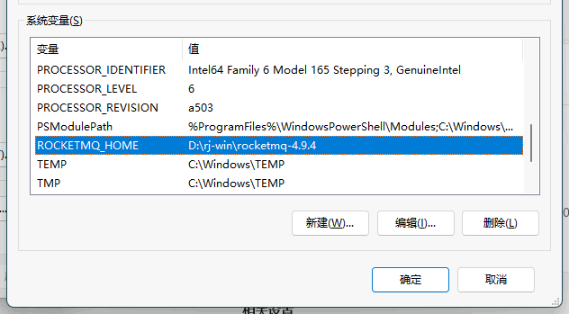
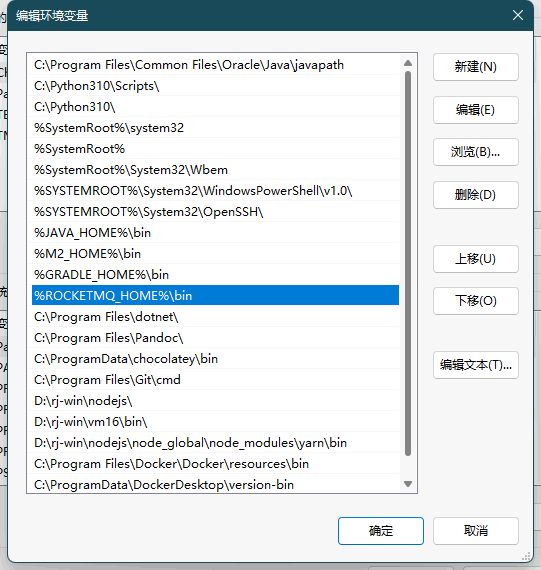
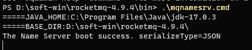
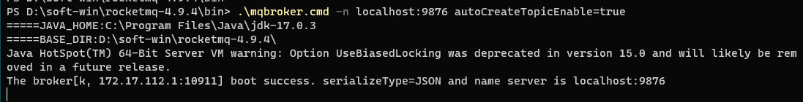
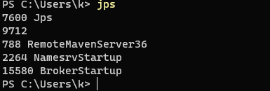
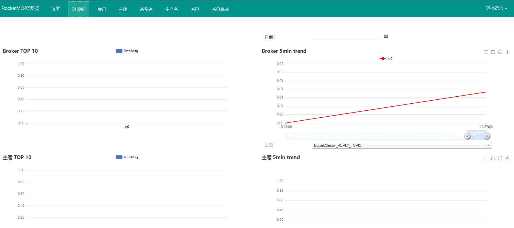
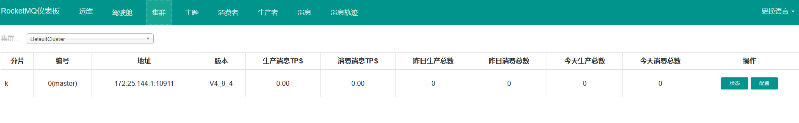
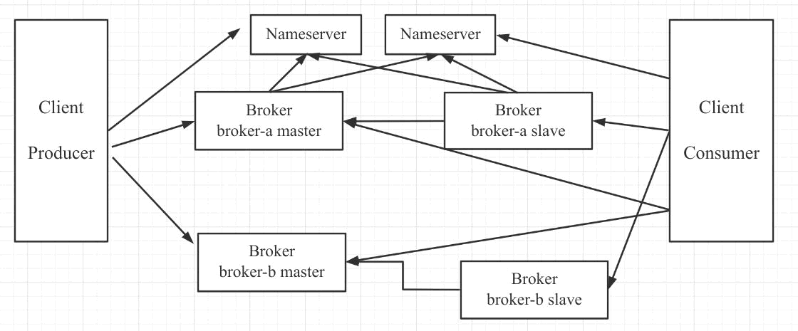
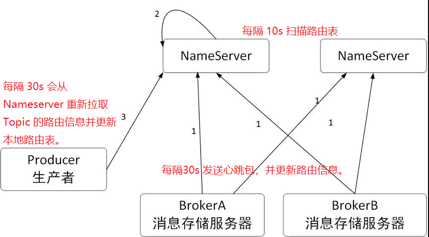
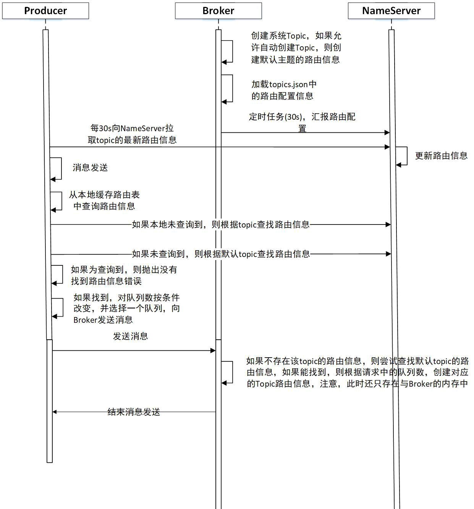

<!-- more -->

# RocketMQ

<https://rocketmq.apache.org>

<https://github.com/apache/rocketmq>

<https://github.com/apache/rocketmq/tree/master/docs/cn>

<https://gitee.com/MFork/rocketmq/tree/develop/docs/cn>

## 1、概念

### 部署模式

| 部署模式                        | 定义                                                                                          | 优点                                                           | 缺点                                              | 其他                                                                                                                                  |
|-----------------------------|:--------------------------------------------------------------------------------------------|:-------------------------------------------------------------|:------------------------------------------------|:------------------------------------------------------------------------------------------------------------------------------------|
| 单 master 模式                 | 也就是只有一个 master 节点，称不上是集群，一旦这个 master 节点宕机，那么整个服务就不可用，适合个人学习使用。                              | -                                                            | -                                               | -                                                                                                                                   |
| 多 master 模式                 | 多个 master 节点组成集群，单个 master 节点宕机或者重启对应用没有影响。                                                 | 所有模式中性能最高                                                    | 单个 master 节点宕机期间，未被消费的消息在节点恢复之前不可用，消息的实时性就受到影响。 | 使用同步刷盘可以保证消息不丢失，同时 Topic 相对应的 queue 应该分布在集群中各个节点，而不是只在某各节点上，否则，该节点宕机会对订阅该 topic 的应用造成影响。                                            |
| 多 master 多 slave **异步**复制模式 | 在多 master 模式的基础上，每个 master 节点都有至少一个对应的 slave。master 节点可读可写，但是 slave 只能读不能写，类似于 mysql 的主备模式。 | 在 master 宕机时，消费者可以从 slave 读取消息，消息的实时性不会受影响，性能几乎和多 master 一样。 | 使用异步复制的同步方式有可能会有消息丢失的问题。                        | -                                                                                                                                   |
| 多 master 多 slave **同步**双写模式 | 同多 master 多 slave 异步复制模式类似，区别在于 master 和 slave 之间的数据同步方式。                                   | 同步双写的同步模式能保证数据不丢失。                                           | 发送单个消息 RT 会略长，性能相比异步复制低10%左右。                   | 刷盘策略：同步刷盘和异步刷盘（指的是节点自身数据是同步还是异步存储）<br/> 同步方式：同步双写和异步复制（指的一组 master 和 slave 之间数据的同步）<br/> **注意**：要保证数据可靠，需采用同步刷盘和同步双写的方式，但性能会较其他方式低。 |

### 基本概念

RocketMQ主要由 Producer、Broker、Consumer 三部分组成，其中Producer 负责生产消息，Consumer  负责消费消息，Broker 负责存储消息。Broker 在实际部署过程中对应一台服务器，每个 Broker  可以存储多个Topic的消息，每个Topic的消息也可以分片存储于不同的 Broker。Message Queue  用于存储消息的物理地址，每个Topic中的消息地址存储于多个 Message Queue 中。ConsumerGroup 由多个Consumer 实例构成。

| 概念                       | 说明      | 其他                                                                                                                          |
|--------------------------|---------|-----------------------------------------------------------------------------------------------------------------------------|
| Producer                 | 消息生产者   | 负责生产消息，一般由业务系统负责生产消息。一个消息生产者会把业务应用系统里产生的消息发送到broker服务器。RocketMQ提供多种发送方式，同步发送、异步发送、顺序发送、单向发送。同步和异步方式均需要Broker返回确认信息，单向发送不需要。 |
| Producer Group           | 消息生产者分组 | -                                                                                                                           |
| Broker                   | 消息代理服务器 | 消息中转角色，负责存储消息、转发消息。代理服务器在RocketMQ系统中负责接收从生产者发送来的消息并存储、同时为消费者的拉取请求作准备。代理服务器也存储消息相关的元数据，包括消费者组、消费进度偏移和主题和队列消息等。               |
| Consumer                 | 消息消费者   | 负责消费消息，一般是后台系统负责异步消费。一个消息消费者会从Broker服务器拉取消息、并将其提供给应用程序。从用户应用的角度而言提供了两种消费形式：拉取式消费、推动式消费。                                     |
| Consumer Group           | 消费者分组   | -                                                                                                                           |
| Topic                    | 主题      | 表示一类消息的集合，每个主题包含若干条消息，每条消息只能属于一个主题，是RocketMQ进行消息订阅的基本单位。                                                                    |
| Message（Queue）           | 消息      | 消息系统所传输信息的物理载体，生产和消费数据的最小单位，每条消息必须属于一个主题。RocketMQ中每个消息拥有唯一的Message ID，且可以携带具有业务标识的Key。系统提供了通过Message ID和Key查询消息的功能。         |
| Tag                      | 标签      | 为消息设置的标志，用于同一主题下区分不同类型的消息。                                                                                                  |
| Name Server              | 名字服务    | 名称服务充当路由消息的提供者。生产者或消费者能够通过名字服务查找各主题相应的Broker IP列表。多个Namesrv实例组成集群，但相互独立，没有信息交换。                                             |
| Pull Consumer            | 拉取式消费   | Consumer消费的一种类型，应用通常主动调用Consumer的拉消息方法从Broker服务器拉消息、主动权由应用控制。一旦获取了批量消息，应用就会启动消费过程。                                          |
| Push Consumer            | 推动式消费   | Consumer消费的一种类型，该模式下Broker收到数据后会主动推送给消费端，该消费模式一般**实时性**较高。                                                                  |
| Clustering               | 集群消费    | 集群消费模式下,相同Consumer Group的每个Consumer实例平均分摊消息。                                                                                |
| Broadcasting             | 广播消费    | 广播消费模式下，相同Consumer Group的每个Consumer实例都接收全量的消息。                                                                              |
| Normal Ordered Message   | 普通顺序消息  | 普通顺序消费模式下，消费者通过同一个消息队列（ Topic 分区，称作 Message Queue） 收到的消息是有顺序的，不同消息队列收到的消息则可能是无顺序的。                                          |
| Strictly Ordered Message | 严格顺序消息  | 严格顺序消息模式下，消费者收到的所有消息均是有顺序的。                                                                                                 |

## 2、特性

### 订阅与发布

消息的发布是指某个生产者向某个topic发送消息；消息的订阅是指某个消费者关注了某个topic中带有某些tag的消息，进而从该topic消费数据。

### 消息顺序

消息有序指的是一类消息消费时，能按照发送的顺序来消费。例如：一个订单产生了三条消息分别是订单创建、订单付款、订单完成。消费时要按照这个顺序消费才能有意义，但是同时订单之间是可以并行消费的。RocketMQ可以严格的保证消息有序。

顺序消息分为全局顺序消息与分区顺序消息，全局顺序是指某个Topic下的所有消息都要保证顺序；部分顺序消息只要保证每一组消息被顺序消费即可。

- 全局顺序 对于指定的一个 Topic，所有消息按照严格的先入先出（FIFO）的顺序进行发布和消费。 适用场景：性能要求不高，所有的消息严格按照 FIFO 原则进行消息发布和消费的场景
- 分区顺序 对于指定的一个 Topic，所有消息根据 sharding key 进行区块分区。 同一个分区内的消息按照严格的 FIFO 顺序进行发布和消费。 Sharding key 是顺序消息中用来区分不同分区的关键字段，和普通消息的 Key 是完全不同的概念。 适用场景：性能要求高，以 sharding key 作为分区字段，在同一个区块中严格的按照 FIFO 原则进行消息发布和消费的场景。

### 消息过滤

RocketMQ的消费者可以根据Tag进行消息过滤，也支持自定义属性过滤。消息过滤目前是在Broker端实现的，优点是减少了对于Consumer无用消息的网络传输，缺点是增加了Broker的负担、而且实现相对复杂。

### 消息可靠性

RocketMQ支持消息的高可靠，影响消息可靠性的几种情况：

1. Broker非正常关闭
2. Broker异常Crash
3. OS Crash
4. 机器掉电，但是能立即恢复供电情况
5. 机器无法开机（可能是cpu、主板、内存等关键设备损坏）
6. 磁盘设备损坏

1)、2)、3)、4) 四种情况都属于硬件资源可立即恢复情况，RocketMQ在这四种情况下能保证消息不丢，或者丢失少量数据（依赖刷盘方式是同步还是异步）。

5)、6)属于单点故障，且无法恢复，一旦发生，在此单点上的消息全部丢失。RocketMQ在这两种情况下，通过异步复制，可保证99%的消息不丢，但是仍然会有极少量的消息可能丢失。通过同步双写技术可以完全避免单点，同步双写势必会影响性能，适合对消息可靠性要求极高的场合，例如与Money相关的应用。注：RocketMQ从3.0版本开始支持同步双写。

### 至少一次

至少一次(At least Once)指每个消息必须投递一次。Consumer先Pull消息到本地，消费完成后，才向服务器返回ack，如果没有消费一定不会ack消息，所以RocketMQ可以很好的支持此特性。

### 回溯消费

回溯消费是指Consumer已经消费成功的消息，由于业务上需求需要重新消费，要支持此功能，Broker在向Consumer投递成功消息后，消息仍然需要保留。并且重新消费一般是按照时间维度，例如由于Consumer系统故障，恢复后需要重新消费1小时前的数据，那么Broker要提供一种机制，可以按照时间维度来回退消费进度。RocketMQ支持按照时间回溯消费，时间维度精确到毫秒。

### 事务消息

RocketMQ事务消息（Transactional  Message）是指应用本地事务和发送消息操作可以被定义到全局事务中，要么同时成功，要么同时失败。RocketMQ的事务消息提供类似  X/Open XA 的分布事务功能，通过事务消息能达到分布式事务的最终一致。

### 定时消息

定时消息（延迟队列）是指消息发送到broker后，不会立即被消费，等待特定时间投递给真正的topic。 broker有配置项messageDelayLevel，默认值为“1s 5s 10s 30s 1m 2m 3m 4m 5m 6m 7m 8m  9m 10m 20m 30m 1h  2h”，18个level。可以配置自定义messageDelayLevel。注意，messageDelayLevel是broker的属性，不属于某个topic。发消息时，设置delayLevel等级即可：msg.setDelayLevel(level)。level有以下三种情况：

- level == 0，消息为非延迟消息
- 1<=level<=maxLevel，消息延迟特定时间，例如level==1，延迟1s
- level > maxLevel，则level== maxLevel，例如level==20，延迟2h

定时消息会暂存在名为SCHEDULE_TOPIC_XXXX的topic中，并根据delayTimeLevel存入特定的queue，queueId = delayTimeLevel –  1，即一个queue只存相同延迟的消息，保证具有相同发送延迟的消息能够顺序消费。broker会调度地消费SCHEDULE_TOPIC_XXXX，将消息写入真实的topic。

需要注意的是，定时消息会在第一次写入和调度写入真实topic时都会计数，因此发送数量、tps都会变高。

### 消息重试

Consumer消费消息失败后，要提供一种重试机制，令消息再消费一次。Consumer消费消息失败通常可以认为有以下几种情况：

- 由于消息本身的原因，例如反序列化失败，消息数据本身无法处理（例如话费充值，当前消息的手机号被注销，无法充值）等。这种错误通常需要跳过这条消息，再消费其它消息，而这条失败的消息即使立刻重试消费，99%也不成功，所以最好提供一种定时重试机制，即过10秒后再重试。
- 由于依赖的下游应用服务不可用，例如db连接不可用，外系统网络不可达等。遇到这种错误，即使跳过当前失败的消息，消费其他消息同样也会报错。这种情况建议应用sleep 30s，再消费下一条消息，这样可以减轻Broker重试消息的压力。

RocketMQ会为每个消费组都设置一个Topic名称为“%RETRY%+consumerGroup”的重试队列（这里需要注意的是，这个Topic的重试队列是针对消费组，而不是针对每个Topic设置的），用于暂时保存因为各种异常而导致Consumer端无法消费的消息。考虑到异常恢复起来需要一些时间，会为重试队列设置多个重试级别，每个重试级别都有与之对应的重新投递延时，重试次数越多投递延时就越大。RocketMQ对于重试消息的处理是先保存至Topic名称为“SCHEDULE_TOPIC_XXXX”的延迟队列中，后台定时任务按照对应的时间进行Delay后重新保存至“%RETRY%+consumerGroup”的重试队列中。

### 消息重投

生产者在发送消息时，同步消息失败会重投，异步消息有重试，oneway没有任何保证。

消息重投保证消息尽可能发送成功、不丢失，但可能会造成消息重复，消息重复在RocketMQ中是无法避免的问题。消息重复在一般情况下不会发生，当出现消息量大、网络抖动，消息重复就会是大概率事件。另外，生产者主动重发、consumer负载变化也会导致重复消息。如下方法可以设置消息重试策略：

- retryTimesWhenSendFailed:同步发送失败重投次数，默认为2，因此生产者会最多尝试发送retryTimesWhenSendFailed +  1次。不会选择上次失败的broker，尝试向其他broker发送，最大程度保证消息不丢。超过重投次数，抛出异常，由客户端保证消息不丢。当出现RemotingException、MQClientException和部分MQBrokerException时会重投。
- retryTimesWhenSendAsyncFailed:异步发送失败重试次数，异步重试不会选择其他broker，仅在同一个broker上做重试，不保证消息不丢。
- retryAnotherBrokerWhenNotStoreOK:消息刷盘（主或备）超时或slave不可用（返回状态非SEND_OK），是否尝试发送到其他broker，默认false。十分重要消息可以开启。

### 流量控制

生产者流控，因为broker处理能力达到瓶颈；消费者流控，因为消费能力达到瓶颈。

生产者流控：

- commitLog文件被锁时间超过osPageCacheBusyTimeOutMills时，参数默认为1000ms，返回流控。
- 如果开启transientStorePoolEnable == true，且broker为异步刷盘的主机，且transientStorePool中资源不足，拒绝当前send请求，返回流控。
- broker每隔10ms检查send请求队列头部请求的等待时间，如果超过waitTimeMillsInSendQueue，默认200ms，拒绝当前send请求，返回流控。
- broker通过拒绝send 请求方式实现流量控制。

注意，生产者流控，不会尝试消息重投。

消费者流控：

- 消费者本地缓存消息数超过pullThresholdForQueue时，默认1000。
- 消费者本地缓存消息大小超过pullThresholdSizeForQueue时，默认100MB。
- 消费者本地缓存消息跨度超过consumeConcurrentlyMaxSpan时，默认2000。

消费者流控的结果是降低拉取频率。

### 死信队列

死信队列用于处理无法被正常消费的消息。当一条消息初次消费失败，消息队列会自动进行消息重试；达到最大重试次数后，若消费依然失败，则表明消费者在正常情况下无法正确地消费该消息，此时，消息队列 不会立刻将消息丢弃，而是将其发送到该消费者对应的特殊队列中。

RocketMQ将这种正常情况下无法被消费的消息称为死信消息（Dead-Letter  Message），将存储死信消息的特殊队列称为死信队列（Dead-Letter  Queue）。在RocketMQ中，可以通过使用console控制台对死信队列中的消息进行重发来使得消费者实例再次进行消费。

## 3、安装

### 下载地址

<https://rocketmq.apache.org/release_notes/release-notes-4.9.4/>

### 配置环境变量

ROCKETMQ_HOME="D:\rocketmq"、NAMESRV_ADDR="localhost:9876"





### port 端口说明

| 端口                                       | 说明    |
|------------------------------------------|-------|
| NameServer                               | 9876  |
| Broker-listenPort（接受客户端连接的监听端口）          | 10911 |
| Broker-fastListenPort（主要用于slave同步master） | 10909 |
| Broker-haListenPort（haService中使用）        | 10912 |

### conf 目录配置说明

| 文件          | 说明             |
|-------------|----------------|
| 2m-2s-async | 2 主 2 从异步复制的配置 |
| 2m-2s-sync  | 2 主 2 从同步复制的配置 |
| 2m-noslave  | 2 主的配置         |
| dledger     |                |
| broker.conf |                |
|             |                |

### broker.conf 参数

| 参数选项                              | 说明                                                                                      |
|-----------------------------------|-----------------------------------------------------------------------------------------|
| brokerClusterName                 | 所属集群名字                                                                                  |
| brokerName                        | broker名字，注意此处不同的配置文件填写的不一样                                                              |
| brokerId                          | 0 表示 Master，>0 表示 Slave                                                                 |
| brokerIP1                         | broker ip根据服务器实际IP进行更改                                                                  |
| namesrvAddr                       | nameServer地址，分号分割                                                                       |
| defaultTopicQueueNums             | 在发送消息时，自动创建服务器不存在的topic，默认创建的队列数                                                        |
| autoCreateTopicEnable             | 是否允许 Broker 自动创建Topic，建议线下开启，线上关闭                                                       |
| autoCreateSubscriptionGroup       | 是否允许 Broker 自动创建订阅组，建议线下开启，线上关闭                                                         |
| listenPort                        | Broker 对外服务的监听端口                                                                        |
| deleteWhen                        | 删除文件时间点，默认凌晨 4点                                                                         |
| fileReservedTime                  | 文件保留时间，默认 48 小时                                                                         |
| mapedFileSizeCommitLog            | commitLog每个文件的大小默认1G                                                                    |
| mapedFileSizeConsumeQueue         | ConsumeQueue每个文件默认存30W条，根据业务情况调整                                                        |
| destroyMapedFileIntervalForcibly  |                                                                                         |
| redeleteHangedFileInterval        |                                                                                         |
| diskMaxUsedSpaceRatio             | 检测物理文件磁盘空间                                                                              |
| storePathRootDir                  | 存储路径                                                                                    |
| storePathCommitLog                | commitLog 存储路径                                                                          |
| storePathConsumeQueue             | 消费队列存储路径存储路径                                                                            |
| storePathIndex                    | 消息索引存储路径                                                                                |
| storeCheckpoint                   | checkpoint 文件存储路径                                                                       |
| abortFile                         | abort 文件存储路径                                                                            |
| maxMessageSize                    | 限制的消息大小                                                                                 |
| flushCommitLogLeastPages          |                                                                                         |
| flushConsumeQueueLeastPages       |                                                                                         |
| flushCommitLogThoroughInterval    |                                                                                         |
| flushConsumeQueueThoroughInterval |                                                                                         |
| brokerRole                        | Broker 的角色<br/>  - ASYNC_MASTER 异步复制Master<br/>  - SYNC_MASTER 同步双写Master<br/>  - SLAVE |
| flushDiskType                     | 刷盘方式<br/>  - ASYNC_FLUSH 异步刷盘<br/>  - SYNC_FLUSH 同步刷盘                                   |
| checkTransactionMessageEnable     |                                                                                         |
| sendMessageThreadPoolNums         | 发消息线程池数量                                                                                |
| pullMessageThreadPoolNums         | 拉消息线程池数量                                                                                |
|                                   |                                                                                         |

### 启动

1、**Start NameServer**   .\mqnamesrv.cmd | start mqnamesrv.cmd（或双击）

2、**Start Broker**   .\mqbroker.cmd -n 192.168.0.5:9876 autoCreateTopicEnable=true | start mqbroker.cmd -n 192.168.0.5:9876 autoCreateTopicEnable=true（或双击）

3、关闭：mqshutdown namesrv、mqshutdown brokers

`（mqadmin:管理工具、mqnamesrv：名称服务、mqbroker:消息代理服务器）`







### 启动时jvm参数报错，修改文件

mqnamesrv.cmd->runserver.cmd

```bash
@echo off

echo =====JAVA_HOME:%JAVA_HOME%

if not exist "%JAVA_HOME%\bin\java.exe" echo Please set the JAVA_HOME variable in your environment, We need java(x64)! & EXIT /B 1
set "JAVA=%JAVA_HOME%\bin\java.exe"

setlocal

set BASE_DIR=%~dp0
set BASE_DIR=%BASE_DIR:~0,-1%
for %%d in (%BASE_DIR%) do set BASE_DIR=%%~dpd

echo =====BASE_DIR:%BASE_DIR%

set CLASSPATH=.;%BASE_DIR%conf;%BASE_DIR%lib\*;%CLASSPATH%

set "JAVA_OPT=%JAVA_OPT% -server -Xms2g -Xmx2g -Xmn1g -XX:MetaspaceSize=128m -XX:MaxMetaspaceSize=320m"
rem set "JAVA_OPT=%JAVA_OPT% -XX:+UseConcMarkSweepGC -XX:+UseCMSCompactAtFullCollection -XX:CMSInitiatingOccupancyFraction=70 -XX:+CMSParallelRemarkEnabled -XX:SoftRefLRUPolicyMSPerMB=0 -XX:+CMSClassUnloadingEnabled -XX:SurvivorRatio=8 -XX:-UseParNewGC"
rem set "JAVA_OPT=%JAVA_OPT% -verbose:gc -Xloggc:"%USERPROFILE%\rmq_srv_gc.log" -XX:+PrintGCDetails -XX:+PrintGCDateStamps"
set "JAVA_OPT=%JAVA_OPT% -XX:-OmitStackTraceInFastThrow"
set "JAVA_OPT=%JAVA_OPT% -XX:-UseLargePages"
set "JAVA_OPT=%JAVA_OPT% -cp "%CLASSPATH%""

"%JAVA%" %JAVA_OPT% %*
```

mqbroker.cmd->runbroker.cmd

```bash
@echo off

echo =====JAVA_HOME:%JAVA_HOME%

if not exist "%JAVA_HOME%\bin\java.exe" echo Please set the JAVA_HOME variable in your environment, We need java(x64)! & EXIT /B 1
set "JAVA=%JAVA_HOME%\bin\java.exe"

setlocal

set BASE_DIR=%~dp0
set BASE_DIR=%BASE_DIR:~0,-1%
for %%d in (%BASE_DIR%) do set BASE_DIR=%%~dpd

echo =====BASE_DIR:%BASE_DIR%

set CLASSPATH=.;%BASE_DIR%conf;%BASE_DIR%lib\*;%CLASSPATH%

set "JAVA_OPT=%JAVA_OPT% -server -Xms2g -Xmx2g"
set "JAVA_OPT=%JAVA_OPT% -XX:+UseG1GC -XX:G1HeapRegionSize=16m -XX:G1ReservePercent=25 -XX:InitiatingHeapOccupancyPercent=30 -XX:SoftRefLRUPolicyMSPerMB=0 -XX:SurvivorRatio=8"
rem set "JAVA_OPT=%JAVA_OPT% -verbose:gc -Xloggc:%USERPROFILE%\mq_gc.log -XX:+PrintGCDetails -XX:+PrintGCDateStamps -XX:+PrintGCApplicationStoppedTime -XX:+PrintAdaptiveSizePolicy"
rem set "JAVA_OPT=%JAVA_OPT% -XX:+UseGCLogFileRotation -XX:NumberOfGCLogFiles=5 -XX:GCLogFileSize=30m"
set "JAVA_OPT=%JAVA_OPT% -XX:-OmitStackTraceInFastThrow"
set "JAVA_OPT=%JAVA_OPT% -XX:+AlwaysPreTouch"
set "JAVA_OPT=%JAVA_OPT% -XX:MaxDirectMemorySize=15g"
set "JAVA_OPT=%JAVA_OPT% -XX:-UseLargePages -XX:-UseBiasedLocking"
set "JAVA_OPT=%JAVA_OPT% -cp %CLASSPATH%"

"%JAVA%" %JAVA_OPT% %*
```

### Docker安装

1) **Start NameServer**

docker pull apache/rocketmq:4.9.4

docker tag apache/rocketmq:4.9.4 registry.cn-chengdu.aliyuncs.com/jinfang/rocketmq:4.9.4

docker push registry.cn-chengdu.aliyuncs.com/jinfang/rocketmq:4.9.4

```bash
docker run -d -p 9876:9876 --name rocketmq-server --restart=always --net=host registry.cn-chengdu.aliyuncs.com/jinfang/rocketmq:4.9.4 ./mqnamesrv
```

2) **Start Broker**

```bash
docker run -d -p 10911:10911 --name rocketmq-broker -v E:\docker\rocketmq\conf\:/home/rocketmq/conf -v E:\docker\rocketmq\logs\:/home/rocketmq/logs -v E:\docker\rocketmq\store\:/home/rocketmq/store --restart=always --net=host -d registry.cn-chengdu.aliyuncs.com/jinfang/rocketmq:4.9.4 ./mqbroker -n 192.168.0.5:9876
```

### 可视化界面

<https://github.com/apache/rocketmq-externals>

<https://github.com/apache/rocketmq-externals/tree/release-rocketmq-console-1.0.0> (rocketmq-dashboard代替)

<https://github.com/apache/rocketmq-dashboard>

打开rocketmq-externals -> rocketmq-console我们会发现他是个springboot项目，此时我们只需要做一些配置文件的修改并启动项目即可 src -> main -> resource -> application.properties 修改 rocketmq.config.namesrvAddr=ip+port

```xml
<mirrors>
    <mirror>
          <id>alimaven</id>
          <name>aliyun maven</name>
          <url>http://maven.aliyun.com/nexus/content/groups/public/</url>
          <mirrorOf>central</mirrorOf>        
    </mirror>
</mirrors>
```

修改完毕后启动项目，然后访问 <http://127.0.0.1:8080> 即可

打包jar

运行命令：java -jar rocketmq-console-ng-2.0.0.jar --server.port=8181

### 可视化界面 docker

docker pull apacherocketmq/rocketmq-dashboard:latest

docker run -d --name rocketmq-dashboard -e "JAVA_OPTS=-Drocketmq.namesrv.addr=192.168.0.5:9876" -p 8080:8080 -t apacherocketmq/rocketmq-dashboard:latest

<http://127.0.0.1:8080>





## 4、技术架构和部署架构

**技术架构**



RocketMQ架构上主要分为四部分，如上图所示:

- **Producer**：消息发布的角色，支持分布式集群方式部署。Producer通过MQ的负载均衡模块选择相应的Broker集群队列进行消息投递，投递的过程支持快速失败并且低延迟。
- **Consumer**：消息消费的角色，支持分布式集群方式部署。支持以push推，pull拉两种模式对消息进行消费。同时也支持集群方式和广播方式的消费，它提供实时消息订阅机制，可以满足大多数用户的需求。
- **NameServer**：NameServer是一个非常简单的Topic路由注册中心，其角色类似Dubbo中的zookeeper，支持Broker的动态注册与发现。主要包括两个功能：Broker管理，NameServer接受Broker集群的注册信息并且保存下来作为路由信息的基本数据。然后提供心跳检测机制，检查Broker是否还存活；路由信息管理，每个NameServer将保存关于Broker集群的整个路由信息和用于客户端查询的队列信息。然后Producer和Conumser通过NameServer就可以知道整个Broker集群的路由信息，从而进行消息的投递和消费。NameServer通常也是集群的方式部署，各实例间相互不进行信息通讯。Broker是向每一台NameServer注册自己的路由信息，所以每一个NameServer实例上面都保存一份完整的路由信息。当某个NameServer因某种原因下线了，Broker仍然可以向其它NameServer同步其路由信息，Producer和Consumer仍然可以动态感知Broker的路由的信息。
- **BrokerServer**：Broker主要负责消息的存储、投递和查询以及服务高可用保证，为了实现这些功能，Broker包含了以下几个重要子模块。
  1. Remoting Module：整个Broker的实体，负责处理来自Client端的请求。
  2. Client Manager：负责管理客户端(Producer/Consumer)和维护Consumer的Topic订阅信息。
  3. Store Service：提供方便简单的API接口处理消息存储到物理硬盘和查询功能。
  4. HA Service：高可用服务，提供Master Broker 和 Slave Broker之间的数据同步功能。
  5. Index Service：根据特定的Message key对投递到Broker的消息进行索引服务，以提供消息的快速查询。

**网络部署特点**

- **NameServer**是一个几乎无状态节点，可集群部署，节点之间无任何信息同步。

- **Broker**部署相对复杂，Broker分为Master与Slave，一个Master可以对应多个Slave，但是一个Slave只能对应一个Master，Master与Slave 的对应关系通过指定相同的BrokerName，不同的BrokerId  来定义，BrokerId为0表示Master，非0表示Slave。Master也可以部署多个。每个Broker与NameServer集群中的所有节点建立长连接，定时注册Topic信息到所有NameServer。

  **注意**：当前RocketMQ版本在部署架构上支持一Master多Slave，但只有BrokerId=1的从服务器才会参与消息的读负载。

- **Producer与NameServer**集群中的其中一个节点（随机选择）建立长连接，定期从NameServer获取Topic路由信息，并向提供Topic 服务的Master建立长连接，且定时向Master发送心跳。Producer完全无状态，可集群部署。

- **Consumer与NameServer**集群中的其中一个节点（随机选择）建立长连接，定期从NameServer获取Topic路由信息，并向提供Topic服务的Master、Slave建立长连接，且定时向Master、Slave发送心跳。Consumer既可以从Master订阅消息，也可以从Slave订阅消息，消费者在向Master拉取消息时，Master服务器会根据拉取偏移量与最大偏移量的距离（判断是否读老消息，产生读I/O），以及从服务器是否可读等因素建议下一次是从Master还是Slave拉取。

结合部署架构图，描述集群工作流程：

- 启动NameServer，NameServer起来后监听端口，等待Broker、Producer、Consumer连上来，相当于一个路由控制中心。
- Broker启动，跟所有的NameServer保持长连接，定时发送心跳包。心跳包中包含当前Broker信息(IP+端口等)以及存储所有Topic信息。注册成功后，NameServer集群中就有Topic跟Broker的映射关系。
- 收发消息前，先创建Topic，创建Topic时需要指定该Topic要存储在哪些Broker上，也可以在发送消息时自动创建Topic。
- Producer发送消息，启动时先跟NameServer集群中的其中一台建立长连接，并从NameServer中获取当前发送的Topic存在哪些Broker上，轮询从队列列表中选择一个队列，然后与队列所在的Broker建立长连接从而向Broker发消息。
- Consumer跟Producer类似，跟其中一台NameServer建立长连接，获取当前订阅Topic存在哪些Broker上，然后直接跟Broker建立连接通道，开始消费消息。

## 5、关键机制的设计原理，主要包括消息存储、通信机制、消息过滤、负载均衡、事务消息等

<https://github.com/apache/rocketmq/blob/master/docs/cn/design.md>

### 基本路由规则



Broker 在启动时向 Nameserver 注册存储在该服务器上的路由信息，并每隔 30s 向Nameserver 发送心跳包，并更新路由信息。Nameserver 每隔 10s 扫描路由表，如果检测到 Broker 服务宕机，则移除对应的路由信息。

消息生产者每隔 30s 会从 Nameserver 重新拉取 Topic 的路由信息并更新本地路由表；在消息发送之前，如果本地路由表中不存在对应主题的路由消息时，会主动向Nameserver 拉取该主题的消息。

### 自动创建主题机制



## 6、样例

### 6.1、基本样例

样例：

<https://gitee.com/MFork/rocketmq/blob/develop/docs/cn/RocketMQ_Example.md>

<https://github.com/apache/rocketmq/blob/master/docs/cn/RocketMQ_Example.md>

在基本样例中我们提供如下的功能场景：

- 使用RocketMQ发送三种类型的消息：同步消息、异步消息和单向消息。其中前两种消息是可靠的，因为会有发送是否成功的应答。
- 使用RocketMQ来消费接收到的消息。

#### 6.1.1 加入依赖

`maven`

```xml
<dependency>
    <groupId>org.apache.rocketmq</groupId>
    <artifactId>rocketmq-client</artifactId>
    <version>4.9.4</version>
</dependency>
```

`gradle`

```properties
compile 'org.apache.rocketmq:rocketmq-client:4.9.4'
```

#### 6.1.2 消息发送

##### 6.1.2.1、发送同步消息

这种可靠性同步地发送方式使用的比较广泛，比如：重要的消息通知，短信通知。

```java
private static void sendSyncProducer() throws Exception {
        DefaultMQProducer producer = new DefaultMQProducer(RocketMQConstants.PRODUCER_GROUP);
        producer.setNamesrvAddr(RocketMQConstants.NAME_SERVER);
        producer.start();
        for (int i = 0; i < 12; i++) {
            // 创建消息，并指定Topic，Tag和消息体
            Message msg = new Message(RocketMQConstants.TOPIC,
                    "TagA", ("666 Hello RocketMQ " + i).getBytes(RemotingHelper.DEFAULT_CHARSET));
            // 发送消息到一个Broker
            SendResult sendResult = producer.send(msg);
            // 通过sendResult返回消息是否成功送达
            System.out.printf("%s%n", sendResult);
            Thread.sleep(1000 * 3);
        }
        producer.shutdown();
    }
```

##### 6.1.2.2、发送异步消息

异步消息通常用在对响应时间敏感的业务场景，即发送端不能容忍长时间地等待Broker的响应。

```java
private static void sendAsyncProducer() throws Exception {
        DefaultMQProducer producer = new DefaultMQProducer(RocketMQConstants.PRODUCER_GROUP);
        producer.setNamesrvAddr(RocketMQConstants.NAME_SERVER);
        producer.start();
        //设置发送异步失败时的重试次数
        producer.setRetryTimesWhenSendAsyncFailed(RocketMQConstants.RETRY_TIMES_WHEN_SEND_ASYNC_FAILED);

        int messageCount = 12;
        // 根据消息数量实例化倒计时计算器
        final CountDownLatch2 countDownLatch = new CountDownLatch2(messageCount);
        for (int i = 0; i < messageCount; i++) {
            final int index = i;
            // 创建消息，并指定Topic，Tag和消息体
            Message msg = new Message(RocketMQConstants.TOPIC,
                    "TagB",
                    "OrderID188",
                    "888 Hello world".getBytes(RemotingHelper.DEFAULT_CHARSET));
            // SendCallback接收异步返回结果的回调
            producer.send(msg, new SendCallback() {
                @Override
                public void onSuccess(SendResult sendResult) {
                    countDownLatch.countDown();
                    System.out.printf("%-10d OK %s %n", index,
                            sendResult.getMsgId());
                }

                @Override
                public void onException(Throwable e) {
                    countDownLatch.countDown();
                    System.out.printf("%-10d Exception %s %n", index, e);
                    e.printStackTrace();
                }
            });
        }
        // 等待5s
        countDownLatch.await(5, TimeUnit.SECONDS);
        producer.shutdown();
    }
```

##### 6.1.2.3、单向发送消息

这种方式主要用在不特别关心发送结果的场景，例如日志发送。

```java
private static void onewayProducer() throws Exception {
        // 实例化消息生产者Producer
        DefaultMQProducer producer = new DefaultMQProducer(RocketMQConstants.PRODUCER_GROUP);
        // 设置NameServer的地址
        producer.setNamesrvAddr(RocketMQConstants.NAME_SERVER);
        // 启动Producer实例
        producer.start();
        for (int i = 0; i < 12; i++) {
            // 创建消息，并指定Topic，Tag和消息体
            Message msg = new Message(RocketMQConstants.TOPIC,
                    "TagC",
                    ("111 Hello RocketMQ " + i).getBytes(RemotingHelper.DEFAULT_CHARSET) /* Message body */
            );
            // 发送单向消息，没有任何返回结果
            producer.sendOneway(msg);

        }
        // 如果不再发送消息，关闭Producer实例。
        producer.shutdown();
    }
```

#### 6.1.3 消费消息 - PushConsumer

```java
private static void consumer() throws MQClientException {
        // 实例化消费者
        DefaultMQPushConsumer consumer = new DefaultMQPushConsumer(RocketMQConstants.CONSUMER_GROUP);
        // 设置NameServer的地址
        consumer.setNamesrvAddr(RocketMQConstants.NAME_SERVER);
        // 订阅一个或者多个Topic，以及Tag来过滤需要消费的消息
        consumer.subscribe(RocketMQConstants.TOPIC, "*");
        // 注册回调实现类来处理从broker拉取回来的消息
        consumer.registerMessageListener(new MessageListenerConcurrently() {
            @Override
            public ConsumeConcurrentlyStatus consumeMessage(List<MessageExt> msgs, ConsumeConcurrentlyContext context) {
                System.out.printf("%s Receive New Messages: %s %n", Thread.currentThread().getName(), msgs);
                // 标记该消息已经被成功消费
                return ConsumeConcurrentlyStatus.CONSUME_SUCCESS;
            }
        });
        // 启动消费者实例
        consumer.start();
        System.out.printf("Consumer Started.%n");
    }
```

### 6.2 顺序消息样例

消息有序指的是可以按照消息的发送顺序来消费(FIFO)。RocketMQ可以严格的保证消息有序，可以分为分区有序或者全局有序。

顺序消费的原理解析，在默认的情况下消息发送会采取Round Robin轮询方式把消息发送到不同的queue(分区队列)；而消费消息的时候从多个queue上拉取消息，这种情况发送和消费是不能保证顺序。但是如果控制发送的顺序消息只依次发送到同一个queue中，消费的时候只从这个queue上依次拉取，则就保证了顺序。当发送和消费参与的queue只有一个，则是全局有序；如果多个queue参与，则为分区有序，即相对每个queue，消息都是有序的。

下面用订单进行分区有序的示例。一个订单的顺序流程是：创建、付款、推送、完成。订单号相同的消息会被先后发送到同一个队列中，消费时，同一个OrderId获取到的肯定是同一个队列。

#### 6.2.1 顺序消息生产

```java
package cn.jf.system.example.order;

import cn.jf.common.core.utils.time.DateUtils;
import cn.jf.system.constant.RocketMQConstants;
import org.apache.rocketmq.client.producer.DefaultMQProducer;
import org.apache.rocketmq.client.producer.MessageQueueSelector;
import org.apache.rocketmq.client.producer.SendResult;
import org.apache.rocketmq.common.message.Message;
import org.apache.rocketmq.common.message.MessageQueue;

import java.util.ArrayList;
import java.util.List;

/**
 * @author jf
 * @version 1.0
 * @date 2022/07/14 13:14
 */
public class Producer {

    public static void main(String[] args) throws Exception {
        DefaultMQProducer producer = new DefaultMQProducer(RocketMQConstants.PRODUCER_GROUP);
        producer.setNamesrvAddr(RocketMQConstants.NAME_SERVER);
        producer.start();
        String[] tags = new String[]{"TagA", "TagC", "TagD"};
        // 订单列表
        List<OrderStep> orderList = new Producer().buildOrders();

        for (int i = 0; i < 10; i++) {
            // 加个时间前缀
            String body = DateUtils.getTime() + " Hello RocketMQ " + orderList.get(i);
            Message msg = new Message(RocketMQConstants.TOPIC, tags[i % tags.length], "KEY" + i, body.getBytes());

            SendResult sendResult = producer.send(msg, new MessageQueueSelector() {
                @Override
                public MessageQueue select(List<MessageQueue> mqs, Message msg, Object arg) {
                    Long id = (Long) arg;  //根据订单id选择发送queue
                    long index = id % mqs.size();
                    return mqs.get((int) index);
                }
            }, orderList.get(i).getOrderId());//订单id

            System.out.println(String.format("SendResult status:%s, queueId:%d, body:%s",
                    sendResult.getSendStatus(),
                    sendResult.getMessageQueue().getQueueId(),
                    body));
            Thread.sleep(1000 * 3);
        }

        producer.shutdown();
    }
    
    class OrderStep {
        private long orderId;
        private String desc;
    }
    /**
     * 生成模拟订单数据
     */
    private List<OrderStep> buildOrders() {
        List<OrderStep> orderList = new ArrayList<OrderStep>();

        OrderStep orderDemo = new OrderStep();
        orderDemo.setOrderId(15103111039L);
        orderDemo.setDesc("创建");
        orderList.add(orderDemo);

        orderDemo = new OrderStep();
        orderDemo.setOrderId(15103111065L);
        orderDemo.setDesc("创建");
        orderList.add(orderDemo);

        orderDemo = new OrderStep();
        orderDemo.setOrderId(15103111039L);
        orderDemo.setDesc("付款");
        orderList.add(orderDemo);

        orderDemo = new OrderStep();
        orderDemo.setOrderId(15103117235L);
        orderDemo.setDesc("创建");
        orderList.add(orderDemo);

        orderDemo = new OrderStep();
        orderDemo.setOrderId(15103111065L);
        orderDemo.setDesc("付款");
        orderList.add(orderDemo);

        orderDemo = new OrderStep();
        orderDemo.setOrderId(15103117235L);
        orderDemo.setDesc("付款");
        orderList.add(orderDemo);

        orderDemo = new OrderStep();
        orderDemo.setOrderId(15103111065L);
        orderDemo.setDesc("完成");
        orderList.add(orderDemo);

        orderDemo = new OrderStep();
        orderDemo.setOrderId(15103111039L);
        orderDemo.setDesc("推送");
        orderList.add(orderDemo);

        orderDemo = new OrderStep();
        orderDemo.setOrderId(15103117235L);
        orderDemo.setDesc("完成");
        orderList.add(orderDemo);

        orderDemo = new OrderStep();
        orderDemo.setOrderId(15103111039L);
        orderDemo.setDesc("完成");
        orderList.add(orderDemo);

        return orderList;
    }
}

```

#### 6.2.2 顺序消费消息

```java
package cn.jf.system.example.order;

import cn.jf.system.constant.RocketMQConstants;
import org.apache.rocketmq.client.consumer.DefaultMQPushConsumer;
import org.apache.rocketmq.client.consumer.listener.ConsumeOrderlyContext;
import org.apache.rocketmq.client.consumer.listener.ConsumeOrderlyStatus;
import org.apache.rocketmq.client.consumer.listener.MessageListenerOrderly;
import org.apache.rocketmq.common.consumer.ConsumeFromWhere;
import org.apache.rocketmq.common.message.MessageExt;

import java.util.List;
import java.util.Random;
import java.util.concurrent.TimeUnit;

/**
 * 顺序消息消费，带事务方式（应用可控制Offset什么时候提交）
 *
 * @author jf
 * @version 1.0
 * @date 2022/07/14 13:44
 */
public class ConsumerInOrder {

    public static void main(String[] args) throws Exception {
        DefaultMQPushConsumer consumer = new DefaultMQPushConsumer(RocketMQConstants.CONSUMER_GROUP);
        consumer.setNamesrvAddr(RocketMQConstants.NAME_SERVER);
        /**
         * 设置 Consumer 第一次启动是从队列头部开始消费还是队列尾部开始消费<br>
         * 如果非第一次启动，那么按照上次消费的位置继续消费
         */
        consumer.setConsumeFromWhere(ConsumeFromWhere.CONSUME_FROM_FIRST_OFFSET);
        consumer.subscribe(RocketMQConstants.TOPIC, "TagA || TagC || TagD");
        //注册消息监听器
        consumer.registerMessageListener(new MessageListenerOrderly() {
            Random random = new Random();
            @Override
            public ConsumeOrderlyStatus consumeMessage(List<MessageExt> msgs, ConsumeOrderlyContext context) {
                context.setAutoCommit(true);
                for (MessageExt msg : msgs) {
                    // 可以看到每个queue有唯一的consume线程来消费, 订单对每个queue(分区)有序
                    System.out.println("consumeThread=" + Thread.currentThread().getName() + ", queueId=" + msg.getQueueId() + ", content:" + new String(msg.getBody()));
                }
                try {
                    //模拟业务逻辑处理中...
                    TimeUnit.SECONDS.sleep(random.nextInt(10));
                } catch (Exception e) {
                    e.printStackTrace();
                }
                return ConsumeOrderlyStatus.SUCCESS;
            }
        });
        consumer.start();
        System.out.println("Consumer Started.");
    }
}

```

### 6.3 延时消息样例

#### 6.3.1 启动消费者等待传入订阅消息

```java
package cn.jf.system.example.delayedmessage;

import cn.jf.system.constant.RocketMQConstants;
import org.apache.rocketmq.client.consumer.DefaultMQPushConsumer;
import org.apache.rocketmq.client.consumer.listener.ConsumeConcurrentlyContext;
import org.apache.rocketmq.client.consumer.listener.ConsumeConcurrentlyStatus;
import org.apache.rocketmq.client.consumer.listener.MessageListenerConcurrently;
import org.apache.rocketmq.common.message.MessageExt;

import java.util.List;

/**
 * 启动消费者等待传入订阅消息
 *
 * @author jf
 * @version 1.0
 * @date 2022/07/14 13:58
 */
public class ScheduledMessageConsumer {
    public static void main(String[] args) throws Exception {
        // 实例化消费者
        DefaultMQPushConsumer consumer = new DefaultMQPushConsumer(RocketMQConstants.EXAMPLE_CONSUMER_GROUP);
        // 设置NameServer的地址
        consumer.setNamesrvAddr(RocketMQConstants.NAME_SERVER);
        // 订阅Topics
        consumer.subscribe(RocketMQConstants.TOPIC, "*");
        // 注册消息监听者
        consumer.registerMessageListener(new MessageListenerConcurrently() {
            @Override
            public ConsumeConcurrentlyStatus consumeMessage(List<MessageExt> messages, ConsumeConcurrentlyContext context) {
                for (MessageExt message : messages) {
                    System.out.println("==> 接收到超时订单 [订单ID=" + message.getMsgId() + ", 内容详情:" + new String(message.getBody()) + "] " + (System.currentTimeMillis() - message.getBornTimestamp()) + "ms later");
                }
                return ConsumeConcurrentlyStatus.CONSUME_SUCCESS;
            }
        });
        // 启动消费者
        consumer.start();
    }
}

```

#### 6.3.2 发送延时消息

```java
package cn.jf.system.example.delayedmessage;

import cn.jf.common.core.utils.time.DateUtils;
import cn.jf.system.constant.RocketMQConstants;
import org.apache.rocketmq.client.producer.DefaultMQProducer;
import org.apache.rocketmq.common.message.Message;


/**
 * 发送延时消息
 * <p>
 * 比如电商里，提交了一个订单就可以发送一个延时消息，1h后去检查这个订单的状态，如果还是未付款就取消订单释放库存。
 *
 * @author jf
 * @version 1.0
 * @date 2022/07/14 14:02
 */
public class ScheduledMessageProducer {
    public static void main(String[] args) throws Exception {
        // 实例化一个生产者来产生延时消息
        DefaultMQProducer producer = new DefaultMQProducer(RocketMQConstants.EXAMPLE_PRODUCER_GROUP);
        // 设置NameServer的地址
        producer.setNamesrvAddr(RocketMQConstants.NAME_SERVER);
        // 启动生产者
        producer.start();
        int totalMessagesToSend = 12;
        for (int i = 0; i < totalMessagesToSend; i++) {
            Message message = new Message(RocketMQConstants.TOPIC, (DateUtils.getTime() + "，你好，预定消息 " + i).getBytes());
            // 设置延时等级3,这个消息将在10s之后发送(现在只支持固定的几个时间,详看delayTimeLevel)
            // messageDelayLevel = "1s 5s 10s 30s 1m 2m 3m 4m 5m 6m 7m 8m 9m 10m 20m 30m 1h 2h";
            // 从1s到2h分别对应着等级1到18
            message.setDelayTimeLevel(3);
            // 发送消息
            producer.send(message);
        }
        // 关闭生产者
        producer.shutdown();
    }
}

```

#### 6.3.3 延时消息的使用场景

比如电商里，提交了一个订单就可以发送一个延时消息，1h后去检查这个订单的状态，如果还是未付款就取消订单释放库存。

#### 6.3.4 延时消息的使用限制

```java
// org/apache/rocketmq/store/config/MessageStoreConfig.java

private String messageDelayLevel = "1s 5s 10s 30s 1m 2m 3m 4m 5m 6m 7m 8m 9m 10m 20m 30m 1h 2h";
```

现在RocketMq并不支持任意时间的延时，需要设置几个固定的延时等级，从1s到2h分别对应着等级1到18
消息消费失败会进入延时消息队列，消息发送时间与设置的延时等级和重试次数有关，详见代码`SendMessageProcessor.java`

### 6.4 批量消息样例

批量发送消息能显著提高传递小消息的性能。限制是这些批量消息应该有相同的topic，相同的waitStoreMsgOK，而且不能是延时消息。此外，这一批消息的总大小不应超过4MB。

#### 6.4.1 发送批量消息

如果您每次只发送不超过4MB的消息，则很容易使用批处理，样例如下：

```java
package cn.jf.system.example.bulkmessage;

import cn.jf.system.constant.RocketMQConstants;
import org.apache.rocketmq.client.producer.DefaultMQProducer;
import org.apache.rocketmq.common.message.Message;

import java.util.ArrayList;
import java.util.List;

/**
 * 发送批量消息
 *
 * @author jf
 * @version 1.0
 * @date 2022/07/14 14:18
 */
public class BulkProducer {
    public static void main(String[] args) throws Exception {
        main02();
    }

    /**
     * 发送批量消息
     *
     * @throws Exception
     */
    private static void main01() throws Exception {
        DefaultMQProducer producer = new DefaultMQProducer(RocketMQConstants.EXAMPLE_PRODUCER_GROUP);
        producer.setNamesrvAddr(RocketMQConstants.NAME_SERVER);
        producer.start();

        String topic = RocketMQConstants.TOPIC_BATCH_TEST;
        List<Message> messages = new ArrayList<>();
        for (int i = 0; i < 20; i++) {
            messages.add(new Message(topic, "TagA", "OrderID00" + i, ("Hello world " + i).getBytes()));
        }
        producer.send(messages);
        producer.shutdown();
    }

    /**
     * 把大的消息分裂成若干个小的消息
     *
     * @throws Exception
     */
    public static void main02() throws Exception {
        DefaultMQProducer producer = new DefaultMQProducer(RocketMQConstants.EXAMPLE_PRODUCER_GROUP);
        producer.setNamesrvAddr(RocketMQConstants.NAME_SERVER);
        producer.start();

        String topic = RocketMQConstants.TOPIC_BATCH_TEST;
        List<Message> messages = new ArrayList<>();
        for (int i = 0; i < 20; i++) {
            messages.add(new Message(topic, "TagB", "OrderID00" + i, ("Hello world " + i).getBytes()));
        }
        //把大的消息分裂成若干个小的消息
        ListSplitter splitter = new ListSplitter(messages);
        while (splitter.hasNext()) {
            try {
                List<Message> listItem = splitter.next();
                producer.send(listItem);
            } catch (Exception e) {
                e.printStackTrace();
            }
        }
        producer.shutdown();
    }
}

```

#### 6.4.2 消息列表分割

复杂度只有当你发送大批量时才会增长，你可能不确定它是否超过了大小限制（4MB）。这时候你最好把你的消息列表分割一下：

```java
package cn.jf.system.example.bulkmessage;

import org.apache.rocketmq.common.message.Message;

import java.util.Iterator;
import java.util.List;
import java.util.Map;

/**
 * 消息列表分割
 *
 * @author jf
 * @version 1.0
 * @date 2022/07/14 14:24
 */
public class ListSplitter implements Iterator<List<Message>> {
    private final int SIZE_LIMIT = 1024 * 1024 * 4;
    private final List<Message> messages;
    private int currIndex;

    public ListSplitter(List<Message> messages) {
        this.messages = messages;
    }

    @Override
    public boolean hasNext() {
        return currIndex < messages.size();
    }

    @Override
    public List<Message> next() {
        int startIndex = getStartIndex();
        int nextIndex = startIndex;
        int totalSize = 0;
        for (; nextIndex < messages.size(); nextIndex++) {
            Message message = messages.get(nextIndex);
            int tmpSize = calcMessageSize(message);
            if (tmpSize + totalSize > SIZE_LIMIT) {
                break;
            } else {
                totalSize += tmpSize;
            }
        }
        List<Message> subList = messages.subList(startIndex, nextIndex);
        currIndex = nextIndex;
        return subList;
    }

    private int getStartIndex() {
        Message currMessage = messages.get(currIndex);
        int tmpSize = calcMessageSize(currMessage);
        while (tmpSize > SIZE_LIMIT) {
            currIndex += 1;
            Message message = messages.get(currIndex);
            tmpSize = calcMessageSize(message);
        }
        return currIndex;
    }

    private int calcMessageSize(Message message) {
        int tmpSize = message.getTopic().length() + message.getBody().length;
        Map<String, String> properties = message.getProperties();
        for (Map.Entry<String, String> entry : properties.entrySet()) {
            tmpSize += entry.getKey().length() + entry.getValue().length();
        }
        tmpSize = tmpSize + 20; // 增加⽇日志的开销20字节
        return tmpSize;
    }


}
```

### 6.5 过滤消息样例

在大多数情况下，TAG是一个简单而有用的设计，其可以来选择您想要的消息。例如：

```java
DefaultMQPushConsumer consumer = new DefaultMQPushConsumer("CID_EXAMPLE");
consumer.subscribe("TOPIC", "TAGA || TAGB || TAGC");
```

消费者将接收包含TAGA或TAGB或TAGC的消息。但是限制是一个消息只能有一个标签，这对于复杂的场景可能不起作用。在这种情况下，可以使用SQL表达式筛选消息。SQL特性可以通过发送消息时的属性来进行计算。在RocketMQ定义的语法下，可以实现一些简单的逻辑。下面是一个例子：

```
------------
| message  |
|----------|  a > 5 AND b = 'abc'
| a = 10   |  --------------------> Gotten
| b = 'abc'|
| c = true |
------------
------------
| message  |
|----------|   a > 5 AND b = 'abc'
| a = 1    |  --------------------> Missed
| b = 'abc'|
| c = true |
------------
```

#### 6.5.1 基本语法

RocketMQ只定义了一些基本语法来支持这个特性。你也可以很容易地扩展它。

- 数值比较，比如：**>，>=，<，<=，BETWEEN，=；**
- 字符比较，比如：**=，<>，IN；**
- **IS NULL** 或者 **IS NOT NULL；**
- 逻辑符号 **AND，OR，NOT；**

常量支持类型为：

- 数值，比如：**123，3.1415；**
- 字符，比如：**'abc'，必须用单引号包裹起来；**
- **NULL**，特殊的常量
- 布尔值，**TRUE** 或 **FALSE**

只有使用push模式的消费者才能用使用SQL92标准的sql语句，接口如下：

```
public void subscribe(finalString topic, final MessageSelector messageSelector)
```

#### 6.5.2 使用样例

##### 6.5.2.1、生产者样例

发送消息时，你能通过`putUserProperty`来设置消息的属性

```java
package cn.jf.system.example.filtermessages;

import cn.jf.common.core.utils.time.DateUtils;
import cn.jf.system.constant.RocketMQConstants;
import org.apache.rocketmq.client.producer.DefaultMQProducer;
import org.apache.rocketmq.common.message.Message;
import org.apache.rocketmq.remoting.common.RemotingHelper;

/**
 *  
 * @author jf
 * @version 1.0
 * @date 2022/07/14 13:58
 */
public class FillterMessageProducer {
    public static void main(String[] args) throws Exception {
        DefaultMQProducer producer = new DefaultMQProducer(RocketMQConstants.TEST_PRODUCER_GROUP);
        producer.setNamesrvAddr(RocketMQConstants.NAME_SERVER);
        producer.start();
        int totalMessagesToSend = 12;
        for (int i = 0; i < totalMessagesToSend; i++) {
            Message message = new Message(RocketMQConstants.TOPIC_TEST, (DateUtils.getTime() + "，你好 RocketMQ " + i).getBytes(RemotingHelper.DEFAULT_CHARSET));
            message.putUserProperty("a", String.valueOf(i));
            // 发送消息
            producer.send(message);
        }
        producer.shutdown();
    }
}

```

##### 6.5.2.2、消费者样例

用MessageSelector.bySql来使用sql筛选消息

```java
package cn.jf.system.example.filtermessages;

import cn.jf.system.constant.RocketMQConstants;
import org.apache.rocketmq.client.consumer.DefaultMQPushConsumer;
import org.apache.rocketmq.client.consumer.MessageSelector;
import org.apache.rocketmq.client.consumer.listener.ConsumeConcurrentlyContext;
import org.apache.rocketmq.client.consumer.listener.ConsumeConcurrentlyStatus;
import org.apache.rocketmq.client.consumer.listener.MessageListenerConcurrently;
import org.apache.rocketmq.common.message.MessageExt;

import java.util.List;

/**
 * 启动消费者等待传入订阅消息
 *
 * @author jf
 * @version 1.0
 * @date 2022/07/14 13:58
 */
public class FillterMessageConsumer {
    public static void main(String[] args) throws Exception {
        // 实例化消费者
        DefaultMQPushConsumer consumer = new DefaultMQPushConsumer(RocketMQConstants.EXAMPLE_CONSUMER_GROUP);
        // 设置NameServer的地址
        consumer.setNamesrvAddr(RocketMQConstants.NAME_SERVER);
        // 只有订阅的消息有这个属性a, a >=0 and a <= 3
        consumer.subscribe(RocketMQConstants.TOPIC_TEST, MessageSelector.bySql("a between 0 and 3"));

        consumer.registerMessageListener(new MessageListenerConcurrently() {
            @Override
            public ConsumeConcurrentlyStatus consumeMessage(List<MessageExt> messages, ConsumeConcurrentlyContext context) {
                for (MessageExt message : messages) {
                    System.out.println("==> 接收到消息 [ID=" + message.getMsgId() + ", 内容详情:" + new String(message.getBody()) + "] " + (System.currentTimeMillis() - message.getBornTimestamp()) + "ms later");
                }
                return ConsumeConcurrentlyStatus.CONSUME_SUCCESS;
            }
        });
        // 启动消费者
        consumer.start();
    }
}
```

### 6.6 消息事务样例

事务消息共有三种状态，提交状态、回滚状态、中间状态：

- TransactionStatus.CommitTransaction: 提交事务，它允许消费者消费此消息。
- TransactionStatus.RollbackTransaction: 回滚事务，它代表该消息将被删除，不允许被消费。
- TransactionStatus.Unknown: 中间状态，它代表需要检查消息队列来确定状态。

#### 6.6.1 发送事务消息样例

##### 6.6.1.1、创建事务性生产者

使用 `TransactionMQProducer`类创建生产者，并指定唯一的 `ProducerGroup`，就可以设置自定义线程池来处理这些检查请求。执行本地事务后、需要根据执行结果对消息队列进行回复。回传的事务状态在请参考前一节。

```java
package cn.jf.system.example.transaction;

import cn.jf.system.constant.RocketMQConstants;
import org.apache.rocketmq.client.exception.MQClientException;
import org.apache.rocketmq.client.producer.SendResult;
import org.apache.rocketmq.client.producer.TransactionListener;
import org.apache.rocketmq.client.producer.TransactionMQProducer;
import org.apache.rocketmq.common.message.Message;
import org.apache.rocketmq.remoting.common.RemotingHelper;

import java.io.UnsupportedEncodingException;
import java.util.concurrent.*;

/**
 * 事务消息共有三种状态，提交状态、回滚状态、中间状态：
 * <p>
 * - TransactionStatus.CommitTransaction: 提交事务，它允许消费者消费此消息。<p>
 * - TransactionStatus.RollbackTransaction: 回滚事务，它代表该消息将被删除，不允许被消费。<p>
 * - TransactionStatus.Unknown: 中间状态，它代表需要检查消息队列来确定状态。<p>
 *
 * @author jf
 * @version 1.0
 * @date 2022/07/14 13:58
 */
public class TransactionMessageProducer {
    public static void main(String[] args) throws Exception {
        TransactionListener transactionListener = new TransactionListenerImpl();
        TransactionMQProducer producer = new TransactionMQProducer(RocketMQConstants.TEST_PRODUCER_GROUP);
        ExecutorService executorService = new ThreadPoolExecutor(2, 5, 100, TimeUnit.SECONDS, new ArrayBlockingQueue<Runnable>(2000), new ThreadFactory() {
            @Override
            public Thread newThread(Runnable r) {
                Thread thread = new Thread(r);
                thread.setName("client-transaction-msg-check-thread");
                return thread;
            }
        });

        producer.setNamesrvAddr(RocketMQConstants.NAME_SERVER);
        producer.setExecutorService(executorService);
        producer.setTransactionListener(transactionListener);
        producer.start();
        String[] tags = new String[]{"TagA", "TagB", "TagC", "TagD", "TagE"};
        for (int i = 0; i < 10; i++) {
            try {
                Message msg = new Message(RocketMQConstants.TOPIC_TEST_123, tags[i % tags.length], "KEY" + i,
                        ("Hello RocketMQ " + i).getBytes(RemotingHelper.DEFAULT_CHARSET));
                SendResult sendResult = producer.sendMessageInTransaction(msg, null);
                System.out.printf("%s%n", sendResult);
                Thread.sleep(10);
            } catch (MQClientException | UnsupportedEncodingException e) {
                e.printStackTrace();
            }
        }
        for (int i = 0; i < 100000; i++) {
            Thread.sleep(1000);
        }
        producer.shutdown();
    }
}

```

##### 6.6.1.2、实现事务的监听接口

当发送半消息成功时，我们使用 `executeLocalTransaction` 方法来执行本地事务。它返回前一节中提到的三个事务状态之一。`checkLocalTransaction` 方法用于检查本地事务状态，并回应消息队列的检查请求。它也是返回前一节中提到的三个事务状态之一。

```java
package cn.jf.system.example.transaction;

import org.apache.rocketmq.client.producer.LocalTransactionState;
import org.apache.rocketmq.client.producer.TransactionListener;
import org.apache.rocketmq.common.message.Message;
import org.apache.rocketmq.common.message.MessageExt;

import java.util.concurrent.ConcurrentHashMap;
import java.util.concurrent.atomic.AtomicInteger;

/**
 * 实现事务的监听接口
 *
 * @author jf
 * @version 1.0
 * @date 2022/07/14 15:04
 */
public class TransactionListenerImpl implements TransactionListener {

    private AtomicInteger transactionIndex = new AtomicInteger(0);
    private ConcurrentHashMap<String, Integer> localTrans = new ConcurrentHashMap<>();

    @Override
    public LocalTransactionState executeLocalTransaction(Message msg, Object arg) {
        int value = transactionIndex.getAndIncrement();
        int status = value % 3;
        localTrans.put(msg.getTransactionId(), status);
        return LocalTransactionState.UNKNOW;
    }

    @Override
    public LocalTransactionState checkLocalTransaction(MessageExt msg) {
        Integer status = localTrans.get(msg.getTransactionId());
        if (null != status) {
            switch (status) {
                case 0:
                    return LocalTransactionState.UNKNOW;
                case 1:
                    return LocalTransactionState.COMMIT_MESSAGE;
                case 2:
                    return LocalTransactionState.ROLLBACK_MESSAGE;
            }
        }
        return LocalTransactionState.COMMIT_MESSAGE;
    }
}
```

#### 6.2.2 事务消息使用上的限制

1. 事务消息不支持延时消息和批量消息。
2. 为了避免单个消息被检查太多次而导致半队列消息累积，我们默认将单个消息的检查次数限制为 15 次，但是用户可以通过 Broker 配置文件的 `transactionCheckMax`参数来修改此限制。如果已经检查某条消息超过 N 次的话（ N = `transactionCheckMax` ） 则 Broker 将丢弃此消息，并在默认情况下同时打印错误日志。用户可以通过重写 `AbstractTransactionalMessageCheckListener` 类来修改这个行为。
3. 事务消息将在 Broker 配置文件中的参数 transactionTimeout 这样的特定时间长度之后被检查。当发送事务消息时，用户还可以通过设置用户属性 CHECK_IMMUNITY_TIME_IN_SECONDS 来改变这个限制，该参数优先于 `transactionTimeout` 参数。
4. 事务性消息可能不止一次被检查或消费。
5. 提交给用户的目标主题消息可能会失败，目前这依日志的记录而定。它的高可用性通过 RocketMQ 本身的高可用性机制来保证，如果希望确保事务消息不丢失、并且事务完整性得到保证，建议使用同步的双重写入机制。
6. 事务消息的生产者 ID 不能与其他类型消息的生产者 ID 共享。与其他类型的消息不同，事务消息允许反向查询、MQ服务器能通过它们的生产者 ID 查询到消费者。

### 6.7 Logappender 样例

RocketMQ日志提供log4j、log4j2和logback日志框架作为业务应用，下面是配置样例

#### 6.7.1 log4j样例

按下面样例使用log4j属性配置

```properties
log4j.appender.mq=org.apache.rocketmq.logappender.log4j.RocketmqLog4jAppender
log4j.appender.mq.Tag=yourTag
log4j.appender.mq.Topic=yourLogTopic
log4j.appender.mq.ProducerGroup=yourLogGroup
log4j.appender.mq.NameServerAddress=yourRocketmqNameserverAddress
log4j.appender.mq.layout=org.apache.log4j.PatternLayout
log4j.appender.mq.layout.ConversionPattern=%d{yyyy-MM-dd HH:mm:ss} %-4r [%t] (%F:%L) %-5p - %m%n
```

按下面样例使用log4j xml配置来使用异步添加日志

```xml
<appender name="mqAppender1"class="org.apache.rocketmq.logappender.log4j.RocketmqLog4jAppender">
  <param name="Tag" value="yourTag" />
  <param name="Topic" value="yourLogTopic" />
  <param name="ProducerGroup" value="yourLogGroup" />
  <param name="NameServerAddress" value="yourRocketmqNameserverAddress"/>
  <layout class="org.apache.log4j.PatternLayout">
      <param name="ConversionPattern" value="%d{yyyy-MM-dd HH:mm:ss}-%p %t %c - %m%n" />
  </layout>
</appender>
<appender name="mqAsyncAppender1"class="org.apache.log4j.AsyncAppender">
  <param name="BufferSize" value="1024" />
  <param name="Blocking" value="false" />
  <appender-ref ref="mqAppender1"/>
</appender>
```

#### 6.7.2 log4j2样例

用log4j2时，配置如下，如果想要非阻塞，只需要使用异步添加引用即可

```xml
<RocketMQ name="rocketmqAppender" producerGroup="yourLogGroup" nameServerAddress="yourRocketmqNameserverAddress"
   topic="yourLogTopic" tag="yourTag">
  <PatternLayout pattern="%d [%p] hahahah %c %m%n"/>
</RocketMQ>
```

#### 6.7.3 logback样例

```xml
<appender name="mqAppender1"class="org.apache.rocketmq.logappender.logback.RocketmqLogbackAppender">
  <tag>yourTag</tag>
  <topic>yourLogTopic</topic>
  <producerGroup>yourLogGroup</producerGroup>
  <nameServerAddress>yourRocketmqNameserverAddress</nameServerAddress>
  <layout>
      <pattern>%date %p %t - %m%n</pattern>
  </layout>
</appender>
<appender name="mqAsyncAppender1"class="ch.qos.logback.classic.AsyncAppender">
  <queueSize>1024</queueSize>
  <discardingThreshold>80</discardingThreshold>
  <maxFlushTime>2000</maxFlushTime>
  <neverBlock>true</neverBlock>
  <appender-ref ref="mqAppender1"/>
</appender>
```

### 6.8 OpenMessaging 样例

 [OpenMessaging](https://www.google.com/url?q=http://openmessaging.cloud/&sa=D&ust=1546524111089000)旨在建立消息和流处理规范，以为金融、电子商务、物联网和大数据领域提供通用框架及工业级指导方案。在分布式异构环境中，设计原则是面向云、简单、灵活和独立于语言。符合这些规范将帮助企业方便的开发跨平台和操作系统的异构消息传递应用程序。提供了openmessaging-api 0.3.0-alpha的部分实现，下面的示例演示如何基于OpenMessaging访问RocketMQ。

#### 6.8.1 OMSProducer样例

下面的示例演示如何在同步、异步或单向传输中向RocketMQ代理发送消息。

```java
import io.openmessaging.Future;
import io.openmessaging.FutureListener;
import io.openmessaging.Message;
import io.openmessaging.MessagingAccessPoint;
import io.openmessaging.OMS;
import io.openmessaging.producer.Producer;
import io.openmessaging.producer.SendResult;

import java.nio.charset.Charset;
import java.nio.charset.StandardCharsets;
import java.util.concurrent.CountDownLatch;

public class SimpleProducer {
    public static void main(String[] args) {
        final MessagingAccessPoint messagingAccessPoint =
                OMS.getMessagingAccessPoint("oms:rocketmq://localhost:9876/default:default");
        final Producer producer = messagingAccessPoint.createProducer();
        messagingAccessPoint.startup();
        System.out.printf("MessagingAccessPoint startup OK%n");
        producer.startup();
        System.out.printf("Producer startup OK%n");
        {
            Message message = producer.createBytesMessage("OMS_HELLO_TOPIC", "OMS_HELLO_BODY".getBytes(StandardCharsets.UTF_8));
            SendResult sendResult = producer.send(message);
            //final Void aVoid = result.get(3000L);
            System.out.printf("Send async message OK, msgId: %s%n", sendResult.messageId());
        }
        final CountDownLatch countDownLatch = new CountDownLatch(1);
        {
            final Future<SendResult> result = producer.sendAsync(producer.createBytesMessage("OMS_HELLO_TOPIC", "OMS_HELLO_BODY".getBytes(StandardCharsets.UTF_8)));
            result.addListener(new FutureListener<SendResult>() {
                @Override
                public void operationComplete(Future<SendResult> future) {
                    if (future.getThrowable() != null) {
                        System.out.printf("Send async message Failed, error: %s%n", future.getThrowable().getMessage());
                    } else {
                        System.out.printf("Send async message OK, msgId: %s%n", future.get().messageId());
                    }
                    countDownLatch.countDown();
                }
            });
        }
        {
            producer.sendOneway(producer.createBytesMessage("OMS_HELLO_TOPIC", "OMS_HELLO_BODY".getBytes(StandardCharsets.UTF_8)));
            System.out.printf("Send oneway message OK%n");
        }
        try {
            countDownLatch.await();
            Thread.sleep(500); // 等一些时间来发送消息
        } catch (InterruptedException ignore) {
        }
        producer.shutdown();
    }
}
```

#### 6.8.2 OMSPullConsumer

用OMS PullConsumer 来从指定的队列中拉取消息

```java
import io.openmessaging.Message;
import io.openmessaging.MessagingAccessPoint;
import io.openmessaging.OMS;
import io.openmessaging.OMSBuiltinKeys;
import io.openmessaging.consumer.PullConsumer;
import io.openmessaging.producer.Producer;
import io.openmessaging.producer.SendResult;

public class SimplePullConsumer {
    public static void main(String[] args) {
       final MessagingAccessPoint messagingAccessPoint =
           OMS.getMessagingAccessPoint("oms:rocketmq://localhost:9876/default:default");
       messagingAccessPoint.startup();
       final Producer producer = messagingAccessPoint.createProducer();
       final PullConsumer consumer = messagingAccessPoint.createPullConsumer(
           OMS.newKeyValue().put(OMSBuiltinKeys.CONSUMER_ID, "OMS_CONSUMER"));
       messagingAccessPoint.startup();
       System.out.printf("MessagingAccessPoint startup OK%n");
       final String queueName = "TopicTest";
       producer.startup();
       Message msg = producer.createBytesMessage(queueName, "Hello Open Messaging".getBytes());
       SendResult sendResult = producer.send(msg);
       System.out.printf("Send Message OK. MsgId: %s%n", sendResult.messageId());
       producer.shutdown();
       consumer.attachQueue(queueName);
       consumer.startup();
       System.out.printf("Consumer startup OK%n");
       // 运行直到发现一个消息被发送了
       boolean stop = false;
       while (!stop) {
           Message message = consumer.receive();
           if (message != null) {
               String msgId = message.sysHeaders().getString(Message.BuiltinKeys.MESSAGE_ID);
               System.out.printf("Received one message: %s%n", msgId);
               consumer.ack(msgId);
               if (!stop) {
                   stop = msgId.equalsIgnoreCase(sendResult.messageId());
               }
           } else {
               System.out.printf("Return without any message%n");
           }
       }
       consumer.shutdown();
       messagingAccessPoint.shutdown();
   }
}
```

#### 6.8.3 OMSPushConsumer

以下示范如何将 OMS PushConsumer 添加到指定的队列，并通过 MessageListener 消费这些消息。

```java
import io.openmessaging.Message;
import io.openmessaging.MessagingAccessPoint;
import io.openmessaging.OMS;
import io.openmessaging.OMSBuiltinKeys;
import io.openmessaging.consumer.MessageListener;
import io.openmessaging.consumer.PushConsumer;

public class SimplePushConsumer {
    public static void main(String[] args) {
       final MessagingAccessPoint messagingAccessPoint = OMS
           .getMessagingAccessPoint("oms:rocketmq://localhost:9876/default:default");
       final PushConsumer consumer = messagingAccessPoint.
           createPushConsumer(OMS.newKeyValue().put(OMSBuiltinKeys.CONSUMER_ID, "OMS_CONSUMER"));
       messagingAccessPoint.startup();
       System.out.printf("MessagingAccessPoint startup OK%n");
       Runtime.getRuntime().addShutdownHook(new Thread(new Runnable() {
           @Override
           public void run() {
               consumer.shutdown();
               messagingAccessPoint.shutdown();
           }
       }));
       consumer.attachQueue("OMS_HELLO_TOPIC", new MessageListener() {
           @Override
           public void onReceived(Message message, Context context) {
               System.out.printf("Received one message: %s%n", message.sysHeaders().getString(Message.BuiltinKeys.MESSAGE_ID));
               context.ack();
           }
       });
       consumer.startup();
       System.out.printf("Consumer startup OK%n");
   }
}
```

## 7、整合 springboot

<https://github.com/apache/rocketmq-spring>

<https://gitee.com/MFork/rocketmq-spring>

### 7.1 依赖

```xml
<!-- https://mvnrepository.com/artifact/org.springframework.boot/spring-boot-starter -->
<dependency>
    <groupId>org.springframework.boot</groupId>
    <artifactId>spring-boot-starter</artifactId>
    <version>2.6.8</version>
</dependency>
```

```xml
 <!-- RocketMQ -->
        <!-- https://mvnrepository.com/artifact/org.apache.rocketmq/rocketmq-spring-boot-starter -->
        <dependency>
            <groupId>org.apache.rocketmq</groupId>
            <artifactId>rocketmq-spring-boot-starter</artifactId>
            <version>2.2.2</version>
            <exclusions>
                <exclusion>
                    <groupId>org.apache.rocketmq</groupId>
                    <artifactId>rocketmq-client</artifactId>
                </exclusion>
                <exclusion>
                    <groupId>org.apache.rocketmq</groupId>
                    <artifactId>rocketmq-acl</artifactId>
                </exclusion>
            </exclusions>
        </dependency>
        <dependency>
            <groupId>org.apache.rocketmq</groupId>
            <artifactId>rocketmq-client</artifactId>
            <version>4.9.4</version>
        </dependency>
        <dependency>
            <groupId>org.apache.rocketmq</groupId>
            <artifactId>rocketmq-acl</artifactId>
            <version>4.9.4</version>
        </dependency>
```

rocketmq-spring-boot-starter:2.2.2 包含的 rocketmq-client & rocketmq-client 版本为 4.9.3

### 7.2 配置

```java
package cn.jf.system.config;

import cn.jf.system.constant.RocketMQConstants;
import lombok.extern.slf4j.Slf4j;
import org.apache.rocketmq.client.producer.DefaultMQProducer;
import org.apache.rocketmq.spring.core.RocketMQTemplate;
import org.springframework.context.annotation.Bean;
import org.springframework.context.annotation.Configuration;

/**
 * RocketMQ 配置类
 *
 * @author jf
 * @version 1.0
 * @date 2022/07/05 15:47
 */
@Slf4j
@Configuration
public class MyRocketMQConfig {

    @Bean(name = "rocketMQTemplate")
    public RocketMQTemplate rocketMQTemplate() {
        return new RocketMQTemplate();
    }

    @Bean(name = "defaultMQProducer", initMethod = "start", destroyMethod = "shutdown")
    public DefaultMQProducer defaultMQProducer() {
        RocketMQTemplate rocketMQTemplate = rocketMQTemplate();
        DefaultMQProducer defaultMQProducer = rocketMQTemplate.getProducer() == null
                ? new DefaultMQProducer(RocketMQConstants.PRODUCER_GROUP_TEST)
                : rocketMQTemplate.getProducer();
        rocketMQTemplate.setProducer(defaultMQProducer);
        return defaultMQProducer;
    }
}

```

### 7.3 消息生产者工具

```java
package cn.jf.system.example.rocketmq.producer;

import cn.jf.common.core.exception.GlobalException;
import cn.jf.system.constant.RocketMQConstants;
import lombok.extern.slf4j.Slf4j;
import org.apache.rocketmq.client.exception.MQBrokerException;
import org.apache.rocketmq.client.exception.MQClientException;
import org.apache.rocketmq.client.producer.DefaultMQProducer;
import org.apache.rocketmq.client.producer.SendCallback;
import org.apache.rocketmq.client.producer.SendResult;
import org.apache.rocketmq.common.message.Message;
import org.apache.rocketmq.remoting.exception.RemotingException;
import org.apache.rocketmq.spring.core.RocketMQTemplate;
import org.springframework.messaging.support.MessageBuilder;
import org.springframework.stereotype.Component;

import javax.annotation.Resource;

/**
 * 发送 [单向、同步、异步] 消息
 *
 * @author jf
 * @version 1.0
 * @date 2022/07/14 11:29
 */
@Component
@Slf4j
public class SendProducer {
    @Resource
    private RocketMQTemplate rocketMQTemplate;

    public void sendOnewayProducer(String messageBody) {
        sendOnewayProducer(RocketMQConstants.TOPIC_EXAMPLE, messageBody);
    }

    public void sendOnewayProducer(String topic, String messageBody) {
        sendOnewayProducer(topic, "", messageBody);
    }

    public void sendOnewayProducer(String topic, String tags, String messageBody) {
        sendOnewayProducer(topic, tags, "", messageBody);
    }

    /**
     * 单向发送消息，没有任何返回结果
     *
     * @param topic       主题
     * @param tags        标签
     * @param keys        消息key值，建议设置全局唯一，比如订单号，用户id这种，可不传，不影响消息投递
     * @param messageBody json消息
     */
    public void sendOnewayProducer(String topic, String tags, String keys, String messageBody) {
        this.rocketMQTemplate.sendOneWay(topic + ":" + tags, messageBody);
    }

    public void sendDelayedProducer(String messageBody) {
        sendDelayedProducer(RocketMQConstants.TOPIC_DELAY, "", "", messageBody, 3);
    }

    public void sendDelayedProducer(String messageBody, int delayTimeLevel) {
        sendDelayedProducer(RocketMQConstants.TOPIC_DELAY, "", "", messageBody, delayTimeLevel);
    }

    public void sendDelayedProducer(String topic, String messageBody) {
        sendDelayedProducer(topic, "", "", messageBody, 3);
    }

    public void sendDelayedProducer(String topic, String messageBody, int delayTimeLevel) {
        sendDelayedProducer(topic, "", "", messageBody, delayTimeLevel);
    }

    public void sendDelayedProducer(String topic, String tags, String messageBody) {
        sendDelayedProducer(topic, tags, "", messageBody, 3);
    }

    public void sendDelayedProducer(String topic, String tags, String messageBody, int delayTimeLevel) {
        sendDelayedProducer(topic, tags, "", messageBody, delayTimeLevel);
    }

    /**
     * 异步发送延迟消息，测试默认以 3（10s） 为例。
     * <p>
     * messageDelayLevel = "1s 5s 10s 30s 1m 2m 3m 4m 5m 6m 7m 8m 9m 10m 20m 30m 1h 2h";<br/>
     *
     * @param topic          主题
     * @param tags           标签
     * @param keys           消息key值，建议设置全局唯一，比如订单号，用户id这种，可不传，不影响消息投递
     * @param messageBody    json消息
     * @param delayTimeLevel 设置延时等级3,从1s到2h分别对应着等级1到18
     */
    public void sendDelayedProducer(String topic, String tags, String keys, String messageBody, int delayTimeLevel) {
        this.rocketMQTemplate.asyncSend(topic + ":" + tags,
                MessageBuilder.withPayload(messageBody).build(), new SendCallback() {
                    @Override
                    public void onSuccess(SendResult sendResult) {
                        log.info("-- 发送[延迟]消息成功：{}", sendResult.getMsgId());
                    }

                    @Override
                    public void onException(Throwable e) {
                        log.error("-- 发送[延迟]消息失败：{}", e.getMessage());
                        throw new GlobalException("发送[延迟]消息失败");
                    }
                }, 1000, delayTimeLevel);
    }

    public void sendAsyncProducer(String messageBody) {
        sendAsyncProducer(RocketMQConstants.TOPIC_EXAMPLE, messageBody);
    }

    public void sendAsyncProducer(String topic, String messageBody) {
        sendAsyncProducer(topic, "", messageBody);
    }

    public void sendAsyncProducer(String topic, String tags, String messageBody) {
        sendAsyncProducer(topic, tags, "", messageBody);
    }

    /**
     * 发送异步消息
     *
     * @param topic       主题
     * @param tags        标签
     * @param keys        消息key值，建议设置全局唯一，比如订单号，用户id这种，可不传，不影响消息投递
     * @param messageBody 消息
     */
    public void sendAsyncProducer(String topic, String tags, String keys, String messageBody) {
        //设置发送异步失败时的重试次数
        this.getProducer().setRetryTimesWhenSendAsyncFailed(RocketMQConstants.RETRY_TIMES_WHEN_SEND_ASYNC_FAILED);
        // 创建消息，并指定Topic，Tag和消息体
        Message msg = new Message(topic, tags, keys, messageBody.getBytes());
        // SendCallback 接收异步返回结果的回调
        try {
            this.getProducer().send(msg, new SendCallback() {
                @Override
                public void onSuccess(SendResult sendResult) {
                    log.info("-- 发送[异步]消息成功：{}", sendResult.getMsgId());
                }

                @Override
                public void onException(Throwable e) {
                    log.error("-- 发送[异步]消息失败：{}", e.getMessage());
                    throw new GlobalException("发送[异步]消息失败");
                }
            });
        } catch (MQClientException | RemotingException | InterruptedException e) {
            log.error("-- 发送[异步]消息失败:{}", e.getMessage());
            throw new GlobalException("发送[异步]消息失败");
        }
    }


    public SendResult sendSyncProducer(String messageBody) {
        return sendSyncProducer(RocketMQConstants.TOPIC_EXAMPLE, messageBody);
    }

    public SendResult sendSyncProducer(String topic, String messageBody) {
        return sendSyncProducer(topic, "", messageBody);
    }

    public SendResult sendSyncProducer(String topic, String tags, String messageBody) {
        return sendSyncProducer(topic, tags, "", messageBody);
    }

    /**
     * 发送同步消息
     *
     * @param topic       主题
     * @param tags        标签
     * @param keys        消息key值，建议设置全局唯一，比如订单号，用户id这种，可不传，不影响消息投递
     * @param messageBody 消息
     * @return
     */
    public SendResult sendSyncProducer(String topic, String tags, String keys, String messageBody) {
        // 创建消息，并指定Topic，Tag和消息体 (RemotingHelper.DEFAULT_CHARSET)
        Message msg = new Message(topic, tags, keys, messageBody.getBytes());
        // 发送消息到Broker
        SendResult sendResult = null;
        try {
            sendResult = this.getProducer().send(msg);
        } catch (MQClientException | RemotingException | MQBrokerException | InterruptedException e) {
            log.error("-- 发送[同步]消息失败:{}", e.getMessage());
            throw new GlobalException("发送[同步]消息失败");
        }
        log.info("-- 发送[同步]消息成功: {}", sendResult.getMsgId());
        return sendResult;
    }

    public DefaultMQProducer getProducer() {
        DefaultMQProducer producer = rocketMQTemplate.getProducer();
        if (producer == null) {
            System.out.println("---- new DefaultMQProducer()");
            rocketMQTemplate.setProducer(new DefaultMQProducer(RocketMQConstants.PRODUCER_GROUP_TEST));
            return rocketMQTemplate.getProducer();
        }
        return producer;
    }

    /**
     * 一般在应用上下文，使用上下文监听器，进行关闭
     */
    public void destroy() {
        this.rocketMQTemplate.destroy();
    }

    public void shutdown() {
        this.getProducer().shutdown();
    }

}

```

### 7.4 监听普通主题消息

```java
package cn.jf.system.example.rocketmq.listener;

import cn.jf.system.constant.RocketMQConstants;
import cn.jf.system.example.rocketmq.order.OrderStep;
import lombok.extern.slf4j.Slf4j;
import org.apache.rocketmq.client.consumer.listener.ConsumeOrderlyContext;
import org.apache.rocketmq.client.consumer.listener.ConsumeOrderlyStatus;
import org.apache.rocketmq.common.message.MessageExt;
import org.apache.rocketmq.spring.annotation.ConsumeMode;
import org.apache.rocketmq.spring.annotation.MessageModel;
import org.apache.rocketmq.spring.annotation.RocketMQMessageListener;
import org.apache.rocketmq.spring.core.RocketMQListener;
import org.springframework.stereotype.Component;

import java.util.List;

/**
 * 监听普通主题消息
 * MessageListenerOrderly 消息监听器有序
 *
 * @author jf
 * @version 1.0
 * @date 2022/07/12 18:19
 */
@Slf4j
@Component
@RocketMQMessageListener(topic = RocketMQConstants.TOPIC_EXAMPLE,
        consumerGroup = RocketMQConstants.CONSUMER_GROUP_EXAMPLE,
        consumeMode = ConsumeMode.ORDERLY,
        messageModel = MessageModel.CLUSTERING
)
public class MqMessageListener implements RocketMQListener<List<OrderStep>> {

    public ConsumeOrderlyStatus consumeMessage(List<MessageExt> msgs, ConsumeOrderlyContext context) {
        context.setAutoCommit(true);
        for (MessageExt msg : msgs) {
            log.info("===> 接收到普通主题消息 consumeThread= {}, queueId= {}, content: {}", Thread.currentThread().getName(), msg.getQueueId(), new String(msg.getBody()));
        }
        return ConsumeOrderlyStatus.SUCCESS;
    }

    @Override
    public void onMessage(List<OrderStep> message) {
        log.info("===> 接收到普通主题消息 message: {}", message);
    }
}

```

### 7.5 监听延时、定时主题消息

```java
package cn.jf.system.example.rocketmq.listener;

import cn.jf.system.constant.RocketMQConstants;
import lombok.extern.slf4j.Slf4j;
import org.apache.rocketmq.client.consumer.listener.ConsumeConcurrentlyContext;
import org.apache.rocketmq.client.consumer.listener.ConsumeConcurrentlyStatus;
import org.apache.rocketmq.common.message.MessageExt;
import org.apache.rocketmq.spring.annotation.ConsumeMode;
import org.apache.rocketmq.spring.annotation.MessageModel;
import org.apache.rocketmq.spring.annotation.RocketMQMessageListener;
import org.apache.rocketmq.spring.core.RocketMQListener;
import org.springframework.stereotype.Component;

import java.util.List;

/**
 * 监听延时、定时主题消息
 * MessageListenerConcurrently 并发消息监听器
 *
 * @author jf
 * @version 1.0
 * @date 2022/07/05 19:32
 */
@Slf4j
@Component
@RocketMQMessageListener(topic = RocketMQConstants.TOPIC_DELAY,
        consumerGroup = RocketMQConstants.CONSUMER_GROUP_EXAMPLE_DELAY,
        consumeMode = ConsumeMode.CONCURRENTLY,
        messageModel = MessageModel.CLUSTERING
)
public class MqTimeMessageListener implements RocketMQListener<String> {
//public class MqTimeMessageListener implements MessageListenerConcurrently   {

    public ConsumeConcurrentlyStatus consumeMessage(List<MessageExt> msgs, ConsumeConcurrentlyContext context) {
        for (MessageExt msg : msgs) {
            log.info("===> 接收到超时主题 queueId= {}, content: {}", msg.getQueueId(), new String(msg.getBody()));
        }
        return ConsumeConcurrentlyStatus.CONSUME_SUCCESS;
    }

    @Override
    public void onMessage(String message) {
        log.info("===> 接收到超时主题 message: {}", message);
    }
}

```

### 7.6 测试

```java
package cn.jf.system.example.rocketmq.controller;

import cn.jf.common.core.utils.R;
import cn.jf.common.core.utils.time.DateUtils;
import cn.jf.common.core.web.controller.BaseController;
import cn.jf.system.example.rocketmq.order.OrderStep;
import cn.jf.system.example.rocketmq.producer.SendProducer;
import com.alibaba.fastjson2.JSON;
import lombok.extern.slf4j.Slf4j;
import org.apache.rocketmq.client.producer.SendResult;
import org.springframework.web.bind.annotation.GetMapping;
import org.springframework.web.bind.annotation.RequestMapping;
import org.springframework.web.bind.annotation.RestController;

import javax.annotation.Resource;
import java.util.ArrayList;
import java.util.List;


/**
 * 使用封装类示例
 *
 * @author jf
 * @version 1.0
 * @date 2022/07/05 15:20
 */
@RestController
@RequestMapping("/mq2")
@Slf4j
public class RocketMqDemo2 extends BaseController {

    @Resource
    private SendProducer sendProducer;

    /**
     * 单向发送消息-测试
     */
    @GetMapping("/sendOnewayProducer")
    public R sendOnewayProducer() {
        List<OrderStep> messages = new ArrayList<>();
        for (int i = 120; i < 350; i++) {
            OrderStep orderStep = new OrderStep();
            orderStep.setOrderId(i);
            orderStep.setDesc("单向发送消息-测试");
            orderStep.setTime(DateUtils.getTime());
            messages.add(orderStep);
        }
        sendProducer.sendOnewayProducer(JSON.toJSONString(messages));
        return success("单向发送消息-测试");
    }

    /**
     * 发送延迟消息-测试
     */
    @GetMapping("/sendDelayedProducer")
    public R sendDelayedProducer() {
        List<OrderStep> messages = new ArrayList<>();
        for (int i = 400; i < 600; i++) {
            OrderStep orderStep = new OrderStep();
            orderStep.setOrderId(i);
            orderStep.setDesc("发送延迟消息-测试");
            orderStep.setTime(DateUtils.getTime());
            messages.add(orderStep);
        }
        sendProducer.sendDelayedProducer(JSON.toJSONString(messages));
        return success();
    }

    /**
     * 发送异步消息-测试
     */
    @GetMapping("/sendAsyncProducer")
    public R sendAsyncProducer() {
        List<OrderStep> messages = new ArrayList<>();
        for (int i = 700; i < 800; i++) {
            OrderStep orderStep = new OrderStep();
            orderStep.setOrderId(i);
            orderStep.setDesc("发送异步消息-测试");
            orderStep.setTime(DateUtils.getTime());
            messages.add(orderStep);
        }
        sendProducer.sendAsyncProducer(JSON.toJSONString(messages));
        return success("发送异步消息-测试");
    }

    /**
     * 发送同步消息-测试
     */
    @GetMapping("/sendSyncProducer")
    public R sendSyncProducer() {
        List<OrderStep> messages = new ArrayList<>();
        for (int i = 900; i < 1000; i++) {
            OrderStep orderStep = new OrderStep();
            orderStep.setOrderId(i);
            orderStep.setDesc("发送同步消息-测试");
            orderStep.setTime(DateUtils.getTime());
            messages.add(orderStep);
        }
        SendResult sendResult = sendProducer.sendSyncProducer(JSON.toJSONString(messages));
        return success().put("data", sendResult);
    }

}
```

<http://127.0.0.1:9210/jf-system-dev/mq2/sendOnewayProducer>

<http://127.0.0.1:9210/jf-system-dev/mq2/sendSyncProducer>
