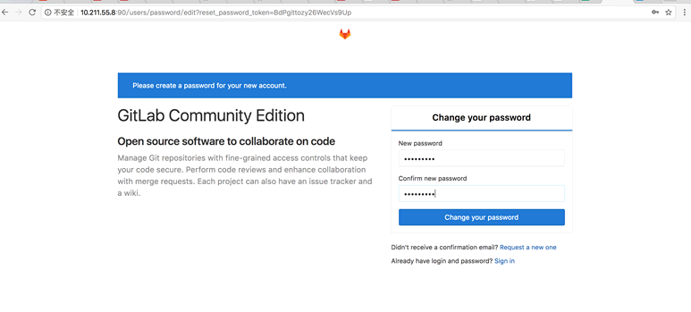

<!-- more -->

# gitlab仓库管理

[CentOS服务器上搭建Gitlab安装步骤](http://www.21yunwei.com/archives/4351)

## 一、安装配置依赖项

```shell
sudo yum install curl openssh-server openssh-clients postfix cronie -y

sudo service postfix start

sudo chkconfig postfix on

sudo lokkit -s http -s ssh
```

## 二、添加[GitLab](http://www.21yunwei.com/archives/category/ywtech/codemanage/gitlab)仓库,并安装到服务器上

wget <https://mirrors.tuna.tsinghua.edu.cn/gitlab-ce/yum/el6/gitlab-ce-10.1.4-ce.0.el6.x86_64.rpm>

rpm -ivh gitlab-ce-XXX.rpm

启动gitlab：`sudo gitlab-ctl reconfigure`

如果访问 `http:127.0.0.1:80` 无法访问，然后用命令查看日志（ `gitlab-ctl tail` #查看所有日志）：gitlab-ctl tail 返现80端口被占用。

修改gitlab启动端口：

gitlab本身采用80端口，如安装前服务器有启用80，安装完访问会报错。需更改gitlab的默认端口。修改 `vim /etc/gitlab/gitlab.rb：external_url 'http://10.211.55.8:90'`

执行 `sudo gitlab-ctl reconfigure` 使之生效，访问如下：

管理员账户为root，密码首次登陆会让你自己更改。



gitlab-ctl start|stop|status|restart
