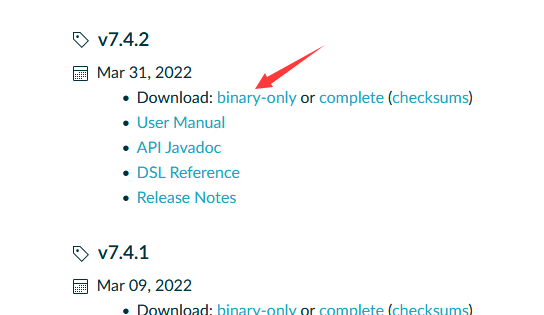
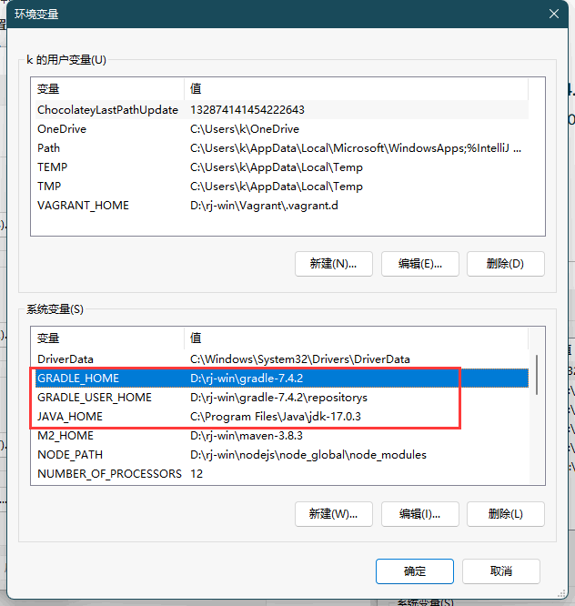
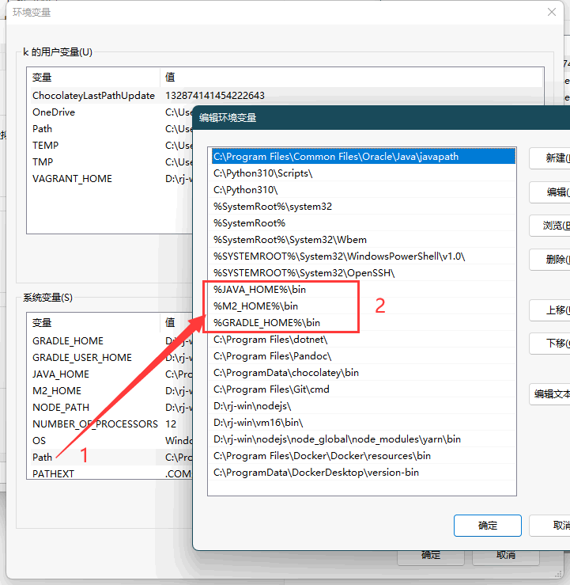
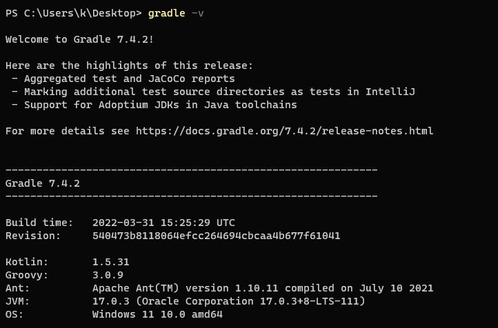
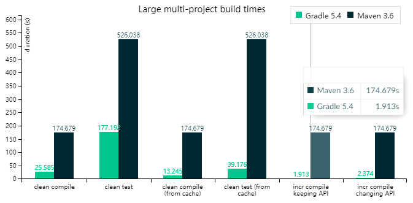
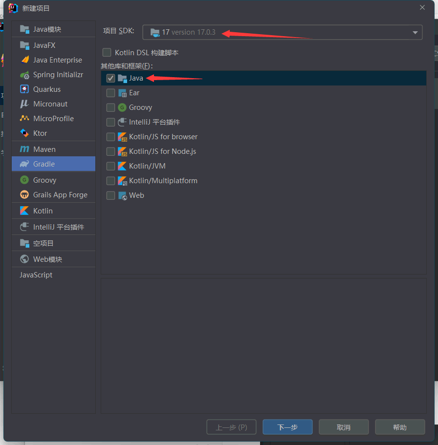
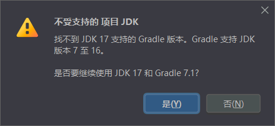
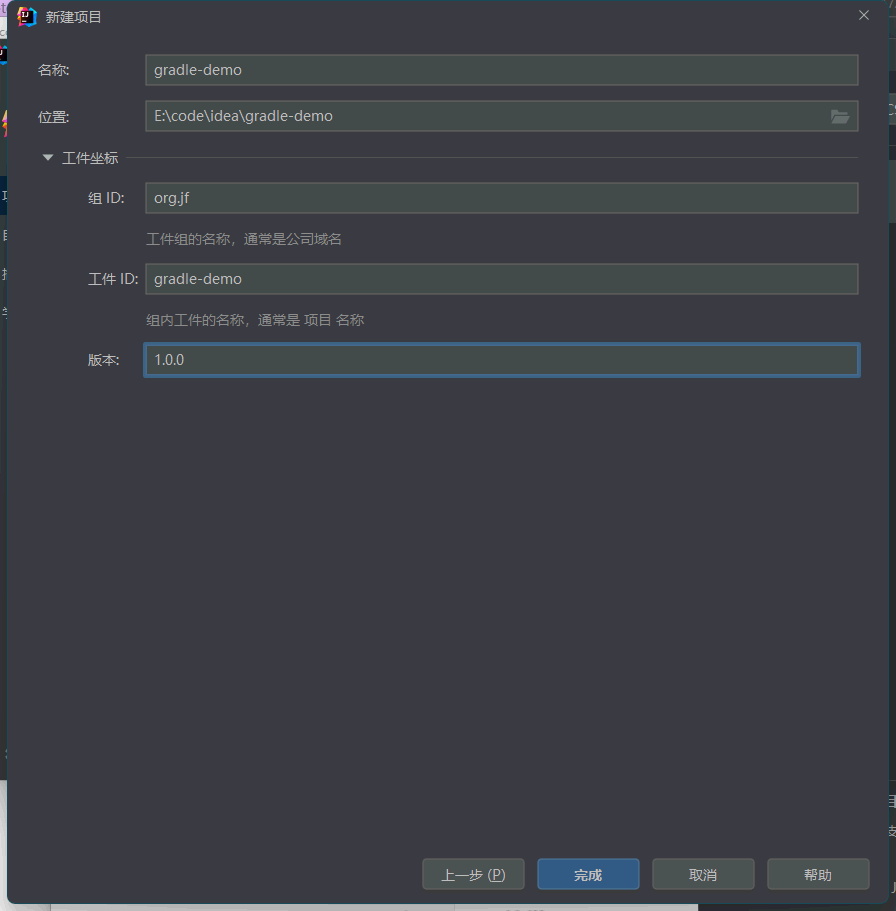

Gradle管理

<!-- more -->

# gradle 使用笔记

## 技术选型

| 名称     | 版本                                                                                              |
|--------|-------------------------------------------------------------------------------------------------|
| JDK    | 21.x                                                                                          |
| Gradle | 8.5，<a target="_blank" href="https://docs.gradle.org/8.5/userguide/userguide.pdf">PDF文档</a> |
| Groovy | 1.5.8 - 4.0.0                                                                                   |
| Kotlin | 1.6.10 - 1.9.20                                                                                 |

## jdk对应版本

[对应版本关系](https://docs.gradle.org/current/userguide/compatibility.html#java)

| Java version | Support for compiling/testing/… | Support for running Gradle |
| :----------- | :------------------------------ | :------------------------- |
| 8            | N/A                             | 2.0                        |
| 9            | N/A                             | 4.3                        |
| 10           | N/A                             | 4.7                        |
| 11           | N/A                             | 5.0                        |
| 12           | N/A                             | 5.4                        |
| 13           | N/A                             | 6.0                        |
| 14           | N/A                             | 6.3                        |
| 15           | 6.7                             | 6.7                        |
| 16           | 7.0                             | 7.0                        |
| 17           | 7.3                             | 7.3                        |
| 18           | 7.5                             | 7.5                        |
| 19           | 7.6                             | 7.6                        |
| 20           | 8.1                             | 8.3                        |
| 21           | 8.4                             | 8.5                        |

## 下载与配置

<a target="_blank" href="https://gradle.org">首页</a>、<a target="_blank" href="https://gradle.org/releases/">下载页</a>

选择 `7.4.2` 版本



window配置

新建`系统环境变量`





配置gradle本地仓库：`D:\rj-win\gradle-7.4.2\init.d\init.gradle`

```properties
allprojects {
    repositories {
        maven { url 'file:///D:/rj-win/gradle-7.4.2/repositorys'}
        mavenLocal()
        maven { url 'https://maven.aliyun.com/repository/public' }
        maven { url 'https://maven.aliyun.com/repository/jcenter' }
        maven { url 'https://maven.aliyun.com/repository/spring' }
        maven { url 'https://maven.aliyun.com/repository/spring-plugin' }       
        maven { url 'https://maven.aliyun.com/repository/gradle-plugin' }      
        maven { url 'https://maven.aliyun.com/repository/google' }
        maven { url 'https://maven.aliyun.com/repository/grails-core' }       
        maven { url 'https://maven.aliyun.com/repository/apache-snapshots' }
        maven { url 'http://nexus.bsdn.org/content/groups/public/' }
        mavenCentral()
    }

    buildscript { 
        repositories { 
   maven { url 'https://maven.aliyun.com/repository/public' }
   maven { url 'https://maven.aliyun.com/repository/jcenter' }
   maven { url 'https://maven.aliyun.com/repository/spring' }
   maven { url 'https://maven.aliyun.com/repository/spring-plugin' }       
   maven { url 'https://maven.aliyun.com/repository/gradle-plugin' }      
   maven { url 'https://maven.aliyun.com/repository/google' }
   maven { url 'https://maven.aliyun.com/repository/grails-core' }       
   maven { url 'https://maven.aliyun.com/repository/apache-snapshots' }
   maven { url 'http://nexus.bsdn.org/content/groups/public/' }
            maven { url 'https://plugins.gradle.org/m2/' }
        }
    }
}
```

重启系统并校验 CMD：gradle -v



## 与maven比较



`图中是大型多模块项目Maven和Gradle编译时间的对比，来自gradle官网`

Gradle是：

- 大型项目更快
- 无限制可定制 `==` 更陡峭的学习曲线
- 使用Groovy或Kotlin代替XML

而Maven是：

- 普遍采用
- 对于较小项目更简单
- 带有XML和尖括号

## Groovy 的优点

简要介绍一下Groovy。Groovy是一种JVM语言，它可以编译为与Java相同的字节码，并且可以与Java类无缝地互操作。Groovy是Java的向后兼容超集，这意味着Groovy可以透明地与Java库和代码交互。但是，它还增加了许多新功能：可选的键入，函数式编程，运行时灵活性以及许多元编程内容。它还极大地清理了Java中许多冗长的代码格式。Groovy尚未成为主流的开发语言，但是它已经在测试（由于其简化的语法和元编程功能）和构建系统中占据了一席之地。

## 创建项目 Gradle+Java





选择 `是`

下一步，设置 `组`、`工件`、`版本`



### 报错

```bash
Unsupported Java. 
Your build is currently configured to use Java 17.0.3 and Gradle 7.1.

Possible solution:
 - Use Java 16 as Gradle JVM: Open Gradle settings 
 - Open Gradle wrapper settings, change `distributionUrl` property to use compatible Gradle version and reload the project
```

### 重新修改gradle版本

`gradle -> wrapper -> gradle-wrapper.properties`

```properties
distributionUrl=https\://services.gradle.org/distributions/gradle-7.1-bin.zip
```

改为：

```properties
distributionUrl=https\://services.gradle.org/distributions/gradle-7.4.2-bin.zip
```

## 创建项目 Gradle+Groovy

### 为什么使用 Groovy?

答案在于 Gradle 内部的运行环境。 虽然 Gradle 核心目的是作为通用构建工具，但它还是主要面向 Java 项目。 这些项目的团队成员显然熟悉 Java。我们认为一个构建工具应该尽可能地对所有团队成员透明。

## 创建项目 Gradle+Kotlin

## 核心文件

### build.gradle

类似于maven的pom文件、依赖配置

```yml
//添加构建插件
plugins {
    id 'java'
}

group 'org.jf'
version '1.0.0'

//项目依赖关系的仓库地址
repositories {
    maven { url 'file:///D:/rj-win/gradle-7.4.2/repositorys' }
    mavenLocal()
    maven { url('https://maven.aliyun.com/repository/public') }
    maven { url 'https://maven.aliyun.com/repository/jcenter' }
    maven { url 'https://maven.aliyun.com/repository/spring' }
    maven { url 'https://maven.aliyun.com/repository/spring-plugin' }
    maven { url 'https://maven.aliyun.com/repository/gradle-plugin' }
    maven { url 'https://maven.aliyun.com/repository/google' }
    maven { url 'https://maven.aliyun.com/repository/grails-core' }
    maven { url 'https://maven.aliyun.com/repository/apache-snapshots' }
    mavenCentral()
}

//项目依赖
dependencies {
    testImplementation 'org.junit.jupiter:junit-jupiter-api:5.7.0'
    testRuntimeOnly 'org.junit.jupiter:junit-jupiter-engine:5.7.0'
}

//测试依赖
test {
    useJUnitPlatform()
}
```

### settings.gradle

项目的gradle配置，里面包含了创建的各子模块.

```properties
rootProject.name = 'gradle-demo'
include 'gradle-demo-pro1'
include 'gradle-demo-mybatis-plus'
include 'gradle-demo-jdbc'
```

### gradle -> wrapper -> gradle-wrapper.properties

gradle服务核心配置

```properties
distributionBase=GRADLE_USER_HOME
distributionPath=wrapper/dists
distributionUrl=https\://services.gradle.org/distributions/gradle-7.4.2-bin.zip
zipStoreBase=GRADLE_USER_HOME
zipStorePath=wrapper/dists
```

### gradle.properties

gradle环境参数配置

```properties
version=1.0.0

org.gradle.caching=true
org.gradle.parallel=true
org.gradle.jvmargs=-Xmx2g -Dfile.encoding=UTF-8
#org.gradle.jvmargs=-Xmx4g -XX:MaxPermSize=512m -XX:+HeapDumpOnOutOfMemoryError -Dfile.encoding=UTF-8systemProp.http.proxyHost=127.0.0.1systemProp.http.proxyPort=10800systemProp.https.proxyHost=127.0.0.1systemProp.https.proxyPort=10800systemProp.file.encoding=UTF-8org.gradle.warning.mode=all

#groovyVersion=xxx
kotlinVersion=xxx
tomcatVersion=10.0.22

kotlin.stdlib.default.dependency=false
```

## 语法

### build.gradle 配置信息格式

Groovy

```properties
implementation 'org.codehaus.groovy:groovy-all:2.4.15'
```

Kotlin

```properties
implementation("org.codehaus.groovy:groovy-all:2.4.15")
```

### 依赖管理

gradle依赖的粒度控制相较于Maven也更加精细，maven只有compile、provided、test、runtime四种scope，而gradle有以下几种scope：

1、implementation，默认的scope。implementation的作用域会让依赖在编译和运行时均包含在内，但是不会暴露在类库使用者的编译时。举例，如果我们的类库包含了gson，那么其他人使用我们的类库时，编译时不会出现gson的依赖。

2、api，和implementation类似，都是编译和运行时都可见的依赖。但是api允许我们将自己类库的依赖暴露给我们类库的使用者。

3、compileOnly和runtimeOnly，这两种顾名思义，一种只在编译时可见，一种只在运行时可见。而runtimeOnly和Maven的provided比较接近。

4、testImplementation，这种依赖在测试编译时和运行时可见，类似于Maven的test作用域。

5、testCompileOnly和testRuntimeOnly，这两种类似于compileOnly和runtimeOnly，但是作用于测试编译时和运行时。

通过简短精悍的依赖配置和多种多样的作用与选择，Gradle可以为我们提供比Maven更加优秀的依赖管理功能。

## 发布到 Maven 仓库

```
plugin: 'maven'
uploadArchives {
    repositories {
        mavenDeployer {
            repository(url: "file://localhost/tmp/myRepo/")
        }
    }
}
```
