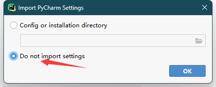
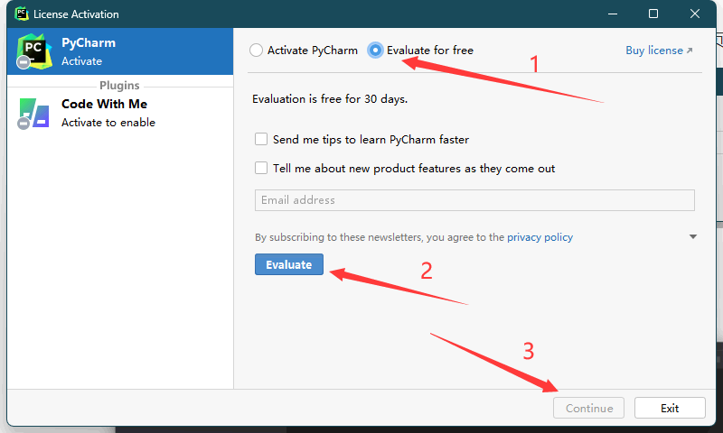
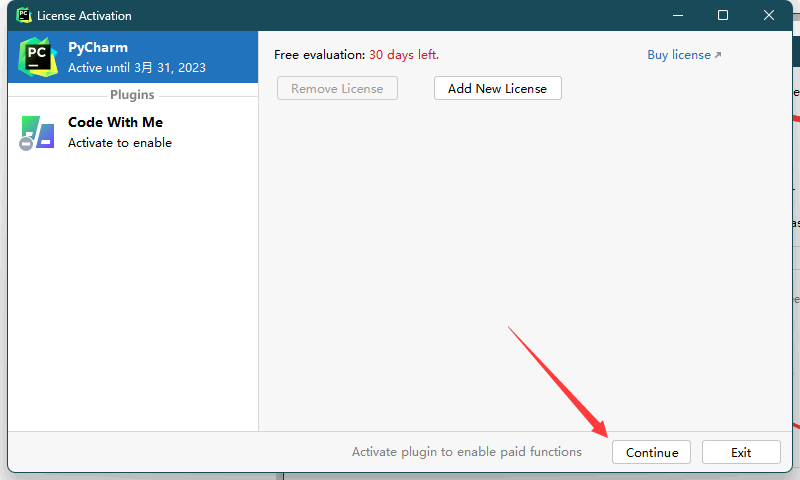
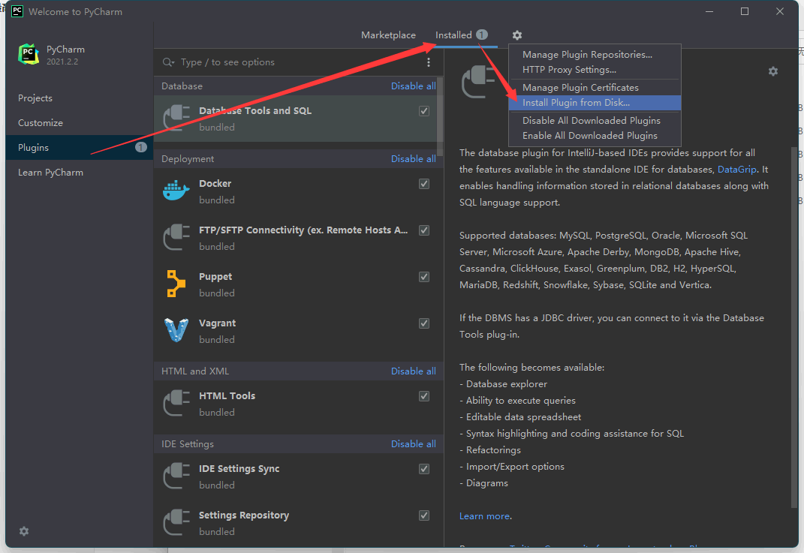
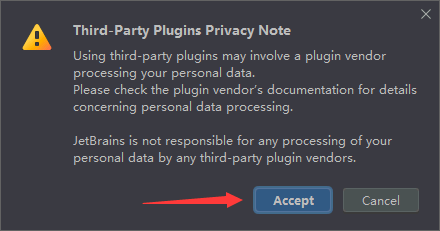
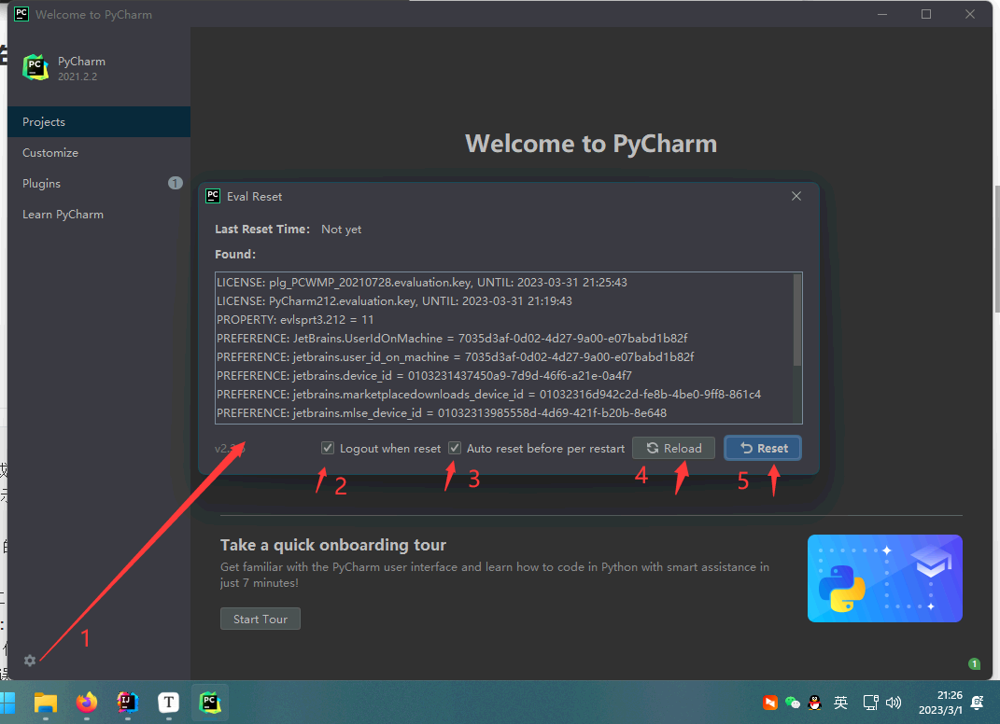
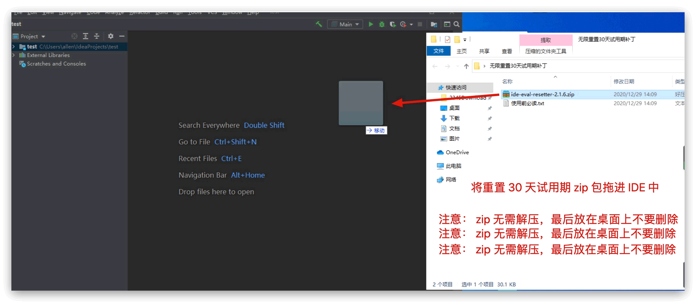
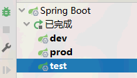
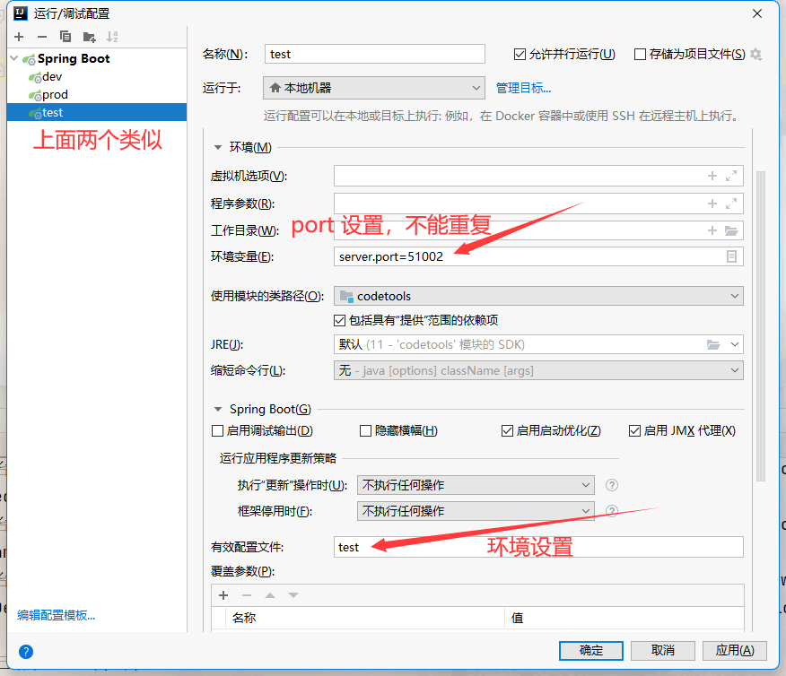

IDEA管理

<!-- more -->

## 常用的插件

Alibaba Java、CamelCase、Chinese、codeGlance3、codota、GenerateAllSetter、gitee、Grep Console、mybatis-log、RestfulToolkit、Translation、vuejs、GsonFormatPlus、json parser

## JetBrains 全系列产品无限试用

1、本激活方法适用于2021.2.2-、2020、2019、2018全系列版本；

2、本教程适用于 JetBrains 全系列产品，包括 Pycharm、IDEA、WebStorm、Phpstorm、Datagrip、RubyMine、CLion、AppCode 等。

### 方式1：无限重置30天试用期教程（最高支持版本2021.2.2）

[参考地址](https://www.exception.site/essay/idea-reset-eval)

[PyCharm 下载地址](https://www.jetbrains.com/zh-cn/pycharm/download/other.html)

[IDEA 下载地址](https://www.jetbrains.com/zh-cn/idea/download/other.html)

安装后，点击开始试用









选择`ide-eval-resetter-2.3.5.zip`文件后，弹出下面框



然后重启程序



或者使用拖拽方式（将 `ide-eval-resetter-2.3.5.zip` 拖拽到pycharm主页里）



### 方式2：激活到2099年教程

[方式2：激活到2099年教程](https://www.exception.site/essay/how-to-free-use-intellij-idea-2019-3)

### 关闭自动更新


## linux 创建 desktop 桌面文件

- idea.desktop

×最好创建在idea-IU/bin/目录里×

```
[Desktop Entry]
Encoding=UTF-8
Name=idea 2021.2.2
Comment=idea 2021.2.2
Exec=/data/home/yus/data/rj/idea-IU/bin/idea.sh
Icon=/data/home/yus/data/rj/idea-IU/bin/idea.png
Terminal=false
starttupNotify=true
Type=Application
Categories=Application;Development;
```

- 构建快捷菜单方式

```
#!/bin/bash

echo "-----------开始构建快捷-------------"
echo "----------------------------------"
echo
ln -s /data/home/yus/data/rj/idea-IU/bin/idea.desktop /usr/share/applications/idea.desktop
echo "link idea.desktop to [/usr/share/applications]"
echo "查看："
ls -all /usr/share/applications/idea.desktop
sleep 3
echo
echo
# （/usr/local/share/applications）这个目录可能不存在，没关系的
ln -s /data/home/yus/data/rj/idea-IU/bin/idea.desktop /usr/local/share/applications/idea.desktop
echo "link idea.desktop to [/usr/local/share/applications]"
echo
echo "查看："
ls -all /usr/local/share/applications/idea.desktop
echo
echo "-----------------------------------"1
sleep 9

```

- 删除

```
#!/bin/bash

echo "----------------------------------------------------------"
echo
rm -rf /usr/share/applications/idea.desktop
echo "rm /usr/share/applications/idea.desktop"
echo
sleep 3
echo
rm -rf /usr/local/share/applications/idea.desktop
echo "rm /usr/local/share/applications/idea.desktop"
echo
echo "----------------------------------------------------------"
sleep 6
```


## 常用快捷键

```markdown
Ctrl+空格: 代码提示
Ctrl+Alt+Space: 类名或接口名提示
Ctrl+P: 使用方法参数提示
Ctrl+Q: 显示注释文档
Ctrl+F12: 显示当前类中的成员变量和方法
Ctrl+H: 显示类结构图
Alt+1: 快速打开或隐藏工程面板
Ctrl+Alt+ left/right: 返回至上次浏览的位置
Alt+ left/right: 切换代码视图
F2 或Shift+F2: 高亮错误或警告快速定位
双击Shift: 查找项目中所有目录中的文件

Ctr+F: 在当前文件中查找指定内容
Ctrl+Shift+F: 在当前项目查找包含查找内容的文件
Ctrl+N: 查找类
Ctrl+Shift+N: 查找类和文件
Ctrl+E: 显示最近使用过的文件
Alt+F7: 查找函数或者变量或者类的所有引用到的地方
Ctrl+Shift+Alt+N: 查找类中的方法或变量
Ctrl+D: 复制当前行到下一行
Ctrl+X: 剪切当前行
Ctrl+C/Ctrl+V: 复制/粘贴
Ctrl+Z: 撤销

Ctrl+Shift+Z: 取消撤销
Shift+Enter: 另起一行
Ctrl+R: 当前文件替内容
Ctrl+Shift+R: 当前项目文件替换
Shift+F6: 重命名项目、类、方法、变量
Ctrl+K: 代码提交到SVN
Ctrl+T: 更新代码
Alt+Insert: 在类上自动生成构造器、getter/setter等等常用方法，在项目上创建新的类和文件
Ctrl+Alt+O: 优化导入的类和包
Ctrl+Shift+Space: 自动补全代码
Alt+Shift+C: 对比最近修改的代码

Ctrl+Shift+上键/下键: 代码向上/下移动
Ctrl+/ 或 Ctrl+Shift+/:注释
Ctrl+Alt+left/right: 返回至上次浏览的位置
Alt+Up/Down: 在方法间快速移动定位
Ctrl+W: 选中代码，连续按会有其他效果Alt+F3 ，逐个往下查找相同文本，并高亮显示
Ctrl+Up/Down: 光标跳转到第一行或最后一行下Ctrl+B 快速打开光标处的类或方法
Alt+Enter: 导入包,修正代码,实现接口方法,简化代码等等
Ctrl+Alt+L: 自动格式化代码
CTRL+ALT+I:  自动缩进 
CTRL+ALT+O:  优化导入的类和包 
ALT+INSERT:  生成代码(如GET,SET方法,构造函数等) 

CTRL+E: 最近更改的代码 
CTRL+SHIFT+SPACE: 自动补全代码 
CTRL+空格:  代码提示 
CTRL+ALT+SPACE:  类名或接口名提示 
CTRL+P:   方法参数提示 
CTRL+J:   自动代码 
CTRL+ALT+T:  把选中的代码放在 TRY{} IF{} ELSE{} 里
Ctrl+Shift+U： 大小写的快速切换

```

## idea设置 java类文件注释模板

```java
/**
  * 
  * @author jf
  * @jdk-version: 17
  * @date: ${DATE} ${TIME}
  * /
```

## 同一个启动类：多环境+多port 运行




