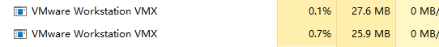

Vagrant_VMware虚拟机批量处理

<!-- more -->

## 一、安装 centos7.9 模板

*安装：略略略略*

## 步骤

1. 查看当前系统版本
2. 设置sudo权限
3. 国内yum源
4. 升级内核
5. 关闭防火墙firewalld、关闭selinux
6. 配置网卡
7. 禁用该可预测命名规则
8. 重新生成GRUB配置并更新内核参数

## 1、查看当前系统版本

```shell
# cat /etc/redhat-release
CentOS Linux release 7.9.2009 (Core)
```

## 2、设置sudo权限

1、su root

2、chmod u+w /etc/sudoers

3、vim /etc/sudoers

> root ALL=(ALL) ALL
>
> a ALL=(ALL) ALL

4、撤销sudoers文件写权限，命令：

chmod u-w /etc/sudoers

5、切换用户
su a

## 3、国内yum源（使用华为）

[阿里镜像站](https://developer.aliyun.com/mirror/?spm=a2c6h.13651102.0.0.44e61b11ewNwcu&serviceType=mirror&tag=%E7%B3%BB%E7%BB%9F)

[华为镜像站](https://mirrors.huaweicloud.com/home)

### CentOS-Base.repo

#### centos7

```shell
# 备份
mv /etc/yum.repos.d/CentOS-Base.repo /etc/yum.repos.d/CentOS-Base.repo.backup
# 配置下载
wget -O /etc/yum.repos.d/CentOS-Base-huawei.repo https://repo.huaweicloud.com/repository/conf/CentOS-7-reg.repo

yum clean all && yum makecache && yum -y update && yum repolist all

-----------------------------------CentOS-Base.repo--------------------------------------
[base]
name=CentOS-$releasever - Base - repo.huaweicloud.com
baseurl=https://repo.huaweicloud.com/centos/$releasever/os/$basearch/
#mirrorlist=https://mirrorlist.centos.org/?release=$releasever&arch=$basearch&repo=os
gpgcheck=1
gpgkey=https://repo.huaweicloud.com/centos/RPM-GPG-KEY-CentOS-7

#发布更新
[updates]
name=CentOS-$releasever - Updates - repo.huaweicloud.com
baseurl=https://repo.huaweicloud.com/centos/$releasever/updates/$basearch/
#mirrorlist=https://mirrorlist.centos.org/?release=$releasever&arch=$basearch&repo=updates
gpgcheck=1
gpgkey=https://repo.huaweicloud.com/centos/RPM-GPG-KEY-CentOS-7

#可能有用的附加软件包
[extras]
name=CentOS-$releasever - Extras - repo.huaweicloud.com
baseurl=https://repo.huaweicloud.com/centos/$releasever/extras/$basearch/
#mirrorlist=https://mirrorlist.centos.org/?release=$releasever&arch=$basearch&repo=extras
gpgcheck=1
gpgkey=https://repo.huaweicloud.com/centos/RPM-GPG-KEY-CentOS-7

#扩展现有软件包功能的附加软件包
[centosplus]
name=CentOS-$releasever - Plus - repo.huaweicloud.com
baseurl=https://repo.huaweicloud.com/centos/$releasever/centosplus/$basearch/
#mirrorlist=https://mirrorlist.centos.org/?release=$releasever&arch=$basearch&repo=centosplus
gpgcheck=1
enabled=1
gpgkey=https://repo.huaweicloud.com/centos/RPM-GPG-KEY-CentOS-7

----------------------------------------------------------------------------------------------------------------------------------------------------------------------------------------------------------------
# 阿里
wget -O /etc/yum.repos.d/CentOS-Base.repo http://mirrors.aliyun.com/repo/Centos-7.repo
curl -o /etc/yum.repos.d/CentOS-Base.repo https://mirrors.aliyun.com/repo/Centos-7.repo
wget http://mirrors.aliyun.com/repo/Centos-7.repo
sed -i -e '/mirrors.cloud.aliyuncs.com/d' -e '/mirrors.aliyuncs.com/d' /etc/yum.repos.d/CentOS-Base.repo

yum clean all && yum makecache && yum -y update && yum repolist all
```

#### ubuntu

```shell
华为：
cp -a /etc/apt/sources.list /etc/apt/sources.list.bak

将http://archive.ubuntu.com和http://security.ubuntu.com替换成http://repo.huaweicloud.com，可以参考如下命令：
sed -i "s@http://.*archive.ubuntu.com@http://repo.huaweicloud.com@g" /etc/apt/sources.list
sed -i "s@http://.*security.ubuntu.com@http://repo.huaweicloud.com@g" /etc/apt/sources.list

执行 yum update 更新索引
--------------------------------------------------------------------------------------------------------------------------------------------------------------------------------------------------------------------------------------
阿里：
替换默认的http://archive.ubuntu.com/为mirrors.aliyun.com

deb http://mirrors.aliyun.com/ubuntu/ focal main restricted universe multiverse
deb-src http://mirrors.aliyun.com/ubuntu/ focal main restricted universe multiverse

deb http://mirrors.aliyun.com/ubuntu/ focal-security main restricted universe multiverse
deb-src http://mirrors.aliyun.com/ubuntu/ focal-security main restricted universe multiverse

deb http://mirrors.aliyun.com/ubuntu/ focal-updates main restricted universe multiverse
deb-src http://mirrors.aliyun.com/ubuntu/ focal-updates main restricted universe multiverse

# deb http://mirrors.aliyun.com/ubuntu/ focal-proposed main restricted universe multiverse
# deb-src http://mirrors.aliyun.com/ubuntu/ focal-proposed main restricted universe multiverse

deb http://mirrors.aliyun.com/ubuntu/ focal-backports main restricted universe multiverse
deb-src http://mirrors.aliyun.com/ubuntu/ focal-backports main restricted universe multiverse

执行 yum update 更新索引
```

### elrepo.repo

#### 华为

<https://mirrors.huaweicloud.com/home> 搜索 epel

1 查看：yum list | grep epel-release

=== epel-release.noarch      7-11        extras

2 安装：yum install -y epel-release yum remove -y epel-release

3 替换：

rm -rf /etc/yum.repos.d/epel-testing.repo（不需要这个文件！）

> sed -i "s/#baseurl/baseurl/g" /etc/yum.repos.d/epel.repo
>
> sed -i "s/metalink/#metalink/g" /etc/yum.repos.d/epel.repo
>
> sed -i "s@https\?://download.fedoraproject.org/pub@<https://repo.huaweicloud.com@g>" /etc/yum.repos.d/epel.repo

4 执行 yum -y clean all && yum -y makecache && yum -y update && yum repolist all

##### epel.repo

```shell
[epel]
name=Extra Packages for Enterprise Linux 7 - $basearch
baseurl=https://repo.huaweicloud.com/epel/7/$basearch
#metalink=https://mirrors.fedoraproject.org/#metalink?repo=epel-7&arch=$basearch
failovermethod=priority
enabled=1
gpgcheck=1
gpgkey=file:///etc/pki/rpm-gpg/RPM-GPG-KEY-EPEL-7

[epel-debuginfo]
name=Extra Packages for Enterprise Linux 7 - $basearch - Debug
baseurl=https://repo.huaweicloud.com/epel/7/$basearch/debug
#metalink=https://mirrors.fedoraproject.org/#metalink?repo=epel-debug-7&arch=$basearch
failovermethod=priority
enabled=0
gpgkey=file:///etc/pki/rpm-gpg/RPM-GPG-KEY-EPEL-7
gpgcheck=1

[epel-source]
name=Extra Packages for Enterprise Linux 7 - $basearch - Source
baseurl=https://repo.huaweicloud.com/epel/7/SRPMS
#metalink=https://mirrors.fedoraproject.org/#metalink?repo=epel-source-7&arch=$basearch
failovermethod=priority
enabled=0
gpgkey=file:///etc/pki/rpm-gpg/RPM-GPG-KEY-EPEL-7
gpgcheck=1
```

##### epel.repo.rpmnew 自动生成

```shell
[epel]
name=Extra Packages for Enterprise Linux 7 - $basearch
# 使用metalink更安全，但如果你想使用本地镜像
# 把它的地址放在这里。
#baseurl=http://download.example/pub/epel/7/$basearch
metalink=https://mirrors.fedoraproject.org/metalink?repo=epel-7&arch=$basearch&infra=$infra&content=$contentdir
failovermethod=priority
enabled=1
gpgcheck=1
gpgkey=file:///etc/pki/rpm-gpg/RPM-GPG-KEY-EPEL-7
```

#### 阿里

<https://developer.aliyun.com/mirror/epel>

1 查看：yum list | grep epel-release

=== epel-release.noarch      7-11        extras

2 安装：yum install -y epel-release

> mv /etc/yum.repos.d/epel.repo /etc/yum.repos.d/epel.repo.backup
>
> mv /etc/yum.repos.d/epel-testing.repo /etc/yum.repos.d/epel-testing.repo.backup

3 wget -O /etc/yum.repos.d/epel.repo <http://mirrors.aliyun.com/repo/epel-7.repo>

## 4、升级内核、并删除当前无用的系统内核版本

[https://kernel.org/](https://kernel.org/)

| mainline: | **5.18-rc6**      | 2022-05-08 | [[tarball](https://git.kernel.org/torvalds/t/linux-5.18-rc6.tar.gz)] |                                                              | [[patch](https://git.kernel.org/torvalds/p/v5.18-rc6/v5.17)] | [[inc. patch](https://git.kernel.org/torvalds/p/v5.18-rc6/v5.18-rc5)] | [[view diff](https://git.kernel.org/torvalds/ds/v5.18-rc6/v5.18-rc5)] | [[browse](https://git.kernel.org/torvalds/h/v5.18-rc6)] |                                                              |
| --------- | ----------------- | ---------- | ------------------------------------------------------------ | ------------------------------------------------------------ | ------------------------------------------------------------ | ------------------------------------------------------------ | ------------------------------------------------------------ | ------------------------------------------------------- | ------------------------------------------------------------ |
| stable:   | **5.17.6**        | 2022-05-09 | [[tarball](https://cdn.kernel.org/pub/linux/kernel/v5.x/linux-5.17.6.tar.xz)] | [[pgp](https://cdn.kernel.org/pub/linux/kernel/v5.x/linux-5.17.6.tar.sign)] | [[patch](https://cdn.kernel.org/pub/linux/kernel/v5.x/patch-5.17.6.xz)] | [[inc. patch](https://cdn.kernel.org/pub/linux/kernel/v5.x/incr/patch-5.17.5-6.xz)] | [[view diff](https://git.kernel.org/stable/ds/v5.17.6/v5.17.5)] | [[browse](https://git.kernel.org/stable/h/v5.17.6)]     | [[changelog](https://cdn.kernel.org/pub/linux/kernel/v5.x/ChangeLog-5.17.6)] |
| stable:   | **5.16.20 [EOL]** | 2022-04-13 | [[tarball](https://cdn.kernel.org/pub/linux/kernel/v5.x/linux-5.16.20.tar.xz)] | [[pgp](https://cdn.kernel.org/pub/linux/kernel/v5.x/linux-5.16.20.tar.sign)] | [[patch](https://cdn.kernel.org/pub/linux/kernel/v5.x/patch-5.16.20.xz)] | [[inc. patch](https://cdn.kernel.org/pub/linux/kernel/v5.x/incr/patch-5.16.19-20.xz)] | [[view diff](https://git.kernel.org/stable/ds/v5.16.20/v5.16.19)] | [[browse](https://git.kernel.org/stable/h/v5.16.20)]    | [[changelog](https://cdn.kernel.org/pub/linux/kernel/v5.x/ChangeLog-5.16.20)] |
| longterm: | **5.15.38**       | 2022-05-09 | [[tarball](https://cdn.kernel.org/pub/linux/kernel/v5.x/linux-5.15.38.tar.xz)] | [[pgp](https://cdn.kernel.org/pub/linux/kernel/v5.x/linux-5.15.38.tar.sign)] | [[patch](https://cdn.kernel.org/pub/linux/kernel/v5.x/patch-5.15.38.xz)] | [[inc. patch](https://cdn.kernel.org/pub/linux/kernel/v5.x/incr/patch-5.15.37-38.xz)] | [[view diff](https://git.kernel.org/stable/ds/v5.15.38/v5.15.37)] | [[browse](https://git.kernel.org/stable/h/v5.15.38)]    | [[changelog](https://cdn.kernel.org/pub/linux/kernel/v5.x/ChangeLog-5.15.38)] |
| longterm: | **5.10.114**      | 2022-05-09 | [[tarball](https://cdn.kernel.org/pub/linux/kernel/v5.x/linux-5.10.114.tar.xz)] | [[pgp](https://cdn.kernel.org/pub/linux/kernel/v5.x/linux-5.10.114.tar.sign)] | [[patch](https://cdn.kernel.org/pub/linux/kernel/v5.x/patch-5.10.114.xz)] | [[inc. patch](https://cdn.kernel.org/pub/linux/kernel/v5.x/incr/patch-5.10.113-114.xz)] | [[view diff](https://git.kernel.org/stable/ds/v5.10.114/v5.10.113)] | [[browse](https://git.kernel.org/stable/h/v5.10.114)]   | [[changelog](https://cdn.kernel.org/pub/linux/kernel/v5.x/ChangeLog-5.10.114)] |
| longterm: | **5.4.192**       | 2022-05-09 | [[tarball](https://cdn.kernel.org/pub/linux/kernel/v5.x/linux-5.4.192.tar.xz)] | [[pgp](https://cdn.kernel.org/pub/linux/kernel/v5.x/linux-5.4.192.tar.sign)] | [[patch](https://cdn.kernel.org/pub/linux/kernel/v5.x/patch-5.4.192.xz)] | [[inc. patch](https://cdn.kernel.org/pub/linux/kernel/v5.x/incr/patch-5.4.191-192.xz)] | [[view diff](https://git.kernel.org/stable/ds/v5.4.192/v5.4.191)] | [[browse](https://git.kernel.org/stable/h/v5.4.192)]    | [[changelog](https://cdn.kernel.org/pub/linux/kernel/v5.x/ChangeLog-5.4.192)] |

### centos 内核升级

[http://www.elrepo.org/](http://www.elrepo.org/)

```shell
# 导入该源的秘钥
rpm --import https://www.elrepo.org/RPM-GPG-KEY-elrepo.org
# 启用该源仓库
rpm -Uvh http://www.elrepo.org/elrepo-release-7.0-6.el7.elrepo.noarch.rpm
或者：
yum -y install https://www.elrepo.org/elrepo-release-7.el7.elrepo.noarch.rpm
```

查看可升级的内核版本

```shell
yum --disablerepo="*" --enablerepo="elrepo-kernel" list available
```

可安装的软件包

kernel-lt.x86_64  5.4.211-1.el7.elrepo  elrepo-kernel

kernel-ml.x86_64  5.19.4-1.el7.elrepo  elrepo-kernel

安装内核

```shell
yum --enablerepo=elrepo-kernel install -y kernel-lt-5.4.211-1.el7.elrepo
```

查看当前系统内可用内核

```shell
awk -F\' '$1=="menuentry " {print i++ " : " $2}' /etc/grub2.cfg
```

设置开机从新内核版本启动（其中 0 是上面查询出来的可用内核编号）

```shell
grub2-set-default 0 && reboot
```

### 并删除当前无用的系统内核版本

所有已安装的内核版本

```shell
[root@master ~]# rpm -qa | grep kernel

kernel-tools-libs-3.10.0-1160.76.1.el7.x86_64
kernel-3.10.0-1160.76.1.el7.x86_64
kernel-headers-3.10.0-1160.76.1.el7.x86_64
kernel-devel-3.10.0-1160.el7.x86_64
kernel-tools-3.10.0-1160.76.1.el7.x86_64
kernel-devel-3.10.0-1160.76.1.el7.x86_64
kernel-lt-5.4.211-1.el7.elrepo.x86_64
kernel-3.10.0-1160.el7.x86_64
abrt-addon-kerneloops-2.1.11-60.el7.centos.x86_64
```

当前使用的内核版本

```shell
[root@master ~]# uname -r
5.4.192-1.el7.elrepo.x86_64
```

删除

```shell
yum remove -y kernel-3.10.0-1160.el7.x86_64 kernel-3.10.0-1160.76.1.el7.x86_64
```

或

```shell
yum remove $(rpm -qa | grep kernel | grep -v $(uname -r))

# 卸载后重新安装
yum --enablerepo=elrepo-kernel install -y kernel-lt-devel-5.4.211-1.el7.elrepo \
kernel-lt-doc-5.4.211-1.el7.elrepo \
kernel-lt-headers-5.4.211-1.el7.elrepo \
kernel-lt-tools-5.4.211-1.el7.elrepo \
kernel-lt-tools-libs-5.4.211-1.el7.elrepo \
kernel-lt-tools-libs-devel-5.4.211-1.el7.elrepo

[root@master ~]# rpm -qa | grep kernel
kernel-lt-doc-5.4.211-1.el7.elrepo.noarch
kernel-lt-tools-5.4.211-1.el7.elrepo.x86_64
kernel-lt-devel-5.4.211-1.el7.elrepo.x86_64
kernel-lt-5.4.211-1.el7.elrepo.x86_64
kernel-lt-tools-libs-5.4.211-1.el7.elrepo.x86_64
kernel-lt-headers-5.4.211-1.el7.elrepo.x86_64
kernel-lt-tools-libs-devel-5.4.211-1.el7.elrepo.x86_64


yum install -y gcc make ncurses-devel openssl-devel flex bison  elfutils-libelf-devel
```

## 5、关闭防火墙firewalld、关闭selinux、关闭swap、确保不休眠

```shell
# 1、 关闭防火墙
## centos
systemctl start firewalld  systemctl stop firewalld
systemctl enable firewalld  systemctl disable firewalld
systemctl status firewalld
## ubuntu
systemctl disable ufw.service && systemctl stop ufw.service
ufw start  ufw stop  
ufw enable  ufw disable  
ufw status

# 2、 关闭selinux
setenforce 0 # 临时关闭 
# 永久关闭/etc/selinux/semanage.conf
sed -i 's/enforcing/disabled/' /etc/selinux/config
sed -i 's/^SELINUX=enforcing$/SELINUX=permissive/' /etc/selinux/config
# 查看SELinux的状态
getenforce

# 3、关闭 swap
swapoff -a  #临时关闭
#永久关闭
sed -ri 's/.*swap.*/#&/' /etc/fstab

# 4、确保不休眠
systemctl mask sleep.target suspend.target hibernate.target hybrid-sleep.target
```

## 6、配置网卡

vim /etc/sysconfig/network-scripts/ifcfg-ens33

生产 UUID： uuidgen ens33

ls -l /dev/disk/by-uuid

查看 UUID： nmcli con | sed -n '1,2p'

BOOTPROTO：

> dhcp 表示使用动态IP，dhcp 动态IP地址是自行生成。
>
> none 无（不指定）通常是DHCP
>
> static 要自己自行指定IP地址
>
> bootp

```shell
TYPE="Ethernet"
PROXY_METHOD="none"
BROWSER_ONLY="no"
BOOTPROTO="static"
DEFROUTE="yes"
IPV4_FAILURE_FATAL="no"
IPV6INIT="yes"
IPV6_AUTOCONF="yes"
IPV6_DEFROUTE="yes"
IPV6_PRIVACY="no"
IPV6_FAILURE_FATAL="no"
IPV6_ADDR_GEN_MODE="stable-privacy"
NAME="ens33"
UUID="ccb173d2-9470-4fc3-b894-cce7029f0455"
DEVICE="ens33"
ONBOOT="yes"
ETHTOOL_OPTS="autoneg off speed 10000 duplex full"
IPADDR="192.168.101.119"
# PREFIX="24"
NETMASK="255.255.255.0"
GATEWAY="192.168.101.1"
DNS1="192.168.1.1"
DNS2="192.168.101.1"
```

```shell
TYPE="Ethernet"
PROXY_METHOD="none"
BROWSER_ONLY="no"
BOOTPROTO="dhcp"
DEFROUTE="yes"
IPV4_FAILURE_FATAL="no"
IPV6INIT="yes"
IPV6_AUTOCONF="yes"
IPV6_DEFROUTE="yes"
IPV6_FAILURE_FATAL="no"
IPV6_ADDR_GEN_MODE="stable-privacy"
NAME="ens33"
UUID="5ed15a21-bf0f-4b2a-a40a-33a07afb6560"
DEVICE="ens33"
ONBOOT="yes"
IPADDR="192.168.100.130"
PREFIX="24"
GATEWAY="192.168.100.2"
DNS1="192.168.100.2"
IPV6_PRIVACY="no"
```

/etc/hosts

```shell
cat <<EOF | tee /etc/hosts
127.0.0.1   localhost localhost.localdomain localhost4 localhost4.localdomain4
::1         localhost localhost.localdomain localhost6 localhost6.localdomain6

192.168.100.130 master
192.168.100.131 node1
192.168.100.132 node2
192.168.100.133 node3
EOF
```

systemctl start network.service    systemctl stop network.service

systemctl restart network.service   systemctl status network.service

netplan apply

## 7、编写后期需要的脚本：vim /root/first.sh<a name="first.sh"></a>

具体使用地址：[使用first.sh](#使用first.sh)

```shell
#!/bin/bash

# 复制到 vm-centos 虚拟机 /root/first.sh 里，配合 auto_VM.sh 使用

ip=$1
hostname=$2

echo -e "\n----------------------------------" >> main.log
echo "请求参数：IP：${ip}，HostName：${hostname}" >> main.log
echo "----------------------------------" >> main.log
if [ $# -ne 2 ];
then
  echo "sh $0 ip hostname" >> main.log
fi
UUID="ccb173d2-9470-4fc3-b894-cce7029f0455"
UUID=$(uuidgen ens33) || exit
echo "new UUID=\"${UUID}\"" >> main.log


function set_ip(){
# 设置IP
  sed -ri "/IPADDR/s#(.*.)\..*#\1.${ip}\"#" /etc/sysconfig/network-scripts/ifcfg-ens33
# 设置UUID
  sed -ri "s/UUID=.*/UUID=\"${UUID}\"/" /etc/sysconfig/network-scripts/ifcfg-ens33
  
# 设置hosts  
cat -s <<EOF | tee /etc/hosts >> main.log
127.0.0.1   localhost localhost.localdomain localhost4 localhost4.localdomain4
::1         localhost localhost.localdomain localhost6 localhost6.localdomain6
192.168.100.130 master
192.168.100.131 node1
192.168.100.132 node2
192.168.100.133 node3
EOF
  
  echo "----------------------------------------------" >> main.log
  # （sed -n '3,100p）读取文件的3-100行
  echo -e "cat /etc/hosts\n$(sed -n '3,100p' /etc/hosts)" >> main.log
  echo "==============================================" >> main.log
  echo "wait for systemctl restart network.service ..." >> main.log
  systemctl restart network.service
  echo "==============================================" >> main.log
  echo "new IPADDR is : \"$(hostname -I)\"" >> main.log
  echo "==============================================" >> main.log
}


function set_hostname(){
  sed -i "s#.*#${hostname}#" /etc/hostname
  hostnamectl set-hostname ${hostname}
  echo "==============================================" >> main.log
  echo "new hostname is : \"$(cat /etc/hostname)\"" >> main.log
  echo "==============================================" >> main.log
}

main (){
  set_hostname
  sleep 3
  set_ip
  echo ">>>>>>>>>> set_ip & set_hostnameok OK!!  <<<<<<<<<" >> main.log
}

main
```

上传到模板镜像的`/root/` 目录下

赋予权限：`chmod +x /root/first.sh`

## 8、禁用 grub 规则

### 在 grub 文件里面的 GRUB_CMDLINE_LINUX 变量添加 net.ifnames=0 biosdevname=0

**原来配置的网卡ip会生效：/etc/sysconfig/network-scripts/ifcfg-ens33**，所以我不需要这里

```shell
[root@localhost ~]# cat /etc/default/grub
...
GRUB_CMDLINE_LINUX="crashkernel=auto rd.lvm.lv=centos/root rd.lvm.lv=centos/swap rhgb quiet"
# 换为：
GRUB_CMDLINE_LINUX="crashkernel=auto rd.lvm.lv=centos/root rd.lvm.lv=centos/swap rhgb quiet net.ifnames=0 biosdevname=0"
```

重新生成GRUB配置并更新内核参数

```shell
[root@localhost ~]# grub2-mkconfig -o /boot/grub2/grub.cfg
Generating grub configuration file ...
Found linux image: /boot/vmlinuz-3.10.0-327.el7.x86_64
Found initrd image: /boot/initramfs-3.10.0-327.el7.x86_64.img
。。。。
```

## 9、安装对window格式的 sh 脚本转码 dos2unix

```shell
[root@master ~]# yum install -y dos2unix
已加载插件：fastestmirror, langpacks
Loading mirror speeds from cached hostfile
 * elrepo: hkg.mirror.rackspace.com
 
[root@master ~]# ls
anaconda-ks.cfg  first.sh  get_UUID.sh

[root@master ~]# dos2unix first.sh
dos2unix: converting file first.sh to Unix format ...

[root@master ~]# sh first.sh 129 master0
new UUID="eddedb45-b871-4eea-8433-4c08103423e1"
```

## 二、Vagrant

### 1、centos7.9 基本配置

### 2、Vagrantfile 文件

#### Vagrant + VirtualBox

安装 VirtualBox ：<https://download.virtualbox.org/virtualbox/6.1.34/VirtualBox-6.1.34-150636-Win.exe>

下载 vagrantfile：<https://releases.hashicorp.com/vagrant/2.2.19/>

查找下载centos7：<https://app.vagrantup.com/boxes/search?utf8=%E2%9C%93&sort=downloads&provider=&q=centos>

**Vagrant 环境变量配置**

新建用户变量：

```
VAGRANT_HOME D:\rj-win\Vagrant\.vagrant.d
```

> vagrant box add centos7 D:\iso\Centos7.box
>
> centos7 是为 box 取的名字，供后续创建虚拟机。
>
> 查看是否添加成功
>
> vagrant box list
>
> > D:\iso>vagrant box list
> > centos7 (virtualbox, 0)

新建目录：F:\vb\centos7，然后进入cmd

> 创建虚拟机
>
> > cd F:\vm\masterVagrantfile、cd F:\vm\nodeVagrantfile
> >
> > vagrant init centos7
> >
> > 会在当前目录 `F:\vb\xxx` 生成 Vagrantfile 文件

#### Vagrantfile 脚本<a name="Vagrantfile 脚本"></a>

<https://www.vagrantup.com/docs/disks>

```bash
#docker, hyperv, virtualbox, vmware_desktop, vmware_workstation
## vagrant up --provider virtualbox
## vagrant up --provider vmware_desktop
## vagrant up --provider vmware_workstation
Vagrant.configure("2") do |config|
    (1..1).each do |i|
        config.vm.define "master" do |master|
            master.vm.box = "centos7w"
            master.vm.box_check_update = false
            master.vm.hostname="master"
            master.vm.disk :disk, size: "100GB", primary: true
            # 设置虚拟机的IP(public_network：桥接 private_network：仅主机)、bridge 桥接适配器
            master.vm.network "public_network", ip: "192.168.101.120", netmask: "255.255.255.0"
            #docker, hyperv, virtualbox, vmware_desktop, vmware_workstation，vmware_fusion
            master.vm.provider "vmware_workstation" do |v|
                # 设置虚拟机的名称
                v.gui=false
                v.vmx["name"] = "master"
                v.vmx["memsize"] = "8192"
                v.vmx["numvcpus"] = "4"
            end
            master.vm.provision "log", type: "shell" do |s|
                s.inline = "echo =================  #{i} ========================="
            end
            #master.vm.provision "shell", inline: <<-SHELL
            #    yum install -y net-tools
            #SHELL
        end
    end
end

```

```shell
Vagrant.configure("2") do |config|
    (1..3).each do |i|
        config.vm.define "node#{i}" do |master|
            master.vm.box = "centos7w"
            master.vm.box_check_update = false
            master.vm.hostname="node#{i}"
            master.vm.disk :disk, size: "100GB", primary: true
            # 设置虚拟机的IP(public_network：桥接 private_network：仅主机)、bridge 桥接适配器
            master.vm.network "public_network", ip: "192.168.101.#{120+i}", netmask: "255.255.255.0"
            #docker, hyperv, virtualbox, vmware_desktop, vmware_workstation，vmware_fusion
            master.vm.provider "vmware_workstation" do |v|
                v.gui=false
                v.vmx["name"] = "node#{i}"
                v.vmx["memsize"] = "8192"
                v.vmx["numvcpus"] = "4"
            end
            master.vm.provision "shell", inline: <<-SHELL
                echo "=================  #{i} ========================="
            SHELL
        end
    end
end

```

完成配置后，下面安装虚拟机

> cd F:\vm\masterVagrantfile、cd F:\vm\nodeVagrantfile
>
> > vagrant up
>
> 默认用户：vagrant 密码：vagrant
>
> root用户：root：密码：vagrant

#### Vagrant + VMware-desktop

**1.下载** [vagrant](https://releases.hashicorp.com/vagrant/2.2.19/vagrant_2.2.19_x86_64.msi)、 [vmware-utility](https://www.vagrantup.com/vmware/downloads)

**2.下载 vmware-desktop插件**

```
vagrant plugin list
vagrant plugin install vagrant-vmware-desktop
vagrant plugin install vagrant-disksize
```

**3.下载** [centos-box](https://app.vagrantup.com/centos/boxes/7)

vmware_desktop：

> <https://app.vagrantup.com/generic/boxes/centos7> (675 MB)
>
> <https://app.vagrantup.com/dds/boxes/vagrant-base-centos7> (:995MB)

vmware_workstation：

> <https://app.vagrantup.com/dds/boxes/vagrant-base-centos7> (:995MB)

**4.本地安装box**

```shell
vagrant box add centos70 D:\iso\centos7.generic.desktop.box
vagrant box add centos7w D:\iso\centos7.dds.workstation.box
vagrant box list
vagrant box remove centos7
```

```shell
mkdir %~dp0centos70
COPY /y /v /d D:\rj-win\Vagrant\.vagrant.d\boxes\centos70\0\vmware_desktop\ %~dp0centos70
```

**5.生成Vagrantfile文件**，[Vagrantfile 脚本](#Vagrantfile 脚本)

> cd F:\vm\k8s
>
> vagrant init centos7d

**6.安装**

```shell
vagrant up --provider virtualbox
vagrant up --provider vmware_desktop
vagrant up --provider vmware_workstation
```

**7.脚本**

**sh脚本均已 Git Bash 执行，bat以 cmd 执行**

1、clear.sh

```shell
#!/bin/bash
echo " ------------- 清除创建记录 -------------- "
k8s="$(cd $(dirname "$0") || exit; pwd)"
Vagrantfile="Vagrantfile"
VagrantD=".vagrant"
mf="${k8s}/masterVagrantfile"
nf="${k8s}/nodeVagrantfile"

cd ${mf}
if [ -e ${VagrantD} ]; then
  rm -rf ${k8s}/master
  rm -rf ${VagrantD}
  echo "---------- delete old virtual machines [$(pwd)/.vagrant]----------"
else
  rm -rf ${k8s}/master
  echo "not ${mf}/.vagrant !!!"
fi
cd ${nf}
if [ -e ${VagrantD} ]; then
  rm -rf ${k8s}/node1
  rm -rf ${k8s}/node2
  rm -rf ${k8s}/node3
  rm -rf ${VagrantD}
  echo "---------- delete old virtual machines [$(pwd)/.vagrant]----------"
else
  rm -rf ${k8s}/node1
  rm -rf ${k8s}/node2
  rm -rf ${k8s}/node3
  echo "not ${nf}/.vagrant !!!"
fi
types=$1 || -1
if ((types > 0)); then
  rm -rf ${k8s}/centos70
  rm -rf ${k8s}/centos7w
  echo "rm -rf ${k8s}/centos70 !!"
  echo "rm -rf ${k8s}/centos7w !!"
fi
exit
```

2、init.sh

```shell
#!/bin/bash

echo "----------------   vagrant box init   ------------------"
k8s="$(cd $(dirname "$0") || exit; pwd)"
centos70="${k8s}/centos70"
centos7w="${k8s}/centos7w"
old_centos70="/d/rj-win/Vagrant/.vagrant.d/boxes/centos70/0/vmware_desktop/"
old_centos7w="/d/rj-win/Vagrant/.vagrant.d/boxes/centos7w/0/vmware_desktop/"
echo "----------------   vagrant box list   ------------------"
vagrant box list
echo ""
echo "----------------   vagrant box remove centos7[0|w]   ------------------"
vagrant box remove centos70
vagrant box remove centos7w
echo ""
echo "----------------   vagrant box add   ------------------"
vagrant box add centos70 /d/iso/centos7.generic.desktop.box
vagrant box add centos7w /d/iso/centos7.dds.workstation.box
echo ""
if [ ! -e ${centos70} ]; then
    echo "------   vagrant box copy to ${centos70}...  -------"
    cp -r ${old_centos70}. ${centos70}
else
    echo ""
fi
if [ ! -e ${centos7w} ]; then
    echo "------   vagrant box copy to ${centos7w}...  -------"
    cp -r ${old_centos7w}. ${centos7w}
else
    echo ""
fi
exit
```

第一次开始创建镜像的目录文件有

```ABAP
39个
Vagrantfile  disk1.vmdk  metadata.json  
vagrant-base-centos7.vmxf  vagrant-base-centos7.nvram  vagrant-base-centos7.vmsd
vagrant-base-centos7.vmx  disk1-s001.vmdk--->disk1-s032.vmdk
```

```ABAP
8个
generic-centos7-vmware.nvram  generic-centos7-vmware.vmdk（后期：vmware【000001-000004】.vmdk）
generic-centos7-vmware.vmsd   generic-centos7-vmware.vmx
generic-centos7-vmware.vmxf
info.json  metadata.json  Vagrantfile
```

3、install.sh

```shell
#!/bin/bash
echo " ------------- 创建 VMware -------------- "
k8s="$(cd $(dirname "$0") || exit; pwd)"
Vagrantfile="Vagrantfile"
VagrantD=".vagrant"
mf="${k8s}/masterVagrantfile"
nf="${k8s}/nodeVagrantfile"

cd ${mf} || exit
if [ -e "$(pwd)/${Vagrantfile}" ]; then
    echo "==================== $(pwd)/${VagrantD} -------------"
    if [ -e "$(pwd)/${VagrantD}" ]; then
        rm -rf "$(pwd)/${VagrantD}"
        if [ ! -e "$(pwd)/${VagrantD}" ]; then
            echo "--------------->  rm "$(pwd)/${VagrantD}" ok!!"
            echo "----------------  vagrant up master  -----------------------"
            vagrant up --provider vmware_workstation
        fi
    fi
    if [ ! -e "$(pwd)/${VagrantD}" ]; then
        echo "----------------  vagrant up master -----------------------"
        vagrant up --provider vmware_workstation
    fi
    echo "====> [ $(date +%Y-%m-%d,%H:%M:%S) ] master install ok!"
    echo " "
else
  echo "not $(pwd)/Vagrantfile !!!"
fi
echo " "
cd ${nf} || exit
if [ -e "$(pwd)/${Vagrantfile}" ]; then
    echo "==================== $(pwd)/${VagrantD} -------------"
    if [ -e "$(pwd)/${VagrantD}" ]; then
        rm -rf "$(pwd)/${VagrantD}"
        if [ ! -e "$(pwd)/${VagrantD}" ]; then
            echo "--------------->  rm $(pwd)/${VagrantD} ok!!"
            echo "----------------  vagrant up node -----------------------"
            vagrant up --provider vmware_workstation
        fi
    fi
    if [ ! -e "$(pwd)/${VagrantD}" ]; then
        echo "----------------  vagrant up node -----------------------"
        vagrant up --provider vmware_workstation
    fi
    echo "====> [ $(date +%Y-%m-%d,%H:%M:%S) ] node install ok!"
    echo " "
else
  echo "not $(pwd)/Vagrantfile !!!"
fi
exit
```

安装完成后执行`kill.bat`结束VMware虚拟机的【vmware-vmx.exe】



4、kill.bat

```bash
@echo off
echo=
for /f "tokens=2 delims= " %%i in ('tasklist  /fi "imagename eq vmware-vmx.exe" /nh') do taskkill /f /pid %%i
cmd
```

5、cp.sh 虚拟机到新目录

```shell
cp -r /f/vm/k8s/masterVagrantfile/.vagrant/machines/master/vmware_workstation/. /f/vm/k8s/master
```

```shell
#!/bin/bash

k8s="$(cd $(dirname "$0") || exit; pwd)"
Vagrantfile="Vagrantfile"
VagrantD=".vagrant"
mf="${k8s}/masterVagrantfile"
nf="${k8s}/nodeVagrantfile"
master="${k8s}/master"
node1="${k8s}/node1"
node2="${k8s}/node2"
node3="${k8s}/node3"
old_master="${mf}/.vagrant/machines/master/vmware_workstation/"
old_node1="${nf}/.vagrant/machines/node1/vmware_workstation/"
old_node2="${nf}/.vagrant/machines/node2/vmware_workstation/"
old_node3="${nf}/.vagrant/machines/node3/vmware_workstation/"

cd "${mf}" || exit
if [ -e "$(pwd)/${VagrantD}" ]; then
  if [ -e ${master} ]; then
    rm -rf ${master}
    echo "rm -f ${master} ok"
  fi
  echo " "
  mkdir "${master}"
  echo "=============> [ $(date +%Y-%m-%d,%H:%M:%S) ] start of copy VMware [${old_master}. --> ${master}]"
  if [ -e ${old_master} ]; then
    cp -r ${old_master}. ${master}
  fi
  echo ""
fi
echo " "
cd "${nf}" || exit
if [ -e "$(pwd)/${VagrantD}" ]; then
  if [ -e ${node1} ]; then
    rm -rf ${node1}
    echo "rm -f ${node1} ok"
  fi
  if [ -e ${node2} ]; then
      rm -rf ${node2}
      echo "rm -f ${node2} ok"
  fi
  if [ -e ${node3} ]; then
      rm -rf ${node3}
      echo "rm -f ${node3} ok"
  fi
  echo " "
  mkdir "${node1}"
  mkdir "${node2}"
  mkdir "${node3}"
  if [ -e ${old_node1} ]; then
      cp -r ${old_node1}. ${node1}
      echo "=============> [ $(date +%Y-%m-%d,%H:%M:%S) ] start of copy VMware [${old_node1}. --> ${node1}]"
    fi
  if [ -e ${old_node2} ]; then
      cp -r ${old_node2}. ${node2}
      echo "=============> [ $(date +%Y-%m-%d,%H:%M:%S) ] start of copy VMware [${old_node2}. --> ${node2}]"
    fi

  if [ -e ${old_node3} ]; then
      cp -r ${old_node3}. ${node3}
      echo "=============> [ $(date +%Y-%m-%d,%H:%M:%S) ] start of copy VMware [${old_node3}. --> ${node3}]"
    fi
  echo ""
fi
exit
```

6、修改虚拟机引用镜像地址 boxes

/f/vm/k8s/下的：master、node[1-3]

把【master、node[1-3]】/c2c6ff32-7b85-4fb9-8cdf-48497b898d32：36位名称+4

遍历后把 `c2c6ff32-7b85-4fb9-8cdf-48497b898d32/. ../master`

**直接把D:\rj-win\Vagrant\.vagrant.d\boxes\centos7w\0\vmware_desktop\复制到F:\vm\k8s\vmware_desktop不就行了，然后修改每个节点的（下面提到的3个文件）！！！！**

7、正则复制

```
ls /data/dns_data/ | grep .*20180928.* | xargs -i cp -r /data/dns_data/{} ./

/data/dns_data/  -->  表示要cp文件所在目录
| grep  .*20180928.*  --->表示要过滤的目录
| args -i cp -r /data/dns_data/{}  ---> 把要拷贝文件传入CP命令当中
./  ---> 当前目录
```

disk1-cl1.vmdk 磁盘描述符文件

修改：`[master,node[1-3]]/c2c6ff32-7b85-4fb9-8cdf-48497b898d32/disk1-cl1.vmdk`

```shell
# 父文件名提示
master:parentFileNameHint="D:\rj-win\Vagrant\.vagrant.d\boxes\centos7w\0\vmware_desktop\disk1.vmdk"
node1: parentFileNameHint="D:\rj-win\Vagrant\.vagrant.d\boxes\centos7w\0\vmware_desktop\disk1-000001.vmdk"
node2: parentFileNameHint="D:\rj-win\Vagrant\.vagrant.d\boxes\centos7w\0\vmware_desktop\disk1-000002.vmdk"
node3: parentFileNameHint="D:\rj-win\Vagrant\.vagrant.d\boxes\centos7w\0\vmware_desktop\disk1-000003.vmdk"
改为：：
master: parentFileNameHint="F:\vm\k8s\master\xxx\server\disk1.vmdk"
node1: parentFileNameHint="F:\vm\k8s\node1\xxx\server\disk1-000001.vmdk"
node2: parentFileNameHint="F:\vm\k8s\node2\xxx\server\disk1-000002.vmdk"
node3: parentFileNameHint="F:\vm\k8s\node3\xxx\server\disk1-000003.vmdk"
```

复制：

把 `D:\rj-win\Vagrant\.vagrant.d\boxes\centos7w\0\vmware_desktop\disk1-s001.vmdk`-->`disk1-s032.vmdk` 复制到`F:\vm\k8s\master\xxx\serve\`

把 `D:\rj-win\Vagrant\.vagrant.d\boxes\centos7w\0\vmware_desktop\disk1-000001-s001.vmdk`-->`disk1-000001-s032.vmdk` 复制到`F:\vm\k8s\node1\xxx\serve\`

把 `D:\rj-win\Vagrant\.vagrant.d\boxes\centos7w\0\vmware_desktop\disk1-000002-s001.vmdk`-->`disk1-000002-s032.vmdk` 复制到`F:\vm\k8s\node2\xxx\serve\`

把 `D:\rj-win\Vagrant\.vagrant.d\boxes\centos7w\0\vmware_desktop\disk1-000003-s001.vmdk`-->`disk1-000003-s032.vmdk` 复制到`F:\vm\k8s\node3\xxx\serve\`

vagrant-base-centos7.vmsd

[master,node[1-3]]/c2c6ff32-7b85-4fb9-8cdf-48497b898d32/vagrant-base-centos7.vmsd

```shell
cloneOf0 = "D:\rj-win\Vagrant\.vagrant.d\boxes\centos7w\0\vmware_desktop\vagrant-base-centos7.vmx"
改
cloneOf0 = "F:\vm\k8s\centos7w\vagrant-base-centos7.vmx"
```

vagrant-base-centos7.vmx

[master,node[1-3]]/c2c6ff32-7b85-4fb9-8cdf-48497b898d32/vagrant-base-centos7.vmx

```shell
filesearchpath = ".;D:\rj-win\Vagrant\.vagrant.d\boxes\centos7w\0\vmware_desktop"
改
filesearchpath = ".;F:\vm\k8s\centos7w\"
```

```bash
Vagrant.configure("2") do |config|
    (1..1).each do |i|
        config.vm.define "master" do |master|
            master.vm.box = "centos70"
            master.vm.box_check_update = false
            master.vm.hostname="master"
            master.vm.disk :disk, size: "100GB", primary: true
            # 设置虚拟机的IP(public_network：桥接 private_network：仅主机)、bridge 桥接适配器
            master.vm.network "public_network", ip: "192.168.101.120", netmask: "255.255.255.0"
            #docker, hyperv, virtualbox, vmware_desktop, vmware_workstation，vmware_fusion
            master.vm.provider "vmware_workstation" do |v|
                v.gui=false
                v.vmx["name"] = "master"
                v.vmx["memsize"] = "8192"
                v.vmx["numvcpus"] = "4"
                v.vmx["cpuid.coresPerSocket"] = "2"
                #cpu总处理器内核数：numvcpus = "4"，
                # numvcpus=处理器数量*cpuid.coresPerSocket
                # 处理器数量=numvcpus/cpuid.coresPerSocket（4/2=2）
                #cpu每个处理器内核数：cpuid.coresPerSocket = "2"
            end
            master.vm.provision "shell", inline: <<-SHELL
                echo "=================  #{i} ========================="
            SHELL
        end
    end
end
```

### 3、

安装kernel-devel,需要安装VBOX的增强包，就必须安装这个

安装增强包：就是vm-tool（在vm安装目录里的 xx.iso）

### Vagrant Box 打包

### 权限配置公钥

为vagrant添加sudo权限

### 配置网卡

此步骤时候我很郁闷的一步，就是当你直接把这个镜像打包后，以后如果在同一台机器上面使用同一个box虚拟多台机器，配置就会出问题。因此这步骤还是比较关键的。

```bash
#第一步：把网卡中的MAC地址注释
#HWADDR=XX:XX------------
#第二步：删除
rm -rf /etc/udev/rules.d/70-persistent-ipoib.rules
#安装新的虚拟机后，建议改一下MAC地址，如果还遇到其他问题，建议看看这里
#虚拟机克隆CentOS7 出现的网络问题解决办法http://www.bubuko.com/infodetail-1483490.html
poweroff
```

### 打包BOX

```csharp
#进入vagrant的目录
[E:\vagrant]$ vagrant package --output ./tzfcentos73.box --base CentOS73
==> CentOS73: Exporting VM...
==> CentOS73: Compressing package to: E:/vagrant/tzfcentos73.box
#解释output是指box的名字，--base是指基于VBOX里面的哪个虚拟机打包，这的名字一定要争取
```

## 二、vmrun

<https://docs.vmware.com/cn/>

### 格式：vmrun [身份验证标志] 命令 [参数]

<https://www.vmware.com/pdf/vix162_vmrun_command.pdf>

<https://docs.vmware.com/cn/search/#/vmrun>

```bash
身份验证标志
--------------
这些必须出现在命令和任何命令参数之前。
   -T <主机类型> (ws|fusion||player)
   -vp <加密虚拟机的密码>
   -gu <来宾操作系统中的用户名>
   -gp <guest OS 中的密码>

电源命令             参数             描述
--------------           ----------           -----------
start                    .vmx 文件的路径       启动虚拟机或团队
                         [gui|nogui]
stop                     .vmx 文件的路径       停止虚拟机或团队
                         [hard|soft]
reset                    .vmx 文件的路径       重置 VM 或团队
                         [hard|soft]
suspend                  .vmx 文件的路径       暂停 VM 或团队
                         [hard|soft]
pause                    .vmx 文件的路径       暂停虚拟机
unpause                  .vmx 文件的路径       取消暂停虚拟机

快照命令           参数              描述
-----------------        ----------           -----------
listSnapshots            .vmx 文件的路径       列出 VM 中的所有快照
                         [showTree]
snapshot                 .vmx 文件的路径       创建 VM 的快照
                         Snapshot name
deleteSnapshot           .vmx 文件的路径       从 VM 中删除快照
                         Snapshot name
                         [andDeleteChildren]
revertToSnapshot         .vmx 文件的路径       将 VM 状态设置为快照
                         快照名称

主机网络命令        参数               描述
---------------------    ----------           -----------
listHostNetworks                               列出主机中的所有网络
listPortForwardings      主机网络名称       列出主机网络上所有可用的端口转发
setPortForwarding        主机网络名称       在主机网络上添加或更新端口转发
                         Protocol
                         Host port
                         Guest ip
                         Guest port
                         [Description]
deletePortForwarding     Host network name    删除主机网络上的端口转发
                         Protocol
                         Host port

嘉宾命令        参数               描述
-----------------        ----------           -----------
runProgramInGuest        .vmx 文件的路径      在来宾操作系统中运行程序
                         [-noWait]
                         [-activeWindow]
                         [-interactive]
                         完整路径到程序
                         [程序参数]
runScriptInGuest         .vmx 文件的路径      在来宾操作系统中运行脚本
                         [-noWait]
                         [-activeWindow]
                         [-interactive]
                         解释器路径
                         脚本文本
fileExistsInGuest        .vmx 文件的路径      检查来宾操作系统中是否存在文件
                         来宾中的文件路径
directoryExistsInGuest   .vmx 文件的路径      检查来宾操作系统中是否存在目录
                         来宾目录的路径
setSharedFolderState     .vmx 文件的路径      修改主客共享文件夹
                         共享名称
                         Host path
                         writable | readonly
addSharedFolder          .vmx 文件的路径      添加主客共享文件夹
                         共享名称
                         新主机路径
removeSharedFolder       .vmx 文件的路径      删除主客共享文件夹
                         共享名称
enableSharedFolders      .vmx 文件的路径      在来宾系统中启用共享文件夹
                         [runtime]
disableSharedFolders     .vmx 文件的路径      禁用来宾系统中的共享文件夹
                         [runtime]
listProcessesInGuest     .vmx 文件的路径      列出来宾操作系统中正在运行的进程
killProcessInGuest       .vmx 文件的路径      在来宾操作系统中终止进程
                         进程号
deleteFileInGuest        .vmx 文件的路径      删除来宾操作系统中的文件
                         Path in guest
createDirectoryInGuest   .vmx 文件的路径      在来宾操作系统中创建目录
                         Directory path in guest
deleteDirectoryInGuest   .vmx 文件的路径      删除来宾操作系统中的目录
                         Directory path in guest
CreateTempfileInGuest    .vmx 文件的路径      在来宾操作系统中创建临时文件
listDirectoryInGuest     .vmx 文件的路径      在来宾操作系统中列出一个目录
                         Directory path in guest
CopyFileFromHostToGuest  .vmx 文件的路径      将文件从主机操作系统复制到来宾操作系统
                         Path on host
                         Path in guest
CopyFileFromGuestToHost  .vmx 文件的路径      将文件从来宾操作系统复制到主机操作系统
                         Path in guest
                         Path on host
renameFileInGuest        .vmx 文件的路径      在来宾操作系统中重命名文件
                         Original name
                         New name
typeKeystrokesInGuest    .vmx 文件的路径      在来宾操作系统中键入击键
                         keystroke string
connectNamedDevice       .vmx 文件的路径      连接来宾操作系统中的命名设备
                         device name
disconnectNamedDevice    .vmx 文件的路径      断开来宾操作系统中的命名设备
                         device name
captureScreen            .vmx 文件的路径      将虚拟机的屏幕捕获到本地文件
                         Path on host
writeVariable            .vmx 文件的路径      在VM状态下写入一个变量
                         [runtimeConfig|guestEnv|guestVar]
                         variable name
                         variable value
readVariable             .vmx 文件的路径      读取处于VM状态的变量
                         [runtimeConfig|guestEnv|guestVar]
                         variable name
getGuestIPAddress        .vmx 文件的路径      获取来宾的IP地址
                         [-wait]

常规命令选项         参数               描述
----------------         ----------           -----------
list                                           列出所有运行的虚拟机。 
upgradevm                .vmx 文件的路径      将虚拟机升级到当前虚拟硬件版本
installTools             .vmx 文件的路径      安装 VMware Tools in Guest
checkToolsState          .vmx 文件的路径      检查客户机中的 VMware Tools 的状态。
            可能的状态为 unknown、installed和running
deleteVM                 .vmx 文件的路径      删除虚拟机
clone                    .vmx 文件的路径      创建 VM 的副本
                         目标 .vmx 文件的路径
                         full（完全克隆）|linked（链接克隆）
                         [-snapshot=克隆的快照名称 if linked时]
                         [-cloneName=名称]

VM模板命令        参数               描述
---------------------    ----------           -----------
downloadPhotonVM         新虚拟机的路径       下载光子虚拟机
```

### 示例

```bash
# 启动虚拟机
vmrun -T ws start "c:\myVMs\myVM.vmx"
vmrun -T ws stop "c:\myVMs\myVM.vmx"

# 克隆虚拟机
/d/rj-win/vm16/vmrun.exe -T ws clone "/f/vm/k8s/centos7_vmware_workstation/centos7_vmware_workstation.vmx" "/f/vm/k8s/centos7/master-cluster/master-120/master-120.vmx"  full -cloneName=master-120

# 在 Windows 主机上使用 Workstation 在虚拟机中运行程序
vmrun -T ws -gu guestUser -gp guestPassword runProgramInGuest "c:\myVMs\myVM.vmx" "c:\Program Files\myProgram.exe"

# 在Windows上登录虚拟机，并执行虚拟机脚本
D:\rj-win\vm16\vmrun.exe -T ws -gu root -gp 123456a runProgramInGuest "F:\vm\k8s\node-cluster\node-121\node-121.vmx" /bin/bash /root/first.sh 121 node-121


# 创建虚拟机的快照
vmrun -T ws snapshot "c:\myVMs\myVM.vmx" mySnapshot

# 获取快照列表
vmrun -T ws listSnapshots "c:\myVMs\myVM.vmx"

# 还原快照
vmrun -T ws revertToSnapshot "c:\myVMs\myVM.vmx" mySnapshot

# 删除快照
vmrun -T ws deleteSnapshot "c:\myVMs\myVM.vmx" mySnapshot

# 启用工作站共享文件夹
vmrun -T ws enableSharedFolders "c:\myVMs\myVM.vmx"
```

### 步骤

1. cd D:\rj-win\vm16\vmrun.exe 程序
2. git 软件
3. 编写脚本 auto.sh
4. sh auto_VM.sh create
5. sh auto_VM.sh start | sh auto_VM.sh
6. 设置IP的脚本 set_ip.bat

> 执行流程：create》start》set_ip》window下运行set_ip.bat脚本

### 脚本：auto_VM.sh

```shell
#!/bin/bash

host_master=(120)
host_node=(121 122 123)
gu="root"
gp="123456a"

#模板镜像位置
VMX_FILE="$(pwd)/CentOS7/CentOS7.vmx"
if [ ! -e ${VMX_FILE} ]; then
   echo ">>>>>>>>>> 没有模板镜像 <<<<<<<<<<"
fi
# vmrun.exe 位置
VMRUN_EXE="/d/rj-win/vm16/vmrun.exe"
PATH_VMRUN_EXE_CMD="D:\\rj-win\\vm16\\vmrun.exe"
# 集群机器位置
K8S_CENTOS7="$(pwd)"
K8S_CENTOS7_CMD="F:\\vm\\k8s"
#集群名称
MASTER_CLUSTER_NAME="master-cluster"
NODE_CLUSTER_NAME="node-cluster"
#服务器名称
MASTER_NAME="master"
NODE_NAME="node"
#创建快照的名称
SHOT_NAME="$2"
echo "=====>  sh 参数[$1,$2,$3]"
v2=120

clone_master(){
#    for i in $(cat host-node.txt)
  for i in ${host_master[@]};
  do
    echo "开始克隆 master-${i} ..."
    ${VMRUN_EXE} -T ws clone "${VMX_FILE}" "${K8S_CENTOS7}/${MASTER_CLUSTER_NAME}/${MASTER_NAME}-${i}/${MASTER_NAME}-${i}.vmx" full -cloneName=${MASTER_NAME}-${i}
    sleep 6
  done
}
clone_node(){
#  for i in $(cat host-node.txt)
  for i in ${host_node[@]};
  do
    echo "开始克隆 node-${i} ..."
    ${VMRUN_EXE} -T ws clone "${VMX_FILE}" "${K8S_CENTOS7}/${NODE_CLUSTER_NAME}/${NODE_NAME}-${i}/${NODE_NAME}-${i}.vmx" full -cloneName=${NODE_NAME}-${i}
    sleep 6
  done
}
# 创建克隆链接的虚拟机
VM_create(){
clone_master
sleep 6
clone_node
sleep 8
echo ">>>>>>>>>    克隆虚拟机完成     <<<<<<<<"
}

start_master(){
  for i in ${host_master[@]};
  do
    echo "开始启动: ${MASTER_NAME}-${i} ..."
    ${VMRUN_EXE} -T ws start "${K8S_CENTOS7}/${MASTER_CLUSTER_NAME}/${MASTER_NAME}-${i}/${MASTER_NAME}-${i}.vmx"
    sleep 6
  done
}
start_node(){
  for i in ${host_node[@]};
  do
    echo "开始启动: ${NODE_NAME}-${i} ..."
    ${VMRUN_EXE} -T ws start "${K8S_CENTOS7}/${NODE_CLUSTER_NAME}/${NODE_NAME}-${i}/${NODE_NAME}-${i}.vmx"
    sleep 6
  done
}
# 启动创建好的虚拟机
VM_start(){
start_master
sleep 6
start_node
sleep 3
echo ">>>>>>>>    启动虚拟机完成    <<<<<<<<"
}

# 修改IP地址
set_ip_master(){
  for i in ${host_master[@]};
  do
    >  ${K8S_CENTOS7_CMD}\\set_ip${i}.bat
    echo "${PATH_VMRUN_EXE_CMD} -T ws -gu ${gu} -gp ${gp} runProgramInGuest \"${K8S_CENTOS7_CMD}\\${MASTER_CLUSTER_NAME}\\${MASTER_NAME}-${i}\\${MASTER_NAME}-${i}.vmx\" /bin/bash /root/first.sh ${i} ${MASTER_NAME}-${i}" >>  ${K8S_CENTOS7_CMD}\\set_ip${i}.bat
    # ping -n 5(发送5次请求)|在Linux端使用 -c
    echo "ping -n 3 192.168.101.${i} >${K8S_CENTOS7_CMD}\\ping${i}.log" >> ${K8S_CENTOS7_CMD}\\set_ip${i}.bat
  done
  echo "修改IP脚本生成路径: ${K8S_CENTOS7_CMD}\\set_ip_${MASTER_NAME}-${i}.bat"
  echo "exit" >> ${K8S_CENTOS7_CMD}\\set_ip${i}.bat
  echo -e "运行命令:\n1.打开cmd.exe\n2.输入: ${K8S_CENTOS7_CMD}\\set_ip${i}.bat"
}
set_ip_node(){
  for i in ${host_node[@]};
  do
    >  ${K8S_CENTOS7_CMD}\\set_ip${i}.bat
    #登录系统
    echo "${PATH_VMRUN_EXE_CMD} -T ws -gu ${gu} -gp ${gp} runProgramInGuest \"${K8S_CENTOS7_CMD}\\${NODE_CLUSTER_NAME}\\${NODE_NAME}-${i}\\${NODE_NAME}-${i}.vmx\" /bin/bash /root/first.sh ${i} ${NODE_NAME}-${i}" >>  ${K8S_CENTOS7_CMD}\\set_ip${i}.bat
    # ping -n 5(发送5次请求)|在Linux端使用 -c
    echo "ping -n 3 192.168.101.${i} >${K8S_CENTOS7_CMD}\\ping${i}.log" >> ${K8S_CENTOS7_CMD}\\set_ip${i}.bat
    echo "exit" >> ${K8S_CENTOS7_CMD}\\set_ip${i}.bat
  done
  echo "修改IP脚本生成路径: ${K8S_CENTOS7_CMD}\\set_ip_${MASTER_NAME}-${i}.bat"
  echo -e "运行命令:\n1.打开cmd.exe\n2.输入: ${K8S_CENTOS7_CMD}\\set_ip_${MASTER_NAME}-${i}.bat"
}
# -T ws -gu -gp runProgramInGuest "xxx.vmx" "vm.exe"
#登录系统就行设置：
# runProgramInGuest xx.vmx [程序参数]
# runScriptInGuest xx.vmx [解释器路径] [脚本文本]
VM_set_IP(){
  set_ip_master
  set_ip_node
}

stop_master(){
  for i in ${host_master[@]};
  do
    echo "开始关闭: ${MASTER_NAME}-${i} ..."
    ${VMRUN_EXE} -T ws stop "${K8S_CENTOS7}/${MASTER_CLUSTER_NAME}/${MASTER_NAME}-${i}/${MASTER_NAME}-${i}.vmx"
    sleep 2
  done
}
stop_node(){
  for i in ${host_node[@]};
  do
    echo "开始关闭: ${NODE_NAME}-${i} ..."
    ${VMRUN_EXE} -T ws stop "${K8S_CENTOS7}/${NODE_CLUSTER_NAME}/${NODE_NAME}-${i}/${NODE_NAME}-${i}.vmx"
    sleep 2
  done
}
#批量关机
VM_stop(){
stop_master
stop_node
sleep 6
echo ">>>>>>>>    批量关机完成    <<<<<<<<"
}

snapshot_master(){
  for i in ${host_master[@]};
  do
    echo "开始创建快照: ${MASTER_NAME}-${i ...}"
    ${VMRUN_EXE} -T ws snapshot "${K8S_CENTOS7}/${MASTER_CLUSTER_NAME}/${MASTER_NAME}-${i}/${MASTER_NAME}-${i}.vmx" ${SHOT_NAME}
    sleep 6
  done
}
snapshot_node(){
  for i in ${host_node[@]};
  do
    echo "开始创建快照: ${NODE_NAME}-${i} ..."
    ${VMRUN_EXE} -T ws snapshot "${K8S_CENTOS7}/${MASTER_CLUSTER_NAME}/${NODE_NAME}-${i}/${NODE_NAME}-${i}.vmx" ${SHOT_NAME}
    sleep 6
  done
}
# 创建快照
VM_snapshot(){
snapshot_master
sleep 6
snapshot_node
sleep 6
echo ">>>>>>>>    创建快照完成    <<<<<<<<"
}

shot_list_master(){
  for i in ${host_master[@]};
  do
    echo "获取快照列表: ${MASTER_NAME}-${i} ..."
    ${VMRUN_EXE} -T ws listSnapshots "${K8S_CENTOS7}/${MASTER_CLUSTER_NAME}/${MASTER_NAME}-${i}/${MASTER_NAME}-${i}.vmx"
    sleep 6
  done
}
shot_list_node(){
  for i in ${host_node[@]};
  do
    echo "获取快照列表: ${NODE_NAME}-${i} ..."
    ${VMRUN_EXE} -T ws listSnapshots "${K8S_CENTOS7}/${NODE_CLUSTER_NAME}/${NODE_NAME}-${i}/${NODE_NAME}-${i}.vmx"
    sleep 6
  done
}
# 获取快照列表
VM_shot_list(){
shot_list_master
sleep 6
shot_list_node
sleep 6
echo ">>>>>>>>   获取快照列表    <<<<<<<<"
}

shot_back_master(){
  for i in ${host_master[@]};
  do
    echo "开始恢复快照: ${MASTER_NAME}-${i} ${SHOT_NAME} ..."
    ${VMRUN_EXE} -T ws revertToSnapshot "${K8S_CENTOS7}/${MASTER_CLUSTER_NAME}/${MASTER_NAME}-${i}/${MASTER_NAME}-${i}.vmx" ${SHOT_NAME}
    sleep 6
  done
}
shot_back_node(){
  for i in ${host_node[@]};
  do
    echo "开始恢复快照: ${NODE_NAME}-${i} ${SHOT_NAME} ..."
    ${VMRUN_EXE} -T ws revertToSnapshot "${K8S_CENTOS7}/${NODE_CLUSTER_NAME}/${NODE_NAME}-${i}/${NODE_NAME}-${i}.vmx" ${SHOT_NAME}
    sleep 6
  done
}
# 恢复快照
VM_shot_back(){
shot_back_master
sleep 6
shot_back_node
sleep 6
echo ">>>>>>>>   恢复快照完成：${SHOT_NAME}    <<<<<<<<"
}

# 删除快照
shot_del_master(){
  for i in ${host_master[@]};
  do
    echo "开始删除快照: ${MASTER_NAME}-${i} ${SHOT_NAME} ..."
    ${VMRUN_EXE} -T ws deleteSnapshot "${K8S_CENTOS7}/${MASTER_CLUSTER_NAME}/${MASTER_NAME}-${i}/${MASTER_NAME}-${i}.vmx" ${SHOT_NAME}
    sleep 6
  done
}
# 删除快照
shot_del_node(){
  for i in ${host_node[@]};
  do
    echo "开始删除快照: ${NODE_NAME}-${i} ${SHOT_NAME} ..."
    ${VMRUN_EXE} -T ws deleteSnapshot "${K8S_CENTOS7}/${NODE_CLUSTER_NAME}/${NODE_NAME}-${i}/${NODE_NAME}-${i}.vmx" ${SHOT_NAME}
    sleep 6
  done
}
# 删除快照
VM_shot_del(){
shot_del_master
sleep 6
shot_del_node
sleep 6
echo ">>>>>>>>    批量删除快照完成:${SHOT_NAME}    <<<<<<<<"
}

clone_del_master(){
  rm -rf "${K8S_CENTOS7}/${MASTER_CLUSTER_NAME}/"
  echo ">>>>>>>>    批量删除克隆完成   ${K8S_CENTOS7}/${MASTER_CLUSTER_NAME}/ <<<<<<<<"
}
clone_del_node(){
  rm -rf ${K8S_CENTOS7}/${NODE_CLUSTER_NAME}/
  echo ">>>>>>>>    批量删除克隆完成  ${K8S_CENTOS7}/${NODE_CLUSTER_NAME}/  <<<<<<<<"
}

VM_clone_del(){
clone_del_master
clone_del_node
sleep 6
echo ">>>>>>>>    批量删除克隆完成    <<<<<<<<"
}

# 获取当前正在运行的虚拟机
VM_list(){
  echo "当前正在运行的虚拟机:"
  ${VMRUN_EXE} -T ws list
}

case $1 in
    c)
        VM_create
        ;;
    c1)
        clone_master
        ;;
    c2)
        clone_node
        ;;
    start)
        VM_start
        ;;
    start1)
        start_master
        ;;
    start2)
        start_node
        ;;
    stop)
        VM_stop
        ;;
    stop1)
        stop_master
        ;;
    stop2)
        stop_node
        ;;
    shot)
        VM_snapshot
        ;;
    shot1)
        snapshot_master
        ;;
    shot2)
        snapshot_node
        ;;
    set_ip)
        VM_set_IP
        ;;
    set_ip1)
        set_ip_master
        ;;
    set_ip2)
        set_ip_node
        ;;
    shot_back)
        VM_shot_back
        ;;
    shot_back1)
        shot_back_master
        ;;
    shot_back2)
        shot_back_node
        ;;
    shot_del)
        VM_shot_del
        ;;
    shot_del1)
        shot_del_master
        ;;
    shot_del2)
        shot_del_node
        ;;
    clone_del)
        VM_clone_del
        ;;
    clone_del1)
        clone_del_master
        ;;
    clone_del2)
        clone_del_node
        ;;
    shot_list)
        VM_shot_list
        ;;
    shot_list1)
        shot_list_node
        ;;
    shot_list2)
        shot_list_master
        ;;
    list)
        VM_list
        ;;

    *)
        echo "bash $0 { c | start | set_ip | stop | shot | shot_list | shot_back | clone_del | shot_del | list }"
        echo "bash $0 每个参数后面都可以添加:1(master)|2(node)，如(c1,stop2,shot_list1)"
esac
```

### 脚本：[first.sh](#first.sh)

### start 后，通过 嘉宾（set_ip1.bat） 的方式来设置虚拟机（ip、hostname）<a name="使用first.sh"></a>

脚本：[first.sh](#first.sh)

```shell
D:\rj-win\vm16\vmrun.exe -T ws -gu root -gp 123456a runProgramInGuest "F:\vm\k8s\master-cluster\master-120\master-120.vmx" /bin/bash /root/first.sh 120 master-120
```

## 三、

## 四、

## 五、

## 六、
