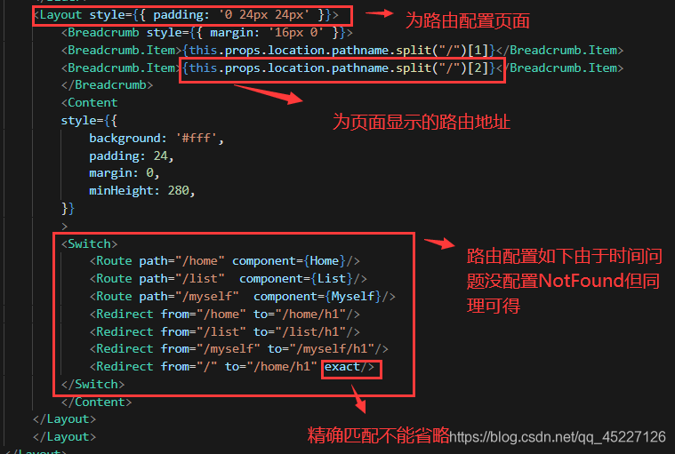

<!-- more -->

## 一、基础语法

<https://zh-hans.reactjs.org/>

### 1、react 常用UI组件库

Material-UI：<https://material-ui.com/（面向web>端）

蚂蚁设计Ant Design：<https://ant.design/（面向web>端）

SemanticUI：<https://semantic-ui.com/>

React Desktop：（面向MacOS Sierra和Windows10桌面风格的ReactUI组件库）

```
import.meta.env
```

### 2、通过 Props 传递数据

```tsx
class Board extends React.Component {
  renderSquare(i) {
    return <Square value={i} />;  }
}
```

```tsx
class Square extends React.Component {
  render() {
    return (
      <button className="square">
        {this.props.value}      </button>
    );
  }
}
```

```
class Square extends React.Component {
 render() {
   return (
     <button className="square" onClick={() => console.log('click')}>       {this.props.value}
     </button>
   );
 }
}
```

### 3、使用 setae 保存数据

```tsx
class Square extends React.Component {
  constructor(props) {
    super(props);
    this.state = {
      value: null,
    };
  }

  render() {
    return (
      <button
        className="square"        
          onClick={() => this.setState({value: 'X'})}>
        {this.state.value}      
        </button>
    );
  }
}
```

### 4、类组件

-constructor是可选的，我们通常在constructor中初始化一些数据；

- this.state中维护的就是我们组件内部的数据；
- render() 方法是 class 组件中唯一必须实现的方法；

```tsx
import React,{Component} from "react";

export default class Footer extends Component {
    constructor(props) {
        super(props);
        /**/
        this.state={

        }
    }
    /*是 class 组件中唯一必须实现的方法*/
    render() {
        return (<h2>Hello footer.tsx</h2>)
    }
}
```

### 5、函数组件

**函数组件必须首字母大写**

函数组件的特点：

- 没有生命周期，也会被更新并挂载，但是没有生命周期函数；
- 没有this(组件实例）；
- 没有内部状态（state）；

```tsx
export default function Hello() {
  return (
    <div>Hello World</div>
  )
}
```

### 6、生命周期

生命周期和生命周期函数的关系：

>
>
>

-

-

-

### 7、数据替换

```
var player = {score: 1, name: 'Jeff'};
player.score = 2;
// player 修改后的值为 {score: 2, name: 'Jeff'}
```

```
var player = {score: 1, name: 'Jeff'};

var newPlayer = Object.assign({}, player, {score: 2});
// player 的值没有改变, 但是 newPlayer 的值是 {score: 2, name: 'Jeff'}

// 使用对象展开语法，就可以写成：
// var newPlayer = {...player, score: 2};
```

### 8、tsx 结构

```tsx
import React, {Component} from "react";

// 自定义函数
function updata() {
    const player = {score: 1, name: 'Jeff'};
    player.score = 2;// {score: 2, name: 'Jeff'}
    // 使用对象展开语法，就可以写成：
    const newPlayer2 = {...player, score: 3};
}

//函数组件
class index extends Component {
    state = {
        name: "嘎嘎嘎嘎",
        age: 120
    }

    render() {
        return (
            <button > </button>
        )
    }
}

//类组件
export default class footer extends Component {
    constructor(props) {
        super(props);
        /**/
        this.state = {
            counter: 0,
            history: [{squares: Array(9).fill(null),}],
            squares: Array(9).fill(null),
        }
    }
    
//自定义函数
    handleClick(i: number) {
        const squares = 000
    }
 
    /*是 class 组件中唯一必须实现的方法*/
    render() {
          const name2 = 'Josh Perez';//嵌入表达式 
        return (
            <div> {name2}自己内容 </div>
        )
    }
    
//内置函数
    increment() {

    }
 /**
     * 在组件挂载后（插入 DOM 树中）立即调用
     */
    componentDidMount() {
    }

    /**
     * 捕获组件：异常
     * @param error
     * @param errorInfo
     */
    componentDidCatch(error: Error, errorInfo: React.ErrorInfo) {

    }

    /**
     * 在更新后会被立即调用，首次渲染不会执行此方法。
     * @param prevProps
     * @param prevState
     * @param snapshot
     */
    componentDidUpdate(prevProps: Readonly<{}>, prevState: Readonly<{}>, snapshot?: any) {

    }
    /**
     * 在组件卸载及销毁之前直接调用
     */
    componentWillUnmount() {

    }
}
```

### 9、项目结构

```
.
├── mock/                         ## 模拟数据服务
│   ├── db.js                     ## 模拟数据DB
│   └── routes.json               ## 模拟数据API路由配置
│   └── ...
├── public/                       ## 静态资源文件（包括css, images, fonts, index.html等）
│   └── ...
├── src/
│   ├── components/               ## 公用React组件
│   │   └── ...
│   ├── models/                   ## Dva数据Store层
│   │   └── ...
│   ├── pages/                    ## 页面模块
│   │   └── ...
│   ├── routes/                   ## App页面路由配置
│   │   └── ...
│   ├── services/                 ## API请求服务
│   │   └── ...
│   ├── style/                    ## 通用CSS样式
│   │   └── ...
│   ├── utils/                    ## 通用工具模块
│   │   └── ...
│   ├── App.css                   ## App 页面CSS样式
│   ├── App.tsx                   ## App 全局页面
│   ├── App.test.tsx              ## App 页面Jest测试用例
│   ├── ent.ts                    ## App 环境变量配置
│   ├── index.css                 ## 全局CSS样式
│   ├── index.tsx                 ## React入口文件
│   ├── logo.svg                  ## App logo
│   ├── Page.tsx                  ## 全局页面路由
│   │
├── build/                        ## 生成环境静态资源文件
├── .gitignore                    ## Git ignore 配置（禁止随意篡改配置!!!）
├── .editorconfig                 ## 编辑器配置（禁止随意篡改配置!!!）
├── config-overrides.js           ## Webpack 默认配置覆盖操作
├── tsconfig.json                 ## Typescript规则配置（禁止随意篡改规则）
├── tslint.json                   ## tslint规则配置（禁止随意篡改规则）
└── package.json                  ## 构建脚本和依赖配置（禁止随意篡改配置）
└── yarn.lock                     ## Yarn文件
```

### 10、嵌入组件

```tsx
import {Button, Layout, Menu} from 'antd';
import Index from '@/pages/index'

export default function App() {
    return (
        <Layout>
            <Index></Index>
        </Layout>
    )
}
```

```tsx
import {Button} from "antd";

//函数组件必须首字母大写
export default function Index() {
    return(
        <Button type='primary'>Index 66</Button>
    )
}
```

### 11、12、13、14、15、16、17、

## 二、创建项目 react+vite+ts+Ant Design4

Ant Design4：<https://ant.design/>

<https://gitee.com/MFork/vite-material-ui>

### 1、使用命令创建项目

vite

>mkdir  javacode-react
>
>cd javacode-react
>
>npm init @vitejs/app
>
>npm install

ant-design-pro

```bash
$ mkdir my-app
$ cd my-app
$ yarn create umi  ## or npm create umi

 Select the boilerplate type (Use arrow keys) 选择 Ant Design Pro
❯ ant-design-pro  - Create project with an layout-only ant-design-pro boilerplate, use together with umi block.
  app             - Create project with a simple boilerplate, support typescript.
  block           - Create a umi block.
  library         - Create a library with umi.
  plugin          - Create a umi plugin.
 Which language do you want to use? 选择你使用的语言
❯ TypeScript
  JavaScript
 Do you need all the blocks or a simple scaffold? 你需要所有的积木还是一个简单的脚手架？
> simple 简单的
  complete 完全的

$ npm install
$ npm start         ## visit http://localhost:8000

 "name": "javacode-react",
  "version": "1.0.1",
  "private": true,
  "description": "基于ant-design-pro创建的react项目",

"npm-i": "npm install && node ./node_modules/esbuild-loader/node_modules/esbuild/install.js",
    "npm-i-esbuild-exe": "",
    "serve": "umi-serve",
    "start": "cross-env UMI_ENV=dev umi dev & rm /src/.umi /s",
    "start:dev": "cross-env REACT_APP_ENV=dev UMI_ENV=dev umi dev",
        "build": "umi build",
```

ant-design

```bash
mkdir app
cd app
npm create @umijs/umi-app

```

#### 模板

<https://gitee.com/MFork/ant-design-pro>

<https://v4-pro.ant.design/docs/layout-cn>

```
├── config                   ## umi 配置，包含路由，构建等配置
├── mock                     ## 本地模拟数据
├── public
│   └── favicon.png          ## Favicon
├── src
│   ├── assets               ## 本地静态资源
│   ├── components           ## 业务通用组件
│   ├── e2e                  ## 集成测试用例
│   ├── layouts              ## 通用布局
│   ├── models               ## 全局 dva model
│   ├── pages                ## 业务页面入口和常用模板
│   ├── services             ## 后台接口服务
│   ├── utils                ## 工具库
│   ├── locales              ## 国际化资源
│   ├── global.less          ## 全局样式
│   └── global.ts            ## 全局 JS
├── tests                    ## 测试工具
├── README.md
└── package.json
```

#### Error: spawn E:\code\javacode\myre\node_modules\esbuild-loader\node_modules\esbuild\esbuild.exe ENOENT

>解决：cd E:\code\javacode\myre\node_modules\esbuild-loader\node_modules\esbuild
>
>运行：node .\install.js  npm install -g

```json
"npm-i": "npm install",
"npm-i-esbuild-exe": "node ./node_modules/esbuild-loader/node_modules/esbuild/install.js",
```

### 2、内置组件

#### React.FC（函数式组件）

使用 React.FC 来写 React 组件的时候，是不能用 setState 的，取而代之的是 useState()、useEffect()

```

```

#### React.VFC（无函数式组件）

#### React.Component（）

```tsx
import React from "react";

class index extends React.Component {
const [createModalVisible, handleModalVisible] = useState<boolean>(false); 
    state = {
        name: "嘎嘎嘎嘎",
        age: 120
    }
    render() {
        return (
            <button
                onClickCapture={() => alert('name:' + this.state.name + " age:" + this.state.age)}>
            </button>
        )
    }
}
export default index
```

#### React.FC（）

### 3、路由



### 4、

### 5、6、7、8、

## 三、react + vite + ts + Material-UI

<https://mui.com/zh/>

模板市场

<https://mui.com/store/?utm_source=docs&utm_medium=referral&utm_campaign=in-house-themes>

01：<https://mui.com/store/previews/berry-react-material-admin-free/>

<https://berrydashboard.io/free/>#

<https://gitee.com/kong19/react-admin-template>


02：

### 1、

### 2、

### 3、

### 4、

### 5、6、7、8、

## 四、五、六、七、八、九
