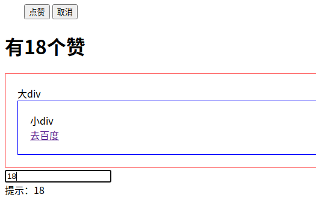
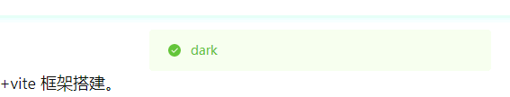

Vue基础

<!-- more -->

## 一、Vue2

### Vue创建模板

```html
<template>
    <div>
    </div>
</template>
<script>
    export default {
        name: "demo01",
        data: () => ({
            
        }),
        components: {
        },
        //计算属性 类似于data概念
        computed: {},
        //监控data中的数据变化
        watch: {},
        //方法集合
        methods: {
          da() {
            return "9999"
          }
        },
        //生命周期 - 创建完成（可以访问当前this实例）
        created() {
        },
        //生命周期 - 挂载完成（可以访问DOM元素）
        mounted() {
        },
        beforeCreate() {
        }, //生命周期 - 创建之前
        beforeMount() {
        }, //生命周期 - 挂载之前
        beforeUpdate() {
        }, //生命周期 - 更新之前
        updated() {
        }, //生命周期 - 更新之后
        beforeDestroy() {
        }, //生命周期 - 销毁之前
        destroyed() {
        }, //生命周期 - 销毁完成
        activated() {
        } //如果页面有keep-alive缓存功能，这个函数会触发
    }
</script>
<style type="text/css">
</style>
```

### http请求

#### 工具

```ts
import Vue from 'vue'
import axios from 'axios'
import qs from 'qs'
import merge from 'lodash/merge'
import {clearLoginInfo} from './'
import {myMsgBox, myMsgAuto} from "./message";

axios.defaults.baseURL = process.env.VUE_APP_BASE_API;

export const http = axios.create({
  timeout: 1000 * 30,
  withCredentials: true,
  headers: {
    'Content-Type': 'application/json; charset=utf-8'
  }
})

/**
 * 请求拦截
 * 请求头带上token
 */
http.interceptors.request.use(config => {
    const token = Vue.cookie.get("token");
    const path = config.url.endsWith('/login') || config.url.endsWith('/logout');
    if (path) {//为登录地址时，不拦截
        config.headers['token'] = token;
        return config;
    } else if (token === '' || token === null) {
        myMsgBox('拦截信息', '登录过期，请重新登录...', 'warning', 'login');
    } else {
        config.headers['token'] = token;
        return config;
    }
}, error => {
    return Promise.reject(error);
})


/**
 * 响应拦截
 */
http.interceptors.response.use(response => {
    const data = response.data;
    if (data && data.code === 401) { // 401, token失效 || response.data.code === 501
        clearLoginInfo();
        myMsgBox('响应信息', data.msg, 'warning', 'login');
    } else if (data.code !== 0 && data.code !== 401 && data.code !== 501) {
        myMsgAuto(data.msg, 'error');
    }
    return response
}, error => {
    return Promise.reject(error)
})

/**
 * get请求参数处理
 * @param {*} params 参数对象
 * @param {*} openDefultParams 是否开启默认参数?
 */
http.getParam = (params = {}, openDefultParams = true) => {
    var defaults = {
        'time': ''//new Date().getTime()
    }
    return openDefultParams ? merge(defaults, params) : params
}

/**
 * post请求数据处理
 * @param {*} data 数据对象
 * @param {*} openDefultdata 是否开启默认数据?
 * @param {*} contentType 数据格式
 *  json: 'application/json; charset=utf-8'
 *  form: 'application/x-www-form-urlencoded; charset=utf-8'
 */
http.postData = (data = {}, openDefultdata = true, contentType = 'json') => {
    var defaults = {
        'time': ''//new Date().getTime()
    }
    data = openDefultdata ? merge(defaults, data) : data
    return contentType === 'json' ? JSON.stringify(data) : qs.stringify(data)
}

```

```javascript
/**
 * 清除登录信息
 */
export function clearLoginInfo() {
  Vue.cookie.delete('token')
  store.commit('resetStore')
  // router.options.isAddDynamicMenuRoutes = false
}
```

#### get

```javascript
        this.$http({
          url: this.$http.forUrl("/product/categorybrandrelation/brands/list"),
          method: "get",
          params: this.$http.getParam({
            catId: this.catId
          })
        }).then(({data}) => {
          this.brands = data.data;
        });
```

#### post

```javascript
            this.$http({
              url: this.$http.forUrl('/sys/login'),
              method: 'post',
              data: this.$http.postData({
                'username': this.dataForm.userName,
                'password': this.dataForm.password,
                'uuid': this.dataForm.uuid,
                'captcha': this.dataForm.captcha
              }).then(({data}) => {
                  if (data && data.code === 0) {
                    this.$cookie.set('token', data.token)
                    // localStorage.setItem('menuList', JSON.stringify(data.menuList || '[]'))
                    localStorage.setItem('permissions', JSON.stringify(data.permissions || '[]'))
                    this.$router.replace({name: 'index'})
                  } else {
                    this.getCaptcha()
                    myMsgAuto(data.msg, 'error')
                  }
                });
```

### 自定义 message.js

```javascript
import Vue from "vue";
import router from "../router";

/**
 * 交互式提示框
 * @param title 标题
 * @param message 提示信息
 * @param type 类型 【'success' | 'warning' | 'info' | 'error'】
 * @param viewPathName 是否有跳转路由name，
 * @param showClose 【X】 关闭按钮
 * @param closeOnClickModal 点击阴影区关闭：false
 * @param showCancelButton 取消按钮
 * @param closeOnPressEscape 按ESC关闭：false
 */
export function myMsgBox(title, message, type, viewPathName, showClose = false, closeOnClickModal = false, showCancelButton = false, closeOnPressEscape = false) {
  Vue.prototype.$msgbox({
    icon: edit
title: title,
    message: message,
    showClose: showClose,
    closeOnClickModal: closeOnClickModal,
    showCancelButton: showCancelButton,
    closeOnPressEscape: closeOnPressEscape,
    type: type == null ? 'warning' : type,
  }).then(() => {/*确认*/
    if (viewPathName !== null && viewPathName !== '') {
      router.replace({name: viewPathName}).then(r => {
      });
    }
  }).catch(() => {/*取消*/
  });
}

/**
 * （无交互）自动关闭提示框
 * @param message 提示信息
 * @param type 类型【'success' | 'warning' | 'info' | 'error'】
 * @param duration 存活时间，默认[1.5]秒
 */
export function myMsgAuto(message, type, duration = 1.5) {
  Vue.prototype.$message({
    message: message,
    type: type == null ? 'success' : type,
    duration: duration > 0 ? (duration * 1000) : 1500,
  });
}
```

### 基本语法

```html
<body>
    <div id="app">
        <input type="text" v-model="num">
        <button v-on:click="num++">点赞</button>
        <button v-on:click="cancle">取消</button>
        <h1> {{name}} ,非常帅，有{{num}}个人为他点赞{{hello()}}</h1>
    </div>
    <script>
        //1、vue声明式渲染
        let vm = new Vue({
            el: "#app",//绑定元素
            data: {  //封装数据
                name: "张三",
                num: 88
            },
            methods:{  //封装方法
                cancle(){
                    this.num -- ;
                },
                hello(){
                    return "18"
                }
            }
        });
        //2、双向绑定,模型变化，视图变化。反之亦然。
        //3、事件处理
        //v-xx：指令
        //1、创建vue实例，关联页面的模板，将自己的数据（data）渲染到关联的模板，响应式的
        //2、指令来简化对dom的一些操作。
        //3、声明方法来做更复杂的操作。methods里面可以封装方法。
    </script>
</body>
```

### 指令：单项绑定v-bind & 双向绑定v-model

1. 单向绑定：v-bind（简写：‘‘:style’’）、更改页面元素但data不会变

```html
<body>
<!-- 完整语法 -->
<a v-bind:href="url"> ... </a>
<!-- 缩写 -->
<a :href="url"> ... </a>
<!-- 动态参数的缩写 -->
<a :[key]="url"> ... </a>

<!-- 单向绑定 -->
<!-- 给html标签的属性绑定 -->
<div id="app">
    <a v-bind:href="link">gogogo</a>
    <!-- class,style  {class名：加上？}-->
    <span v-bind:class="{active:isActive,'text-danger':hasError}" :style="{color: color1,fontSize: size}">你好</span>
</div>
<script>
    let vm = new Vue({
        el: "#app",
        data: {
            link: "http://www.baidu.com",
            isActive: true,
            hasError: true,
            color1: 'red',
            size: '36px'
        }
    })
</script>
</body>
```


2. 双向绑定 v-model

```html
<body>
<!-- 双向绑定 会将model值加入到language数组中-->
<!-- 表单项，自定义组件 -->
<div id="app">
    精通的语言：
    <input type="checkbox" v-model="language" value="Java"> java<br/>
    <input type="checkbox" v-model="language" value="PHP"> PHP<br/>
    <input type="checkbox" v-model="language" value="Python"> Python<br/>
    选中了 {{language.join("，")}}
</div>
<script>
    let vm = new Vue({
        el: "#app",
        data: {
            language: []
        }
    })
</script>
</body>
```


### 指令：v-no、v-for、v-if、v-show

#### v-no：用来绑定事件

```html
v-no：用来绑定事件
<!-- 完整语法 -->
<a v-on:click="doSomething"> ... </a>
<!-- 缩写 -->
<a @click="doSomething"> ... </a>
<!-- 动态参数的缩写 -->
<a @[event]="doSomething"> ... </a>


<div id="app">
    <!--事件中直接写js片段-->
    <button v-on:click="num++">点赞</button>
    <!--事件指定一个回调函数，必须是Vue实例中定义的函数-->
    <button @click="cancle">取消</button>
    <h1>有{{num}}个赞</h1>
    <!-- 事件修饰符 -->
    <div style="border: 1px solid red;padding: 20px;" v-on:click.once="hello">
        大div
        <div style="border: 1px solid blue;padding: 20px;" @click.stop="hello">
            小div <br/>
            <a href="http://www.baidu.com" @click.prevent.stop="hello">去百度</a>
        </div>
    </div>
    <!-- 按键修饰符： -->
    <input type="text" v-model="num" v-on:keyup.up="num+=2" @keyup.down="num-=2"
           @click.ctrl="num=10"><br/>
    提示：{{num}}
</div>
<script>
    new Vue({
        data: {
            num: 1
        },
        methods: {
            cancle() {
                this.num--;
            },
            hello() {
                alert("点击了")
            }
        }
    })
</script>
```



#### v-for

```html
<div id="app">
    <ul>
        <li v-for="(user,index) in users" :key="user.name" v-if="user.gender == '女'">
            <!-- 1、显示user信息：v-for="item in items" -->
            当前索引：{{index}} ==> {{user.name}} ==> {{user.gender}} ==>{{user.age}} <br>
            <!-- 2、获取数组下标：v-for="(item,index) in items" -->
            <!-- 3、遍历对象：
                    v-for="value in object"
                    v-for="(value,key) in object"
                    v-for="(value,key,index) in object"
            -->
            对象信息：
            <span v-for="(v,k,i) in user">{{k}}=={{v}}=={{i}}；</span>
            <!-- 4、遍历的时候都加上:key来区分不同数据，提高vue渲染效率 -->
        </li>
    </ul>
    <ul>
        <li v-for="(num,index) in nums" :key="index"></li>
    </ul>
</div>
<script src="../node_modules/vue/dist/vue.js"></script>
<script>
    let app = new Vue({
        el: "#app",
        data: {
            users: [{name: '柳岩', gender: '女', age: 21},
                {name: '张三', gender: '男', age: 18},
                {name: '范冰冰', gender: '女', age: 24},
                {name: '刘亦菲', gender: '女', age: 18},
                {name: '古力娜扎', gender: '女', age: 25}],
            nums: [1, 2, 3, 4, 4]
        },
    })
</script>
```


#### v-if、v-show

```html
<body>
<!--
    v-if，顾名思义，条件判断。当得到结果为true时，所在的元素才会被渲染。
    v-show，当得到结果为true时，所在的元素才会被显示。
-->
<div id="app">
    <button v-on:click="show = !show">点我呀</button>
    <!-- 1、使用v-if显示 -->
    <h1 v-if="show">if=看到我....</h1>
    <!-- 2、使用v-show显示 -->
    <h1 v-show="show">show=看到我</h1>
</div>

<script src="../node_modules/vue/dist/vue.js"></script>
    
<script>
   new Vue({
        data: {
            show: true
        }
    })
</script>
```


### 计算属性

#### 监听器watch

```html
<div id="app">
    <!-- 某些结果是基于之前数据实时计算出来的，我们可以利用计算属性。来完成 -->
    <ul>
        <li>西游记； 价格：{{xyjPrice}}，数量：<input type="number" v-model="xyjNum"></li>
        <li>水浒传； 价格：{{shzPrice}}，数量：<input type="number" v-model="shzNum"></li>
        <li>总价：{{totalPrice}}</li>
        {{msg}}
    </ul>
</div>
<script src="../node_modules/vue/dist/vue.js"></script>

<script>
    //watch可以让我们监控一个值的变化。从而做出相应的反应。
    new Vue({
        data: {
            xyjPrice: 99.98,
            shzPrice: 98.00,
            xyjNum: 1,
            shzNum: 1,
            msg: ""
        },
        computed: {
            totalPrice() {
                return this.xyjPrice * this.xyjNum + this.shzPrice * this.shzNum
            }
        },
        watch: {
            xyjNum(newVal, oldVal) {
                if (newVal >= 3) {
                    this.msg = "库存超出限制";
                    this.xyjNum = 3
                } else {
                    this.msg = "";
                }
            }
        },
    })
</script>
```


#### 过滤器filter

```html
<!-- 过滤器常用来处理文本格式化的操作。过滤器可以用在两个地方：双花括号插值和 v-bind 表达式 -->
<div id="app">
    <ul><li v-for="user in userList">
            {{user.id}} ==> {{user.name}} ==> {{user.gender == 1?"男":"女"}} ==>
            {{user.gender | genderFilter}} ==> {{user.gender | gFilter}}
        </li></ul></div>
<script src="../node_modules/vue/dist/vue.js"></script>
<script>
    Vue.filter("gFilter", function (val) {
        if (val == 1) {
            return "男~~~";
        } else {
            return "女~~~"; } })
    new Vue({
        data: { userList: [
                {id: 1, name: 'jacky', gender: 1},
                {id: 2, name: 'peter', gender: 0} ]},
        filters: {// filters 定义局部过滤器，只可以在当前vue实例中使用
            genderFilter(val) {
                if (val == 1) {
                    return "男"; } else { return "女"; } } } })
</script>
```


### 组件化

```html
<div id="app">
    <button v-on:click="count++">我被点击了 {{count}} 次</button>
    <counter></counter>
    <counter></counter>

    <button-counter></button-counter>
</div>
<script src="../node_modules/vue/dist/vue.js"></script>


<script>
    //1、全局声明注册一个组件
    Vue.component("counter", {
        template: `<button v-on:click="count++">全局我被点击了 {{count}} 次</button>`,
        data() {
            return {
                count: 1
            }
        }
    });

    //2、局部声明一个组件
    const buttonCounter = {
        template: `<button v-on:click="count++">局部我被点击了 {{count}} 次~~~</button>`,
        data() {
            return {
                count: 1
            }
        }
    };

    new Vue({
        el: "#app",
        data: {
            count: 1
        },
        components: {
            'button-counter': buttonCounter
        }
    })
</script>
```


### 生命周期


```html
<div id="app">
    <span id="num">{{num}}</span>
    <button @click="num++">赞！</button>
    <h2>{{name}}，有{{num}}个人点赞</h2>
</div>
<script src="../node_modules/vue/dist/vue.js"></script>
<script>
    let app = new Vue({
        el: "#app",
        data: {
            name: "张三",
            num: 100
        },
        methods: {
            show() {
                return this.name;
            },
            add() {
                this.num++;
            }
        },
        beforeCreate() {
            console.log("=========beforeCreate=============");
            console.log("数据模型未加载：" + this.name, this.num);
            console.log("方法未加载：" + this.show());
            console.log("html模板未加载：" + document.getElementById("num"));
        },
        created: function () {
            console.log("=========created=============");
            console.log("数据模型已加载：" + this.name, this.num);
            console.log("方法已加载：" + this.show());
            console.log("html模板已加载：" + document.getElementById("num"));
            console.log("html模板未渲染：" + document.getElementById("num").innerText);
        },
        beforeMount() {
            console.log("=========beforeMount=============");
            console.log("html模板未渲染：" + document.getElementById("num").innerText);
        },
        mounted() {
            console.log("=========mounted=============");
            console.log("html模板已渲染：" + document.getElementById("num").innerText);
        },
        beforeUpdate() {
            console.log("=========beforeUpdate=============");
            console.log("数据模型已更新：" + this.num);
            console.log("html模板未更新：" + document.getElementById("num").innerText);
        },
        updated() {
            console.log("=========updated=============");
            console.log("数据模型已更新：" + this.num);
            console.log("html模板已更新：" + document.getElementById("num").innerText);
        }
    });
</script>
```


### 脚手架


## 二、Vue3


### 变化

```
<script lang="ts" setup> const srcList = [] </script>

```

| Vue2.x        | Vue3                      |
| ------------- | ------------------------- |
| beforeCreate  | 使用 setup(props&context) |
| created       | 使用 setup()              |
| beforeMount   | onBeforeMount             |
| mounted       | onMounted                 |
| beforeUpdate  | onBeforeUpdate            |
| updated       | onUpdated                 |
| beforeDestroy | onBeforeUnmount           |
| destroyed     | onUnmounted               |
| errorCaptured | onErrorCaptured           |

### setup的参数

setup (props, {attrs, emit, slots})

- setup(props, context) / setup(props, {attrs, slots, emit})
- props: 包含props配置声明且传入了的所有属性的对象
- attrs: 包含没有在props配置中声明的属性的对象, 相当于 this.$attrs
- slots: 包含所有传入的插槽内容的对象, 相当于 this.$slots
- emit: 用来分发自定义事件的函数, 相当于 this.$emit

```javascript
export default ({
    setup (props, {attrs, emit, slots}) {

        console.log('setup', this)
        console.log(props.msg, attrs.msg2, slots, emit)

        const m = ref(2)
        const n = ref(3)

        function update () {
          // console.log('--', this)
          // this.n += 2 
          // this.m += 2

          m.value += 2
          n.value += 2

          // 分发自定义事件
          emit('fn', '++')
        }

        return {
          m,
          n,
          update,
        }
      },
}           
```

### 生命周期

[vue3与vue2的区别](https://www.cnblogs.com/baifangzi/p/14156726.html)

### 创建模板

```html
<template>
    #[[$END$]]#
</template>
<script>
import {
  onActivated,
  onBeforeMount,
  onBeforeUnmount,
  onBeforeUpdate,
  onErrorCaptured,
  onMounted,
  onUnmounted,
  onUpdated
} from 'vue'

export default {
  name: "${COMPONENT_NAME}",
  setup({props,context}) {
    //挂载之前
    onBeforeMount(() => {
    });
    //挂载完成
    onMounted(() => {
    });
    //更新之前
    onBeforeUpdate(() => {
    });
    //更新之后
    onUpdated(() => {
    });
    //销毁之前
    onBeforeUnmount(() => {
    });
    //销毁完成
    onUnmounted(() => {
    });
    //如果页面有keep-alive缓存功能，这个函数会触发
    onActivated(()=>{});
    //捕获异常
    onErrorCaptured((err, instance, info) => {
      this.ElMessage.error(info);
    });
  }
}
</script>
<style scoped>
</style>
```

### main.ts

```ts
import {createApp} from 'vue'
import App from './App.vue'
import route from '@/router'
import ele from '@/plugins/element'
import {IconPark} from '@/plugins/IconPark'

const app = createApp(App)
app.use(route)
ele(app)
IconPark(app)
app.mount('#app')
```

### element.ts

```tsx
import ElementPlus, {
    ElAlert,
    ElAside,
    ElButton,
    ElContainer,
    ElDrawer,
    ElFooter,
    ElForm,
    ElFormItem,
    ElHeader,
    ElImage,
    ElInput,
    ElLink,
    ElLoading,
    ElMain,
    ElMenu,
    ElMenuItem,
    ElMessage,
    ElMessageBox,
    ElNotification,
    ElRow,
    ElSelect,
    ElSubMenu,
    ElTable,
    ElTabs,
    ElTag,
    ElTimeline,
    ElTree,
    ElTreeV2,
    ElUpload
} from 'element-plus'
import "element-plus/dist/index.css";
import "element-plus/theme-chalk/src/index.scss";
import "element-plus/es/components/notification/style/css";
import "element-plus/es/components/message/style/css";
import zhCn from "element-plus/es/locale/lang/zh-cn";

export default (app) => {
    app.use(ElementPlus, {
        locale: zhCn,
        size:'default',
    })
    app.use(ElAlert)
    app.use(ElDrawer)
    app.use(ElFooter)
    app.use(ElUpload)
    app.use(ElImage)
    app.use(ElLink)
    app.use(ElSelect)
    app.use(ElTabs)
    app.use(ElTable)
    app.use(ElTag)
    app.use(ElTree)
    app.use(ElTreeV2)
    app.use(ElLoading)
    app.use(ElMessage)
    app.use(ElMessageBox)
    app.use(ElNotification)
    app.use(ElButton)
    app.use(ElForm)
    app.use(ElFormItem)
    app.use(ElTimeline)
    app.use(ElInput)
    app.use(ElRow)
    app.use(ElContainer)
    app.use(ElHeader)
    app.use(ElAside)
    app.use(ElMain)
    app.use(ElMenu)
    app.use(ElSubMenu)
    app.use(ElMenuItem)
    app.config.globalProperties.$message = ElMessage
    app.config.globalProperties.$notify = ElNotification
}
```

### IconPark.ts

```
import {install} from '@icon-park/vue-next/es/all';
// import '@icon-park/vue-next/styles/index.css';

export function IconPark(app) {
    install(app, 'i'); //使用自定义前缀“i”，例如：<i-people />
}
```

### 多环境dev、prod、test

在项目根路径下创建：.env.dev .env.prod .env.test

```javascript
VITE_NODE_ENV='dev' 、'prod'、'test'
VITE_BASE_URL='http://localhost/codetools-dev/' 、codetools、codetools-test、
VITE_OPEN_PROXY=true 、false
```

package.json

```
/////////////vite//////////////////
"dev": "vite --mode dev",
"prod": "vite --mode prod",
"test": "vite --mode test",
/////////////vue//////////////////
"dev": "vue-cli-service serve --mode dev",
"prod": "vue-cli-service serve --mode prod",
"test": "vue-cli-service serve --mode test",

```

### axios 请求

```
"axios": "^0.25.0",
```

```ts
import axios from 'axios'

// 这边由于后端没有区分测试和正式，姑且都写成一个接口。
axios.defaults.baseURL = '/api'
// 请求头，headers 信息
axios.defaults.headers['X-Requested-With'] = 'XMLHttpRequest'
axios.defaults.headers['Access-Control-Allow-Origin'] = '*'
//Origin,X-Requested-With,Content-Type,Accept,Authorization
axios.defaults.headers['Access-Control-Allow-Headers'] = '*'
//GET,POST,PUT,DELETE,OPTIONS,PATCH
axios.defaults.headers['Access-Control-Allow-Methods'] = '*'
// axios.defaults.headers['token'] = localGet('token') || ''
axios.defaults.headers.post['Content-Type'] = 'application/json'

const http = axios.create({
    timeout: 1000 * 30,
    // 携带 cookie，对目前的项目没有什么作用，因为我们是 token 鉴权
    withCredentials: true,
});
/**
 * 请求拦截
 */
http.interceptors.request.use(
    config => {
        return config;
    },
    error => {
        return Promise.reject(error);
    }
)

/**
 * 响应拦截
 */
http.interceptors.response.use(
    response => {
        return response
    }, error => {
        return Promise.reject(error)
    })

export default http
```

```javascript
import http from "../../util/axios";

export function policy() {
    return new Promise((resolve) => {
        http.get('oss/policy')
            .then(({data}) => {
                resolve(data);
            })
    });
}
////////////////////////////////////////////
<el-button class="ml-3" type="success" @click="getLogs">测试log</el-button>

<script setup lang="ts">
const logData = {
  code: '',
  msg: '',
  data: '',
}
function getLogs() {
  http.get('get/log').then(data => {
    console.log("getLogs::::", data.data)
    logData.code = data.data.code
    logData.msg = data.data.msg
    logData.data = data.data.data
    msgNotification(logData);
  })
}
```

### proxy 请求代理

```javascript
server: {
            open: false,
            host: "0.0.0.0",
            cors: {
                allowedHeaders: '*',
                origin: '*',
                methods: '*',
                credentials: true
            },
            port: mode == 'prod' ? 3000 : (mode == 'dev' ? 3001 : 3002),
            // @ts-ignore
            proxy: env.VITE_OPEN_PROXY === false ? {} : {
                '/api': {
                    target: env.VITE_BASE_URL,
                    changeOrigin: true,
                    rewrite: (path) => path.replace(/^\/api/, ''),
                }
            }
        },
```

### 计算属性与监视 watch

```ts
<script lang="ts" setup>
    const user = reactive({
      name: '',
      age: '12',
    })
    const fullName = ref('')
    /*
       使用watch的2个特性:
         深度监视
         初始化立即执行
       */
    watch(user, () => {
      fullName.value = user.name + '-' + user.age
    }, {
      immediate: true,  // 是否初始化立即执行一次, 默认是false
      deep: true, // 是否是深度监视, 默认是false
    })
    /*
      watch一个数据
        默认在数据发生改变时执行回调
      */
    watch(fullName, (value) => {
      console.log('watch')
      const names = value.split('-')
      user.name = names[0]
      user.age = names[1]
    })
    /*
       watch多个数据:
         使用数组来指定
         如果是ref对象, 直接指定
         如果是reactive对象中的属性,  必须通过函数来指定
       */
    watch([() => user.name, () => user.age, fullName], (values) => {
      console.log('监视多个数据', values)
    })
</script>
```

### ref获取元素

```vue
<template>
  <h2>App</h2>
  <input type="text">---
  <input type="text" ref="inputRef">
</template>

<script lang="ts">
import { onMounted, ref } from 'vue'
/* 
ref获取元素: 利用ref函数获取组件中的标签元素
功能需求: 让输入框自动获取焦点
*/
export default {
  setup() {
    const inputRef = ref<HTMLElement|null>(null)

    onMounted(() => {
      inputRef.value && inputRef.value.focus()
    })

    return {
      inputRef
    }
  },
}
</script>
```

## 三、vue+vite+typescript

vitejs：<https://vitejs.dev/config/>

TS ：<https://www.tslang.cn/docs/home.html>

Vue3+TS 快速上手：<https://24kcs.github.io/vue3_study/>

### 1、创建TS项目步骤

```javascript
1)npm init @vitejs/app
2)自己输入项目名称
3)选择vue
4)选择vue-ts（vue+vite+ts项目）
5)cd 项目名称
6)npm install
```

### 2、自动导入：自定义工具、api 接口，实现 vue 组件不需要 import 指令

#### 2.1、配置 vite.config.ts

```javascript
import {defineConfig, loadEnv} from 'vite'
import vue from '@vitejs/plugin-vue'
import AutoImport from 'unplugin-auto-import/vite'
import {ElementPlusResolver} from 'unplugin-vue-components/resolvers'
// @ts-ignore
import path from "path";

export default defineConfig(({mode}) => {
    let env = loadEnv(mode, process.cwd());
    return {
        plugins: [
            vue(),
            // api 库解析器，也可以自定义
            AutoImport({
                dts: 'src/auto-imports.d.ts',
                include: [
                    /\.[tj]sx?$/, // .ts, .tsx, .js, .jsx
                    /\.vue$/, /\.vue\?vue/, // .vue
                    /\.md$/, // .md
                ],
                imports: [
                    {
                        'vuex': ['useStore']
                    },
                    {
                        '@/util/msg/msg_function': ['msgAuto', 'msgNotification', 'msgBoxAlert', 'msgBox']
                    },
                ],
                resolvers: [
                    ElementPlusResolver(),
                ]
            }),
            // ui库解析器，也可以自定义
            Components({
                dirs: ['src/components'],
                // 搜索子目录
                deep: true,
                resolvers: [
                    ElementPlusResolver()
                ],
                dts: 'src/components.d.ts',
                include: [/.vue$/, /.vue?vue/],
            }),
        ],
    }
});
```

#### 2.2、自定义api：src/util/xxx.ts

```javascript
export function msgAuto(options: msgAutoOptions) {...}
export function msgNotification(options: msgNotificationOptions) {...}
export function msgBoxAlert(options: msgBoxAlertOptions) {...}
export function msgBox(options: msgBoxOptions){...}
```

#### 2.3、查看编译结果 src/auto-imports.d.ts

```javascript
// Generated by 'unplugin-auto-import'
// We suggest you to commit this file into source control
declare global {
  const msgAuto: typeof import('@/util/msg/msg_function')['msgAuto']
  const msgBox: typeof import('@/util/msg/msg_function')['msgBox']
  const msgBoxAlert: typeof import('@/util/msg/msg_function')['msgBoxAlert']
  const msgNotification: typeof import('@/util/msg/msg_function')['msgNotification']
  ....
  const useStore: typeof import('vuex')['useStore']
}
export {}
```

#### 2.4、vue 组件应用

```
<script lang="ts" setup>
const store = useStore()

const upTheme = () => {
  let this_theme: string = store.state.theme
  msgAuto({message: this_theme})
}
</script>
```




### 3、vite.config.ts +自动导入组件，在vue页面里不用import （src/Components、vite、vue、vuex）依赖：【unplugin-auto-import/vite、unplugin-vue-components/vite、unplugin-vue-components/resolvers】

```ts
import {defineConfig, loadEnv} from 'vite'
import vue from '@vitejs/plugin-vue'
import AutoImport from 'unplugin-auto-import/vite'
import Components from 'unplugin-vue-components/vite'
import {ElementPlusResolver, VantResolver,} from 'unplugin-vue-components/resolvers'
// @ts-ignore
import path from "path";
// @ts-ignore
import md from "./src/plugins/md.ts";

// https://vitejs.dev/config/
// @ts-ignore
export default defineConfig(({mode}) => {
    let env = loadEnv(mode, process.cwd());
    return {
        plugins: [
            vue(), md(),
            AutoImport({
                dts: 'src/auto-imports.d.ts',
                include: [
                    /\.[tj]sx?$/, // .ts, .tsx, .js, .jsx
                    /\.vue$/, /\.vue\?vue/, // .vue
                    /\.md$/, // .md
                ],
                imports: ['vue', 'vuex', 'vue-router',],
                //可以在这自定义自己的东西，比如接口api的引入，工具函数等等
                resolvers: [
                    ElementPlusResolver(), VantResolver(),
                ]
            }),
            // ui库解析器，也可以自定义
            Components({
                dirs: ['src/components'],
                // 搜索子目录
                deep: true,
                //自定义组件的解析器
                resolvers: [
                    ElementPlusResolver(), VantResolver(),
                ],
                extensions: ['vue'],
                dts: 'src/components.d.ts',
                include: [/.vue$/, /.vue?vue/],
            }),
        ],
        resolve: {
            alias: {
                '@': path.resolve(__dirname, 'src')
            },
        },
        server: {
            open: false,
            /*localhost,0.0.0.0，127.0.0.1，www.demo.cn；等等。*/
            host: "localhost",
            cors: {
                allowedHeaders: '*',
                origin: '*',
                methods: '*',
                credentials: true
            },
            port: mode == 'prod' ? 2100 : (mode == 'dev' ? 2101 : 2102),
            // @ts-ignore
            proxy: env.VITE_OPEN_PROXY === false ? {} : {
                '/api': {
                    target: env.VITE_BASE_URL,
                    changeOrigin: true,
                    rewrite: (path) => path.replace(/^\/api/, ''),
                }
            }
        }
    }
});
```

应用：

```vue
<template>
  <el-header class="header">
    <DefaultHeader/>
  </el-header>
  <el-container>
    <el-aside class="aside">
      <el-scrollbar>
        <DetailsDrawer/>
      </el-scrollbar>
    </el-aside>
    <el-container>
      <el-main class="main">
         <DefaultView/>
      </el-main>
      <el-footer class="footer">
        <DefaultFooter/>
      </el-footer>
    </el-container>
  </el-container>
</template>
```

```
<script lang="ts" setup>
const state = reactive({
  themelight: false,
  themedark: true,
})
const themeLight = toRef(state, "themelight")
const themeDark = toRef(state, "themedark")

const store = useStore()
let this_theme = store.state.theme

</script>
```

### package.json

```javascripton
{
  "name": "web",
  "version": "0.0.1",
  "scripts": {
    "dev": "vite --mode dev",
    "prod": "vite --mode prod",
    "test": "vite --mode test",
    "build:test": "vite build --mode test",
    "build:prod": "vite build --mode prod",
    "preview": "vite preview"
  },
  "dependencies": {
    "axios": "^0.25.0",
    "element-plus": "^1.3.0-beta.7",
    "globals": "^13.10.0",
    "vue": "^3.2.25",
    "vue-router": "^4.0.12"
  },
  "devDependencies": {
    "@types/node": "^17.0.10",
    "@vitejs/plugin-vue": "^2.0.0",
    "typescript": "^4.4.4",
    "vite": "^2.7.2",
    "vue-tsc": "^0.29.8",
    "@icon-park/vue-next": "^1.3.6",
    "sass": "^1.49.0",
    "sass-loader": "^12.4.0",
    "vite-plugin-imp": "^2.1.3",
    "unplugin-auto-import": "^0.5.11",
    "unplugin-vue-components": "^0.17.14"
  }
}
```

### tsconfig.json

```javascripton
{
  "compilerOptions": {
    "target": "esnext",
    "module": "esnext",
    "moduleResolution": "node",
    "isolatedModules": false,
    "jsx": "preserve",
    "importHelpers": true,
    "strict": true,
    "skipLibCheck": true,
    "noUnusedLocals": true,
    "noUnusedParameters": true,
    "experimentalDecorators": true,
    "allowSyntheticDefaultImports": true,
    "sourceMap": true,
    "baseUrl": ".",
    "noImplicitAny": false,
    "paths": {
      "@/*": [
        "src/*"
      ]
    },
    "lib": [
      "esnext",
      "dom",
      "dom.iterable",
      "scripthost"
    ],
    "types": [
      "vite/client"
    ]
  },
  "include": [
    "src/**/*.d.ts",
    "src/**/*.ts",
    "src/**/*.tsx",
    "src/**/*.vue",
    "tests/**/*.ts",
    "tests/**/*.tsx",
    "src/main.ts"
  ],
  "exclude": [
    "node_modules",
    "dist"
  ]
}
```

```
基本配置项目说明：
include ts文件在哪个文件夹中
lib     运行环境包括哪些api
module  ts代码编译成什么模块系统
outDir  编译后的js代码存放位置
stirct  是否开启严格模式
target  ts编译成js的标准
... 有很多配置项具体可以查看其它资料
```

### vue3+ts模板 <a name="vue+ts模板" />

```vue
<el-button class="ml-3" type="success" @click="backTop">上传</el-button>

<script lang="ts" setup>
 import {onMounted, onUnmounted, ref} from "vue";

    const btnFlag = ref(false);
    const scrollTop = ref(0);
    
    function backTop() {
     btnFlag.value = true
        scrollTop.value = 1112
    }
 
    //挂载之前
    onBeforeMount(() => {
    });
    //挂载完成
    onMounted(() => {
    });
    //更新之前
    onBeforeUpdate(() => {
    });
    //更新之后
    onUpdated(() => {
    });
    //销毁之前
    onBeforeUnmount(() => {
    });
    //销毁完成
    onUnmounted(() => {
    });
    //如果页面有 keep-alive 缓存功能，这个函数会触发
    onActivated(()=>{});
    //捕获异常
    onErrorCaptured((err, instance, info) => {
      this.ElMessage.error(info);
    });
}
```

```
<template>
  <el-breadcrumb class="myBreadcrumb">
    <el-link :underline="false" type="primary" @click="$router.push({path:'/'})">
      <span class="target">首页</span>
    </el-link>
    <span v-if="subTargetName!==''">
      <span class="split">&nbsp;>&nbsp;</span>
      <el-link :underline="false" type="primary" @click="$router.push({path:subTargetPush})">
        <span class="target">{{ subTargetName }}</span>
      </el-link>
    </span>
    <span v-if="targetTitle!==''">
      <span class="split">&nbsp;>&nbsp;</span>
      <el-link :underline="false" type="info">
        <span class="target">{{ targetTitle }}</span>
      </el-link>
    </span>
  </el-breadcrumb>
</template>
<script lang="ts" setup>
import {useRouter} from "vue-router";
import {onMounted, reactive, toRef} from "vue";

const state = reactive({
  subTargetName: "",
  subTargetPush: "",
  targetTitle: ""
})
const subTargetName = toRef(state, "subTargetName")
const subTargetPush = toRef(state, "subTargetPush")
const targetTitle = toRef(state, "targetTitle")

function getSubTargetName() {
  console.log("------",useRouter())
  const router = useRouter().getRoutes()
  //"https://www.demo.com/java101/hello/cmdhellojava"
  // window.location.href
  /**获取域名后面的路径*/
      // const url1 = str.split("cn/")[1] // java101/hello/cmdhellojava
      //targetUrl = this.$route.path;得到“/java101/hello/cmdhellojava”
  const targetUrl = 'http://localhost:2101/java101/hello' //str.split("8080/")[1]; // /java101/hello/cmdhellojava
  console.log(targetUrl)
  const url = targetUrl.split("/"); // ['','java101','hello','cmdhellojava']
  const subUrl = url[1].replace(url[1], '/' + url[1]);// /java101
  router.forEach((data) => {
    if (subUrl === data.path) {
      //获取path= /java101 的title
      subTargetName.value = data.meta.title + "";
      subTargetPush.value = data.path;
      return;
    } else if (targetUrl === data.path) {
      //获取path= /java101/hello/cmdhellojava 的title
      targetTitle.value = data.meta.title + "";
      return;
    }
  })
}

onMounted(() => {
  getSubTargetName();
});
</script>
```

### 全局函数

*代码*

```
greet("hello, world");
```

*声明*

使用`declare function`声明函数。

```
declare function greet(greeting: string): void;
```

### ts 回调函数\组合式 API 语法

```ts
/* OK */
function fn(x: () => void) {
    x();
}
使用void相对安全，因为它防止了你不小心使用x的返回值：
function fn(x: () => void) {
    var k = x(); // oops! meant to do something else
    k.doSomething(); // error, but would be OK if the return type had been 'any'
}

<!-- 组合式 API 语法糖 script setup -->
<script lang="ts" setup>
import { ref, defineProps, defineEmits } from 'vue'

// 声明一个数据接收 defineProps
const props = defineProps({
  msg: {
    type: String,
    default: ''
  }
})

// 自定义事件
const emit = defineEmits(['increment'])

const msg = 'abc'

const count = ref(100)
const increment = () => {
  count.value++
  console.log('msg=>', props.msg)
  // => Hello Vue 3 + TypeScript + Vite
  // => abc (重名后会以本地的赋值为主)
  // 导出自定义事件
  emit('increment')
}
</script>
```

### 问题


## 四、其他

### eslint 配置

<https://eslint.vuejs.org/user-guide/#usage>

### 按需导入css样式

<https://github.com/vbenjs/vite-plugin-style-import/blob/HEAD/README.zh_CN.md>

```bash
 "vite-plugin-style-import": "^1.4.1",
```

```javascript
import vue from '@vitejs/plugin-vue';
import {styleImport, ElementPlusResolve} from 'vite-plugin-style-import';

export default {
  plugins: [
    vue(),
    styleImport({
                libs: [
                    {
                        libraryName: 'element-plus',
                        esModule: true,
                        resolveStyle: name => `element-plus/es/components/${name}/style/css`
                    },
                    {
                        libraryName: 'vuetify',
                        esModule: true,
                        resolveStyle: name => `vuetify/lib/${name}/`
                    }
                ]
            }),
  ],
};

```

## 五、vue3+vite+AntDesignVue 专用pc、web端

Ant Design Vue专用pc、web端

## 六、vue3 + vite + vant + typescript 专用app移动端

Vant专用app移动端

<https://youzan.github.io/vant/v4/#/zh-CN>

### 快速上手

```
"vant": "^3.4.7",
```

```
import Vant from 'vant'

app.use(Vuex).use(Vant)
```

vite.config.ts

```
import vue from '@vitejs/plugin-vue';
import styleImport, { VantResolve } from 'vite-plugin-style-import';

export default {
  plugins: [
    vue(),
    styleImport({
      resolves: [VantResolve()],
    }),
  ],
};
```

引入组件

```
import { createApp } from 'vue';
import { Button } from 'vant';

const app = createApp();
app.use(Button);
```

在 `<script setup>` 中可以直接使用 Vant 组件，不需要进行组件注册。

```ts
<script setup>
  import { Button } from 'vant';
</script>

<template>
  <Button />
</template>

```

### 桌面端适配

```bash
@vant/touch-emulator
```

#### 底部安全区适配

```
<!-- 在 head 标签中添加 meta 标签，并设置 viewport-fit=cover 值 -->
<meta
  name="viewport"
  content="width=device-width, initial-scale=1.0, maximum-scale=1.0, minimum-scale=1.0, viewport-fit=cover"
/>

<!-- 开启顶部安全区适配 -->
<van-nav-bar safe-area-inset-top />

<!-- 开启底部安全区适配 -->
<van-number-keyboard safe-area-inset-bottom />

```


## 七、vue+vuetify 快速开发

设备匹配：pc、web端、app

## 九、Tailwind CSS 样式

<https://www.tailwindcss.cn/>

npm install tailwindcss

## 十、vue项目打包

### git

<https://cli.vuejs.org/zh/guide/deployment.html#github-pages>

<https://cn.vitejs.dev/guide/static-deploy.html>

### Webpack

### Rollup

### vue3+vite+nginx

```javascript
// 打包相关规则
build: {
    target: "esnext", //指定es版本,浏览器的兼容性
    outDir: "dist", //指定打包输出路径
    assetsDir: "static", //指定静态资源存放路径
    cssCodeSplit: true, //css代码拆分,禁用则所有样式保存在一个css里面
    sourcemap: false, //是否构建source map 文件
    chunkSizeWarningLimit: 1500,
    rollupOptions:{
      output:{
          chunkFileNames:'static/js/[name]-[hash].js',
          entryFileNames:'static/js/[name]-[hash].js',
          assetFileNames:'static/[ext]/[name]-[hash].[ext]',
      }
    },
    terserOptions: {
        // 生产环境移除console
        compress: {
            drop_console: true,
            drop_debugger: true,
        },
    },
},
```
