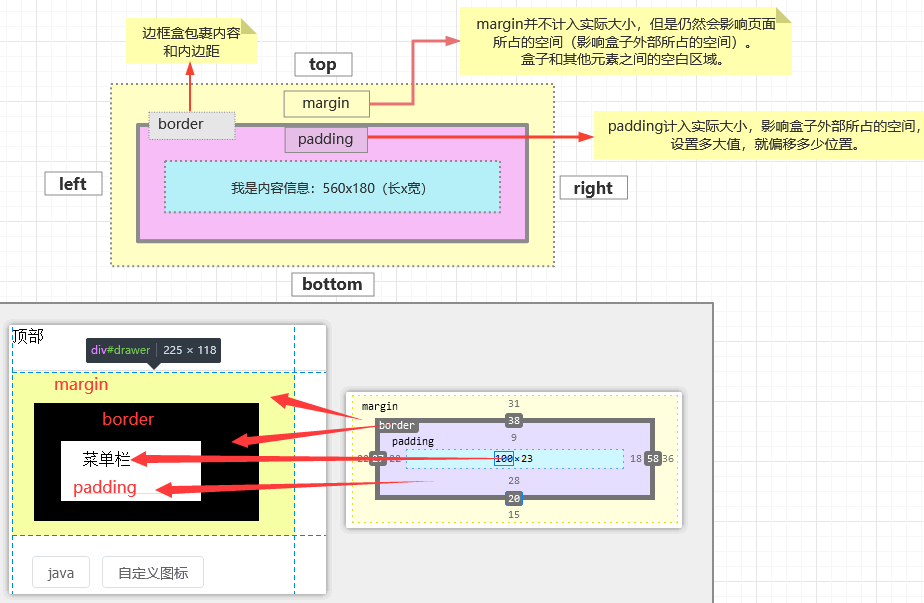
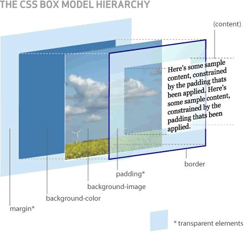

<!-- more -->

## CSS 模型盒





1、margin: 包括margin-top、margin-right、margin-bottom、margin-left，**控制块级元素之间的距离**，它们是透明不可见的。

2、padding: 包括padding-top、padding-right、padding-bottom、padding-left，**控制块级元素内部**，content与border之间的距离。

Vite 2.0 —— 超快的构建工具
Vue 3.0 —— 更强大更灵活的 Vue
SSG —— 服务端渲染方案，利于 SEO 进行内容收录
PWA —— 构建离线应用

## vuepress打包报错

```bash
TypeError: Invalid value used as weak map key
    at WeakMap.set (<anonymous>)
    at normalizePropsOptions (xxx\node_modules\@vue\runtime-core\dist\runtime-.prod.js:3179:15)
    at createComponentInstance (xxx\node_modules\@vue\runtime-core\dist\runtimjs.prod.js:5695:23)
    at renderComponentVNode (xxx\node_modules\@vue\server-renderer\dist\server-renderer.cjs.prod.js:168:22)
    at Object.ssrRenderComponent (xxx\node_modules\@vue\server-renderer\dist\server-renderer.cjs.prod.js:605:12)
    at _sfc_ssrRender$2G (xxx\docs\.vuepress\.temp\.server\app.js:29120:24)   
    at renderComponentSubTree (xxx\node_modules\@vue\server-renderer\dist\server-renderer.cjs.prod.js:250:13)
    at renderComponentVNode (xxx\node_modules\@vue\server-renderer\dist\server-renderer.cjs.prod.js:185:16)
    at renderVNode (xxx\node_modules\@vue\server-renderer\dist\server-renderer.cjs.prod.js:292:22)
    at renderComponentSubTree (xxx\node_modules\@vue\server-renderer\dist\server-renderer.cjs.prod.js:256:13)
```

查看`runtime-core\dist\runtime-.prod.js:3179:15`

```text
    if (!raw && !hasExtends) {
        cache.set(comp, shared.EMPTY_ARR);
        return shared.EMPTY_ARR;
    }
```

查看信息输出

> 由于在 md 文件中存在的标签 \<Hello />，不是 Vue 组件、或未经注册，Vue WeakMap 接收的 key
> 本应是组件对象，变成了 string 引发错误。
>
> 构建抛错程序会中止，把组件参数打印出来，最后的打印输出就是有问题的标签，将 md 中相应标签处理即可解决。

```js
    if (!raw && !hasExtends) {
        console.log()
        console.log('===> debug--1', comp)
        cache.set(comp, shared.EMPTY_ARR);
        return shared.EMPTY_ARR;
    }
```

## 一、ES6

### let & var & const

```text
#var 
 声明的变量往往会越域
 可以声明多次
 会变量提升
#let 
 声明的变量有严格局部作用域
 只能声明一次，声明之后不允许改变
    一但声明必须初始化，否则会报错
#const
 const 与 let 类似
 是一个只读变量
 一旦声明必须初始化，否则会报错
```

```html
<!DOCTYPE html>
<html lang="en">
<head>
    <meta charset="UTF-8">
    <meta name="viewport" content="width=device-width, initial-scale=1.0">
    <meta http-equiv="X-UA-Compatible" content="ie=edge">
    <title>Document</title>
</head>
<body>


<script>
    // var 声明的变量往往会越域
    // let 声明的变量有严格局部作用域
    {
        var a = 1;
        let b = 2;
    }
    console.log(a);  // 1
    //         console.log(b);  // ReferenceError: b is not defined

    // var 可以声明多次
    // let 只能声明一次
    //         var m = 1
    //         var m = 2
    //         let n = 3
    // //         let n = 4
    //         console.log(m)  // 2
    //         console.log(n)  // Identifier 'n' has already been declared

    // var 会变量提升
    // let 不存在变量提升
    //         console.log(x);  // undefined
    //         var x = 10;
    //         console.log(y);   //ReferenceError: y is not defined
    //         let y = 20;

    // let
    // 1. 声明之后不允许改变
    // 2. 一但声明必须初始化，否则会报错
    //         const a = 1;
    //         a = 3; //Uncaught TypeError: Assignment to constant variable.

</script>

</body>
</html>
```

#### 解构&字符串

数组解构、对象解构、字符串扩展、字符串模板

```html
<!DOCTYPE html>
<html lang="en">
<head>
    <meta charset="UTF-8">
    <meta name="viewport" content="width=device-width, initial-scale=1.0">
    <meta http-equiv="X-UA-Compatible" content="ie=edge">
    <title>Document</title>
</head>
<body>
<script>
    //数组解构
    let arr = [1,2,3];
    let a = arr[0];
    let b = arr[1];
    let c = arr[2];
    console.log(a,b,c) //1 2 3
    let arr = [1,2,3];
    let [a,b,c] = arr;
    console.log(a,b,c) //1 2 3
    //对象解构
    const person = {
        name: "jack",
        age: 18,
        language: ['java', 'js', 'css']
    }
    const name = person.name;
    const age = person.age;
    const language = person.language;
    const {name: abc, age, language} = person;
    console.log(abc, age, language)
    //4、字符串扩展
    let str = "hello.vue";
    console.log(str.startsWith("hello"));//开头：true
    console.log(str.endsWith(".vue"));//结尾：true
    console.log(str.includes("e"));//包含：true
    console.log(str.includes("hello"));//包含：true
    console.log(str.includes("o1"));//包含：true
    //字符串模板
    let ss = `<div>
                    <span>hello world<span>
                </div>`;
    console.log(ss);
    //字符串插入变量和表达式。变量名写在 ${} 中，${} 中可以放入 JavaScript 表达式。
    function fun() {
        return "这是一个函数"
    }
    let info = `我是${abc}，今年${age + 10}了, 我想说： ${fun()}`;
    console.log(info);
</script>
</body>

</html>
```

#### 函数优化

```html
<!DOCTYPE html>
<html lang="en">

<head>
    <meta charset="UTF-8">
    <meta name="viewport" content="width=device-width, initial-scale=1.0">
    <meta http-equiv="X-UA-Compatible" content="ie=edge">
    <title>Document</title>
</head>

<body>

<script>
    //在ES6以前，我们无法给一个函数参数设置默认值，只能采用变通写法：
    function add(a, b) {
        // 判断b是否为空，为空就给默认值1
        b = b || 10;
        return a + b;
    }
    // 传一个参数
    console.log(add(10));
    //现在可以这么写：直接给参数写上默认值，没传就会自动使用默认值
    function add2(a, b = 1) {
        return a + b;
    }
    console.log(add2(20));
    //2）、不定参数
    function fun(...values) {
        console.log(values.length)
    }
    fun(1, 2)      //2
    fun(1, 2, 3, 4)  //4
    //3）、箭头函数
    //以前声明一个方法
    // var print = function (obj) {
    //     console.log(obj);
    // }
    var print = obj => console.log(obj);
    print("hello 箭头函数");
    var sum = function (a, b) {
        c = a + b;
        return a + c;
    }
    var sum2 = (a, b) => a + b;
    console.log(sum2(11, 12));
    var sum3 = (a, b) => {
        c = a + b;
        return a + c;
    }
    console.log(sum3(10, 20))
    //箭头函数+解构
    const person = {
        name: "jack",
        age: 21,
        language: ['java', 'js', 'css']
    }
    function hello(person) {
        console.log("hello," + person.name)
    }
    var hello2 = ({name}) => console.log("hello22," + name);
    hello2(person);
</script>
</body>

</html>
```

#### 对象优化

```html
<!DOCTYPE html>
<html lang="en">

<head>
    <meta charset="UTF-8">
    <meta name="viewport" content="width=device-width, initial-scale=1.0">
    <meta http-equiv="X-UA-Compatible" content="ie=edge">
    <title>Document</title>
</head>

<body>

<script>
    const person = {
        name: "jack",
        age: 21,
        language: ['java', 'js', 'css']
    }
    console.log(Object.keys(person));//["name", "age", "language"]
    console.log(Object.values(person));//["jack", 21, Array(3)]
    console.log(Object.entries(person));//[Array(2), Array(2), Array(2)]
    const target = {a: 1};
    const source1 = {b: 2};
    const source2 = {c: 3};
    //{a:1,b:2,c:3}
    Object.assign(target, source1, source2);
    console.log(target);//["name", "age", "language"]
    //2）、声明对象简写
    const age = 23
    const name = "张三"
    const person1 = {age: age, name: name}
    const person2 = {age, name}
    console.log(person2);
    //3）、对象的函数属性简写
    let person3 = {
        name: "jack",
        // 以前：
        eat: function (food) {
            console.log(this.name + "在吃" + food);
        },
        //箭头函数this不能使用，对象.属性
        eat2: food => console.log(person3.name + "在吃" + food),
        eat3(food) {
            console.log(this.name + "在吃" + food);
        }
    }
    person3.eat("香蕉");
    person3.eat2("苹果")
    person3.eat3("橘子");
    //4）、对象拓展运算符
    // 1、拷贝对象（深拷贝）
    let p1 = {name: "Amy", age: 15}
    let someone = {...p1}
    console.log(someone)  //{name: "Amy", age: 15}
    // 2、合并对象
    let age1 = {age: 15}
    let name1 = {name: "Amy"}
    let p2 = {name: "zhangsan"}
    p2 = {...age1, ...name1}
    console.log(p2)


</script>
</body>

</html>
```

#### map、reduce

````html
<!DOCTYPE html>
<html lang="en">
<head>
    <meta charset="UTF-8">
    <meta name="viewport" content="width=device-width, initial-scale=1.0">
    <meta http-equiv="X-UA-Compatible" content="ie=edge">
    <title>Document</title>
</head>
<body>


<script>
    //数组中新增了map和reduce方法。
    //map()：接收一个函数，将原数组中的所有元素用这个函数处理后放入新数组返回。
    let arr = ['1', '20', '-5', '3'];
    //  arr = arr.map((item)=>{
    //     return item*2
    //  });
    arr = arr.map(item => item * 2);
    console.log(arr);
    //reduce() 为数组中的每一个元素依次执行回调函数，不包括数组中被删除或从未被赋值的元素，
    //[2, 40, -10, 6]
    //arr.reduce(callback,[initialValue])
    /**
     1、previousValue （上一次调用回调返回的值，或者是提供的初始值（initialValue））
     2、currentValue （数组中当前被处理的元素）
     3、index （当前元素在数组中的索引）
     4、array （调用 reduce 的数组）*/
    let result = arr.reduce((a, b) => {
        console.log("上一次处理后：" + a);
        console.log("当前正在处理：" + b);
        return a + b;
    }, 100);
    console.log(result)

</script>
</body>
</html>
````

#### promise异步编排

````html
<!DOCTYPE html>
<html lang="en">
<head>
    <meta charset="UTF-8">
    <meta name="viewport" content="width=device-width, initial-scale=1.0">
    <meta http-equiv="X-UA-Compatible" content="ie=edge">
    <title>Document</title>
</head>
<body>


<script>
    //数组中新增了map和reduce方法。
    //map()：接收一个函数，将原数组中的所有元素用这个函数处理后放入新数组返回。
    let arr = ['1', '20', '-5', '3'];
    //  arr = arr.map((item)=>{
    //     return item*2
    //  });
    arr = arr.map(item => item * 2);
    console.log(arr);
    //reduce() 为数组中的每一个元素依次执行回调函数，不包括数组中被删除或从未被赋值的元素，
    //[2, 40, -10, 6]
    //arr.reduce(callback,[initialValue])
    /**
     1、previousValue （上一次调用回调返回的值，或者是提供的初始值（initialValue））
     2、currentValue （数组中当前被处理的元素）
     3、index （当前元素在数组中的索引）
     4、array （调用 reduce 的数组）*/
    let result = arr.reduce((a, b) => {
        console.log("上一次处理后：" + a);
        console.log("当前正在处理：" + b);
        return a + b;
    }, 100);
    console.log(result)


</script>
</body>
</html>
````

```html
<!DOCTYPE html>
<html lang="en">

<head>
    <meta charset="UTF-8">
    <meta name="viewport" content="width=device-width, initial-scale=1.0">
    <meta http-equiv="X-UA-Compatible" content="ie=edge">
    <title>Document</title>
    <script src="https://cdn.bootcss.com/jquery/3.4.1/jquery.min.js"></script>
</head>

<body>

<script>
    //1、查出当前用户信息
    //2、按照当前用户的id查出他的课程
    //3、按照当前课程id查出分数
    // $.ajax({
    //     url: "mock/user.json",
    //     success(data) {
    //         console.log("查询用户：", data);
    //         $.ajax({
    //             url: `mock/user_corse_${data.id}.json`,
    //             success(data) {
    //                 console.log("查询到课程：", data);
    //                 $.ajax({
    //                     url: `mock/corse_score_${data.id}.json`,
    //                     success(data) {
    //                         console.log("查询到分数：", data);
    //                     },
    //                     error(error) {
    //                         console.log("出现异常了：" + error);
    //                     }
    //                 });
    //             },
    //             error(error) {
    //                 console.log("出现异常了：" + error);
    //             }
    //         });
    //     },
    //     error(error) {
    //         console.log("出现异常了：" + error);
    //     }
    // });


    //1、Promise可以封装异步操作
    // let p = new Promise((resolve, reject) => {
    //     //1、异步操作
    //     $.ajax({
    //         url: "mock/user.json",
    //         success: function (data) {
    //             console.log("查询用户成功:", data)
    //             resolve(data);
    //         },
    //         error: function (err) {
    //             reject(err);
    //         }
    //     });
    // });

    //then操作成功
    // p.then((obj) => {
    //     return new Promise((resolve, reject) => {
    //         $.ajax({
    //             url: `mock/user_corse_${obj.id}.json`,
    //             success: function (data) {
    //                 console.log("查询用户课程成功:", data)
    //                 resolve(data);
    //             },
    //             error: function (err) {
    //                 reject(err)
    //             }
    //         });
    //     })
    // }).then((data) => {
    //     console.log("上一步的结果", data)
    //     $.ajax({
    //         url: `mock/corse_score_${data.id}.json`,
    //         success: function (data) {
    //             console.log("查询课程得分成功:", data)
    //         },
    //         error: function (err) {
    //         }
    //     });
    // })
    /////////////////////////////////////////////////////////////////////////////

    function get(url, data) {
        return new Promise((resolve, reject) => {
            $.ajax({
                url: url,
                data: data,
                success: function (data) {
                    resolve(data);
                },
                error: function (err) {
                    reject(err)
                }
            })
        });
    }

    get("mock/user.json")
        .then((data) => {
            console.log("用户查询成功```:", data)
            return get(`mock/user_corse_${data.id}.json`);
        })
        .then((data) => {
            console.log("课程查询成功```:", data)
            return get(`mock/corse_score_${data.id}.json`);
        })
        .then((data) => {
            console.log("课程成绩查询成功```:", data)
        })
        .catch((err) => {
            console.log("出现异常", err)
        });

</script>
</body>

</html>
```
